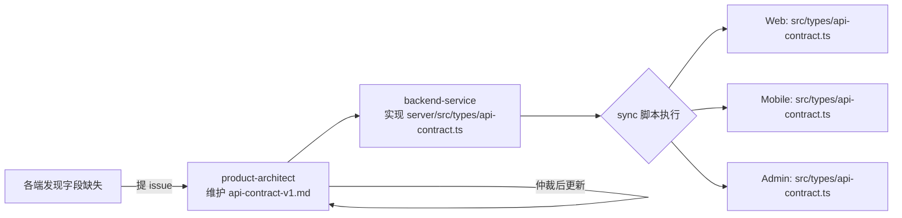

# 丹青有AI - API 契约

> **文档定位**:本文档是丹青有AI 多端(Web / 移动端 / 管理后台 / 产品官网)共享的 API 契约"单一真相源"(Single Source of Truth)。所有端的请求/响应类型必须以本文档为准,禁止各端独立定义跨端类型。
>
> **版本**:v2.0(M-0 增补)
> **创建时间**:2026-07-27(初版 v1.0)
> **M-0 更新时间**:2026-08-07
> **维护人**:product-architect
> **适用阶段**:Phase 1(飞书登录 + 多租户 + AI 分析基础链路)+ M-0 增补(AI 图像生成 / 批删 / 仲裁配置 / 指标 / 高危确认)
> **对应代码**:`server/src/types/api-contract.ts`(后端主副本,各端通过 sync 脚本同步)
> **M-0 依据**:`m0-doc-contract-plan-2026-08-06.md`(契约真源,本文档为人类可读副本)

---

## 0. 文档约束与阅读说明

| 项 | 约束 |
|---|---|
| 响应格式 | 所有接口统一返回 `{code, message, data, traceId}`,禁止 `success` 字段 |
| 类型规范 | TypeScript 严格模式,禁止 `any`,所有字段必须显式类型 |
| 鉴权方式 | `Authorization: Bearer {access_token}`(除 `/auth/feishu/authorize` 与 `/auth/feishu/callback`) |
| Cookie | refresh_token 通过 `Set-Cookie: refresh_token=...; HttpOnly; Secure; SameSite=Lax` 下发 |
| 字符编码 | UTF-8 |
| 时间格式 | ISO 8601 字符串(UTC),如 `2026-07-27T08:30:00.000Z` |
| ID 格式 | UUID v4(除 Tenant.plan 等枚举) |
| 错误处理 | `code !== 0` 一律视为业务错误,前端统一 Toast 展示 `message` |
| 文档冲突 | 代码与文档冲突时以代码为准,但需 24 小时内同步本文档 |

---

## 1. 通用约定

### 1.1 基础路径

| 环境 | Base URL |
|---|---|
| 本地开发 | `http://localhost:3000/api/v1` |
| 预发布 | `https://staging-api.danqing-ai.com/api/v1` |
| 生产 | `https://api.danqing-ai.com/api/v1` |

本文档所有路径均相对于 Base URL。例如 `GET /auth/me` 实际为 `GET https://api.danqing-ai.com/api/v1/auth/me`。

### 1.2 统一响应格式

```typescript
// 所有接口的成功响应
interface ApiResponse<T> {
  code: number;        // 0 表示成功,非 0 表示业务错误(见错误码表)
  message: string;     // 人类可读的提示信息(中文)
  data: T;             // 业务数据,失败时为 null
  traceId: string;     // UUID v4,贯穿日志/链路追踪,排查必备
}
```

**成功响应示例**:

```json
{
  "code": 0,
  "message": "success",
  "data": {
    "id": "u-2b1f4a8e",
    "name": "张老师"
  },
  "traceId": "550e8400-e29b-41d4-a716-446655440000"
}
```

**失败响应示例**:

```json
{
  "code": 2002,
  "message": "access_token 已过期,请刷新令牌",
  "data": null,
  "traceId": "550e8400-e29b-41d4-a716-446655440000"
}
```

### 1.3 鉴权约定

| 接口分类 | 是否需鉴权 | 说明 |
|---|---|---|
| `/auth/feishu/authorize` | 否 | 公开接口,返回授权 URL |
| `/auth/feishu/callback` | 否 | OAuth 回调,后端用 code 换 token |
| `/auth/refresh` | 否(凭 Cookie 中 refresh_token) | 不校验 access_token |
| `/auth/logout` | 是 | 需 access_token + Cookie 中 refresh_token |
| `/auth/me` | 是 | 需 access_token |
| `/users/*` | 是 | 需 access_token |
| `/tenants/*` | 是 | 需 access_token |
| `/analyses` (POST/GET) | 是 | 需 access_token + tenant_id |
| `/analyses/:id` | 是 | 需 access_token + tenant_id |

鉴权失败统一返回:
- 未携带 token → `code=2001`(未授权)
- token 过期 → `code=2002`(token 过期)
- token 签名无效/被撤销 → `code=2003`(refresh_token 无效,需重新登录)

### 1.4 请求头约定

```http
Authorization: Bearer {access_token}
Content-Type: application/json
Accept: application/json
X-Trace-Id: {客户端生成的 UUID v4,可选;不传则后端生成}
X-Client: web | admin | mobile | marketing
```

---

## 2. 错误码表

### 2.1 错误码命名规范

错误码为 4 位整数,按业务域分段:

| 段 | 业务域 | HTTP 状态码范围 |
|---|---|---|
| `0` | 成功 | 200 |
| `1xxx` | 客户端参数错误 | 400 |
| `2xxx` | 认证授权错误 | 401 / 403 |
| `3xxx` | 租户相关错误 | 403 / 404 |
| `4xxx` | 飞书 OAuth 错误 | 400 / 502 |
| `5xxx` | 文件上传错误 | 400 / 413 |
| `6xxx` | AI 分析错误 | 402 / 408 / 500 |
| `9xxx` | 服务器内部错误 | 500 / 502 / 503 |

### 2.2 完整错误码清单

| code | 名称 | HTTP | message(示例) | 触发场景 |
|---|---|---|---|---|
| 0 | SUCCESS | 200 | success | 业务成功 |
| 1001 | PARAM_INVALID | 400 | 参数错误:{field} | 请求参数格式/取值非法 |
| 1002 | PARAM_MISSING | 400 | 缺少必填参数:{field} | 必填参数未传 |
| 1003 | RESOURCE_NOT_FOUND | 404 | 资源不存在 | 查询的资源 ID 不存在 |
| 1004 | PARAM_TYPE_MISMATCH | 400 | 参数类型错误:{field} | artType 取值不在枚举内等 |
| 1005 | DUPLICATE_RESOURCE | 409 | 资源已存在 | 重复创建(如重复加入租户) |
| 2001 | UNAUTHORIZED | 401 | 未授权,请先登录 | 未携带或缺少 access_token |
| 2002 | TOKEN_EXPIRED | 401 | access_token 已过期,请刷新令牌 | access_token 过期,前端调 /auth/refresh |
| 2003 | REFRESH_TOKEN_INVALID | 401 | refresh_token 无效,请重新登录 | refresh_token 过期/被撤销/不匹配 |
| 2004 | FORBIDDEN | 403 | 权限不足 | 角色无权操作该资源 |
| 2005 | TOKEN_SIGNATURE_INVALID | 401 | token 签名无效 | JWT 签名校验失败 |
| 3001 | TENANT_NOT_FOUND | 404 | 租户不存在 | tenant_id 无效 |
| 3002 | TENANT_DISABLED | 403 | 租户已被禁用 | 租户 status=disabled |
| 3003 | TENANT_SEATS_FULL | 403 | 租户成员席位已满 | 加入租户时超过 max_seats |
| 3004 | TENANT_MISMATCH | 403 | 资源不属于当前租户 | 跨租户访问被拒 |
| 4001 | FEISHU_AUTH_FAILED | 400 | 飞书授权失败 | state 校验失败或用户拒绝授权 |
| 4002 | FEISHU_TOKEN_EXCHANGE_FAILED | 502 | 飞书 access_token 获取失败 | code 无效或已过期 |
| 4003 | FEISHU_USER_INFO_FAILED | 502 | 飞书用户信息获取失败 | user_access_token 无效 |
| 4004 | FEISHU_APP_CONFIG_ERROR | 500 | 飞书应用配置错误 | App ID/Secret 未配置 |
| 5001 | FILE_UPLOAD_FAILED | 400 | 文件上传失败 | multer 解析失败 |
| 5002 | FILE_TYPE_UNSUPPORTED | 400 | 文件类型不支持,仅支持 JPEG/PNG/WebP/BMP | mimetype 不在白名单 |
| 5003 | FILE_TOO_LARGE | 413 | 文件过大,最大支持 10MB | 超过 10MB 限制 |
| 5004 | FILE_EMPTY | 400 | 未上传文件 | multipart 中无 file 字段 |
| 6001 | ANALYSIS_QUOTA_EXCEEDED | 402 | 本月分析配额已用完 | 租户当月分析次数超 plan 限额 |
| 6002 | ANALYSIS_TIMEOUT | 408 | AI 分析超时(3 秒 SLA 违约),请重试 | 分析耗时 > 3 秒被强制中断 |
| 6003 | ANALYSIS_RESULT_FAILED | 500 | AI 分析结果生成失败 | 模型推理异常 |
| 6004 | ANALYSIS_NOT_FOUND | 404 | 分析记录不存在 | analysis_id 无效或跨租户访问 |
| 6005 | ANALYSIS_IMAGE_INVALID | 400 | 图片无法解析 | 图片损坏或无法解码 |
| 6006 | ANALYSIS_BATCH_LIMIT_EXCEEDED | 400 | 批删条数超限(最多 100 条) | 批量删除 ids 超过 100 条 |
| 6101 | GENERATION_QUOTA_EXCEEDED | 402 | 本月生成配额已用完 | 生成任务计入订阅配额后超限 |
| 6102 | GENERATION_TASK_NOT_FOUND | 404 | 生成任务不存在 | 生成任务 id 无效或跨租户 |
| 6103 | GENERATION_PROVIDER_UNAVAILABLE | 502 | 生成服务暂不可用 | 双提供商(GLM/TRAE)均不可用 |
| 6104 | GENERATION_FAILED | 500 | 生成失败 | 生成过程异常 |
| 6105 | GENERATION_IMAGE_INVALID | 400 | 输入的草稿图无法解析 | sketch 图片损坏或无法解码 |
| 6106 | GENERATION_RATE_LIMITED | 429 | 生成过于频繁,请稍后再试 | 单用户 5 次/分钟限流触发 |
| 7001 | SUBSCRIPTION_NOT_FOUND | 404 | 订阅不存在 | 订阅记录不存在 |
| 7002 | SUBSCRIPTION_PLAN_INVALID | 400 | 订阅计划无效 | 订阅计划取值非法 |
| 7003 | SUBSCRIPTION_PAYMENT_FAILED | 402 | 支付失败 | 订阅支付处理失败 |
| 7004 | SUBSCRIPTION_ALREADY_CANCELED | 409 | 订阅已取消 | 重复取消订阅 |
| 7005 | SUBSCRIPTION_DOWNGRADE_NOT_ALLOWED | 400 | 不允许降级 | 订阅降级被拒绝 |
| 7006 | INVOICE_NOT_FOUND | 404 | 发票不存在 | 发票记录不存在 |
| 8001 | ADMIN_USER_NOT_FOUND | 404 | 用户不存在 | 管理后台查询用户不存在 |
| 8002 | ADMIN_USER_ALREADY_LOCKED | 409 | 用户已被锁定 | 重复锁定用户 |
| 8003 | ADMIN_USER_ALREADY_DELETED | 409 | 用户已删除 | 重复删除用户 |
| 8004 | ADMIN_BATCH_LIMIT_EXCEEDED | 400 | 批量操作条数超限 | 管理后台批量操作超过限制 |
| 8005 | ADMIN_ARTWORK_NOT_FOUND | 404 | 作品不存在 | 管理后台查询作品不存在 |
| 8006 | ADMIN_TEMPLATE_NOT_FOUND | 404 | 模板不存在 | 管理后台查询模板不存在 |
| 8007 | ADMIN_API_KEY_NOT_FOUND | 404 | API 密钥不存在 | 管理后台查询密钥不存在 |
| 8008 | ADMIN_API_KEY_ALREADY_REVOKED | 409 | API 密钥已撤销 | 重复撤销密钥 |
| 8009 | ADMIN_AUDIT_LOG_NOT_FOUND | 404 | 审计日志不存在 | 审计日志记录不存在 |
| 8010 | ADMIN_ROLE_INVALID | 400 | 角色无效 | 分配角色取值非法 |
| 8011 | ADMIN_REVIEW_ACTION_INVALID | 400 | 审核动作无效 | 审核动作取值非法 |
| 8012 | ADMIN_REFUND_FAILED | 402 | 退款失败 | 订阅退款处理失败 |
| 8013 | ADMIN_PERMISSION_INSUFFICIENT | 403 | 管理员权限不足 | 管理后台权限不足 |
| 8014 | ADMIN_RESOURCE_CONFLICT | 409 | 资源冲突 | 管理操作资源状态冲突 |
| 8015 | ADMIN_CONFIRM_PASSWORD_MISMATCH | 403 | 高危操作密码校验失败 | 高危操作 confirmPassword 校验不通过 |
| 9001 | INTERNAL_ERROR | 500 | 服务器内部错误 | 未捕获异常 |
| 9002 | DATABASE_ERROR | 500 | 数据库错误 | Prisma 异常 |
| 9003 | CACHE_ERROR | 503 | 缓存服务不可用 | Redis 不可达 |
| 9004 | UPSTREAM_UNAVAILABLE | 502 | 第三方服务不可用 | 飞书/模型服务不可达 |
| 9005 | RATE_LIMITED | 429 | 请求过于频繁,请稍后再试 | 限流触发 |
| 9101 | PHASE5_PRESET_NOT_FOUND | 404 | 评分预设不存在 | 预设查询不存在 |
| 9102 | PHASE5_PRESET_BUILTIN_IMMUTABLE | 403 | 内置预设不可修改 | 修改内置预设被拒 |
| 9103 | PHASE5_PRESET_DIMENSION_MISMATCH | 400 | 预设维度不匹配 | 预设维度与作品类型不符 |
| 9104 | PHASE5_REVIEW_NOT_FOUND | 404 | 评审记录不存在 | 评审记录查询不存在 |
| 9105 | PHASE5_DISPUTE_NOT_FOUND | 404 | 争议记录不存在 | 争议记录查询不存在 |
| 9106 | PHASE5_DISPUTE_ALREADY_RESOLVED | 409 | 争议已解决 | 重复解决争议 |
| 9107 | PHASE5_PHONE_VERIFICATION_FAILED | 400 | 手机验证失败 | 验证码校验失败 |
| 9108 | PHASE5_INVITATION_INVALID | 400 | 邀请码无效 | 邀请码无效或已过期 |
| 9109 | PHASE5_ADMIN_AUTH_FAILED | 401 | 管理鉴权失败 | 管理后台认证失败 |
| 9110 | ARBITRATION_CONFIG_INVALID | 400 | 仲裁配置校验失败(权重未归一化/取值越界) | 租户仲裁配置写入校验失败 |
| 9201 | METRICS_DATA_UNAVAILABLE | 503 | 指标数据暂不可用 | 指标聚合数据尚未就绪 |
| 9901 | NOT_IMPLEMENTED | 501 | 接口未实现 | 预留接口尚未激活 |

### 2.3 前端错误处理约定

| code | 前端行为 |
|---|---|
| 0 | 正常处理 data |
| 2002 | 静默调用 `/auth/refresh`,成功后重放原请求;失败跳登录页 |
| 2003 / 2001 | 清除本地 token,跳登录页 |
| 2004 / 3001-3004 | Toast 提示,不跳转 |
| 4001 | Toast 提示"飞书授权失败",停留在登录页 |
| 6001 | Toast 提示并引导升级订阅 |
| 6002 | Toast 提示"分析超时,请重试",允许重试 |
| 9005 | Toast 提示"操作过于频繁",按钮禁用 30 秒 |
| 其他 | Toast 展示 message |

---

## 3. TypeScript 类型定义(跨端共享)

> 以下类型定义是各端必须遵守的"单一真相源"。后端在 `server/src/types/api-contract.ts` 维护主副本,通过 sync 脚本同步到 Web(`src/types/api-contract.ts`)、移动端、管理后台。
>
> **禁止各端独立修改本节类型**。如需新增字段,提 issue 至 product-architect 仲裁。

### 3.1 通用类型

```typescript
// ============ 通用响应 ============

/** 统一 API 响应包装 */
export interface ApiResponse<T> {
  code: number;
  message: string;
  data: T | null;
  traceId: string;
}

/** 成功响应(data 非空) */
export interface ApiSuccess<T> extends ApiResponse<T> {
  code: 0;
  data: T;
}

/** 错误响应(data 为 null) */
export interface ApiError extends ApiResponse<null> {
  data: null;
}

/** 分页响应数据 */
export interface PaginatedData<T> {
  items: T[];
  total: number;
  page: number;
  pageSize: number;
  hasMore: boolean;
}

/** 分页查询参数 */
export interface PaginationQuery {
  page?: number;      // 默认 1
  pageSize?: number;  // 默认 20,最大 100
}

/** 客户端标识 */
export type ClientType = 'web' | 'admin' | 'mobile' | 'marketing';

/** ISO 8601 时间字符串 */
export type ISODateString = string;
```

### 3.2 错误码枚举

```typescript
/** 业务错误码枚举(与错误码表保持一致) */
export enum ErrorCode {
  SUCCESS = 0,
  PARAM_INVALID = 1001,
  PARAM_MISSING = 1002,
  RESOURCE_NOT_FOUND = 1003,
  PARAM_TYPE_MISMATCH = 1004,
  DUPLICATE_RESOURCE = 1005,
  UNAUTHORIZED = 2001,
  TOKEN_EXPIRED = 2002,
  REFRESH_TOKEN_INVALID = 2003,
  FORBIDDEN = 2004,
  TOKEN_SIGNATURE_INVALID = 2005,
  TENANT_NOT_FOUND = 3001,
  TENANT_DISABLED = 3002,
  TENANT_SEATS_FULL = 3003,
  TENANT_MISMATCH = 3004,
  FEISHU_AUTH_FAILED = 4001,
  FEISHU_TOKEN_EXCHANGE_FAILED = 4002,
  FEISHU_USER_INFO_FAILED = 4003,
  FEISHU_APP_CONFIG_ERROR = 4004,
  FILE_UPLOAD_FAILED = 5001,
  FILE_TYPE_UNSUPPORTED = 5002,
  FILE_TOO_LARGE = 5003,
  FILE_EMPTY = 5004,
  ANALYSIS_QUOTA_EXCEEDED = 6001,
  ANALYSIS_TIMEOUT = 6002,
  ANALYSIS_RESULT_FAILED = 6003,
  ANALYSIS_NOT_FOUND = 6004,
  ANALYSIS_IMAGE_INVALID = 6005,
  // 跨端批删(M-0 追加,DOC-2026-08-002)
  ANALYSIS_BATCH_LIMIT_EXCEEDED = 6006,
  // AI 图像生成(M-0 追加,DOC-2026-08-008)
  GENERATION_QUOTA_EXCEEDED = 6101,
  GENERATION_TASK_NOT_FOUND = 6102,
  GENERATION_PROVIDER_UNAVAILABLE = 6103,
  GENERATION_FAILED = 6104,
  GENERATION_IMAGE_INVALID = 6105,
  GENERATION_RATE_LIMITED = 6106,
  SUBSCRIPTION_NOT_FOUND = 7001,
  SUBSCRIPTION_PLAN_INVALID = 7002,
  SUBSCRIPTION_PAYMENT_FAILED = 7003,
  SUBSCRIPTION_ALREADY_CANCELED = 7004,
  SUBSCRIPTION_DOWNGRADE_NOT_ALLOWED = 7005,
  INVOICE_NOT_FOUND = 7006,
  ADMIN_USER_NOT_FOUND = 8001,
  ADMIN_USER_ALREADY_LOCKED = 8002,
  ADMIN_USER_ALREADY_DELETED = 8003,
  ADMIN_BATCH_LIMIT_EXCEEDED = 8004,
  ADMIN_ARTWORK_NOT_FOUND = 8005,
  ADMIN_TEMPLATE_NOT_FOUND = 8006,
  ADMIN_API_KEY_NOT_FOUND = 8007,
  ADMIN_API_KEY_ALREADY_REVOKED = 8008,
  ADMIN_AUDIT_LOG_NOT_FOUND = 8009,
  ADMIN_ROLE_INVALID = 8010,
  ADMIN_REVIEW_ACTION_INVALID = 8011,
  ADMIN_REFUND_FAILED = 8012,
  ADMIN_PERMISSION_INSUFFICIENT = 8013,
  ADMIN_RESOURCE_CONFLICT = 8014,
  // 管理后台高危操作幂等确认(M-0 追加,DOC-2026-08-014)
  ADMIN_CONFIRM_PASSWORD_MISMATCH = 8015,
  KNOWLEDGE_NOT_FOUND = 8101,
  KNOWLEDGE_INDEX_ERROR = 8102,
  KNOWLEDGE_PERMISSION_DENIED = 8103,
  MODULE_NOT_FOUND = 8201,
  MODULE_ALREADY_INSTALLED = 8202,
  MODULE_CONFIG_INVALID = 8203,
  UI_CONFIG_NOT_FOUND = 8301,
  UI_THEME_INVALID = 8302,
  UI_COMPONENT_NOT_FOUND = 8303,
  FEATURE_NOT_FOUND = 8401,
  PARAM_KEY_INVALID = 8402,
  WORKFLOW_NOT_FOUND = 8403,
  WORKFLOW_EXECUTION_FAILED = 8404,
  INTERNAL_ERROR = 9001,
  DATABASE_ERROR = 9002,
  CACHE_ERROR = 9003,
  UPSTREAM_UNAVAILABLE = 9004,
  RATE_LIMITED = 9005,
  PHASE5_PRESET_NOT_FOUND = 9101,
  PHASE5_PRESET_BUILTIN_IMMUTABLE = 9102,
  PHASE5_PRESET_DIMENSION_MISMATCH = 9103,
  PHASE5_REVIEW_NOT_FOUND = 9104,
  PHASE5_DISPUTE_NOT_FOUND = 9105,
  PHASE5_DISPUTE_ALREADY_RESOLVED = 9106,
  PHASE5_PHONE_VERIFICATION_FAILED = 9107,
  PHASE5_INVITATION_INVALID = 9108,
  PHASE5_ADMIN_AUTH_FAILED = 9109,
  // 租户级仲裁配置覆盖(M-0 追加,DOC-2026-08-004)
  ARBITRATION_CONFIG_INVALID = 9110,
  // 可观测性指标(M-0 追加,DOC-2026-08-012)
  METRICS_DATA_UNAVAILABLE = 9201,
  NOT_IMPLEMENTED = 9901,
}
```

### 3.3 认证相关类型

```typescript
// ============ 飞书 OAuth 登录 ============

/** GET /auth/feishu/authorize 响应 */
export interface FeishuAuthorizeResponse {
  /** 飞书授权页完整 URL,前端直接 location.href 跳转 */
  authorizeUrl: string;
  /** 后端生成的 state,用于 callback 时校验 CSRF */
  state: string;
  /** 客户端传入的 redirect_uri,原样回显 */
  redirectUri: string;
}

/** GET /auth/feishu/callback 请求参数 */
export interface FeishuCallbackQuery {
  /** 飞书返回的授权码 */
  code: string;
  /** 后端在 authorize 阶段生成的 state */
  state: string;
}

/** GET /auth/feishu/callback 响应 */
export interface FeishuCallbackResponse {
  /** JWT access_token,前端存内存(不存 localStorage) */
  accessToken: string;
  /** access_token 过期时间(ISO 8601) */
  accessTokenExpiresAt: ISODateString;
  /** 是否为首次登录(用于前端引导新手流程) */
  isFirstLogin: boolean;
  /** 当前用户信息 */
  user: UserProfile;
  /** 当前激活租户信息 */
  tenant: TenantInfo;
}

/** POST /auth/refresh 响应 */
export interface AuthRefreshResponse {
  accessToken: string;
  accessTokenExpiresAt: ISODateString;
}

/** POST /auth/logout 响应 */
export interface AuthLogoutResponse {
  /** 撤销的会话数 */
  revokedSessions: number;
}

/** GET /auth/me 响应 */
export interface AuthMeResponse {
  user: UserProfile;
  tenant: TenantInfo;
  /** 当前用户在所有租户中的成员关系(用于切换租户) */
  memberships: TenantMembership[];
}
```

### 3.4 用户与租户类型

```typescript
// ============ 用户 ============

/** 用户角色(租户内角色) */
export type UserRole = 'admin' | 'teacher' | 'student' | 'owner';

/** 用户资料(完整) */
export interface UserProfile {
  id: string;
  /** 当前激活租户 ID */
  tenantId: string;
  feishuOpenId: string;
  feishuUnionId: string;
  name: string;
  avatar: string;
  email: string | null;
  phone: string | null;
  role: UserRole;
  createdAt: ISODateString;
  updatedAt: ISODateString;
  lastLoginAt: ISODateString | null;
}

/** PATCH /users/profile 请求 */
export interface UpdateProfileRequest {
  name?: string;
  avatar?: string;
  email?: string | null;
  phone?: string | null;
}

/** GET /users/profile 响应(等同 UserProfile) */
export type GetProfileResponse = UserProfile;

/** PATCH /users/profile 响应(返回更新后的完整资料) */
export type UpdateProfileResponse = UserProfile;

// ============ 租户 ============

/** 租户类型 */
export type TenantType = 'school' | 'college' | 'class' | 'individual';

/** 订阅计划 */
export type TenantPlan = 'free' | 'standard' | 'enterprise';

/** 租户状态 */
export type TenantStatus = 'active' | 'disabled';

/** 租户信息 */
export interface TenantInfo {
  id: string;
  name: string;
  type: TenantType;
  feishuTenantKey: string | null;
  plan: TenantPlan;
  status: TenantStatus;
  maxSeats: number;
  /** 父租户 ID(层级关系,class→college→school) */
  parentId: string | null;
  createdAt: ISODateString;
  /** 当月已用分析次数(仅 current 接口返回) */
  usedQuota?: number;
  /** 当月分析配额上限(仅 current 接口返回) */
  maxQuota?: number;
  /** 租户级仲裁配置覆盖(未配置为 null;P-04,M-0 追加,DOC-2026-08-005) */
  arbitrationConfig?: ArbitrationConfig | null;
}

/** GET /tenants/current 响应 */
export type GetCurrentTenantResponse = TenantInfo;

/** 用户在某租户中的成员关系 */
export interface TenantMembership {
  tenantId: string;
  tenantName: string;
  tenantType: TenantType;
  role: UserRole;
  joinedAt: ISODateString;
}
```

### 3.5 AI 分析相关类型

```typescript
// ============ AI 分析 ============

/** 艺术作品类型(四类) */
export type ArtType = 'painting' | 'design' | 'product' | 'sculpture';

/** 分析任务状态 */
export type AnalysisStatus = 'pending' | 'processing' | 'success' | 'failed';

/** 提交分析任务请求 */
export interface CreateAnalysisRequest {
  /** 作品类型 */
  artType: ArtType;
  /** 图片 URL(若已上传)与 imageFile 二选一 */
  imageUrl?: string;
  /** 作品标题(可选) */
  title?: string;
  /** 备注(可选,如教师布置的作业要求) */
  remark?: string;
}

/** 提交分析任务响应(同步模式返回完整结果,异步模式仅返回 id+status) */
export interface CreateAnalysisResponse {
  id: string;
  status: AnalysisStatus;
  /** 同步模式且成功时返回完整结果;异步模式为 null */
  result: AnalysisDetail | null;
  /** 分析耗时(毫秒),异步模式为 null */
  durationMs: number | null;
}

/** 分析详情(完整结果) */
export interface AnalysisDetail {
  id: string;
  tenantId: string;
  userId: string;
  workType: ArtType;
  imageUrl: string;
  title: string | null;
  remark: string | null;
  status: AnalysisStatus;
  /** 分析结果 JSON(成功时非空),结构与 workType 对应 */
  result: AnalysisResult | null;
  /** 失败原因(status=failed 时非空) */
  failureReason: string | null;
  durationMs: number | null;
  createdAt: ISODateString;
  completedAt: ISODateString | null;
}

/** 分析历史列表项(精简) */
export interface AnalysisListItem {
  id: string;
  workType: ArtType;
  imageUrl: string;
  title: string | null;
  status: AnalysisStatus;
  overallScore: number | null;
  createdAt: ISODateString;
}

/** GET /analyses 查询参数 */
export interface ListAnalysesQuery extends PaginationQuery {
  /** 按作品类型筛选 */
  artType?: ArtType;
  /** 按状态筛选 */
  status?: AnalysisStatus;
  /** 起始时间(ISO 8601) */
  startDate?: ISODateString;
  /** 结束时间(ISO 8601) */
  endDate?: ISODateString;
  /** 按用户筛选(教师查看班级学生时使用) */
  userId?: string;
}

/** GET /analyses 响应 */
export type ListAnalysesResponse = PaginatedData<AnalysisListItem>;

/** GET /analyses/:id 响应 */
export type GetAnalysisResponse = AnalysisDetail;
```

### 3.6 分析结果类型(对齐现有 src/types/index.ts)

> 以下类型与前端 `src/types/index.ts` 中的 `PaintingAnalysis` / `DesignAnalysis` / `ProductAnalysis` / `SculptureAnalysis` 保持一致,作为后端 `result` 字段的 JSON 结构契约。

```typescript
/** 焦点坐标 */
export interface FocusPoint {
  x: number;
  y: number;
}

/** 原创性维度(所有作品类型共享) */
export interface OriginalityDimension {
  score: number;
  /** 与网络图片相似度(0-1) */
  similarity: number;
  creativityLevel: 'excellent' | 'good' | 'average' | 'needsWork';
  suggestion: string;
}

/** 绘画类分析维度 */
export interface PaintingAnalysis {
  type: 'painting';
  composition: {
    score: number;
    focusPoint: FocusPoint;
    balance: 'balanced' | 'left-heavy' | 'right-heavy' | 'top-heavy' | 'bottom-heavy';
    guideline: 'good' | 'average' | 'poor';
    whitespaceRatio: number;
    symmetry: number;
    suggestion: string;
    heatmapData: number[][];
  };
  color: {
    score: number;
    warmRatio: number;
    coolRatio: number;
    contrast: 'high' | 'medium' | 'low';
    saturation: 'high' | 'medium' | 'low';
    richness: 'rich' | 'moderate' | 'limited';
    harmony: string;
    dominantColor: string;
    suggestion: string;
  };
  brushwork: {
    score: number;
    textureLevel: 'rich' | 'moderate' | 'simple';
    strokeVariety: number;
    wetDryBalance: string;
    suggestion: string;
  };
}

/** 设计类分析维度 */
export interface DesignAnalysis {
  type: 'design';
  visualHierarchy: {
    score: number;
    focusPoint: FocusPoint;
    primarySecondaryClarity: 'clear' | 'moderate' | 'unclear';
    informationFlow: 'good' | 'average' | 'poor';
    heatmapData: number[][];
    suggestion: string;
  };
  typography: {
    score: number;
    alignmentQuality: 'good' | 'average' | 'poor';
    rhythmConsistency: 'good' | 'average' | 'poor';
    negativeSpaceUsage: 'good' | 'average' | 'poor';
    gridAdherence: number;
    suggestion: string;
  };
  colorApplication: {
    score: number;
    contrast: 'high' | 'medium' | 'low';
    brandConsistency: 'strong' | 'moderate' | 'weak';
    colorPsychology: string;
    paletteHarmony: string;
    suggestion: string;
  };
}

/** 产品设计类分析维度 */
export interface ProductAnalysis {
  type: 'product';
  form: {
    score: number;
    focusPoint: FocusPoint;
    proportionBalance: 'good' | 'average' | 'poor';
    lineFluidity: 'smooth' | 'moderate' | 'stiff';
    surfaceQuality: 'excellent' | 'good' | 'average';
    ergonomicsHint: 'strong' | 'moderate' | 'weak';
    heatmapData: number[][];
    suggestion: string;
  };
  materialExpression: {
    score: number;
    textureRealism: 'high' | 'medium' | 'low';
    lightShadowPerformance: 'excellent' | 'good' | 'average';
    surfaceTreatment: 'refined' | 'moderate' | 'rough';
    suggestion: string;
  };
  functionExpression: {
    score: number;
    structureClarity: 'clear' | 'moderate' | 'unclear';
    functionImplication: 'strong' | 'moderate' | 'weak';
    detailRefinement: 'excellent' | 'good' | 'average';
    suggestion: string;
  };
}

/** 雕塑类分析维度 */
export interface SculptureAnalysis {
  type: 'sculpture';
  spatialComposition: {
    score: number;
    focusPoint: FocusPoint;
    volumeSense: 'strong' | 'moderate' | 'weak';
    spaceOccupation: 'full' | 'moderate' | 'sparse';
    voidSolidRelation: 'harmonious' | 'moderate' | 'imbalanced';
    heatmapData: number[][];
    suggestion: string;
  };
  bodyLanguage: {
    score: number;
    dynamicSense: 'strong' | 'moderate' | 'static';
    tensionExpression: 'high' | 'medium' | 'low';
    rhythmFlow: 'fluent' | 'moderate' | 'stiff';
    suggestion: string;
  };
  materialLanguage: {
    score: number;
    materialCharacter: 'distinct' | 'moderate' | 'obscure';
    textureExpression: 'rich' | 'moderate' | 'simple';
    qualityLayering: 'rich' | 'moderate' | 'simple';
    suggestion: string;
  };
}

/** 分析结果联合类型(workType 决定具体分支) */
export type DimensionResult =
  | PaintingAnalysis
  | DesignAnalysis
  | ProductAnalysis
  | SculptureAnalysis;

/** 完整分析结果(对应 AnalysisDetail.result) */
export interface AnalysisResult {
  /** 作品类型(与 DimensionResult.type 一致,便于前端 narrowing) */
  artType: ArtType;
  dimensions: DimensionResult;
  originality: OriginalityDimension;
  /** 综合评分(0-100) */
  overallScore: number;
}
```

### 3.7 跨端批删一致性(P-06,M-0 追加)

> DOC-2026-08-001。服务端为准,前端乐观更新 + 回滚;多租户强制所有 ids 归属 `req.tenantId`。

```typescript
// ============ 3.7 跨端批删一致性(P-06) ============

/** POST /api/v1/analyses/batch-delete 请求体 */
export interface BatchDeleteAnalysesRequest {
  /** 待删除的分析记录 ID 列表(最多 100 条) */
  ids: string[];
}

/** 批删单条结果 */
export interface BatchDeleteAnalysisItem {
  /** 分析记录 ID */
  id: string;
  /** 是否删除成功 */
  deleted: boolean;
  /** 删除失败原因(deleted=false 时非空,如跨租户越权/不存在) */
  error?: string;
}

/** POST /api/v1/analyses/batch-delete 响应 */
export interface BatchDeleteAnalysesResponse {
  /** 请求总数 */
  total: number;
  /** 成功删除数 */
  deleted: number;
  /** 失败数 */
  failedCount: number;
  /** 每条删除结果(供前端精确提示) */
  items: BatchDeleteAnalysisItem[];
}
```

### 3.8 租户级仲裁配置覆盖(P-04,M-0 追加)

> DOC-2026-08-003/005。复用 `arbitration.ts` 的 `ArbitrationConfig`(系统默认);租户覆盖为"深合并",未覆盖字段继承系统默认;写入最小化校验 + 权重归一化。

```typescript
// ============ 3.8 租户级仲裁配置覆盖(P-04) ============

/** GET /api/admin/tenants/:id/arbitration-config 响应 */
export interface GetTenantArbitrationConfigResponse {
  tenantId: string;
  /** 已生效的仲裁配置(合并结果;未覆盖字段取系统默认) */
  effectiveConfig: ArbitrationConfig;
  /** 是否为纯系统默认(租户未配置任何覆盖) */
  isDefault: boolean;
  /** 上次更新时间(从未配置为 null) */
  updatedAt: ISODateString | null;
  /** 上次更新人(从未配置为 null) */
  updatedBy: string | null;
}

/** PUT /api/admin/tenants/:id/arbitration-config 请求体(部分覆盖,深合并) */
export interface UpdateTenantArbitrationConfigRequest {
  /** 争议触发阈值覆盖(不传则继承默认) */
  triggers?: Partial<ArbitrationConfig['triggers']>;
  /** 评委权重覆盖(不传则继承默认) */
  judgeWeights?: Partial<ArbitrationConfig['judgeWeights']>;
  /** 最终裁定规则覆盖(不传则继承默认) */
  rules?: Partial<ArbitrationConfig['rules']>;
  /** 边界情况处理覆盖(不传则继承默认) */
  edgeCases?: Partial<ArbitrationConfig['edgeCases']>;
}

/** PUT /api/admin/tenants/:id/arbitration-config 响应 */
export type UpdateTenantArbitrationConfigResponse = GetTenantArbitrationConfigResponse;
```

### 3.9 AI 图像生成(P-02/P-07,M-0 追加)

> DOC-2026-08-006/007/009。生成任务走异步 + 轮询,避免阻塞诊断链路(3 秒 SLA 硬约束);双提供商(GLM/TRAE)自动降级;生成任务强制归属 `req.tenantId`,计入 `AiUsageLog`(`usageType=generate`)。

```typescript
// ============ 3.9 AI 图像生成(P-02/P-07) ============

/** 生成任务状态 */
export type GenerationStatus = 'pending' | 'processing' | 'success' | 'failed';

/** AI 生成输入来源 */
export type GenerationInputType = 'text' | 'sketch';

/** AI 用量类型(对应 Prisma AiUsageLog.usageType 枚举,DOC-2026-08-009) */
export type AiUsageType = 'diagnose' | 'generate';

/** POST /api/v1/generation 请求体 */
export interface CreateGenerationRequest {
  /** 生成输入类型 */
  inputType: GenerationInputType;
  /** 文字提示词(text 时必填) */
  prompt?: string;
  /** 草稿图 URL(sketch 时必填,基于现有上传图) */
  sketchImageUrl?: string;
  /** 目标作品类型(用于生成后一键进入诊断,默认 painting) */
  artType?: ArtType;
  /** 生成尺寸提示(可选,如 portrait/landscape) */
  aspect?: 'portrait' | 'landscape' | 'square';
  /** 生成数量(默认 1,上限 4) */
  count?: number;
}

/** 单张生成结果 */
export interface GeneratedImage {
  /** 生成图 URL */
  imageUrl: string;
  /** 审核状态(生成内容合规,违规标记 flagged) */
  reviewStatus: ReviewStatus;
}

/** POST /api/v1/generation 响应 */
export interface CreateGenerationResponse {
  /** 生成任务 ID */
  taskId: string;
  status: GenerationStatus;
  /** 生成结果(异步模式为 null,需轮询 GET /generation/:id) */
  images: GeneratedImage[] | null;
}

/** GET /api/v1/generation/:id 响应 */
export interface GetGenerationResponse {
  taskId: string;
  tenantId: string;
  status: GenerationStatus;
  /** 生成结果(status=success 时非空) */
  images: GeneratedImage[] | null;
  /** 失败原因(status=failed 时非空) */
  failureReason: string | null;
  /** 是否经过降级(主提供商失败自动降级) */
  usedFallback: boolean;
  createdAt: ISODateString;
  completedAt: ISODateString | null;
}
```

### 3.10 可观测性指标(P-08,M-0 追加)

> DOC-2026-08-010/011。仅供管理后台,IP 白名单 + admin 鉴权;聚合采用 Redis 计数器 + 定时落库;数据不可用返回 `METRICS_DATA_UNAVAILABLE`。

```typescript
// ============ 3.10 可观测性指标(P-08) ============

/** GET /api/admin/metrics/ai 响应 */
export interface AiMetricsResponse {
  /** 统计起始时间 */
  startDate: ISODateString;
  /** 统计结束时间 */
  endDate: ISODateString;
  /** AI 分析 SLA 达标率(0-1,durationMs≤3000 占比) */
  slaComplianceRate: number;
  /** AI 降级率(0-1,aiFallback 次数/总请求) */
  aiFallbackRate: number;
  /** 双提供商可用性(glm/trae) */
  providerAvailability: {
    glm: { successRate: number; switchCount: number };
    trae: { successRate: number; switchCount: number };
  };
  /** 分析请求量 / 成功率 / 平均耗时 */
  analysis: {
    total: number;
    successRate: number;
    avgDurationMs: number;
  };
  /** AI 成本聚合(按天) */
  costByDay: { date: ISODateString; costYuan: number }[];
  /** 统计时间戳 */
  timestamp: ISODateString;
}

/** GET /api/admin/metrics/sla 查询参数 */
export interface SlaMetricsQuery {
  /** 时间范围天数(默认 7,1-90) */
  days?: number;
  /** 按租户筛选(可选) */
  tenantId?: string;
}

/** GET /api/admin/metrics/sla 响应 */
export interface SlaMetricsResponse {
  days: number;
  /** 逐日 SLA 达标率 */
  dailySla: { date: ISODateString; complianceRate: number; total: number }[];
  /** 平均 SLA 达标率 */
  avgComplianceRate: number;
}
```

### 3.11 管理后台高危操作幂等确认(P-05,M-0 追加)

> DOC-2026-08-014。三级确认:normal / sensitive(需关键字) / high(需密码);`confirmPassword` 为可选字段,追加到现有高危请求体(非破坏性);高危接口支持 `Idempotency-Key` 头做幂等去重。

```typescript
// ============ 3.11 管理后台高危操作幂等确认(P-05) ============

/** 高危操作确认载荷(追加到高危请求体,可选) */
export interface HighRiskConfirmPayload {
  /** 高危操作主确认载荷:锁定/删除/退款/撤销/key 等 */
  confirmPassword?: string;
  /** 敏感操作确认关键字(如"删除"/"锁定",前端输入,后端校验) */
  confirmKeyword?: string;
}

/** 三级确认强度 */
export type ConfirmDangerLevel = 'normal' | 'sensitive' | 'high';

/** 高危操作前端确认配置(供 ConfirmAction 组件消费,非后端接口) */
export interface ConfirmActionConfig {
  dangerLevel: ConfirmDangerLevel;
  /** dangerLevel=sensitive 时必填,需输入关键字 */
  requireKeyword?: string;
  /** dangerLevel=high 时必填,需输入当前管理员密码 */
  requirePassword?: boolean;
  /** 幂等键(可选,防重复提交) */
  idempotencyKey?: string;
}
```

> **涉及追加字段的现有高危接口**(M-1 由 backend-service 落地校验):`POST /api/admin/users/:id/lock`、`POST /api/admin/users/batch`、`POST /api/admin/subscriptions/:id/refund`、`DELETE /api/admin/system/api-keys/:id`、`POST /api/admin/artworks/:id/review`。

---

## 4. OpenAPI 3.0 接口规范

> 以下为 OpenAPI 3.0 YAML 片段,可直接粘贴到 Swagger Editor 预览。`components` 部分引用上文 TypeScript 类型。

```yaml
openapi: 3.0.3
info:
  title: 丹青有AI API
  version: 2.0.0
  description: |
    高校艺术教育AI作业诊断系统 API 契约 v2.0(M-0 增补)。
    统一响应格式: {code, message, data, traceId}
    鉴权: Bearer JWT (RS256)
servers:
  - url: https://api.danqing-ai.com/api/v1
    description: 生产
  - url: https://staging-api.danqing-ai.com/api/v1
    description: 预发布
  - url: http://localhost:3000/api/v1
    description: 本地开发

components:
  securitySchemes:
    BearerAuth:
      type: http
      scheme: bearer
      bearerFormat: JWT
  schemas:
    ApiResponse:
      type: object
      required: [code, message, data, traceId]
      properties:
        code: { type: integer, example: 0 }
        message: { type: string, example: "success" }
        data: { nullable: true }
        traceId: { type: string, format: uuid }
    Error:
      allOf:
        - $ref: '#/components/schemas/ApiResponse'
        - type: object
          properties:
            code: { type: integer, example: 2002 }
            data: { nullable: true, default: null }

security:
  - BearerAuth: []
```

### 4.1 飞书 OAuth 授权 - 获取授权 URL

```yaml
paths:
  /auth/feishu/authorize:
    get:
      tags: [Auth]
      summary: 获取飞书 OAuth 授权 URL
      description: 前端调用此接口获取飞书授权页 URL,然后 location.href 跳转。后端生成 state 并缓存(5 分钟有效)用于 callback 校验。
      security: []
      parameters:
        - name: redirect_uri
          in: query
          required: true
          schema: { type: string }
          description: 授权成功后的回调地址,必须在飞书应用白名单内
          example: https://danqing-ai.com/auth/feishu/callback
        - name: client
          in: query
          required: false
          schema: { type: string, enum: [web, admin, mobile, marketing] }
          description: 客户端标识,默认 web
      responses:
        '200':
          description: 成功返回授权 URL
          content:
            application/json:
              schema:
                allOf:
                  - $ref: '#/components/schemas/ApiResponse'
                  - type: object
                    properties:
                      data:
                        type: object
                        properties:
                          authorizeUrl: { type: string }
                          state: { type: string }
                          redirectUri: { type: string }
              example:
                code: 0
                message: "success"
                data:
                  authorizeUrl: "https://open.feishu.cn/open-apis/authen/v1/index?app_id=cli_xxx&redirect_uri=https%3A%2F%2Fdanqing-ai.com%2Fauth%2Ffeishu%2Fcallback&state=8f3a2b1c"
                  state: "8f3a2b1c"
                  redirectUri: "https://danqing-ai.com/auth/feishu/callback"
                traceId: "550e8400-e29b-41d4-a716-446655440000"
        '400':
          description: redirect_uri 缺失或不在白名单
          content:
            application/json:
              schema: { $ref: '#/components/schemas/Error' }
              example:
                code: 1002
                message: "缺少必填参数:redirect_uri"
                data: null
                traceId: "550e8400-e29b-41d4-a716-446655440000"
```

### 4.2 飞书 OAuth 回调

```yaml
  /auth/feishu/callback:
    get:
      tags: [Auth]
      summary: 飞书 OAuth 回调处理
      description: |
        飞书授权后重定向到此接口。后端流程:
        1. 校验 state(防 CSRF)
        2. 用 code 换 app_access_token + user_access_token
        3. 用 user_access_token 获取用户信息(open_id/union_id/name/avatar/email)
        4. 查找或创建 User + TenantMember(首次登录走租户归属决策)
        5. 创建 Session(refresh_token 哈希落库)
        6. Set-Cookie 下发 refresh_token,Body 返回 access_token
      security: []
      parameters:
        - name: code
          in: query
          required: true
          schema: { type: string }
          description: 飞书返回的授权码
        - name: state
          in: query
          required: true
          schema: { type: string }
          description: authorize 阶段生成的 state
      responses:
        '200':
          description: 登录成功,返回 access_token 与用户信息
          headers:
            Set-Cookie:
              schema: { type: string }
              description: "refresh_token=xxx; HttpOnly; Secure; SameSite=Lax; Path=/; Max-Age=604800"
          content:
            application/json:
              schema:
                allOf:
                  - $ref: '#/components/schemas/ApiResponse'
                  - type: object
                    properties:
                      data:
                        type: object
                        properties:
                          accessToken: { type: string }
                          accessTokenExpiresAt: { type: string, format: date-time }
                          isFirstLogin: { type: boolean }
                          user: { type: object }
                          tenant: { type: object }
              example:
                code: 0
                message: "登录成功"
                data:
                  accessToken: "eyJhbGciOiJSUzI1NiIsInR5cCI6IkpXVCJ9.eyJzdWIiOiJ1LTJiMWY0YThlIiwidGVuYW50SWQiOiJ0LWFjYzEyMzQiLCJleHAiOjE3MjIxMDAwMDB9.xxx"
                  accessTokenExpiresAt: "2026-07-27T08:45:00.000Z"
                  isFirstLogin: false
                  user:
                    id: "u-2b1f4a8e"
                    tenantId: "t-acc1234"
                    feishuOpenId: "ou_xxxx"
                    feishuUnionId: "on_xxxx"
                    name: "张老师"
                    avatar: "https://xxx/avatar.jpg"
                    email: "zhang@school.edu.cn"
                    phone: null
                    role: "teacher"
                    createdAt: "2026-07-01T00:00:00.000Z"
                    updatedAt: "2026-07-27T08:30:00.000Z"
                    lastLoginAt: "2026-07-27T08:30:00.000Z"
                  tenant:
                    id: "t-acc1234"
                    name: "通化师范学院美术学院"
                    type: "college"
                    feishuTenantKey: "xxxx"
                    plan: "enterprise"
                    status: "active"
                    maxSeats: 500
                    parentId: "t-school001"
                    createdAt: "2026-07-01T00:00:00.000Z"
                traceId: "550e8400-e29b-41d4-a716-446655440000"
        '400':
          description: state 校验失败或用户拒绝授权
          content:
            application/json:
              schema: { $ref: '#/components/schemas/Error' }
              example:
                code: 4001
                message: "飞书授权失败:state 校验不通过"
                data: null
                traceId: "550e8400-e29b-41d4-a716-446655440000"
        '502':
          description: 飞书 token 换取或用户信息获取失败
          content:
            application/json:
              schema: { $ref: '#/components/schemas/Error' }
              example:
                code: 4002
                message: "飞书 access_token 获取失败"
                data: null
                traceId: "550e8400-e29b-41d4-a716-446655440000"
```

### 4.3 刷新 access_token

```yaml
  /auth/refresh:
    post:
      tags: [Auth]
      summary: 刷新 access_token
      description: |
        access_token 过期后,前端用 Cookie 中的 refresh_token 静默换取新 access_token。
        - 不校验 Authorization 头
        - 从 Cookie 读取 refresh_token,与数据库 Session.refresh_token_hash 比对
        - 校验 Session 未过期且未撤销
        - 签发新 access_token(refresh_token 不变,除非接近过期则一并续期)
      security: []
      parameters:
        - in: cookie
          name: refresh_token
          schema: { type: string }
          required: true
      responses:
        '200':
          description: 刷新成功
          content:
            application/json:
              schema:
                allOf:
                  - $ref: '#/components/schemas/ApiResponse'
                  - type: object
                    properties:
                      data:
                        type: object
                        properties:
                          accessToken: { type: string }
                          accessTokenExpiresAt: { type: string, format: date-time }
              example:
                code: 0
                message: "success"
                data:
                  accessToken: "eyJhbGciOiJSUzI1NiIsInR5cCI6IkpXVCJ9.xxx"
                  accessTokenExpiresAt: "2026-07-27T08:45:00.000Z"
                traceId: "550e8400-e29b-41d4-a716-446655440000"
        '401':
          description: refresh_token 无效/过期/被撤销
          content:
            application/json:
              schema: { $ref: '#/components/schemas/Error' }
              example:
                code: 2003
                message: "refresh_token 无效,请重新登录"
                data: null
                traceId: "550e8400-e29b-41d4-a716-446655440000"
```

### 4.4 登出

```yaml
  /auth/logout:
    post:
      tags: [Auth]
      summary: 登出并撤销会话
      description: |
        撤销当前 Session(将 revoked_at 置为当前时间)。
        可选通过 body.revokeAll=true 撤销该用户所有 Session(踢出其他设备)。
        清除 refresh_token Cookie。
      parameters:
        - in: cookie
          name: refresh_token
          schema: { type: string }
          required: true
      requestBody:
        required: false
        content:
          application/json:
            schema:
              type: object
              properties:
                revokeAll: { type: boolean, default: false, description: 是否撤销该用户所有会话 }
      responses:
        '200':
          description: 登出成功
          headers:
            Set-Cookie:
              schema: { type: string }
              description: "refresh_token=; HttpOnly; Secure; Max-Age=0"
          content:
            application/json:
              schema:
                allOf:
                  - $ref: '#/components/schemas/ApiResponse'
                  - type: object
                    properties:
                      data:
                        type: object
                        properties:
                          revokedSessions: { type: integer }
              example:
                code: 0
                message: "已登出"
                data:
                  revokedSessions: 1
                traceId: "550e8400-e29b-41d4-a716-446655440000"
        '401':
          description: 未登录
          content:
            application/json:
              schema: { $ref: '#/components/schemas/Error' }
              example:
                code: 2001
                message: "未授权,请先登录"
                data: null
                traceId: "550e8400-e29b-41d4-a716-446655440000"
```

### 4.5 获取当前用户信息

```yaml
  /auth/me:
    get:
      tags: [Auth]
      summary: 获取当前登录用户信息
      description: 返回当前用户、激活租户、所有租户成员关系。前端用于初始化全局状态。
      responses:
        '200':
          description: 成功
          content:
            application/json:
              schema:
                allOf:
                  - $ref: '#/components/schemas/ApiResponse'
                  - type: object
                    properties:
                      data:
                        type: object
                        properties:
                          user: { type: object }
                          tenant: { type: object }
                          memberships:
                            type: array
                            items: { type: object }
              example:
                code: 0
                message: "success"
                data:
                  user:
                    id: "u-2b1f4a8e"
                    tenantId: "t-acc1234"
                    feishuOpenId: "ou_xxxx"
                    feishuUnionId: "on_xxxx"
                    name: "张老师"
                    avatar: "https://xxx/avatar.jpg"
                    email: "zhang@school.edu.cn"
                    phone: null
                    role: "teacher"
                    createdAt: "2026-07-01T00:00:00.000Z"
                    updatedAt: "2026-07-27T08:30:00.000Z"
                    lastLoginAt: "2026-07-27T08:30:00.000Z"
                  tenant:
                    id: "t-acc1234"
                    name: "通化师范学院美术学院"
                    type: "college"
                    feishuTenantKey: "xxxx"
                    plan: "enterprise"
                    status: "active"
                    maxSeats: 500
                    parentId: "t-school001"
                    createdAt: "2026-07-01T00:00:00.000Z"
                    usedQuota: 156
                    maxQuota: -1
                  memberships:
                    - tenantId: "t-acc1234"
                      tenantName: "通化师范学院美术学院"
                      tenantType: "college"
                      role: "teacher"
                      joinedAt: "2026-07-01T00:00:00.000Z"
                    - tenantId: "t-individual001"
                      tenantName: "张老师的个人空间"
                      tenantType: "individual"
                      role: "owner"
                      joinedAt: "2026-07-01T00:00:00.000Z"
                traceId: "550e8400-e29b-41d4-a716-446655440000"
        '401':
          description: 未授权或 token 过期
          content:
            application/json:
              schema: { $ref: '#/components/schemas/Error' }
              example:
                code: 2002
                message: "access_token 已过期,请刷新令牌"
                data: null
                traceId: "550e8400-e29b-41d4-a716-446655440000"
```

### 4.6 用户资料管理

```yaml
  /users/profile:
    get:
      tags: [User]
      summary: 获取当前用户资料
      description: 返回当前用户完整资料(与 /auth/me 的 user 字段一致,但不含 tenant/memberships)
      responses:
        '200':
          description: 成功
          content:
            application/json:
              schema:
                allOf:
                  - $ref: '#/components/schemas/ApiResponse'
                  - type: object
                    properties:
                      data: { type: object }
              example:
                code: 0
                message: "success"
                data:
                  id: "u-2b1f4a8e"
                  tenantId: "t-acc1234"
                  feishuOpenId: "ou_xxxx"
                  feishuUnionId: "on_xxxx"
                  name: "张老师"
                  avatar: "https://xxx/avatar.jpg"
                  email: "zhang@school.edu.cn"
                  phone: null
                  role: "teacher"
                  createdAt: "2026-07-01T00:00:00.000Z"
                  updatedAt: "2026-07-27T08:30:00.000Z"
                  lastLoginAt: "2026-07-27T08:30:00.000Z"
                traceId: "550e8400-e29b-41d4-a716-446655440000"
    patch:
      tags: [User]
      summary: 更新当前用户资料
      description: |
        可更新字段:name / avatar / email / phone。
        不可更新字段:feishuOpenId / feishuUnionId / role(由租户管理员管理) / tenantId(通过切换租户接口)。
      requestBody:
        required: true
        content:
          application/json:
            schema:
              type: object
              properties:
                name: { type: string, minLength: 1, maxLength: 32 }
                avatar: { type: string, format: uri }
                email: { type: string, format: email, nullable: true }
                phone: { type: string, nullable: true }
            example:
              name: "张老师"
              avatar: "https://xxx/new-avatar.jpg"
      responses:
        '200':
          description: 更新成功,返回更新后的完整资料
          content:
            application/json:
              schema:
                allOf:
                  - $ref: '#/components/schemas/ApiResponse'
                  - type: object
                    properties:
                      data: { type: object }
              example:
                code: 0
                message: "资料已更新"
                data:
                  id: "u-2b1f4a8e"
                  tenantId: "t-acc1234"
                  feishuOpenId: "ou_xxxx"
                  feishuUnionId: "on_xxxx"
                  name: "张老师"
                  avatar: "https://xxx/new-avatar.jpg"
                  email: "zhang@school.edu.cn"
                  phone: null
                  role: "teacher"
                  createdAt: "2026-07-01T00:00:00.000Z"
                  updatedAt: "2026-07-27T08:35:00.000Z"
                  lastLoginAt: "2026-07-27T08:30:00.000Z"
                traceId: "550e8400-e29b-41d4-a716-446655440000"
        '400':
          description: 参数错误
          content:
            application/json:
              schema: { $ref: '#/components/schemas/Error' }
              example:
                code: 1001
                message: "参数错误:name 长度不能超过 32"
                data: null
                traceId: "550e8400-e29b-41d4-a716-446655440000"
```

### 4.7 获取当前租户信息

```yaml
  /tenants/current:
    get:
      tags: [Tenant]
      summary: 获取当前激活租户信息
      description: |
        返回当前 JWT 中 tenant_id 对应的租户详情,含当月配额使用情况。
        用于前端展示租户名、订阅计划、剩余配额等。
      responses:
        '200':
          description: 成功
          content:
            application/json:
              schema:
                allOf:
                  - $ref: '#/components/schemas/ApiResponse'
                  - type: object
                    properties:
                      data: { type: object }
              example:
                code: 0
                message: "success"
                data:
                  id: "t-acc1234"
                  name: "通化师范学院美术学院"
                  type: "college"
                  feishuTenantKey: "xxxx"
                  plan: "enterprise"
                  status: "active"
                  maxSeats: 500
                  parentId: "t-school001"
                  createdAt: "2026-07-01T00:00:00.000Z"
                  usedQuota: 156
                  maxQuota: -1
                traceId: "550e8400-e29b-41d4-a716-446655440000"
        '403':
          description: 租户已被禁用
          content:
            application/json:
              schema: { $ref: '#/components/schemas/Error' }
              example:
                code: 3002
                message: "租户已被禁用,请联系管理员"
                data: null
                traceId: "550e8400-e29b-41d4-a716-446655440000"
        '404':
          description: 租户不存在
          content:
            application/json:
              schema: { $ref: '#/components/schemas/Error' }
              example:
                code: 3001
                message: "租户不存在"
                data: null
                traceId: "550e8400-e29b-41d4-a716-446655440000"
```

### 4.8 提交分析任务 / 查询历史

```yaml
  /analyses:
    post:
      tags: [Analysis]
      summary: 提交 AI 分析任务
      description: |
        支持两种图片输入方式:
        1. imageUrl:已上传图片的 URL(优先)
        2. multipart/form-data 上传文件(imageFile 字段)

        响应模式(由后端决定):
        - 同步模式:预估耗时 < 2.5s,直接返回 status=success + 完整 result
        - 异步模式:预估耗时 ≥ 2.5s,返回 status=processing + id,前端轮询 GET /analyses/:id

        SLA:从请求到最终结果(success/failed)不超过 3 秒。
      security:
        - BearerAuth: []
      requestBody:
        required: true
        content:
          application/json:
            schema:
              type: object
              required: [artType]
              properties:
                artType:
                  type: string
                  enum: [painting, design, product, sculpture]
                imageUrl: { type: string, format: uri }
                title: { type: string, maxLength: 64 }
                remark: { type: string, maxLength: 500 }
            example:
              artType: "painting"
              imageUrl: "https://cdn.danqing-ai.com/uploads/2026/07/xxx.jpg"
              title: "风景写生"
              remark: "张老师布置的期中作业"
          multipart/form-data:
            schema:
              type: object
              required: [artType, imageFile]
              properties:
                artType:
                  type: string
                  enum: [painting, design, product, sculpture]
                imageFile:
                  type: string
                  format: binary
                title: { type: string }
                remark: { type: string }
      responses:
        '200':
          description: |
            同步模式:分析完成,返回完整结果。
            异步模式:任务已入队,返回 id 与 status=processing。
          content:
            application/json:
              schema:
                allOf:
                  - $ref: '#/components/schemas/ApiResponse'
                  - type: object
                    properties:
                      data:
                        type: object
                        properties:
                          id: { type: string }
                          status: { type: string, enum: [pending, processing, success, failed] }
                          result: { type: object, nullable: true }
                          durationMs: { type: integer, nullable: true }
              examples:
                syncSuccess:
                  summary: 同步模式成功
                  value:
                    code: 0
                    message: "分析完成"
                    data:
                      id: "a-3c4d5e6f"
                      status: "success"
                      durationMs: 2150
                      result:
                        id: "a-3c4d5e6f"
                        tenantId: "t-acc1234"
                        userId: "u-2b1f4a8e"
                        workType: "painting"
                        imageUrl: "https://cdn.danqing-ai.com/uploads/2026/07/xxx.jpg"
                        title: "风景写生"
                        remark: "张老师布置的期中作业"
                        status: "success"
                        failureReason: null
                        durationMs: 2150
                        createdAt: "2026-07-27T08:30:00.000Z"
                        completedAt: "2026-07-27T08:30:02.150Z"
                        result:
                          artType: "painting"
                          overallScore: 84
                          dimensions:
                            type: "painting"
                            composition:
                              score: 85
                              focusPoint: { x: 0.52, y: 0.45 }
                              balance: "balanced"
                              guideline: "good"
                              whitespaceRatio: 0.35
                              symmetry: 0.78
                              suggestion: "天空占比约 60%,建议压缩至 40%,强化地平线引导"
                              heatmapData: [[0.1, 0.3, 0.8], [0.2, 0.9, 0.7]]
                            color:
                              score: 80
                              warmRatio: 0.55
                              coolRatio: 0.45
                              contrast: "medium"
                              saturation: "medium"
                              richness: "moderate"
                              harmony: "类似色为主"
                              dominantColor: "#8B7355"
                              suggestion: "暖色偏多,建议增加冷色点缀强化空间层次"
                            brushwork:
                              score: 87
                              textureLevel: "rich"
                              strokeVariety: 0.72
                              wetDryBalance: "干湿结合良好"
                              suggestion: "笔触变化丰富,前景细节可进一步强化"
                          originality:
                            score: 84
                            similarity: 0.18
                            creativityLevel: "good"
                            suggestion: "构图有个人风格,可尝试打破地平线水平构图"
                    traceId: "550e8400-e29b-41d4-a716-446655440000"
                asyncProcessing:
                  summary: 异步模式处理中
                  value:
                    code: 0
                    message: "任务已提交,正在分析"
                    data:
                      id: "a-3c4d5e6f"
                      status: "processing"
                      result: null
                      durationMs: null
                    traceId: "550e8400-e29b-41d4-a716-446655440000"
        '400':
          description: 参数错误或图片无效
          content:
            application/json:
              schema: { $ref: '#/components/schemas/Error' }
              examples:
                invalidArtType:
                  summary: artType 取值非法
                  value:
                    code: 1004
                    message: "参数类型错误:artType 必须为 painting/design/product/sculpture"
                    data: null
                    traceId: "550e8400-e29b-41d4-a716-446655440000"
                imageInvalid:
                  summary: 图片无法解析
                  value:
                    code: 6005
                    message: "图片无法解析,请检查图片完整性"
                    data: null
                    traceId: "550e8400-e29b-41d4-a716-446655440000"
        '402':
          description: 配额已满
          content:
            application/json:
              schema: { $ref: '#/components/schemas/Error' }
              example:
                code: 6001
                message: "本月分析配额已用完(50/50),请升级订阅"
                data: null
                traceId: "550e8400-e29b-41d4-a716-446655440000"
        '408':
          description: SLA 违约
          content:
            application/json:
              schema: { $ref: '#/components/schemas/Error' }
              example:
                code: 6002
                message: "AI 分析超时(3 秒 SLA 违约),请重试"
                data: null
                traceId: "550e8400-e29b-41d4-a716-446655440000"
        '413':
          description: 文件过大
          content:
            application/json:
              schema: { $ref: '#/components/schemas/Error' }
              example:
                code: 5003
                message: "文件过大,最大支持 10MB"
                data: null
                traceId: "550e8400-e29b-41d4-a716-446655440000"
    get:
      tags: [Analysis]
      summary: 查询分析历史
      description: |
        分页返回当前租户内的分析记录(按 createdAt 降序)。
        - 学生:仅返回自己的记录
        - 教师:返回所在班级所有学生的记录(可按 userId 筛选)
        - 管理员:返回租户内所有记录
      security:
        - BearerAuth: []
      parameters:
        - name: page
          in: query
          schema: { type: integer, default: 1, minimum: 1 }
        - name: pageSize
          in: query
          schema: { type: integer, default: 20, minimum: 1, maximum: 100 }
        - name: artType
          in: query
          schema: { type: string, enum: [painting, design, product, sculpture] }
        - name: status
          in: query
          schema: { type: string, enum: [pending, processing, success, failed] }
        - name: startDate
          in: query
          schema: { type: string, format: date-time }
        - name: endDate
          in: query
          schema: { type: string, format: date-time }
        - name: userId
          in: query
          schema: { type: string }
          description: 按用户筛选(教师查看指定学生时使用)
      responses:
        '200':
          description: 成功
          content:
            application/json:
              schema:
                allOf:
                  - $ref: '#/components/schemas/ApiResponse'
                  - type: object
                    properties:
                      data:
                        type: object
                        properties:
                          items:
                            type: array
                            items: { type: object }
                          total: { type: integer }
                          page: { type: integer }
                          pageSize: { type: integer }
                          hasMore: { type: boolean }
              example:
                code: 0
                message: "success"
                data:
                  items:
                    - id: "a-3c4d5e6f"
                      workType: "painting"
                      imageUrl: "https://cdn.danqing-ai.com/uploads/2026/07/xxx.jpg"
                      title: "风景写生"
                      status: "success"
                      overallScore: 84
                      createdAt: "2026-07-27T08:30:00.000Z"
                    - id: "a-2b3c4d5e"
                      workType: "design"
                      imageUrl: "https://cdn.danqing-ai.com/uploads/2026/07/yyy.jpg"
                      title: null
                      status: "success"
                      overallScore: 78
                      createdAt: "2026-07-26T14:20:00.000Z"
                  total: 156
                  page: 1
                  pageSize: 20
                  hasMore: true
                traceId: "550e8400-e29b-41d4-a716-446655440000"
```

### 4.9 查询单条分析结果

```yaml
  /analyses/{id}:
    get:
      tags: [Analysis]
      summary: 查询单条分析详情
      description: |
        返回指定 analysis_id 的完整分析结果。
        - 跨租户访问返回 3004(TENANT_MISMATCH)
        - status 为 pending/processing 时 result 为 null,前端继续轮询
      security:
        - BearerAuth: []
      parameters:
        - name: id
          in: path
          required: true
          schema: { type: string, format: uuid }
      responses:
        '200':
          description: 成功
          content:
            application/json:
              schema:
                allOf:
                  - $ref: '#/components/schemas/ApiResponse'
                  - type: object
                    properties:
                      data: { type: object }
              example:
                code: 0
                message: "success"
                data:
                  id: "a-3c4d5e6f"
                  tenantId: "t-acc1234"
                  userId: "u-2b1f4a8e"
                  workType: "painting"
                  imageUrl: "https://cdn.danqing-ai.com/uploads/2026/07/xxx.jpg"
                  title: "风景写生"
                  remark: "张老师布置的期中作业"
                  status: "success"
                  failureReason: null
                  durationMs: 2150
                  createdAt: "2026-07-27T08:30:00.000Z"
                  completedAt: "2026-07-27T08:30:02.150Z"
                  result:
                    artType: "painting"
                    overallScore: 84
                    dimensions:
                      type: "painting"
                      composition:
                        score: 85
                        focusPoint: { x: 0.52, y: 0.45 }
                        balance: "balanced"
                        guideline: "good"
                        whitespaceRatio: 0.35
                        symmetry: 0.78
                        suggestion: "天空占比约 60%,建议压缩至 40%"
                        heatmapData: [[0.1, 0.3, 0.8], [0.2, 0.9, 0.7]]
                      color:
                        score: 80
                        warmRatio: 0.55
                        coolRatio: 0.45
                        contrast: "medium"
                        saturation: "medium"
                        richness: "moderate"
                        harmony: "类似色为主"
                        dominantColor: "#8B7355"
                        suggestion: "暖色偏多,建议增加冷色点缀"
                      brushwork:
                        score: 87
                        textureLevel: "rich"
                        strokeVariety: 0.72
                        wetDryBalance: "干湿结合良好"
                        suggestion: "前景细节可进一步强化"
                    originality:
                      score: 84
                      similarity: 0.18
                      creativityLevel: "good"
                      suggestion: "可尝试打破地平线水平构图"
                traceId: "550e8400-e29b-41d4-a716-446655440000"
        '403':
          description: 跨租户访问
          content:
            application/json:
              schema: { $ref: '#/components/schemas/Error' }
              example:
                code: 3004
                message: "资源不属于当前租户"
                data: null
                traceId: "550e8400-e29b-41d4-a716-446655440000"
        '404':
          description: 分析记录不存在
          content:
            application/json:
              schema: { $ref: '#/components/schemas/Error' }
              example:
                code: 6004
                message: "分析记录不存在"
                data: null
                traceId: "550e8400-e29b-41d4-a716-446655440000"
```

### 4.10 跨端批删(M-0 新增,DOC-2026-08-001)

```yaml
  /analyses/batch-delete:
    post:
      tags: [Analysis]
      summary: 批量删除分析记录
      description: |
        服务端为准,前端乐观更新 + 回滚。
        多租户强制:所有 ids 归属当前 req.tenantId,任一越权则该条记入 failed(不整体回滚误删)。
        最多 100 条,超出返回 ANALYSIS_BATCH_LIMIT_EXCEEDED。
      security:
        - BearerAuth: []
      requestBody:
        required: true
        content:
          application/json:
            schema:
              type: object
              required: [ids]
              properties:
                ids:
                  type: array
                  maxItems: 100
                  items: { type: string, format: uuid }
      responses:
        '200':
          description: 批删完成(逐条结果)
          content:
            application/json:
              schema:
                allOf:
                  - $ref: '#/components/schemas/ApiResponse'
                  - type: object
                    properties:
                      data:
                        type: object
                        properties:
                          total: { type: integer }
                          deleted: { type: integer }
                          failedCount: { type: integer }
                          items:
                            type: array
                            items:
                              type: object
                              properties:
                                id: { type: string }
                                deleted: { type: boolean }
                                error: { type: string, nullable: true }
              example:
                code: 0
                message: "success"
                data:
                  total: 3
                  deleted: 2
                  failedCount: 1
                  items:
                    - id: "a-3c4d5e6f"
                      deleted: true
                    - id: "a-2b3c4d5e"
                      deleted: true
                    - id: "a-1a2b3c4d"
                      deleted: false
                      error: "资源不属于当前租户"
                traceId: "550e8400-e29b-41d4-a716-446655440000"
        '400':
          description: 批删条数超限
          content:
            application/json:
              schema: { $ref: '#/components/schemas/Error' }
              example:
                code: 6006
                message: "批删条数超限(最多 100 条)"
                data: null
                traceId: "550e8400-e29b-41d4-a716-446655440000"
```

### 4.11 租户仲裁配置覆盖(M-0 新增,DOC-2026-08-003)

```yaml
  /api/admin/tenants/{id}/arbitration-config:
    get:
      tags: [Admin.Tenant]
      summary: 获取租户仲裁配置(合并结果)
      description: 返回已生效的仲裁配置(未覆盖字段取系统默认)。admin/owner 可读。
      security:
        - BearerAuth: []
      parameters:
        - name: id
          in: path
          required: true
          schema: { type: string, format: uuid }
      responses:
        '200':
          description: 成功
          content:
            application/json:
              schema:
                allOf:
                  - $ref: '#/components/schemas/ApiResponse'
                  - type: object
                    properties:
                      data:
                        type: object
                        properties:
                          tenantId: { type: string }
                          isDefault: { type: boolean }
                          updatedAt: { type: string, format: date-time, nullable: true }
                          updatedBy: { type: string, nullable: true }
                          effectiveConfig: { type: object }
    put:
      tags: [Admin.Tenant]
      summary: 更新租户仲裁配置(部分覆盖,深合并)
      description: |
        未传字段继承系统默认。写入时 Zod 全量校验 + 权重归一化(judgeWeights 内每模式权重之和=1)。
        配置变更写入 AuditLog。admin/owner 可写。
      security:
        - BearerAuth: []
      parameters:
        - name: id
          in: path
          required: true
          schema: { type: string, format: uuid }
      requestBody:
        required: true
        content:
          application/json:
            schema:
              type: object
              properties:
                triggers: { type: object }
                judgeWeights: { type: object }
                rules: { type: object }
                edgeCases: { type: object }
      responses:
        '200':
          description: 更新成功,返回合并结果
          content:
            application/json:
              schema:
                allOf:
                  - $ref: '#/components/schemas/ApiResponse'
                  - type: object
                    properties:
                      data: { type: object }
        '400':
          description: 仲裁配置校验失败
          content:
            application/json:
              schema: { $ref: '#/components/schemas/Error' }
              example:
                code: 9110
                message: "仲裁配置校验失败(权重未归一化/取值越界)"
                data: null
                traceId: "550e8400-e29b-41d4-a716-446655440000"
```

### 4.12 AI 图像生成(M-0 新增,DOC-2026-08-006/007)

```yaml
  /generation:
    post:
      tags: [Generation]
      summary: 提交 AI 参考图生成任务
      description: |
        输入文字提示词(text)或草稿图(sketch),生成 1-4 张参考图。
        任务走异步 + 轮询;单用户限流 5 次/分钟;计入 AiUsageLog(usageType=generate)。
        生成后前端可一键"提交诊断",复用 analysis.service.runAnalysis 形成"生成→诊断→批改"闭环。
      security:
        - BearerAuth: []
      requestBody:
        required: true
        content:
          application/json:
            schema:
              type: object
              required: [inputType]
              properties:
                inputType: { type: string, enum: [text, sketch] }
                prompt: { type: string }
                sketchImageUrl: { type: string, format: uri }
                artType: { type: string, enum: [painting, design, product, sculpture] }
                aspect: { type: string, enum: [portrait, landscape, square] }
                count: { type: integer, minimum: 1, maximum: 4, default: 1 }
      responses:
        '200':
          description: 任务已创建
          content:
            application/json:
              schema:
                allOf:
                  - $ref: '#/components/schemas/ApiResponse'
                  - type: object
                    properties:
                      data:
                        type: object
                        properties:
                          taskId: { type: string }
                          status: { type: string, enum: [pending, processing, success, failed] }
                          images: { type: array, nullable: true, items: { type: object } }
        '402':
          description: 生成配额已用完
          content:
            application/json:
              schema: { $ref: '#/components/schemas/Error' }
              example:
                code: 6101
                message: "本月生成配额已用完"
                data: null
                traceId: "550e8400-e29b-41d4-a716-446655440000"
  /generation/{id}:
    get:
      tags: [Generation]
      summary: 轮询生成任务结果
      description: 异步模式前端轮询此接口,status=success 时 images 非空。
      security:
        - BearerAuth: []
      parameters:
        - name: id
          in: path
          required: true
          schema: { type: string, format: uuid }
      responses:
        '200':
          description: 成功(含任务状态与结果)
          content:
            application/json:
              schema:
                allOf:
                  - $ref: '#/components/schemas/ApiResponse'
                  - type: object
                    properties:
                      data:
                        type: object
                        properties:
                          taskId: { type: string }
                          tenantId: { type: string }
                          status: { type: string, enum: [pending, processing, success, failed] }
                          images: { type: array, nullable: true, items: { type: object } }
                          failureReason: { type: string, nullable: true }
                          usedFallback: { type: boolean }
        '404':
          description: 任务不存在/跨租户
          content:
            application/json:
              schema: { $ref: '#/components/schemas/Error' }
              example:
                code: 6102
                message: "生成任务不存在"
                data: null
                traceId: "550e8400-e29b-41d4-a716-446655440000"
```

---

## 5. 接口清单速查表

| # | 方法 | 路径 | 鉴权 | 描述 | 主要错误码 |
|---|---|---|---|---|---|
| 1 | GET | /auth/feishu/authorize | 否 | 获取飞书授权 URL | 1002, 4004 |
| 2 | GET | /auth/feishu/callback | 否 | OAuth 回调,返回 access_token | 4001, 4002, 4003 |
| 3 | POST | /auth/refresh | Cookie | 刷新 access_token | 2003 |
| 4 | POST | /auth/logout | 是 | 登出并撤销会话 | 2001 |
| 5 | GET | /auth/me | 是 | 获取当前用户+租户+成员关系 | 2001, 2002 |
| 6 | GET | /users/profile | 是 | 获取用户资料 | 2001, 2002 |
| 7 | PATCH | /users/profile | 是 | 更新用户资料 | 1001, 2001 |
| 8 | GET | /tenants/current | 是 | 获取当前租户(含配额) | 3001, 3002 |
| 9 | POST | /analyses | 是 | 提交分析任务(同步/异步) | 1004, 5003, 6001, 6002, 6005 |
| 10 | GET | /analyses | 是 | 查询分析历史(分页) | 2001, 2004 |
| 11 | GET | /analyses/:id | 是 | 查询单条分析详情 | 3004, 6004 |
| 12 | POST | /analyses/batch-delete | 是 | 批量删除分析记录(M-0) | 6006, 3004 |
| 13 | GET | /api/admin/tenants/:id/arbitration-config | 是 | 获取租户仲裁配置(M-0) | 2004, 3001 |
| 14 | PUT | /api/admin/tenants/:id/arbitration-config | 是 | 更新租户仲裁配置(M-0) | 9110, 2004 |
| 15 | POST | /generation | 是 | 提交 AI 参考图生成任务(M-0) | 6101, 6103, 6105, 6106 |
| 16 | GET | /generation/:id | 是 | 轮询生成任务结果(M-0) | 6102 |
| 17 | GET | /api/admin/metrics/ai | 是(IP白名单+admin) | AI 指标聚合(M-0) | 9201, 2004 |
| 18 | GET | /api/admin/metrics/sla | 是(IP白名单+admin) | SLA 逐日达标率(M-0) | 9201, 2004 |

---

## 6. 跨端协作约定

### 6.1 类型同步流程



### 6.2 变更管理

- 任何 API 变更必须先更新本文档,再由 backend-service 实现代码
- 字段新增为非破坏性变更(向后兼容),字段删除/重命名为破坏性变更,需升级版本号(v2)
- 各端在 sync 后若编译失败,提 issue 至 product-architect 仲裁,禁止各端私自修改类型

### 6.3 待定事项(Phase 2 补充)

| 项 | 说明 | 计划阶段 |
|---|---|---|
| 切换租户接口 | POST /tenants/switch | Phase 2 |
| 邀请成员接口 | POST /tenants/{id}/members/invite | Phase 2 |
| 文件上传独立接口 | POST /uploads | Phase 2(Phase 1 走 /analyses multipart) |
| 成长曲线接口 | GET /growth?dimension=... | Phase 2 |
| 订阅管理接口 | /subscriptions/* | Phase 2 |
| 班级聚合统计 | GET /tenants/{id}/stats | Phase 2 |

> **M-0 已落地 / 登记项**(2026-08-07 更新):以下先前"待定/预留"项已在 M-0 冻结或登记,不再作为过期待定项:
>
> | 项 | 状态 | 说明 |
> |---|---|---|
> | 跨端批删 | 已落地 | `POST /analyses/batch-delete`,DOC-2026-08-001,P-06 |
> | 租户仲裁配置覆盖 | 已落地 | `GET/PUT /api/admin/tenants/:id/arbitration-config`,DOC-2026-08-003,P-04 |
> | AI 图像生成 | 已落地 | `POST /generation` + `GET /generation/:id`,DOC-2026-08-006/007,P-02/P-07 |
> | 可观测性指标 | 已落地 | `GET /api/admin/metrics/ai` + `/metrics/sla`,DOC-2026-08-010/011,P-08 |
> | 管理高危确认 | 已落地 | 高危写接口追加 `confirmPassword`,DOC-2026-08-014,P-05 |
> | Phase5 config/ui 激活 | 已登记 | §3.11 config/ui 类型批量标注激活,复用租户配置深合并模式,DOC-2026-08-013,P-03 |
> | Phase5 knowledge/modules | 保持预留 | 保持 P2 延后,不激活 |

---

## 7. 变更记录

| 版本 | 时间 | 变更人 | 变更内容 |
|---|---|---|---|
| v1.0 | 2026-07-27 | product-architect | 初始版本,覆盖 Phase 1 全部 11 个接口 |
| v2.0 | 2026-08-07 | product-architect + backend-service | **M-0 增补**(依据 `m0-doc-contract-plan-2026-08-06.md`):①错误码表追加 6006/6101-6106/8015/9110/9201 及 7001-7006/8001-8014/8101-8103/8201-8203/8301-8303/8401-8404/9101-9109(M-0 之前已存在但本文档缺失的部分一并补齐);②新增 §3.7-3.11 批删/仲裁配置/生成/指标/高危确认类型;③TenantInfo 追加 `arbitrationConfig`;④新增 §4.10-4.12 OpenAPI 片段;⑤接口清单速查表扩至 18 项;⑥§6.3 更新待定项(移除已落地项);⑦类型与 `api-contract.ts` 主副本完全一致 |

---

## 8. 验收报告

| 验收项 | 状态 | 说明 |
|---|---|---|
| OpenAPI 片段覆盖所有 Phase 1 接口 | 通过 | 覆盖 11 个接口(authorize/callback/refresh/logout/me + profile GET/PATCH + tenants/current + analyses POST/GET + analyses/:id) |
| M-0 新接口 OpenAPI 片段 | 通过 | 第 4.10-4.12 节覆盖批删 / 仲裁配置 / 生成任务 |
| TypeScript interface 全部定义且无 any | 通过 | 第 3 节全部显式类型,无 any;联合类型与字面量类型穷举所有取值 |
| 错误码表完整 | 通过 | 第 2.2 节定义 60+ 错误码,覆盖 0/1xxx/2xxx/3xxx/4xxx/5xxx/6xxx/7xxx/8xxx/9xxx 全部分段(M-0 已补齐 7001+ / 8001+ / Phase5 段) |
| M-0 新增类型与 api-contract.ts 一致 | 通过 | §3.7-3.11 与 `server/src/types/api-contract.ts` 主副本逐字段核对一致 |
| 数据模型包含 tenant_id 多租户字段 | 通过 | UserProfile.tenantId / AnalysisDetail.tenantId 已定义;完整数据模型见 data-model-v1.md |
| 统一响应格式 {code,message,data,traceId} | 通过 | 第 1.2 节定义 ApiResponse<T>,所有接口示例遵守 |
| 飞书登录全链路覆盖 | 通过 | authorize→callback→refresh→logout→me 闭环 |
| 多租户隔离约定 | 通过 | 第 1.3 节鉴权约定 + PRD 5.2.3 租户隔离规则 + 错误码 3004 跨租户访问 |
| 3 秒 SLA 体现 | 通过 | /analyses 同步/异步混合模式 + 错误码 6002 SLA 违约 + M-0 生成接口走异步防止阻塞诊断链路 |
| 分析结果类型对齐现有前端 | 通过 | 第 3.6 节 PaintingAnalysis/DesignAnalysis/ProductAnalysis/SculptureAnalysis 与 src/types/index.ts 完全一致 |
