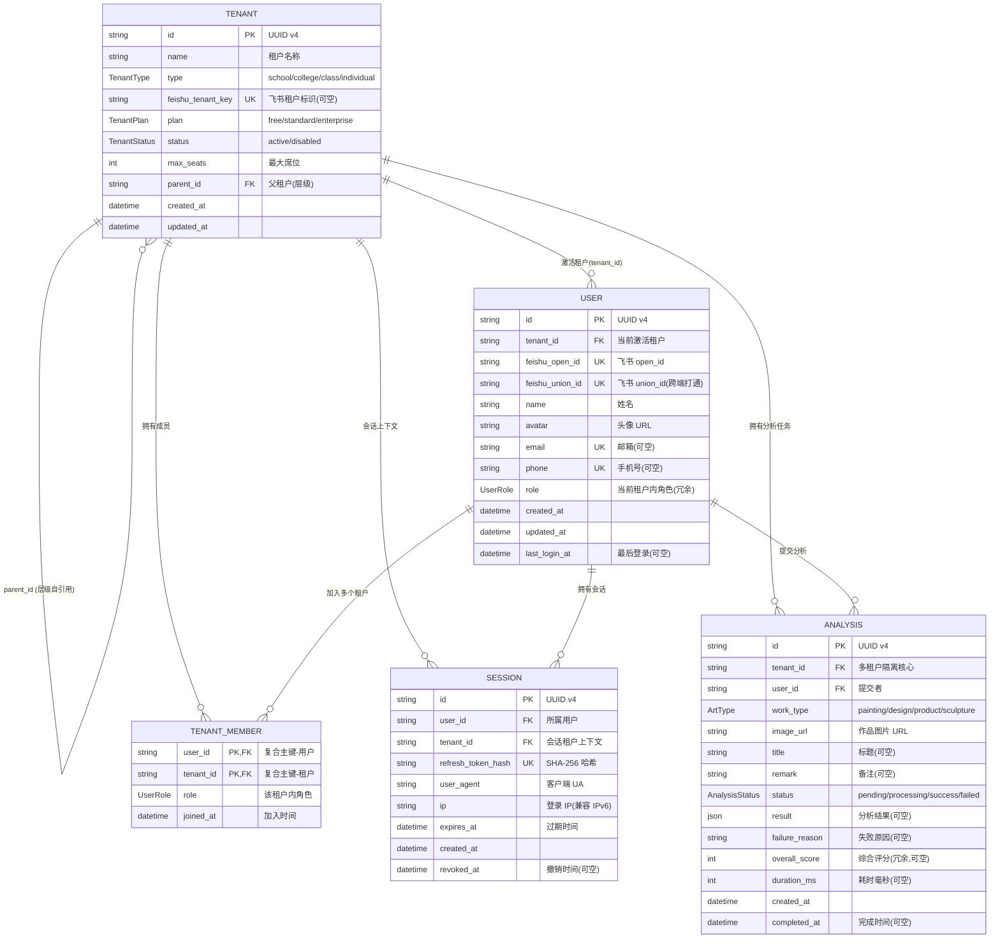

# 丹青有AI - 数据模型 v1

> **文档定位**:本文档定义丹青有AI 后端数据库的数据模型,作为 Prisma schema 的设计依据与各端共享的数据契约。所有表结构变更必须先更新本文档,再由 backend-service 修改 `server/prisma/schema.prisma`。
>
> **版本**:v1.0
> **创建时间**:2026-07-27
> **维护人**:product-architect
> **适用阶段**:Phase 1(用户/会话/租户/分析任务)
> **对应代码**:`server/prisma/schema.prisma`(由 backend-service 实现)

---

## 0. 设计原则

| 原则 | 说明 |
|---|---|
| 数据库 | PostgreSQL 14+(生产环境强制,禁止 SQLite) |
| 主键 | UUID v4,所有表主键统一为 `id String @id @default(uuid())` |
| 多租户隔离 | 所有业务表强制包含 `tenant_id` 字段(除 Tenant 表本身),Repository 层所有查询必须带 `WHERE tenant_id = ?` |
| 软删除 | Phase 1 暂不引入软删除字段;Analysis 通过 status=failed 表达失败,Session 通过 revoked_at 表达撤销 |
| 时间戳 | 所有表含 `created_at`;可变表(User/Tenant)含 `updated_at`;`@updatedAt` 自动维护 |
| 命名规范 | 表名复数蛇形(`tenants` / `users` / `sessions` / `tenant_members` / `analyses`),字段名蛇形,Prisma model 名大驼峰 |
| 字符串长度 | VARCHAR 用于定长约束(如 phone 45 兼容 IPv6),TEXT 用于长文本(如 user_agent / imageUrl) |
| 敏感数据 | refresh_token 仅存 SHA-256 哈希,禁止明文;email/phone 加唯一索引便于登录 |
| 外键 | 所有关联显式 `@relation`,级联策略默认 `Restrict`(禁止误删),需级联时显式声明 |

---

## 1. 表清单速查

| # | 表名 | Prisma model | 说明 | 多租户字段 | 主键 |
|---|---|---|---|---|---|
| 1 | tenants | Tenant | 租户(学校/学院/班级/个人) | 否(自身) | id |
| 2 | users | User | 用户(飞书登录) | 是(tenant_id 当前激活) | id |
| 3 | sessions | Session | 会话(refresh_token 哈希) | 是(tenant_id 上下文) | id |
| 4 | tenant_members | TenantMember | 租户成员关系(多对多) | 是(tenant_id 复合主键) | (user_id, tenant_id) |
| 5 | analyses | Analysis | AI 分析任务 | 是(tenant_id) | id |

---

## 2. 表字段详细说明

### 2.1 Tenant 表(租户)

| 字段 | 类型 | 约束 | 说明 |
|---|---|---|---|
| id | String(UUID) | PK, @default(uuid()) | 租户唯一标识 |
| name | String | NOT NULL | 租户名称(如"通化师范学院美术学院") |
| type | TenantType(enum) | NOT NULL | school / college / class / individual |
| feishu_tenant_key | String? | UNIQUE | 飞书租户标识,用于首次登录自动匹配;个人租户为 null |
| plan | TenantPlan(enum) | NOT NULL, default(free) | free / standard / enterprise |
| status | TenantStatus(enum) | NOT NULL, default(active) | active / disabled |
| max_seats | Int | NOT NULL, default(1) | 最大成员席位(免费版 1,标准版 50,院校版 500) |
| parent_id | String? | FK → tenants.id, UNIQUE 索引 | 父租户 ID(层级关系:class→college→school) |
| created_at | DateTime | NOT NULL, @default(now()) | 创建时间 |
| updated_at | DateTime | NOT NULL, @updatedAt | 更新时间 |

**设计说明**:
- `type` 决定租户层级:individual 无父租户,class 的父租户是 college,college 的父租户是 school
- `feishu_tenant_key` 唯一,首次飞书登录时按此字段匹配租户;一个飞书租户只能对应一个系统租户
- `parent_id` 加 UNIQUE 索引便于向上追溯层级
- `max_seats` 与 `plan` 解耦,允许管理员手动调整(如院校版额外购买席位)

### 2.2 User 表(用户)

| 字段 | 类型 | 约束 | 说明 |
|---|---|---|---|
| id | String(UUID) | PK, @default(uuid()) | 用户唯一标识 |
| tenant_id | String | FK → tenants.id, 索引 | 当前激活租户(用户可切换,此字段为当前上下文) |
| feishu_open_id | String | NOT NULL, UNIQUE | 飞书 open_id(单应用内唯一) |
| feishu_union_id | String | NOT NULL, UNIQUE | 飞书 union_id(开发者下所有应用唯一,用于跨应用身份打通) |
| name | String | NOT NULL | 用户姓名(从飞书同步,可修改) |
| avatar | String | NOT NULL, default("") | 头像 URL |
| email | String? | UNIQUE | 邮箱(可空,从飞书同步) |
| phone | String? | UNIQUE | 手机号(可空,从飞书同步) |
| role | UserRole(enum) | NOT NULL, default(student) | 当前激活租户内的角色(冗余字段,与 TenantMember.role 保持一致) |
| created_at | DateTime | NOT NULL, @default(now()) | 注册时间 |
| updated_at | DateTime | NOT NULL, @updatedAt | 更新时间 |
| last_login_at | DateTime? | NULL | 最后登录时间(每次登录更新) |

**设计说明**:
- `feishu_union_id` 是跨端身份打通的核心字段,Web/移动/管理后台三端登录后通过 union_id 识别为同一用户
- `tenant_id` 是"当前激活租户",用户切换租户时更新此字段;用户与租户的实际关系通过 TenantMember 表表达(多对多)
- `role` 是冗余字段,与 TenantMember 中 (user_id, tenant_id) 对应的 role 保持一致;切换租户时一并更新
- `email` / `phone` 加唯一索引,便于后续扩展邮箱/手机号登录(Phase 2)

### 2.3 Session 表(会话)

| 字段 | 类型 | 约束 | 说明 |
|---|---|---|---|
| id | String(UUID) | PK, @default(uuid()) | 会话唯一标识 |
| user_id | String | FK → users.id, 索引 | 所属用户 |
| tenant_id | String | FK → tenants.id, 索引 | 会话创建时的租户上下文(多租户强制) |
| refresh_token_hash | String | NOT NULL, UNIQUE | refresh_token 的 SHA-256 哈希(不存明文) |
| user_agent | String | NOT NULL, @db.Text | 客户端 User-Agent |
| ip | String | NOT NULL, @db.VarChar(45) | 登录 IP(兼容 IPv6) |
| expires_at | DateTime | NOT NULL, 索引 | 过期时间(创建时间 + 7 天) |
| created_at | DateTime | NOT NULL, @default(now()) | 创建时间 |
| revoked_at | DateTime? | NULL, 索引 | 撤销时间(非空表示已登出/踢出) |

**设计说明**:
- `refresh_token_hash` 仅存 SHA-256 哈希,即使数据库泄露攻击者也无法直接使用 refresh_token
- `tenant_id` 在 Session 表的意义:满足"所有表强制 tenant_id"的多租户约束,同时便于按租户审计会话、批量撤销某租户的所有会话(如租户被禁用时)
- `revoked_at` 为 null 表示有效会话;非 null 表示已撤销(登出或被踢出)
- 定时任务清理 `expires_at < now() AND revoked_at IS NULL` 的过期会话

### 2.4 TenantMember 表(租户成员关系)

| 字段 | 类型 | 约束 | 说明 |
|---|---|---|---|
| user_id | String | FK → users.id, 复合 PK | 用户 ID |
| tenant_id | String | FK → tenants.id, 复合 PK, 索引 | 租户 ID |
| role | UserRole(enum) | NOT NULL, default(student), 索引 | 该用户在该租户中的角色 |
| joined_at | DateTime | NOT NULL, @default(now()) | 加入租户时间 |

**设计说明**:
- 复合主键 (user_id, tenant_id),一个用户在一个租户中只有一条记录
- 一个用户可属于多个租户(如张老师是 A 学院的 teacher,同时是 B 班级的 student)
- `role` 是租户内角色,与 User.role(当前激活租户角色)保持一致
- 邀请成员时插入此表;退出租户时删除此表记录(同时若退出的是当前激活租户,需切换 User.tenant_id)

### 2.5 Analysis 表(AI 分析任务)

| 字段 | 类型 | 约束 | 说明 |
|---|---|---|---|
| id | String(UUID) | PK, @default(uuid()) | 分析任务唯一标识 |
| tenant_id | String | FK → tenants.id, 复合索引 | 多租户隔离核心字段 |
| user_id | String | FK → users.id, 复合索引 | 提交者 |
| work_type | ArtType(enum) | NOT NULL, 复合索引 | painting / design / product / sculpture |
| image_url | String | NOT NULL, @db.Text | 作品图片 URL(上传后落 OSS/CDN) |
| title | String? | @db.VarChar(64) | 作品标题(可选) |
| remark | String? | @db.VarChar(500) | 备注(如教师布置的作业要求) |
| status | AnalysisStatus(enum) | NOT NULL, default(pending), 复合索引 | pending / processing / success / failed |
| result | Json? | NULL | 分析结果(成功时存 AnalysisResult 结构,见 API 契约 3.6) |
| failure_reason | String? | NULL, @db.Text | 失败原因(status=failed 时非空) |
| overall_score | Int? | NULL, 索引 | 综合评分(冗余,便于列表查询排序,0-100) |
| duration_ms | Int? | NULL | 分析耗时(毫秒,用于 SLA 监控) |
| created_at | DateTime | NOT NULL, @default(now()), 复合索引 | 创建时间 |
| completed_at | DateTime? | NULL | 完成时间(success/failed 的时间) |

**设计说明**:
- `tenant_id` + `created_at` 复合索引:支撑"租户内按时间倒序查询历史"
- `tenant_id` + `user_id` 复合索引:支撑"教师查看指定学生的分析记录"
- `tenant_id` + `status` / `tenant_id` + `work_type` 复合索引:支撑筛选查询
- `overall_score` 冗余存储,从 `result.overallScore` 提取,避免列表查询时解析 JSON
- `result` 用 Json 类型存储,结构对应 API 契约第 3.6 节的 `AnalysisResult`

---

## 3. 枚举定义

```typescript
// 用户角色(租户内角色)
enum UserRole {
  admin      // 管理员(school/college)
  teacher    // 教师(college/class)
  student    // 学生(class/individual)
  owner      // 所有者(individual,等同 admin)
}

// 租户类型
enum TenantType {
  school       // 学校级
  college      // 学院级
  class        // 班级级
  individual   // 个人
}

// 订阅计划
enum TenantPlan {
  free        // 免费版(50 次/月,1 席位)
  standard    // 标准版(2000 次/月,50 席位)
  enterprise  // 院校版(无限,500 席位)
}

// 租户状态
enum TenantStatus {
  active     // 启用
  disabled   // 禁用
}

// 艺术作品类型(四类)
enum ArtType {
  painting    // 绘画
  design      // 设计
  product     // 产品设计
  sculpture   // 雕塑
}

// 分析任务状态
enum AnalysisStatus {
  pending      // 待处理(已入队)
  processing   // 处理中(Worker 已取走)
  success      // 成功
  failed       // 失败
}
```

---

## 4. Prisma Schema 雏形

> 以下为 Prisma schema 完整 model 定义,由 backend-service 落地为 `server/prisma/schema.prisma`。Phase 1 仅包含本节 5 个 model,Phase 2 起扩展 Subscription/Artwork/Growth 等。

```prisma
// ============================================================
// 丹青有AI - Prisma Schema v1
// 数据库:PostgreSQL 14+
// 主键策略:UUID v4
// 多租户:所有业务表强制 tenant_id(除 Tenant 表本身)
// 维护人:product-architect
// ============================================================

generator client {
  provider = "prisma-client-js"
}

datasource db {
  provider = "postgresql"
  url      = env("DATABASE_URL")
}

// ============================================================
// 枚举定义
// ============================================================

enum UserRole {
  admin
  teacher
  student
  owner
}

enum TenantType {
  school
  college
  class
  individual
}

enum TenantPlan {
  free
  standard
  enterprise
}

enum TenantStatus {
  active
  disabled
}

enum ArtType {
  painting
  design
  product
  sculpture
}

enum AnalysisStatus {
  pending
  processing
  success
  failed
}

// ============================================================
// 1. 租户表(Tenant)
// ============================================================

model Tenant {
  id              String       @id @default(uuid())
  name            String
  type            TenantType
  feishuTenantKey String?      @unique
  plan            TenantPlan   @default(free)
  status          TenantStatus @default(active)
  maxSeats        Int          @default(1)
  parentId        String?
  createdAt       DateTime     @default(now())
  updatedAt       DateTime     @updatedAt

  // 关系:租户层级(自引用)
  parent          Tenant?      @relation("TenantHierarchy", fields: [parentId], references: [id])
  children        Tenant[]     @relation("TenantHierarchy")

  // 关系:租户内的成员、用户、分析、会话
  members         TenantMember[]
  users           User[]       // 当前激活租户为该租户的用户
  analyses        Analysis[]
  sessions        Session[]

  @@index([parentId])
  @@index([feishuTenantKey])
  @@map("tenants")
}

// ============================================================
// 2. 用户表(User)
// ============================================================

model User {
  id              String       @id @default(uuid())
  tenantId        String       // 当前激活租户(可切换)
  feishuOpenId    String       @unique
  feishuUnionId   String       @unique
  name            String
  avatar          String       @default("")
  email           String?      @unique
  phone           String?      @unique
  role            UserRole     @default(student)  // 当前激活租户内的角色(冗余,与 TenantMember.role 一致)
  createdAt       DateTime     @default(now())
  updatedAt       DateTime     @updatedAt
  lastLoginAt     DateTime?

  // 关系
  tenant          Tenant       @relation(fields: [tenantId], references: [id])
  sessions        Session[]
  memberships     TenantMember[]
  analyses        Analysis[]

  @@index([tenantId])
  @@index([feishuUnionId])
  @@map("users")
}

// ============================================================
// 3. 会话表(Session)
// ============================================================

model Session {
  id                String    @id @default(uuid())
  userId            String
  tenantId          String    // 会话创建时的租户上下文(多租户强制)
  refreshTokenHash  String    @unique  // SHA-256 哈希,禁止存明文
  userAgent         String    @db.Text
  ip                String    @db.VarChar(45)  // 兼容 IPv6
  expiresAt         DateTime
  createdAt         DateTime  @default(now())
  revokedAt         DateTime?  // 撤销时间(非空表示已登出/踢出)

  // 关系
  user              User      @relation(fields: [userId], references: [id])
  tenant            Tenant    @relation(fields: [tenantId], references: [id])

  @@index([userId])
  @@index([tenantId])
  @@index([expiresAt])
  @@index([revokedAt])
  @@map("sessions")
}

// ============================================================
// 4. 租户成员关系表(TenantMember,多对多)
// ============================================================

model TenantMember {
  userId      String
  tenantId    String
  role        UserRole   @default(student)
  joinedAt    DateTime   @default(now())

  // 关系
  user        User       @relation(fields: [userId], references: [id])
  tenant      Tenant     @relation(fields: [tenantId], references: [id])

  @@id([userId, tenantId])  // 复合主键
  @@index([tenantId])
  @@index([role])
  @@map("tenant_members")
}

// ============================================================
// 5. AI 分析任务表(Analysis)
// ============================================================

model Analysis {
  id              String          @id @default(uuid())
  tenantId        String          // 多租户隔离核心字段
  userId          String
  workType        ArtType
  imageUrl        String          @db.Text
  title           String?         @db.VarChar(64)
  remark          String?         @db.VarChar(500)
  status          AnalysisStatus  @default(pending)
  result          Json?           // 成功时存 AnalysisResult 结构(见 API 契约 3.6)
  failureReason   String?         @db.Text
  overallScore    Int?            // 冗余字段,从 result.overallScore 提取,便于列表排序
  durationMs      Int?            // 分析耗时(毫秒),用于 SLA 监控
  createdAt       DateTime        @default(now())
  completedAt     DateTime?

  // 关系
  tenant          Tenant          @relation(fields: [tenantId], references: [id])
  user            User            @relation(fields: [userId], references: [id])

  @@index([tenantId, createdAt])   // 租户内按时间倒序查询
  @@index([tenantId, userId])      // 教师查看指定学生
  @@index([tenantId, status])      // 按状态筛选
  @@index([tenantId, workType])    // 按作品类型筛选
  @@index([overallScore])          // 评分排序
  @@map("analyses")
}
```

---

## 5. ER 图(Mermaid erDiagram)



---

## 6. 索引设计汇总

| 表 | 索引名 | 字段 | 用途 |
|---|---|---|---|
| tenants | tenants_parent_id_idx | parent_id | 层级查询 |
| tenants | tenants_feishu_tenant_key_idx | feishu_tenant_key | 首次登录匹配租户 |
| users | users_tenant_id_idx | tenant_id | 按租户查询用户 |
| users | users_feishu_union_id_idx | feishu_union_id | 跨端身份识别 |
| sessions | sessions_user_id_idx | user_id | 查询用户会话 |
| sessions | sessions_tenant_id_idx | tenant_id | 按租户审计会话 |
| sessions | sessions_expires_at_idx | expires_at | 清理过期会话 |
| sessions | sessions_revoked_at_idx | revoked_at | 查询有效会话 |
| tenant_members | tenant_members_tenant_id_idx | tenant_id | 查询租户成员 |
| tenant_members | tenant_members_role_idx | role | 按角色筛选 |
| analyses | analyses_tenant_id_created_at_idx | (tenant_id, created_at) | 租户内按时间倒序 |
| analyses | analyses_tenant_id_user_id_idx | (tenant_id, user_id) | 教师查看指定学生 |
| analyses | analyses_tenant_id_status_idx | (tenant_id, status) | 按状态筛选 |
| analyses | analyses_tenant_id_work_type_idx | (tenant_id, work_type) | 按作品类型筛选 |
| analyses | analyses_overall_score_idx | overall_score | 评分排序 |

---

## 7. 多租户字段强制约束

### 7.1 字段覆盖核查

| 表 | 是否含 tenant_id | 说明 |
|---|---|---|
| tenants | 否 | 租户表本身,不需要 tenant_id |
| users | 是 | User.tenantId 表示当前激活租户 |
| sessions | 是 | Session.tenantId 表示会话创建时的租户上下文(满足强制约束 + 便于按租户审计/批量撤销) |
| tenant_members | 是 | 复合主键之一即 tenant_id |
| analyses | 是 | Analysis.tenantId 多租户隔离核心字段 |

### 7.2 Repository 层强制过滤实现约定

> 以下约定由 backend-service 在 Repository 层强制实现,违反约定的 PR 不予合并。

```typescript
// Repository 基类(伪代码,由 backend-service 实现)
abstract class BaseRepository<T> {
  // 所有查询必须传入 tenantId,自动追加 WHERE tenant_id = ?
  async findMany(tenantId: string, where: Partial<T>): Promise<T[]>;

  // 所有单条查询必须校验 tenant_id
  async findById(tenantId: string, id: string): Promise<T | null>;

  // 所有写操作必须带 tenant_id
  async create(tenantId: string, data: Omit<T, 'id' | 'tenantId'>): Promise<T>;

  // 所有更新必须 WHERE (id, tenant_id)
  async update(tenantId: string, id: string, data: Partial<T>): Promise<T>;

  // 所有删除必须 WHERE (id, tenant_id)
  async delete(tenantId: string, id: string): Promise<void>;
}
```

### 7.3 中间件注入 tenant_id

```typescript
// authMiddleware(伪代码)
function authMiddleware(req, res, next) {
  const payload = verifyJWT(req.headers.authorization);  // RS256 校验
  req.userId = payload.sub;
  req.tenantId = payload.tenantId;  // 从 JWT 中注入 tenant_id
  req.role = payload.role;
  next();
}

// 后续 Repository 从 req.tenantId 取值,禁止从请求体/查询参数读取 tenant_id
```

### 7.4 跨租户访问防护

- 所有 `WHERE id = ?` 查询必须追加 `AND tenant_id = ?`
- 管理员聚合查询(向上追溯下级租户)需显式声明 `ALLOW_CROSS_TENANT` 标记,并由 Service 层校验角色权限
- 任何跨租户访问尝试返回 `code=3004`(TENANT_MISMATCH)

---

## 8. 数据迁移与初始化

### 8.1 迁移脚本约定

- Prisma migration 命名:`YYYYMMDDHHmmss_<action>.sql`(如 `20260727100000_init.sql`)
- 每次 schema 变更必须 `npx prisma migrate dev --name <描述>`,生成迁移文件
- 生产环境禁止 `prisma db push`,必须 `prisma migrate deploy`
- 迁移文件一旦合并到 main 分支,禁止修改(只能新增迁移回滚)

### 8.2 初始化数据

Phase 1 需要的初始化数据(由 seed 脚本写入):

| 数据 | 说明 |
|---|---|
| 默认个人租户 | 无(用户首次登录时按 PRD 5.1.5 决策创建) |
| 默认管理员 | 无(由飞书登录 + 邮箱域名匹配自动创建) |
| 配额计数器 | Redis 初始化 `tenant:{id}:quota:{YYYYMM}` = 0 |

### 8.3 回滚方案

| 场景 | 回滚方式 |
|---|---|
| 字段新增 | 删除字段(向后兼容,无数据丢失) |
| 字段删除 | 不允许直接删除,先标记 deprecated,Phase N+1 删除 |
| 表结构变更 | 新增迁移文件反向操作,禁止修改已合并迁移 |
| 枚举值删除 | 不允许,只能新增枚举值 |

---

## 9. 与 API 契约的映射关系

| API 契约类型(见 api-contract-v1.md 第 3 节) | 对应数据模型 |
|---|---|
| UserProfile | User 表 |
| TenantInfo | Tenant 表(+ usedQuota/maxQuota 来自 Redis 计数器) |
| TenantMembership | TenantMember 表(+ 关联 Tenant.name/type) |
| AnalysisDetail | Analysis 表(+ result 字段反序列化为 AnalysisResult) |
| AnalysisListItem | Analysis 表(精简字段,含 overallScore 冗余) |
| CreateAnalysisRequest | 请求体,写入 Analysis 表(初始 status=pending) |
| CreateAnalysisResponse | Analysis 表(id + status + 可选 result) |

---

## 10. 验收报告

| 验收项 | 状态 | 说明 |
|---|---|---|
| User 表字段完整 | 通过 | 含 id/tenant_id/feishu_open_id/feishu_union_id/name/avatar/email/phone/role/created_at/updated_at/last_login_at,完全覆盖任务要求 |
| Session 表字段完整 | 通过 | 含 id/user_id/refresh_token_hash/user_agent/ip/expires_at/created_at/revoked_at,额外加 tenant_id 满足多租户强制约束 |
| Tenant 表字段完整 | 通过 | 含 id/name/type/feishu_tenant_key/plan/max_seats/created_at,额外加 status/parent_id/updated_at 支撑层级与禁用 |
| TenantMember 表字段完整 | 通过 | 含 user_id/tenant_id/role/joined_at,复合主键 (user_id, tenant_id) |
| Analysis 表字段完整 | 通过 | 含 id/tenant_id/user_id/work_type/image_url/status/result(JSON)/duration_ms/created_at/completed_at,额外加 title/remark/failure_reason/overall_score |
| 所有表含 tenant_id(除 Tenant) | 通过 | User/Session/TenantMember/Analysis 均含 tenant_id;Tenant 表本身不含(设计原则) |
| Prisma schema 雏形已给出 | 通过 | 第 4 节给出完整 5 个 model 定义,含 enum/关系/索引/表名映射 |
| Mermaid ER 图已绘制 | 通过 | 第 5 节给出 erDiagram,含 5 个实体与所有关系 |
| 多租户强制约束说明 | 通过 | 第 7 节给出字段覆盖核查 + Repository 层强制过滤 + 中间件注入 + 跨租户防护 |
| 枚举定义清晰 | 通过 | 第 3 节定义 6 个 enum,与 API 契约第 3 节类型完全一致 |
| 索引设计完整 | 通过 | 第 6 节汇总 15 个索引,覆盖主要查询场景 |
| 迁移与回滚方案 | 通过 | 第 8 节给出迁移命名/初始化/回滚约定 |

---

## 11. 变更记录

| 版本 | 时间 | 变更人 | 变更内容 |
|---|---|---|---|
| v1.0 | 2026-07-27 | product-architect | 初始版本,定义 5 张核心表 + 6 个枚举 + Prisma schema + ER 图 |

---

## 12. 待定事项(Phase 2 扩展)

| 表 | 用途 | 计划阶段 |
|---|---|---|
| Subscription | 订阅记录(支付/续费/退款) | Phase 2 |
| Artwork | 课堂素材库(99+名作)持久化 | Phase 2 |
| GrowthSnapshot | 成长曲线快照(按月聚合) | Phase 2 |
| AuditLog | 操作审计日志 | Phase 2 |
| Invitation | 租户成员邀请记录 | Phase 2 |
| FileUpload | 文件上传元数据(OSS Key/大小/类型) | Phase 2 |
