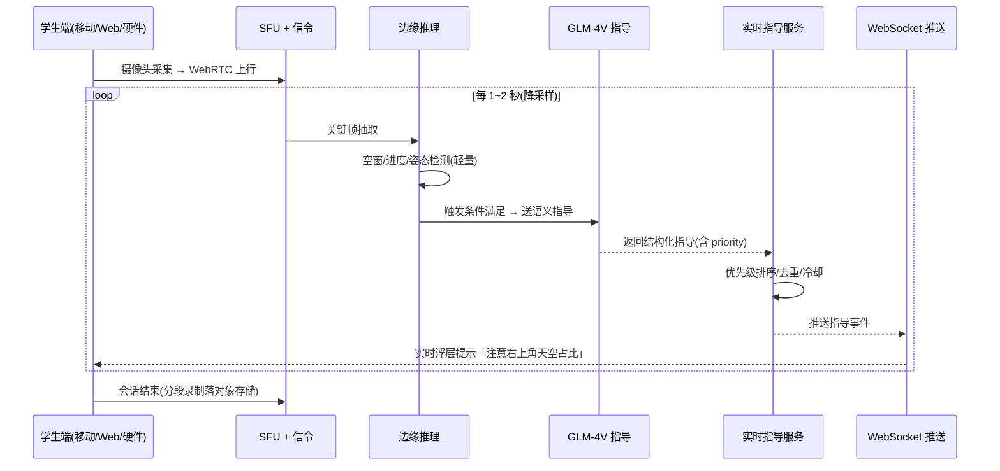
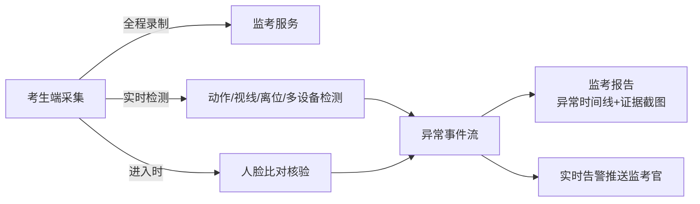
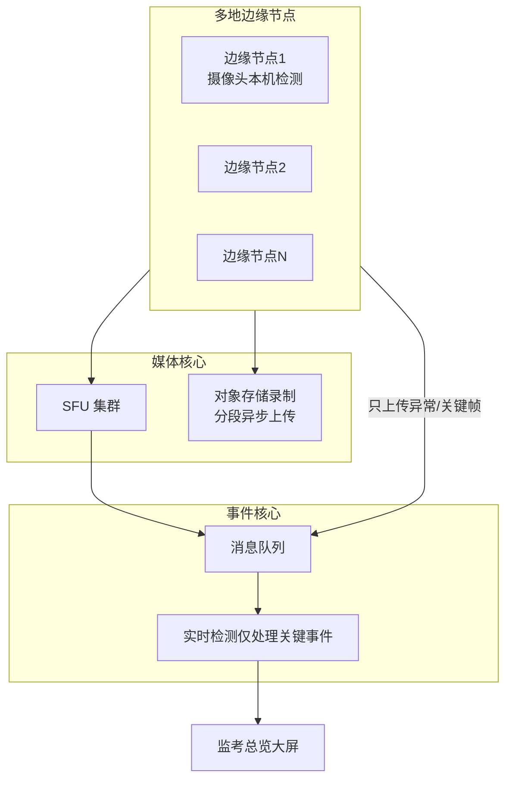
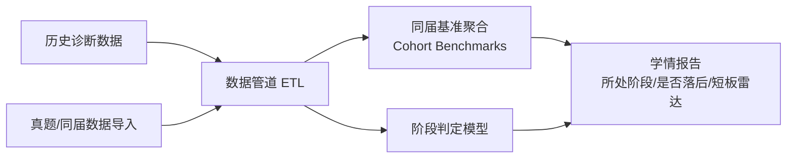

# 丹青有AI - 硬件实时监督与监考架构规划

> **文档定位**：本需求为「重大架构变更」，涉及引入硬件端、实时音视频、实时 AI 监督、监考模式、大规模在线监考与学情数据分析。本文件为架构规划与影响评估的「单一真相源」，作为后续 prd.md / tech_arch.md / data-model-v1.md / api-contract-v1.md 增量扩展的依据。
>
> **版本**：v1.0
> **创建时间**：2026-08-06
> **维护人**：product-architect（01）
> **状态**：待审阅（审阅通过后拆分任务并更新契约文档）
> **上游需求**：用户原始需求（硬件交互 / 实时监督现场指导 / 监考模式 / 校考初试在线监考 / 联网数据训练 / 阶段分析）

---

## 目录
1. [需求拆解与澄清结论](#1-需求拆解与澄清结论)
2. [影响评估报告](#2-影响评估报告)
3. [高层技术架构方案](#3-高层技术架构方案)
4. [数据模型增量设计（高层）](#4-数据模型增量设计高层)
5. [API 契约增量（高层）](#5-api-契约增量高层)
6. [跨端任务分解](#6-跨端任务分解)
7. [技术选型建议](#7-技术选型建议)
8. [优先实施顺序与里程碑](#8-优先实施顺序与里程碑)
9. [风险、合规与回滚](#9-风险合规与回滚)
10. [待确认事项](#10-待确认事项)

---

## 1. 需求拆解与澄清结论

### 1.1 原始需求五块拆解

| # | 用户关键词 | 需求本质 | 产品形态 | 与其他端的关系 |
|---|---|---|---|---|
| R1 | 进军硬件交互 | 新增**硬件端**能力 | 智能摄像头/边缘 AI 盒子（软硬解耦） | 作为采集与边缘推理终端 |
| R2 | 实时监督现场指导 | 教学核心：AI 像集训老师一样**实时看着、实时指出错误** | 「AI 实时伴学」实时指导模式 | 复用现有诊断能力，新增流式监督 |
| R3 | 监考模式 | 画室月考/模拟考，AI **替代老师在场监考** | 「AI 监考」单考场模式 | 新增防作弊 + 监考报告 |
| R4 | 校考初试在线监督 | 大规模线上考试（数万学生并发），替代人工监看/回放 | 「大规模在线监考」 | 新增边缘检测 + 录制 + 事件流 |
| R5 | 联网数据训练 + 阶段分析 | 基于同龄/同届真题数据分析，判断使用者**是否落后、处于什么阶段** | 「学情分析 + 同届基准」 | 新增数据管道 + 阶段模型 |

### 1.2 澄清结论（架构师建议口径）

| 待澄清点 | 建议口径 | 理由 |
|---|---|---|
| 硬件形态 | **软件化先行（手机/平板摄像头），硬件后置** | 「进军硬件」需较长研发周期；用现有设备先跑通实时监督，验证产品价值后再做专用硬件，降低首期风险 |
| 实时监督的推理粒度 | **关键帧触发式**（降采样 1~2fps + 事件触发），非全帧实时推理 | 数万并发下全帧推理成本不可承受；美术作画变化慢，关键帧足够捕捉错误 |
| 实时性定义 | 指导**延迟 ≤ 3s**（与分析 SLA 一致），非毫秒级 | 美术纠错不需要毫秒级，3s 内"老师看到并指出"体验成立 |
| 监考与实时监督的关系 | 复用同一套「视频采集 + 事件检测」底座，**两种业务模式**（伴学/监考） | 避免重复建设，用会话类型区分 |
| 大规模并发的量级目标 | 首期支持 **1000 并发在线**，远期扩容至数万 | 数万并发需边缘节点 + 传输网，属重资产，分阶段达标 |
| 数据训练边界 | 首期**不训练自有大模型**，做「数据采集 + 同届基准聚合 + 阶段判定」 | 自训视觉模型成本过高；复用 GLM-4V + 客观规则达成阶段分析 |
| 合规优先级 | 人脸/未成年人/大规模监控属**高风险**，首期即纳入合规评审 | 监考涉及人脸比对与全程录像，必须满足 PIPL |

---

## 2. 影响评估报告

### 2.1 影响等级总览

| 领域 | 影响等级 | 说明 | 是否需暂停现有主线 |
|---|---|---|---|
| 端矩阵 | 🔴 高 | 新增**硬件端**，需定义硬件抽象层与设备管理 | 否（并行规划） |
| 后端架构 | 🔴 高 | 新增实时信令、媒体、流式推理、监考、学情分析服务 | 否（新增模块，不改造现有） |
| 数据库 | 🔴 高 | 新增 10+ 表（设备/实时会话/指导事件/监考/异常/基准/阶段等） | 是（需冻结 schema 变更窗口） |
| AI 集成 | 🔴 高 | 从「异步 3s 诊断」扩展出「流式/边缘推理 + 实时指导」 | 否（新增管线，复用现有） |
| 基础设施 | 🔴 高 | 新增 SFU/媒体服务器、对象存储录制、消息队列、边缘计算 | 是（需扩容与新增部署） |
| 权限体系 | 🟡 中 | 新增监考官/被监考角色、设备与考场权限 | 否 |
| 前端/移动端 | 🔴 高 | 新增视频采集、WebRTC、实时指导 UI、监考 UI | 否 |
| 管理后台 | 🟡 中 | 新增设备管理、监考管理、异常事件、阶段仪表盘 | 否 |
| 产品官网 | 🟢 低 | 新增硬件/监考/伴学产品介绍页 | 否 |
| 支付流程 | 🟢 低 | 硬件/监考订阅计费（后置） | 否 |
| 合规 | 🔴 高 | 人脸数据、未成年人、大规模监控、数据出境 | 是（首期需合规评审） |

### 2.2 结论：**允许并行推进，但需冻结数据库 schema 变更窗口**

本需求为**增量扩展**而非重构：现有「上传 → 3s 诊断 → 多形式报告」链路与多租户权限体系可完全保留，新增能力以**独立服务 + 独立数据域**承载。因此**不需要暂停现有主线开发**，但存在两点硬性约束：

1. **数据库 schema 冻结**：新增 10+ 表涉及 `schema.prisma` 大版本变更，需在正式迁移前冻结 schema 变更窗口，避免与现有迭代冲突。
2. **合规前置**：监考涉及人脸与未成年人数据采集，**必须在编码前**由 compliance-checker 出具合规方案，否则存在产品无法上线的风险。

---

## 3. 高层技术架构方案

### 3.1 总体架构（新增域以虚线框出）

```mermaid
flowchart TB
    subgraph Edges["终端层"]
        HW[硬件端<br/>智能摄像头/边缘AI盒子]
        MOB[移动端/平板<br/>摄像头采集]
        WEB[Web 端<br/>摄像头采集]
    end

    subgraph Media["实时媒体域(新增)"]
        SFU[SFU 媒体服务器<br/>LiveKit/mediasoup]
        REC[录制分段存储<br/>对象存储]
        SIG[信令服务<br/>WebSocket]
    end

    subgraph AI["AI 能力域"]
        EDGE[边缘推理<br/>姿态/空窗/进度检测]
        CLOUD[云端 GLM-4V<br/>语义指导/评分]
        DIA[现有异步诊断管线<br/>(3s SLA)]
    end

    subgraph Biz["业务域(新增)"]
        GUIDE[实时指导服务]
        PROCT[监考服务]
        ANALYTICS[学情分析服务]
        BENCH[同届基准聚合]
    end

    subgraph Core["核心域(现有)"]
        API[API Gateway<br/>多租户/RBAC]
        DB[(PostgreSQL)]
        REDIS[(Redis)]
        MQ[消息队列<br/>Redis Streams/Kafka]
        AUTH[认证/会话]
    end

    HW --> SFU
    MOB --> SFU
    WEB --> SFU
    SFU --> REC
    SFU --> SIG
    EDGE -->|异常/关键帧| CLOUD
    CLOUD --> GUIDE
    GUIDE --> PROCT
    ANALYTICS --> BENCH
    BENCH --> DB
    GUIDE --> MQ
    PROCT --> MQ
    MQ --> ANALYTICS
    API --> AUTH
    API --> DB
    API --> GUIDE
    API --> PROCT
    API --> ANALYTICS
    DIA --> CLOUD
```

### 3.2 实时伴学（R2）数据流

> 教学核心：AI 在旁边一直看着、实时指出错误。



**设计要点**：
- 关键帧**降采样**（1~2fps），避免全帧推理，控制成本与带宽。
- **事件触发式**：仅当边缘检测到「空窗过久 / 构图偏离 / 进度异常」等触发条件时，才调用云端 GLM-4V 做语义指导，具备**冷却机制**防轰炸。
- 指导对象即现有 `AnalysisResult` 的增量结构（新增 `RealTimeGuidance`），复用原诊断维度。

### 3.3 单一考场监考（R3）



**设计要点**：
- 复用 3.2 的采集底座，以 `ExamSession` 类型区分「伴学 / 监考」。
- 防作弊能力：**人脸核验**（入场比对）、**动作/视线/离位检测**、**多设备检测**、**页面切换检测**（移动/桌面端）。
- 输出**监考报告**：异常事件时间线 + 证据截图，供人工复核。

### 3.4 大规模在线监考（R4）

> 数万学生并发，人工监看/回放不可行，需边缘化、事件化、异步化。



**设计要**点：
- **边缘本地检测**：数万路视频不可能全量送云端，边缘设备本地完成行为/动作检测，**仅上传异常帧 + 关键帧**。
- **录制异步化**：本地分段录制，异步上传对象存储；实时检测只订阅关键事件，全量回放按需拉取。
- **事件流**：消息队列承载大规模事件，避免直连数据库打爆。
- **分级容量**：首期 1000 并发在线，架构预留扩容至数万（通过加边缘节点 + SFU 集群水平扩展）。

### 3.5 学情分析与同届基准（R5）



**设计要点**：
- **首期不训练自有大模型**，用「数据采集 + 同届基准百分位 + 阶段规则」达成阶段分析。
- 新增 `Cohort`（同届群组）、`Benchmark`（基准）、`StageModel`（阶段模型）等数据域。
- 阶段判定：基于历史诊断分数 + 同届百分位，输出「基础/瓶颈/冲刺」阶段与短板雷达。

---

## 4. 数据模型增量设计（高层）

> 以下为新增表的高层草案，最终以 `data-model-v1.md` 增量为准（需遵从前文 schema 冻结约束）。

| 新增表 | 说明 | 关键字段 | 主域 |
|---|---|---|---|
| `devices` | 硬件/采集设备注册 | id, tenantId, type(edge_camera/mobile/web), status, lastAliveAt | 硬件 |
| `live_sessions` | 实时会话（伴学/监考通用） | id, tenantId, userId, sessionType(guidance/proctor), deviceId, status, startAt, endAt | 实时 |
| `guidance_events` | 实时指导事件 | id, sessionId, frameAt, dimension, advice, priority, source(edge/cloud), snapshotUrl | 伴学 |
| `exam_sessions` | 考场会话 | id, tenantId, examId, proctorId, status, startAt, endAt | 监考 |
| `exam_anomalies` | 监考异常事件 | id, examSessionId, type(leave/peer/face/multiDevice/switch), timestamp, evidenceUrl, severity | 监考 |
| `face_verifications` | 人脸核验记录 | id, examSessionId, userId, verified, confidence, snapshotUrl | 监考 |
| `recordings` | 录制分段元数据 | id, sessionId, objectKey, durationMs, size, status | 媒体 |
| `cohorts` | 同届群组 | id, tenantId, name, schoolYear, examTarget | 学情 |
| `benchmarks` | 同届基准 | id, cohortId, artType, dimension, p50/p75/p90, sampleCount | 学情 |
| `student_stages` | 学生阶段快照 | id, tenantId, userId, cohortId, stage, percentile, radar, updatedAt | 学情 |

**枚举扩展**：`SessionType(guidance/proctor)`、`GuidancePriority`、`AnomalyType`、`StageModel(basic/foundation/advanced/creative)` 等。

**关系**：`live_sessions` 关联 `devices` 与 `exam_sessions`；`exam_sessions` 关联 `cohorts`；`student_stages` 关联 `cohorts` 与 `benchmarks`。所有业务表强制 `tenant_id`（沿用现有多租户约束）。

---

## 5. API 契约增量（高层）

> 统一响应 `{code, message, data, traceId}` 不变，以下为新增端点高层设计。

### 5.1 实时会话（伴学/监考通用）

| 方法 | 路径 | 鉴权 | 说明 |
|---|---|---|---|
| POST | `/api/v1/live-sessions` | 是 | 创建实时会话（传 sessionType） |
| GET | `/api/v1/live-sessions/:id` | 是 | 会话详情 |
| POST | `/api/v1/live-sessions/:id/stop` | 是 | 结束会话（触发分段录制归档） |
| WS | `/ws/live/:sessionId` | 是(token) | 信令 + 实时指导事件推送 |

### 5.2 实时指导

| 方法 | 路径 | 鉴权 | 说明 |
|---|---|---|---|
| GET | `/api/v1/live-sessions/:id/guidance` | 是 | 拉取本会话指导事件列表 |

### 5.3 监考

| 方法 | 路径 | 鉴权 | 说明 |
|---|---|---|---|
| POST | `/api/v1/exams` | 是(teacher/admin) | 创建考场 |
| POST | `/api/v1/exams/:id/start` | 是(teacher/admin) | 开始监考 |
| GET | `/api/v1/exams/:id/report` | 是(teacher/admin) | 监考报告（异常时间线） |
| GET | `/api/v1/exams/:id/live` | 是(teacher/admin) | 实时监考画面/大屏 |
| POST | `/api/v1/exams/:id/verify` | 是 | 人脸核验 |

### 5.4 学情分析

| 方法 | 路径 | 鉴权 | 说明 |
|---|---|---|---|
| GET | `/api/v1/users/:id/stage` | 是(本人/teacher) | 学生所处阶段与是否落后 |
| GET | `/api/v1/cohorts/:id/benchmarks` | 是(teacher/admin) | 同届基准分布 |
| GET | `/api/v1/users/:id/radar` | 是(本人/teacher) | 短板雷达 |

### 5.5 设备管理

| 方法 | 路径 | 鉴权 | 说明 |
|---|---|---|---|
| GET/POST | `/api/v1/devices` | 是(admin) | 设备列表/注册 |
| PATCH | `/api/v1/devices/:id` | 是(admin) | 更新设备状态 |

---

## 6. 跨端任务分解

| 任务ID | 优先级 | 负责 Agent | 任务描述 | 验收标准 |
|---|---|---|---|---|
| HL-01 | P0 | product-architect(01) | 更新 prd/tech_arch/data-model/api-contract 四份契约文档（本需求增量） | 四文档同步一致，类型单一真相源 |
| HL-02 | P0 | compliance-checker(13) | 出具人脸/未成年人/大规模监控合规方案（PIPL 告知同意、数据最小化、境内存储） | 合规评审通过，可上线 |
| HL-03 | P0 | backend-service(03) | 新增实时会话/设备/媒体相关表迁移 + 基础 CRUD | schema 迁移通过，多租户隔离生效 |
| HL-04 | P0 | ai-integration-engineer(11) | 关键帧降采样 + 事件触发的实时指导管线（复用 GLM-4V） | 指导延迟 ≤3s，事件去重/冷却正常 |
| HL-05 | P0 | mobile-app(05) | 移动端摄像头采集 + WebRTC 上行 + 实时指导浮层 UI | 移动端可实时看到指导提示 |
| HL-06 | P0 | frontend-app(02) | Web 端摄像头采集 + WebRTC + 实时指导 UI | Web 端实时伴学可用 |
| HL-07 | P1 | backend-service(03) | 监考服务：人脸核验 + 动作/视线/多设备/切换检测事件 | 异常事件可记录 + 证据截图 |
| HL-08 | P1 | admin-dashboard(06) | 监考管理：考场创建、实时大屏、监考报告 | 监考官可实时监看并出报告 |
| HL-09 | P1 | backend-service(03) | 学情分析服务：同届基准聚合 + 阶段判定 + 短板雷达 | 阶段判定与百分位准确 |
| HL-10 | P1 | frontend-app(02) | 学情报告页：阶段/是否落后/短板雷达可视化 | 学生可见阶段与短板 |
| HL-11 | P2 | devops-qa(08) | SFU 集群 + 对象存储录制 + 消息队列部署与压测 | 1000 并发在线稳定，录制可归档 |
| HL-12 | P2 | performance-expert(12) | 大规模并发监考性能优化与容量分级验证 | 关键帧检测不丢事件，录制不阻塞 |
| HL-13 | P2 | backend-service(03) | 大规模在线监考：边缘节点 + 事件流 + 录制异步化 | 仅上传关键事件，全量录制异步归档 |
| HL-14 | P2 | （新增）hardware-engineer | 硬件端抽象层定义 + 边缘推理集成（RK3588/ONNX） | 硬件采集与检测跑通，软硬解耦 |
| HL-15 | P2 | marketing-website(04) | 官网新增硬件/伴学/监考产品介绍页 | 官网可介绍并对接购买意向 |
| HL-16 | P3 | api-test-pro(10) | 实时/监考/学情 API 全量测试用例与压测脚本 | 关键链路测试通过 |
| HL-17 | P3 | auth-oauth(07) | 新增监考官/被监考角色与会话/设备权限 | RBAC 覆盖新角色，隔离正确 |
| HL-18 | P3 | ui-designer(09) | 实时指导浮层、监考大屏、学情雷达的视觉设计（水墨风） | 视觉符合设计规范 |

> 注：HL-14 需新增 `hardware-engineer` Subagent（当前 13 个 Agent 未覆盖硬件端）。

---

## 7. 技术选型建议

| 能力 | 候选方案 | 建议 | 理由 |
|---|---|---|---|
| 实时传输 | WebRTC | 采纳 | 浏览器/移动端原生支持，零插件 |
| SFU 大规模转发 | mediasoup / LiveKit / Janus | **LiveKit** | 开源、易集成、自带录制与信令，适合起步 |
| 录制存储 | 对象存储（本地 MinIO / 云 OSS） | 对象存储 | 分段异步上传，避免实时上传打爆 |
| 实时通信信令 | WebSocket / LiveKit 内置 | WebSocket | 复用现有 Node 栈，轻量 |
| 边缘推理框架 | ONNX Runtime / TFLite / RKNN | **ONNX Runtime** | 跨平台，CPU/NPU 均可 |
| 边缘芯片 | RK3588 / 地平线旭日 / 树莓派 | RK3588 | 国产、NPU 6T、性价比高 |
| 消息队列 | Redis Streams / RabbitMQ / Kafka | **首期 Redis Streams**（已有 Redis），规模后迁移 Kafka | 最小化基础设施变更 |
| 事件触发模型 | 规则 + 边缘轻量检测 | 规则 + 轻量检测 | 首期不训练自有模型 |
| 学情聚合 | PostgreSQL + 定时聚合 + 缓存 | 复用现有 | 不引入重型数仓 |

---

## 8. 优先实施顺序与里程碑

| 里程碑 | 范围 | 验收 | 依赖 |
|---|---|---|---|
| **M0 契约冻结** | 四契约文档更新 + 合规评审 | 文档单一真相源一致，合规通过 | HL-01/HL-02 |
| **M1 软件化实时伴学(P0)** | 移动/Web 摄像头采集 + WebRTC + 实时指导管线 | 学生用现有设备即可获得实时 AI 指导 | HL-03/04/05/06 |
| **M2 单考场监考(P1)** | 监考服务 + 防作弊 + 监考报告 + 学情分析 | 画室月考/模拟考 AI 监考闭环，出阶段报告 | HL-07/08/09/10 |
| **M3 大规模在线监考(P2)** | SFU 集群 + 边缘节点 + 异步录制 + 事件流 | 1000+ 并发在线稳定，校考初试试点 | HL-11/12/13 |
| **M4 硬件商业化(P2/P3)** | 硬件抽象层 + 边缘盒子 + 官网承接 + 订阅计费 | 硬件端跑通，形成商业闭环 | HL-14/15/16/17/18 |

> **主路径建议**：先做 M0 → M1（最快验证「实时监督 + 现场指导」核心价值），再 M2 → M3 → M4。其中 M3（大规模并发）与 M4（硬件）为重资产，宜在 M1/M2 价值验证后启动。

---

## 9. 风险、合规与回滚

### 9.1 风险登记

| 风险 | 等级 | 缓解 |
|---|---|---|
| 数万并发媒体成本不可控 | 🔴 高 | 边缘本地检测 + 仅上传关键事件 + 录制异步，分级容量达标 |
| 人脸/未成年人数据合规风险 | 🔴 高 | compliance-checker 前置评审，告知同意 + 数据最小化 + 境内存储 |
| 实时推理成本/延迟 | 🟡 中 | 关键帧降采样 + 事件触发 + 冷却，复用 GLM-4V |
| 硬件研发周期长 | 🟡 中 | 软件化先行，硬件后置，软硬解耦 |
| 新增 10+ 表与现有迭代冲突 | 🟡 中 | schema 冻结变更窗口，增量迁移 |

### 9.2 回滚方案

| 场景 | 回滚方式 |
|---|---|
| 实时伴学/监考不可用 | 关闭新服务模块，退回现有「上传 → 3s 诊断」主链路，不影响核心功能 |
| 新增表迁移失败 | 增量迁移脚本可独立回滚，不触碰现有表（除关系外键） |
| GLM-4V 实时指导超时 | 降级为「仅边缘检测 + 通知」，不阻断学生使用 |
| 录制归档故障 | 降级为「本地暂存 + 手动上传」，不阻塞实时检测 |

### 9.3 非目标（本期不做）
- 自训视觉基础大模型（本期用数据采集 + 同届基准替代）
- 毫秒级实时推理（3s 指导延迟已满足美术纠错体验）
- 自有硬件大规模量产（先软件化验证，再硬件化）

---

## 10. 待确认事项

1. **硬件战略优先级**：是否接受「软件化先行、硬件后置」路线？还是要求首期即出硬件样机？
2. **并发量级目标**：首期 1000 并发是否可接受？有明确的校考合作方与量级吗？
3. **监考合规**：人脸核验是否必须？未成年人考生是否在范围内？是否已具备《个人信息保护法》合规条件？
4. **数据来源**：同届真题数据从何获取（合作院校/公开数据/人工导入）？隐私边界？
5. **实时性与成本平衡**：指导延迟 3s 是否满足预期？可接受的推理成本上限？
6. **是否需要新增 hardware-engineer Subagent**（当前 Agent 矩阵未覆盖硬件端）？

---

**文档结束。请审阅本架构规划，确认后我将按 M0 顺序更新四份契约文档并派发 HL 任务。**