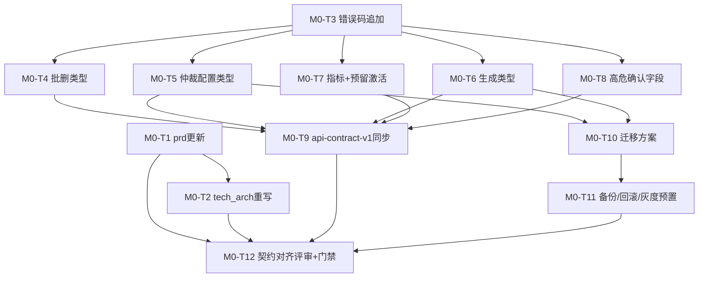

# 丹青有AI · M-0 阶段《文档契约与更新计划》

> **文档版本**：v1.0.0
> **生成时间**：2026-08-07
> **文档状态**：已批准生效（作为 M-1~M-7 各专项 agent 的"契约真源"）
> **维护人**：产品架构协调中枢（product-architect）
> **依据文档**：
> - `system-upgrade-plan-2026-08-06.md`（已批准总方案，P0/P1/P2 各项）
> - `implementation-source-of-truth.md`（系统真源，当前实现状态）
> - `prd.md`（产品需求文档，MVP + Phase1 + 硬件需求登记）
> - `tech_arch.md`（⚠️ 当前为 MVP 旧版，LocalStorage 无后端，需整体重写）
> - `api-contract-v1.md`（API 契约人类可读副本）
> - `server/src/types/api-contract.ts`（跨端共享 TS 契约主副本）
> - `new-features-design.md`（Phase5 设计）
> - `server/src/types/arbitration.ts`（仲裁配置类型）
> - `server/prisma/schema.prisma`（数据模型）
>
> **适用范围**：Web 应用 / 管理后台 / 移动端 / 品牌官网 / 后端服务 五端
> **唯一产出文件**：本文档 + 被本计划驱动更新的 `prd.md` / `tech_arch.md` / `api-contract-v1.md` / `api-contract.ts`（后两者由 backend-service 按本计划执行）

---

## 目录

1. [一、M-0 目标与门禁](#一m-0-目标与门禁)
2. [二、文档契约更新清单](#二文档契约更新清单)
3. [三、新增 API 契约草案](#三新增-api-契约草案)
4. [四、契约变更影响评估](#四契约变更影响评估)
5. [五、M-0 任务拆解与依赖](#五m-0-任务拆解与依赖)
6. [六、M-0 验收清单](#六m-0-验收清单)
7. [七、附：文档先行编号登记表](#七附文档先行编号登记表)

---

## 一、M-0 目标与门禁

### 1.1 阶段定位

M-0 是已批准升级计划（`system-upgrade-plan-2026-08-06.md` §4.1）的前置基础阶段，**不产出任何业务代码**，只产出"文档契约"。其核心价值是**先冻结契约、再分派实现**，确保 M-1~M-7 各专项 agent 在完全一致的接口与类型定义上并行开发，杜绝跨端类型漂移。

M-0 唯一产出物：
| 产出物 | 类型 | 说明 |
|--------|------|------|
| 本文档 | 新增 | M-0 更新计划 + 新功能契约草案（后续 M-1~M-7 契约真源） |
| `prd.md` | 更新 | 补齐 M-0 涉及新功能（P-02/03/04/05/06/07/08）的产品需求 |
| `tech_arch.md` | **整体重写** | 从 MVP 旧版（LocalStorage）重写为当前"五端 + 后端三层架构"真实架构 |
| `api-contract-v1.md` | 更新 | 同步 `api-contract.ts` 新增类型，补齐错误码表与 OpenAPI 片段 |
| `server/src/types/api-contract.ts` | 更新 | 追加新契约类型 + 新错误码（唯一被修改的源码文件，仅追加不删改现有类型） |

> ⚠️ **范围铁律**：除 `api-contract.ts`（契约主副本，可由 backend-service 按本计划追加）外，**业务源码一律不动**。本文档只定义契约，不实现。

### 1.2 完成定义（DoD）

M-0 阶段宣告完成，需**全部满足**以下条件：

| # | 完成定义 | 验证方式 |
|---|---------|---------|
| D1 | 四份文档契约（prd / tech_arch / api-contract-v1 / api-contract.ts）全部更新完毕且互相一致 | 契约对齐评审（product-architect + backend-service） |
| D2 | `tech_arch.md` 已从 MVP 旧版重写为真实五端架构，不再出现 LocalStorage/Mock 表述 | 通读评审 |
| D3 | 本计划 §3 列出的全部新接口契约（请求/响应/错误码）已追加到 `api-contract.ts`，且**不修改任何现有类型** | `git diff` 仅新增行 + tsc 0 错误 |
| D4 | 每个新接口均标注"文档先行"编号（DOC-2026-08-xxx），登记于 §7 | 编号去重校验 |
| D5 | 所有新接口遵循：统一 `ApiResponse<T>` 包装、`PaginatedData`、`ErrorCode` 枚举、严格类型无 `any`、多租户强制 `tenant_id`、CSRF 双提交 | 代码评审 + 静态扫描 |
| D6 | 数据模型变更（Tenant.arbitrationConfig、AiUsageLog.usageType）已给出 Prisma 迁移方案与回滚/备份策略（§4） | 迁移评审 |
| D7 | M-0 验收清单（§6）全部勾选 | 验收会 |

### 1.3 验收门禁（Gate）

进入 M-1 前必须通过的门禁：

| 门禁 | 条件 | 责任人 |
|------|------|--------|
| 门禁 0-1 | `api-contract.ts` 编译通过（tsc 0 错误），889+0 现有测试不回退 | backend-service |
| 门禁 0-2 | 新契约与现有 `ApiResponse`/`ErrorCode`/`ArbitrationConfig` 风格一致，错误码无冲突 | product-architect |
| 门禁 0-3 | 契约变更影响评估（§4）已确认，数据模型变更已挂上备份/回滚/灰度方案 | devops-qa + backend-service |
| 门禁 0-4 | 四份文档契约评审通过，M-1~M-7 各 agent 确认契约可执行 | 产品架构协调中枢 |

---

## 二、文档契约更新清单

> 优先级：**P0**=必须本次完成；**P1**=本阶段完成但可稍后；**P2**=仅登记不断言。
> 每个条目标注涉及的升级痛点编号（P-xx），便于追溯。

### 2.1 `prd.md`（产品需求文档）

| # | 变更内容 | 涉及 P-xx | 优先级 | 说明 |
|---|---------|----------|:------:|------|
| PRD-1 | 新增第 8 章"AI 图像生成与教学闭环"：用户故事（文字/草图生成参考图 → 一键诊断 → 批改）、生成配额与计费、生成内容审核 | P-02 / P-07 | P0 | 承接总方案 §2.3.1 |
| PRD-2 | 新增"租户级仲裁配置覆盖"需求：院校可按自定义触发阈值/评委权重/边界规则，未配置回退系统默认 | P-04 | P0 | 承接总方案 §2.1.1 |
| PRD-3 | 新增"管理后台三级确认"需求：常规/敏感（关键字）/高危（密码）三级确认 | P-05 | P0 | 承接总方案 §2.1.2 |
| PRD-4 | 新增"跨端批删一致性"需求：批删以服务端为准，乐观更新+回滚 | P-06 | P0 | 承接总方案 §2.1.3 |
| PRD-5 | 新增"Phase5 预留接口激活"需求：config/ui/knowledge/modules 四类能力说明 | P-03 | P1 | 承接总方案 §2.3.2 |
| PRD-6 | 新增"可观测性"需求：AI SLA 达标率 / 降级率 / 成本 / 双提供商可用性指标 | P-08 | P1 | 承接总方案 §2.5.1 |
| PRD-7 | 更新第 7.3 可观测性章节：补充业务级指标口径（非仅 traceId） | P-08 | P1 | 承接 §2.5.1 |

### 2.2 `tech_arch.md`（技术架构文档）——⚠️ 整体重写

> **现状核实**：`tech_arch.md` 第 1-6 节为 **MVP 旧版**，描述为 `LocalStorage` 数据层、`Mock Data`、无后端。第 7 节硬件监督演进摘要、第 8 节实现细节与文档主体脱节。**本文件必须整体重写**，以 `implementation-source-of-truth.md` 为唯一事实来源。

| # | 变更内容 | 涉及 P-xx | 优先级 | 说明 |
|---|---------|----------|:------:|------|
| TA-1 | 整体重写为真实五端架构：Web(/app) / Admin / Mobile / Website / Server，含 Nginx + PM2 + PG15 + Redis7 部署拓扑 | - | P0 | 以真源 §2.1 架构图为准 |
| TA-2 | 补齐后端三层分层（Routes/Controller/Service/Repository）与中间件链路（含 traceMiddleware） | - | P0 | 以真源 §2.2/§2.3 为准 |
| TA-3 | 删除 LocalStorage / Mock Data 表述，改为真实 API 契约消费 | - | P0 | MVP 残留清理 |
| TA-4 | 新增"AI 图像生成架构"小节：image-generation.service + 双提供商降级 + 异步任务状态机 | P-02 / P-07 | P0 | 承接总方案 §2.3.1 |
| TA-5 | 新增"租户配置深合并"架构模式：`resolveConfig(tenantId)`，租户覆盖→系统默认 | P-04 | P0 | 承接总方案 §2.1.1 |
| TA-6 | 新增"可观测性架构"小节：指标聚合（Redis 计数器 + 定时落库）、admin 指标接口 | P-08 | P1 | 承接总方案 §2.5.1 |
| TA-7 | 更新数据模型章节：Tenant.arbitrationConfig、AiUsageLog.usageType 增量 | P-04 / P-02 | P0 | 承接 §2.1.1/§2.3.1 |
| TA-8 | 保留并完善第 7 节硬件监督演进（增量架构链接 hardware-live-guidance-plan.md） | - | P1 | 已有内容，重写时保留 |

### 2.3 `api-contract-v1.md`（API 契约文档）

| # | 变更内容 | 涉及 P-xx | 优先级 | 说明 |
|---|---------|----------|:------:|------|
| AC-1 | 错误码表 §2.2 追加本计划 §3.4 新增错误码（GENERATION_* / ANALYSIS_BATCH / ADMIN_CONFIRM / ARBITRATION_CONFIG / METRICS） | P-02/03/04/05/06/08 | P0 | 与 `api-contract.ts` 同步 |
| AC-2 | 类型定义 §3 追加本计划 §3 全部新接口类型（批删 / 仲裁配置 / 生成 / config/ui 激活 / 指标） | P-02/03/04/06/08 | P0 | 与 `api-contract.ts` 同步 |
| AC-3 | 第 6.3 待定事项表更新：移除已落地项，登记 M-0 新接口 | - | P0 | 清理过期待定项 |
| AC-4 | 补充 OpenAPI 3.0 片段：批删 / 仲裁配置 / 生成任务 | P-04/06/02 | P1 | 与 TS 类型一致 |
| AC-5 | 变更记录 §7 追加 v2.0 条目（本计划所有新增） | - | P0 | 版本号升级 |

### 2.4 `server/src/types/api-contract.ts`（跨端共享 TS 契约主副本）

> **唯一允许修改的源码文件**。遵循真源 §6"仅追加、不修改现有类型"追加原则。所有新增通过 sync 脚本同步到 Web/Mobile/Admin。

| # | 变更内容 | 涉及 P-xx | 优先级 | 说明 |
|---|---------|----------|:------:|------|
| CT-1 | `ErrorCode` 枚举追加新错误码（§3.4），`ERROR_HTTP_STATUS` 同步映射 | P-02/03/04/05/06/08 | P0 | 唯一枚举追加 |
| CT-2 | 追加批删接口类型 `BatchDeleteAnalysesRequest/Response/Item` | P-06 | P0 | §3.1 |
| CT-3 | 追加租户仲裁配置类型 `ArbitrationConfigUpdateRequest` 等，并在 `TenantInfo` 追加可选 `arbitrationConfig` | P-04 | P0 | §3.2 |
| CT-4 | 追加 AI 生成类型 `CreateGenerationRequest/GenerationTask/GenerationStatus` 等 | P-02 / P-07 | P0 | §3.3 |
| CT-5 | 追加 `OperationalMetrics` 及 admin 指标响应类型 | P-08 | P1 | §3.5 |
| CT-6 | 将 §3.11 预留接口（config/ui）类型标注从 `@reserved planned` 更新为 `@implemented`（类型本身已存在） | P-03 | P1 | §3.6 |
| CT-7 | admin 高危接口请求体追加可选 `confirmPassword` 字段（幂等确认） | P-05 | P0 | §3.7 |

---

## 三、新增 API 契约草案

> **契约准则**（承接 `api-contract.ts` 头部声明）：
> - 统一 `ApiResponse<T>` 包装：`{code, message, data, traceId}`；禁止 `success` 字段、禁止 `any`。
> - 分页统一 `PaginatedData<T>` / `PaginationQuery`。
> - 错误码统一 `ErrorCode` 枚举 + `ERROR_HTTP_STATUS` 映射。
> - 多租户隔离：`tenant_id` 由 JWT 注入（`req.tenantId`），**禁止从请求体/查询参数读取**；repository 层强制过滤。
> - CSRF 双提交：所有写操作需携带 `X-CSRF-Token` 头匹配 `csrf_token` Cookie。
> - ISO 时间 `ISODateString`，ID 为 UUID v4。
> - AI 建议含 `evidence` + `priority` 字段（high≤2 / medium≤2 / low≤1，总≤5）。
>
> 每个接口标注"文档先行"编号（见 §7 登记表），供 M-1~M-7 实现时引用。

### 3.1 跨端批删一致性（P-06）

**接口**：`POST /api/v1/analyses/batch-delete`
**鉴权**：已登录 + `analysis:delete:own` / `analysis:delete:tenant`（按角色）
**CSRF**：需 `X-CSRF-Token` 头
**多租户**：强制校验所有 `ids` 归属当前 `req.tenantId`，任一越权则该条记入 `failed`（不整体回滚误删）

```typescript
// ============ 3.1 跨端批删一致性(P-06) ============

/** POST /api/v1/analyses/batch-delete 请求体 */
export interface BatchDeleteAnalysesRequest {
  /** 待删除的分析记录 ID 列表(最多 100 条) */
  ids: string[];
}

/** 批删单条结果 */
export interface BatchDeleteAnalysisItem {
  /** 分析记录 ID */
  id: string;
  /** 是否删除成功 */
  deleted: boolean;
  /** 删除失败原因(deleted=false 时非空,如跨租户越权/不存在) */
  error?: string;
}

/** POST /api/v1/analyses/batch-delete 响应 */
export interface BatchDeleteAnalysesResponse {
  /** 请求总数 */
  total: number;
  /** 成功删除数 */
  deleted: number;
  /** 失败数 */
  failedCount: number;
  /** 每条删除结果(供前端精确提示) */
  items: BatchDeleteAnalysisItem[];
}
```

**错误码**：

```typescript
ANALYSIS_BATCH_LIMIT_EXCEEDED = 6006, // 批删条数超限(>100)
```

**前端约定**：批删采用乐观更新 + 回滚；后端返回后调用 `invalidateQueries(['analyses'])` 以服务端为准；任一 `deleted=false` 时 toast 展示对应 `error`。

### 3.2 租户级仲裁配置覆盖（P-04）

**接口**：
- `GET /api/admin/tenants/:id/arbitration-config`（admin/owner 可读）
- `PUT /api/admin/tenants/:id/arbitration-config`（admin/owner 可写）

**鉴权**：requirePermission `tenant:update` / `admin:*`
**CSRF**：需 `X-CSRF-Token` 头
**数据模型**：`Tenant` 新增 `arbitrationConfig Json?`（`@map("arbitration_config")`），`null` 回退 `DEFAULT_ARBITRATION_CONFIG`。

```typescript
// ============ 3.2 租户级仲裁配置覆盖(P-04) ============

/** GET /api/admin/tenants/:id/arbitration-config 响应 */
export interface GetTenantArbitrationConfigResponse {
  tenantId: string;
  /** 已生效的仲裁配置(合并结果;未覆盖字段取系统默认) */
  effectiveConfig: ArbitrationConfig;
  /** 是否为纯系统默认(租户未配置任何覆盖) */
  isDefault: boolean;
  /** 上次更新时间(从未配置为 null) */
  updatedAt: ISODateString | null;
  /** 上次更新人(从未配置为 null) */
  updatedBy: string | null;
}

/** PUT /api/admin/tenants/:id/arbitration-config 请求体(部分覆盖,深合并) */
export interface UpdateTenantArbitrationConfigRequest {
  /** 争议触发阈值覆盖(不传则继承默认) */
  triggers?: Partial<ArbitrationConfig['triggers']>;
  /** 评委权重覆盖(不传则继承默认) */
  judgeWeights?: Partial<ArbitrationConfig['judgeWeights']>;
  /** 最终裁定规则覆盖(不传则继承默认) */
  rules?: Partial<ArbitrationConfig['rules']>;
  /** 边界情况处理覆盖(不传则继承默认) */
  edgeCases?: Partial<ArbitrationConfig['edgeCases']>;
}

/** PUT /api/admin/tenants/:id/arbitration-config 响应 */
export type UpdateTenantArbitrationConfigResponse = GetTenantArbitrationConfigResponse;
```

**校验规则**：写入时 Zod 全量校验 + 权重归一化校验（`judgeWeights` 内每模式权重之和=1）；配置变更写入 `AuditLog`（auditAction=update）。

**错误码**：

```typescript
ARBITRATION_CONFIG_INVALID = 9110, // 仲裁配置校验失败(权重未归一化/取值越界)
```

**`TenantInfo` 追加字段**（可选，向后兼容）：

```typescript
export interface TenantInfo {
  // ... 现有字段不变 ...
  /** 租户级仲裁配置覆盖(未配置为 null;P-04 追加) */
  arbitrationConfig?: ArbitrationConfig | null;
}
```

### 3.3 AI 图像生成（P-02 / P-07）

**接口**：
- `POST /api/v1/generation`（提交生成任务，返回任务 id）
- `GET /api/v1/generation/:id`（轮询结果，含生成图 URL）

**鉴权**：已登录 + `analysis:create`
**CSRF**：需 `X-CSRF-Token` 头
**限流**：单用户 5 次/分钟（`GENERATION_RATE_LIMITED`）
**多租户**：生成任务强制归属 `req.tenantId`，计入 `AiUsageLog`（`usageType=generate`）
**数据模型**：`AiUsageLog` 新增 `usageType` 枚举（`diagnose`/`generate`）

```typescript
// ============ 3.3 AI 图像生成(P-02/P-07) ============

/** 生成任务状态 */
export type GenerationStatus = 'pending' | 'processing' | 'success' | 'failed';

/** AI 生成输入来源 */
export type GenerationInputType = 'text' | 'sketch';

/** POST /api/v1/generation 请求体 */
export interface CreateGenerationRequest {
  /** 生成输入类型 */
  inputType: GenerationInputType;
  /** 文字提示词(text 时必填) */
  prompt?: string;
  /** 草稿图 URL(sketch 时必填,基于现有上传图) */
  sketchImageUrl?: string;
  /** 目标作品类型(用于生成后一键进入诊断,默认 painting) */
  artType?: ArtType;
  /** 生成尺寸提示(可选,如 portrait/landscape) */
  aspect?: 'portrait' | 'landscape' | 'square';
  /** 生成数量(默认 1,上限 4) */
  count?: number;
}

/** 单张生成结果 */
export interface GeneratedImage {
  /** 生成图 URL */
  imageUrl: string;
  /** 审核状态(生成内容合规,违规标记 flagged) */
  reviewStatus: ReviewStatus;
}

/** POST /api/v1/generation 响应 */
export interface CreateGenerationResponse {
  /** 生成任务 ID */
  taskId: string;
  status: GenerationStatus;
  /** 生成结果(异步模式为 null,需轮询 GET /generation/:id) */
  images: GeneratedImage[] | null;
}

/** GET /api/v1/generation/:id 响应 */
export interface GetGenerationResponse {
  taskId: string;
  tenantId: string;
  status: GenerationStatus;
  /** 生成结果(status=success 时非空) */
  images: GeneratedImage[] | null;
  /** 失败原因(status=failed 时非空) */
  failureReason: string | null;
  /** 是否经过降级(主提供商失败自动降级) */
  usedFallback: boolean;
  createdAt: ISODateString;
  completedAt: ISODateString | null;
}
```

**错误码**：

```typescript
GENERATION_QUOTA_EXCEEDED = 6101,          // 生成配额已用完(计入订阅配额)
GENERATION_TASK_NOT_FOUND = 6102,          // 生成任务不存在/跨租户
GENERATION_PROVIDER_UNAVAILABLE = 6103,    // 双提供商均不可用
GENERATION_FAILED = 6104,                  // 生成失败
GENERATION_IMAGE_INVALID = 6105,           // 输入草稿图无法解析
GENERATION_RATE_LIMITED = 6106,            // 生成接口被限流(5次/分钟)
```

**教学闭环**：生成图直接复用 `analysis.service.runAnalysis()`；前端"生成参考图"后一键"提交诊断"，形成"生成→诊断→批改"闭环。生成任务计入 `AiUsageLog`（`usageType=generate`），与订阅配额对齐防滥用。

### 3.4 新错误码汇总（追加到 `ErrorCode`）

> 以下为 M-0 新增全部错误码，追加到 `api-contract.ts` 的 `ErrorCode` 枚举与 `ERROR_HTTP_STATUS` 映射。**已核实不与现有任何错误码冲突**（现有 6001-6005 / 7001-7006 / 8001-8014 / 8101-8103 / 8201-8203 / 8301-8303 / 8401-8404 / 9001-9005 / 9101-9109 / 9901）。

```typescript
// ---- P-06 跨端批删 ----
ANALYSIS_BATCH_LIMIT_EXCEEDED = 6006,
// ---- P-02/P-07 AI 生成(61xx 段) ----
GENERATION_QUOTA_EXCEEDED = 6101,
GENERATION_TASK_NOT_FOUND = 6102,
GENERATION_PROVIDER_UNAVAILABLE = 6103,
GENERATION_FAILED = 6104,
GENERATION_IMAGE_INVALID = 6105,
GENERATION_RATE_LIMITED = 6106,
// ---- P-05 管理后台二次确认 ----
ADMIN_CONFIRM_PASSWORD_MISMATCH = 8015,
// ---- P-04 租户仲裁配置 ----
ARBITRATION_CONFIG_INVALID = 9110,
// ---- P-08 可观测性指标 ----
METRICS_DATA_UNAVAILABLE = 9201,
```

**HTTP 状态映射**：

```typescript
[ErrorCode.ANALYSIS_BATCH_LIMIT_EXCEEDED]: 400,
[ErrorCode.GENERATION_QUOTA_EXCEEDED]: 402,
[ErrorCode.GENERATION_TASK_NOT_FOUND]: 404,
[ErrorCode.GENERATION_PROVIDER_UNAVAILABLE]: 502,
[ErrorCode.GENERATION_FAILED]: 500,
[ErrorCode.GENERATION_IMAGE_INVALID]: 400,
[ErrorCode.GENERATION_RATE_LIMITED]: 429,
[ErrorCode.ADMIN_CONFIRM_PASSWORD_MISMATCH]: 403,
[ErrorCode.ARBITRATION_CONFIG_INVALID]: 400,
[ErrorCode.METRICS_DATA_UNAVAILABLE]: 503,
```

### 3.5 可观测性指标契约（P-08）

**接口**（仅供管理后台，IP 白名单 + admin 鉴权）：
- `GET /api/admin/metrics/ai`
- `GET /api/admin/metrics/sla`

```typescript
// ============ 3.5 可观测性指标(P-08) ============

/** GET /api/admin/metrics/ai 响应 */
export interface AiMetricsResponse {
  /** 统计起始时间 */
  startDate: ISODateString;
  /** 统计结束时间 */
  endDate: ISODateString;
  /** AI 分析 SLA 达标率(0-1,durationMs≤3000 占比) */
  slaComplianceRate: number;
  /** AI 降级率(0-1,aiFallback 次数/总请求) */
  aiFallbackRate: number;
  /** 双提供商可用性(glm/trae) */
  providerAvailability: {
    glm: { successRate: number; switchCount: number };
    trae: { successRate: number; switchCount: number };
  };
  /** 分析请求量 / 成功率 / 平均耗时 */
  analysis: {
    total: number;
    successRate: number;
    avgDurationMs: number;
  };
  /** AI 成本聚合(按天) */
  costByDay: { date: ISODateString; costYuan: number }[];
  /** 统计时间戳 */
  timestamp: ISODateString;
}

/** GET /api/admin/metrics/sla 查询参数 */
export interface SlaMetricsQuery {
  /** 时间范围天数(默认 7,1-90) */
  days?: number;
  /** 按租户筛选(可选) */
  tenantId?: string;
}

/** GET /api/admin/metrics/sla 响应 */
export interface SlaMetricsResponse {
  days: number;
  /** 逐日 SLA 达标率 */
  dailySla: { date: ISODateString; complianceRate: number; total: number }[];
  /** 平均 SLA 达标率 */
  avgComplianceRate: number;
}
```

> **说明**：`traceId` 已在现有 `traceMiddleware` 贯通；部署日志同步已在 `api-contract.ts` §3.14（`DeploymentLog`/`CreateDeploymentLogRequest` 等）实现。本契约补齐**业务级/ AI 级指标**，聚合采用 Redis 计数器 + 定时落库，避免实时查询压库。

### 3.6 Phase5 预留接口激活（P-03）

> **现状核实**：`api-contract.ts` §3.11 已完整定义 `knowledge` / `modules` / `ui` / `config` 四类接口的请求/响应/错误码类型（`KnowledgeEntry`、`KnowledgeSearchQuery`、`ModuleInfo`、`ThemeConfig`、`FeatureFlag`、`SystemParam`、`WorkflowDefinition` 等）。**无需新增类型**。
>
> M-0 仅需：将 §3.11 类型顶部 `@reserved`/`@status planned` 标注更新为 `@status implemented`，并确认 `config`/`ui` 的租户级覆盖复用 §3.2 的"租户配置深合并"模式。`modiules`/knowledge 保持 P2 延后。

| 路由 | 契约状态 | M-0 动作 | 实现优先级 |
|------|---------|---------|:---------:|
| `/api/v1/config` | 类型已存在 | 标注激活 + 复核特性开关类型 | P1（M-4） |
| `/api/v1/ui` | 类型已存在 | 标注激活 + 复核主题/组件类型 | P1（M-4） |
| `/api/v1/knowledge` | 类型已存在 | 保持预留（P2） | P2 |
| `/api/v1/modules` | 类型已存在 | 保持预留框架（P2） | P2 |

### 3.7 管理后台高危接口幂等确认（P-05）

> **现状核实**：`ConfirmAction/index.tsx` 仅基础确认。M-0 无需新增独立接口，仅需在**现有高危写接口**的请求体追加可选 `confirmPassword` 字段，并在契约中声明三级确认约定。

**涉及高危接口**（追加可选字段，非破坏性）：

```typescript
// ============ 3.7 管理后台高危操作幂等确认(P-05) ============

/** 高危操作确认载荷(追加到高危请求体,可选) */
export interface HighRiskConfirmPayload {
  /** 高危操作主确认载荷:锁定/删除/退款/撤销/key 等 */
  confirmPassword?: string;
  /** 敏感操作确认关键字(如"删除"/"锁定",前端输入,后端校验) */
  confirmKeyword?: string;
}

/** 三级确认强度 */
export type ConfirmDangerLevel = 'normal' | 'sensitive' | 'high';

/** 高危操作前端确认配置(供 ConfirmAction 组件消费,非后端接口) */
export interface ConfirmActionConfig {
  dangerLevel: ConfirmDangerLevel;
  /** dangerLevel=sensitive 时必填,需输入关键字 */
  requireKeyword?: string;
  /** dangerLevel=high 时必填,需输入当前管理员密码 */
  requirePassword?: boolean;
  /** 幂等键(可选,防重复提交) */
  idempotencyKey?: string;
}
```

**涉及追加字段的现有接口**（后续 M-1 由 backend-service 落地）：
- `POST /api/admin/users/:id/lock`
- `POST /api/admin/users/batch`
- `POST /api/admin/subscriptions/:id/refund`
- `DELETE /api/admin/system/api-keys/:id`
- `POST /api/admin/artworks/:id/review`

**错误码**：`ADMIN_CONFIRM_PASSWORD_MISMATCH = 8015`（密码校验失败）。

> **幂等性约定**：高危接口支持 `Idempotency-Key` 头做幂等去重（同 key 重复提交返回首次结果），防止网络重试导致重复扣款/重复删除。

---

## 四、契约变更影响评估

### 4.1 变更分级

| 风险级 | 定义 | 上线策略 |
|--------|------|---------|
| A 级（高） | 涉及数据模型 / 核心权限 / 基础设施 | 备份 3-5 轮 + 回滚迁移 + 按租户灰度 |
| B 级（中） | 涉及权限扩展但无数据模型变更 | 软生效（前端先行）→ 后端强制校验分两步 |
| C 级（低） | 纯新增接口/类型，向后兼容 | 低风险可直接上线 |

### 4.2 逐项评估

| 变更 | 涉及 P-xx | 风险级 | 评估结论 |
|------|----------|:-----:|---------|
| `Tenant.arbitrationConfig` 新增字段 | P-04 | **A** | 数据模型变更。`prisma migrate` 增加可空 Json 列，现有租户为 null 走系统默认，天然渐进生效。**需**：迁移前 `pg_dump` 备份 3-5 轮 + 准备回滚 SQL（DROP COLUMN）+ 经 `/api/v1/config` 特性开关按租户灰度（先内部租户后全量）。 |
| `AiUsageLog.usageType` 枚举新增 | P-02 / P-07 | **A** | 数据模型变更。新增枚举列（默认 `diagnose`），向后兼容现有诊断日志。**需**：备份 + 回滚迁移 + 灰度（生成功能默认关闭，灰度开启）。 |
| 管理后台高危接口二次确认 | P-05 | **B** | 无数据模型变更。先软生效（仅前端 ConfirmAction）→ 后端强制校验分两步；海量误操作可回退到基础确认。`confirmPassword` 为可选字段，非破坏性。 |
| 跨端批删服务端化 | P-06 | **C** | 纯新增接口 `POST /analyses/batch-delete`，现有单个 DELETE 不受影响。类型仅追加。可直接上线，但需前端同步切换（乐观更新+回滚）。 |
| AI 图像生成接口 | P-02 / P-07 | **A** | 新增接口 + 外部 API 调用 + 计费。**需**：配额护栏（`usageType=generate` 计入订阅）+ 单用户限流 + 内容审核 + 双提供商降级。涉及外部依赖，按租户灰度开启。 |
| Phase5 预留接口激活（config/ui） | P-03 | **C** | 接口从 501 变为可用，属能力激活，此前无调用方，不破坏现有调用。复用租户配置深合并，无数据模型变更（覆盖存 Tenant 已有/新增 Json 字段）。 |
| 可观测性指标接口 | P-08 | **C** | 纯新增 `GET /api/admin/metrics/*`，复用现有 AiUsageLog/Analysis，无数据模型变更。Redis 计数器聚合，低压库风险。部署日志同步已在 §3.14 落地。 |

### 4.3 备份 / 回滚 / 灰度策略（A 级必配）

| 项 | 策略 |
|----|------|
| 备份 | 每次涉及数据模型/权限变更的升级，执行 `pg_dump` 保留 **3-5 轮**全量 + WAL 连续归档；备份完整性校验 + 恢复演练（Runbook §5） |
| 回滚迁移 | 为 `Tenant.arbitration_config` / `AiUsageLog.usage_type` 各准备 `migrate down` 或手动回滚 SQL |
| 灰度 | 经 `/api/v1/config` 特性开关按租户灰度：先内部租户 → 试点院校 → 全量；生成功能默认关闭，灰度开启 |
| 权限灰度 | 二次确认先软生效（仅前端）→ 后端强制校验分两步 |

---

## 五、M-0 任务拆解与依赖

### 5.1 任务清单

> 负责人建议映射到专项 agent 类型（backend-service / frontend-app / admin-dashboard / devops-qa / mobile-app）。

| 任务 ID | 优先级 | 负责人建议 | 内容 | 依赖 | 验收标准 |
|---------|:-----:|-----------|------|------|---------|
| M0-T1 | P0 | 产品架构协调中枢 | 更新 `prd.md`（§2.1 全部 7 项） | - | 新功能需求可追溯至 P-xx |
| M0-T2 | P0 | 产品架构协调中枢 + backend-service | **整体重写** `tech_arch.md`（§2.2）删除 LocalStorage/Mock | M0-T1 | 无 MVP 残留表述，与真源一致 |
| M0-T3 | P0 | backend-service | `api-contract.ts` 追加新错误码（§3.4）+ `ERROR_HTTP_STATUS` | - | tsc 0 错误，无冲突 |
| M0-T4 | P0 | backend-service | `api-contract.ts` 追加批删类型（§3.1） | M0-T3 | 类型完整，无 any |
| M0-T5 | P0 | backend-service | `api-contract.ts` 追加仲裁配置类型 + `TenantInfo.arbitrationConfig`（§3.2） | M0-T3 | 复用 `ArbitrationConfig`，向后兼容 |
| M0-T6 | P0 | backend-service | `api-contract.ts` 追加 AI 生成类型（§3.3） | M0-T3 | 含 evidence/priority 约束声明 |
| M0-T7 | P1 | backend-service | `api-contract.ts` 追加指标类型（§3.5）+ 激活 §3.11 预留标注 | M0-T3 | 类型完整 |
| M0-T8 | P0 | backend-service | `api-contract.ts` 高危接口追加 `confirmPassword`（§3.7） | M0-T3 | 可选字段，非破坏性 |
| M0-T9 | P0 | product-architect + backend-service | 同步 `api-contract-v1.md`（§2.3）错误码表 + 类型 + OpenAPI | M0-T3~T8 | 与 api-contract.ts 一致 |
| M0-T10 | P0 | backend-service | 数据模型迁移方案（§4.3）：Tenant.arbitrationConfig + AiUsageLog.usageType 的备份/回滚/灰度 SQL 草案 | M0-T5/T6 | 迁移方案评审通过 |
| M0-T11 | P0 | devops-qa | 备份轮次提升（3-5 轮）+ 回滚脚本 + 灰度开关预置（`/api/v1/config` 特性开关） | M0-T10 | Runbook 补充备份/回滚步骤 |
| M0-T12 | P0 | 产品架构协调中枢 | 契约对齐评审（DoD D1-D7）+ §7 编号登记 + 门禁 0-1~0-4 | M0-T1~T11 | 四门禁全过 |

### 5.2 依赖关系图（Mermaid）



### 5.3 并行与串行策略

- **可并行**：M0-T1 / M0-T3（prd 与契约不冲突）；M0-T4~T8 在 M0-T3 后可并行追加。
- **串行**：tech_arch 重写依赖 prd 更新；迁移方案依赖契约类型；M0-T12 门禁依赖全部完成。
- **预计耗时**：3 天（对齐总方案 §7 M-0 周期 08.07-08.09）。

---

## 六、M-0 验收清单

> 用于 M-0 验收会逐项勾选。全部 ✔ 后进入门禁 0-4。

| # | 验收项 | 状态 |
|---|--------|:----:|
| 1 | `prd.md` 已补齐 P-02/03/04/05/06/07/08 全部需求章节 | ☐ |
| 2 | `tech_arch.md` 已整体重写，无 LocalStorage/Mock 残留，与真源一致 | ☐ |
| 3 | `api-contract.ts` 已追加全部新错误码（§3.4）且不与现有冲突 | ☐ |
| 4 | `api-contract.ts` 已追加批删 / 仲裁配置 / 生成 / 指标 / 高危确认类型 | ☐ |
| 5 | 所有新类型严格 TS 无 `any`，遵循 `ApiResponse<T>` / `PaginatedData` / `ErrorCode` | ☐ |
| 6 | `api-contract.ts` tsc 编译 0 错误，889+0 现有测试不回退 | ☐ |
| 7 | 所有新接口遵循多租户强制 `tenant_id` 与 CSRF 双提交约定 | ☐ |
| 8 | AI 生成/诊断建议含 `evidence` + `priority`（high≤2/medium≤2/low≤1）约束已声明 | ☐ |
| 9 | 每个新接口标注"文档先行"编号（§7 登记表） | ☐ |
| 10 | `api-contract-v1.md` 错误码表 / 类型 / OpenAPI / 变更记录已同步 | ☐ |
| 11 | 数据模型变更（Tenant.arbitrationConfig、AiUsageLog.usageType）已挂备份 3-5 轮 + 回滚迁移 + 按租户灰度 | ☐ |
| 12 | `api-contract.ts` 未修改任何现有类型（git diff 仅新增行） | ☐ |
| 13 | 四份文档契约评审通过，M-1~M-7 各 agent 确认契约可执行 | ☐ |

---

## 七、附：文档先行编号登记表

> 每个新接口/新类型分配唯一 DOC 编号，供 M-1~M-7 实现时引用。此表为 M-0 全部登记，后续新增需在此追加并通知 product-architect。

| 文档先行编号 | 接口/类型 | 涉及 P-xx | 实现里程碑 | 负责人 |
|-------------|----------|----------|:--------:|--------|
| DOC-2026-08-001 | `POST /api/v1/analyses/batch-delete` + `BatchDeleteAnalysesRequest/Response/Item` | P-06 | M-1 | backend-service + frontend-app |
| DOC-2026-08-002 | `ErrorCode.ANALYSIS_BATCH_LIMIT_EXCEEDED = 6006` | P-06 | M-1 | backend-service |
| DOC-2026-08-003 | `GET/PUT /api/admin/tenants/:id/arbitration-config` + 请求/响应类型 | P-04 | M-1 | backend-service + admin-dashboard |
| DOC-2026-08-004 | `ErrorCode.ARBITRATION_CONFIG_INVALID = 9110` | P-04 | M-1 | backend-service |
| DOC-2026-08-005 | `TenantInfo.arbitrationConfig` 可选字段 | P-04 | M-1 | backend-service |
| DOC-2026-08-006 | `POST /api/v1/generation` + `CreateGenerationRequest/Response` | P-02/P-07 | M-3 | backend-service |
| DOC-2026-08-007 | `GET /api/v1/generation/:id` + `GetGenerationResponse` + `GenerationStatus` | P-02/P-07 | M-3 | backend-service |
| DOC-2026-08-008 | `ErrorCode.GENERATION_* = 6101-6106` | P-02/P-07 | M-3 | backend-service |
| DOC-2026-08-009 | `AiUsageLog.usageType` 枚举（diagnose/generate） | P-02/P-07 | M-3 | backend-service |
| DOC-2026-08-010 | `GET /api/admin/metrics/ai` + `AiMetricsResponse` | P-08 | M-6 | backend-service + admin-dashboard |
| DOC-2026-08-011 | `GET /api/admin/metrics/sla` + `SlaMetricsResponse` | P-08 | M-6 | backend-service + admin-dashboard |
| DOC-2026-08-012 | `ErrorCode.METRICS_DATA_UNAVAILABLE = 9201` | P-08 | M-6 | backend-service |
| DOC-2026-08-013 | Phase5 §3.11 config/ui 类型标注激活（@implemented） | P-03 | M-4 | backend-service |
| DOC-2026-08-014 | `HighRiskConfirmPayload` + `ConfirmActionConfig` + `ErrorCode.ADMIN_CONFIRM_PASSWORD_MISMATCH = 8015` | P-05 | M-1 | frontend-app + admin-dashboard |

---

## 附录：硬约束核对

| 硬约束 | 本计划贯彻点 |
|--------|-------------|
| 多创意形式 | 生成接口 `artType` 覆盖四类；仲裁配置按艺术类型自适应 |
| 3 秒 SLA | 生成走异步任务，诊断链路保持墙钟≤3s；指标契约持续监控 SLA 达标率 |
| AI 双提供商降级 | 生成复用 GLM/TRAE 降级（`usedFallback` 字段）；诊断降级三道防线不变 |
| 建议含 evidence + priority | 仅在 AIGC 相关建议声明 evidence/priority 约束（high≤2/medium≤2/low≤1） |
| 多租户隔离 | 所有新接口强制 tenant_id（repository 层注入），禁止读请求体 tenant_id |
| DB/Redis 仅绑定 127.0.0.1 | 本轮不改变基础设施绑定 |
| 文档先行 | 本计划先冻结契约，M-1~M-7 才允许实现 |

---

> **文档结束**。本计划为 M-1~M-7 各专项 agent 的"契约真源"，所有类型均基于 `api-contract.ts` / `arbitration.ts` / `schema.prisma` 实际状态核实编写，未编造已不存在的字段。评审通过后由产品架构协调中枢按 §5 分派执行。