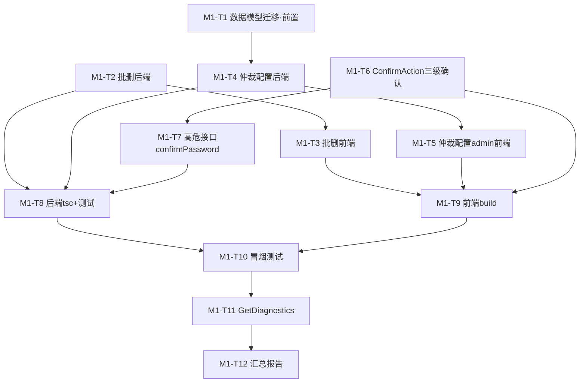

# 丹青有AI · M-1 阶段《执行协调计划》

> **文档版本**：v1.0.0
> **生成时间**：2026-08-07
> **文档状态**：已批准生效（作为 M-1 各专项 agent 的执行真源）
> **维护人**：产品架构协调中枢（product-architect）
> **依据文档**：
> - `m0-doc-contract-plan-2026-08-06.md`（M-0 契约真源，本文档一切接口/类型/错误码的唯一依据）
> - `server/src/types/api-contract.ts`（跨端共享 TS 契约主副本，契约已冻结）
> - `implementation-source-of-truth.md`（系统真源，当前实现状态）
> - `server/prisma/schema.prisma`（数据模型）
> - `server/src/types/arbitration.ts`（仲裁配置类型）
> - `server/src/config/arbitration-default.ts`（仲裁默认值 + 现有内存态覆盖机制）
>
> **务实说明**：本协调文档由产品架构协调中枢产出，聚焦**契约确认、任务分派、数据模型迁移方案（A 级风险）、验收标准与回滚策略**。真正的业务代码落地由 `backend-service` / `frontend-app` / `admin-dashboard` 三个专项 agent 按本文档 + M-0 契约执行。本文件不替代实现，只冻结执行边界。

---

## 目录

1. [一、M-1 目标与范围](#一m-1-目标与范围)
2. [二、契约冻结状态确认（已核实）](#二契约冻结状态确认已核实)
3. [三、M-1 前置门禁与数据模型迁移方案（A 级风险）](#三m-1-前置门禁与数据模型迁移方案a-级风险)
4. [四、任务一：跨端批删一致性（P-06，DOC-001/002）](#四任务一跨端批删一致性p-06doc-001002)
5. [五、任务二：租户级仲裁配置覆盖（P-04，DOC-003/004/005）](#五任务二租户级仲裁配置覆盖p-04doc-003004005)
6. [六、任务三：管理后台高危确认（P-05，DOC-014）](#六任务三管理后台高危确认p-05doc-014)
7. [七、任务分派总表（M1-T1~T12）](#七任务分派总表m1-t1t12)
8. [八、M-1 验收清单与返回格式](#八m-1-验收清单与返回格式)
9. [九、遗留问题与风险登记](#九遗留问题与风险登记)

---

## 一、M-1 目标与范围

### 1.1 阶段定位

M-1 是已批准升级计划（`system-upgrade-plan-2026-08-06.md` §4.2）的**第二个里程碑**，在 M-0 契约冻结完成后，落地三个 P0 功能：

| 功能 | 痛点编号 | 契约 DOC 编号 | 风险级 |
|------|:-------:|:-------------:|:-----:|
| 跨端批删一致性 | P-06 | DOC-001 / 002 | C |
| 租户级仲裁配置覆盖 | P-04 | DOC-003 / 004 / 005 | **A**（数据模型变更） |
| 管理后台高危操作确认 | P-05 | DOC-014 | B |

### 1.2 范围铁律（硬约束）

- 本文档及其后续实现**仅限本地开发环境**，**禁止连接生产服务器、禁止生产迁移/部署**。
- `Tenant.arbitrationConfig` 数据模型变更属于 **A 级风险**，**必须先备份再迁移**（见 §3）。
- 严格遵循 M-0 契约（DOC-2026-08-001~005、014），**不得偏离**。
- **严格遵循 `api-contract.ts` 已冻结的类型，不得改名或偏离**（契约已核实，见 §2）。
- 禁止修改 M-0 已定义的契约类型本身（`api-contract.ts` 仅可追加、不可改现有类型）。
- 全部中文注释。
- 多租户强制 `tenant_id`、CSRF 双提交、AI 建议含 `evidence` + `priority` 约束。

### 1.3 完成定义（DoD）

| # | 完成定义 | 验证方式 |
|---|---------|---------|
| D1 | 三个 P0 功能后端接口 + 前端落地全部完成且符合 M-0 契约 | 契约对齐评审 |
| D2 | `Tenant.arbitrationConfig` 数据模型迁移成功，含备份文件路径记录 | 迁移日志 + 备份校验 |
| D3 | 后端 `tsc --noEmit` 0 错误；相关 vitest 用例通过 | CI / 本地命令 |
| D4 | 前端 `npm run build` / typecheck 通过 | CI / 本地命令 |
| D5 | 本地冒烟测试验证三功能核心链路（批删接口、仲裁配置读写、高危确认） | 冒烟脚本 + 日志 |
| D6 | 遗留问题清单登记（§9） | 文档核对 |

---

## 二、契约冻结状态确认（已核实）

> 产品架构协调中枢于 2026-08-07 核实 `server/src/types/api-contract.ts` 已包含以下全部契约类型与错误码，**契约已冻结，M-1 各 agent 直接消费，无需重新定义**。

| 功能 | 已冻结的契约（api-contract.ts 行号/标识） | 错误码 |
|------|------------------------------------------|--------|
| 批删 | `BatchDeleteAnalysesRequest`(L3314)、`BatchDeleteAnalysesResponse`、`BatchDeleteAnalysisItem` | `ANALYSIS_BATCH_LIMIT_EXCEEDED=6006`(L83) |
| 仲裁配置 | `GetTenantArbitrationConfigResponse`(L3357)、`UpdateTenantArbitrationConfigRequest`(L3370)、`UpdateTenantArbitrationConfigResponse`、`TenantInfo.arbitrationConfig` | `ARBITRATION_CONFIG_INVALID=9110`(L148) |
| 高危确认 | `HighRiskConfirmPayload`(L3534)、`ConfirmDangerLevel`(L3542)、`ConfirmActionConfig`(L3545) | `ADMIN_CONFIRM_PASSWORD_MISMATCH=8015`(L114) |

**HTTP 状态映射**（`ERROR_HTTP_STATUS`，已核实）：
- `ANALYSIS_BATCH_LIMIT_EXCEEDED` → 400
- `ARBITRATION_CONFIG_INVALID` → 400
- `ADMIN_CONFIRM_PASSWORD_MISMATCH` → 403

> 仲裁配置类型 `ArbitrationConfig` 位于 `server/src/types/arbitration.ts`，其结构与默认值 `DEFAULT_ARBITRATION_CONFIG` 已在 `arbitration-default.ts` 定义。现有 `getArbitrationConfig(tenantId)` 已实现**内存态租户覆盖**（`setTenantArbitrationOverride` / `clearTenantArbitrationOverride`），M-1 需将其**持久化**到 `Tenant.arbitrationConfig` 列（见 §3、§5）。

---

## 三、M-1 前置门禁与数据模型迁移方案（A 级风险）

### 3.1 变更对象

`Tenant` 模型新增字段（对应 M-0 §3.2 / §4.3）：

```prisma
model Tenant {
  // ... 现有字段不变 ...
  arbitrationConfig Json? @map("arbitration_config") // 租户级仲裁配置覆盖(未配置为 null,回退系统默认)
  // ... 现有关系不变 ...
}
```

### 3.2 A 级风险备份策略（首要完成，迁移前必须执行）

| 步骤 | 操作 | 产出/校验 |
|------|------|----------|
| BK-1 | 复制 `server/prisma/schema.prisma` → `server/prisma/schema.prisma.bak.m1` | 校验文件可读、与源一致（`diff`） |
| BK-2 | 复制 `server/prisma/migrations/` 目录 → `server/prisma/migrations.bak.m1/`（整体） | 校验迁移目录完整 |
| BK-3 | 若本地开发库可连（`DATABASE_URL` 指向本地 PG），执行 `pg_dump` 全量备份 → `server/prisma/backup/backup-m1-YYYYMMDD.dump` | 校验 dump 文件非空、`pg_restore --list` 可读 |
| BK-4 | 若本地库不可连，在 M-1 执行日志中**明确说明**（不阻塞，但需登记为遗留项） | 文档记录 |

> **备份失败即停止迁移**：若 BK-1~BK-3 任一失败，暂停 `prisma migrate`，排查命令与路径后再继续，禁止在未备份状态下执行迁移。

### 3.3 迁移执行

| 步骤 | 操作 | 说明 |
|------|------|------|
| MG-1 | 编辑 `schema.prisma` 新增 `arbitrationConfig` 字段 | 严格按 §3.1 |
| MG-2 | 本地执行 `npx prisma migrate dev --name add_tenant_arbitration_config` | 本地开发环境，生成迁移文件 |
| MG-3 | `npx prisma generate` 重新生成 client | 使 `@prisma/client` 暴露新字段 |
| MG-4 | 记录迁移文件名 + 迁移后 schema 校验 | 纳入 M-1 返回报告 |

### 3.4 回滚方案（预先准备）

| 场景 | 回滚操作 |
|------|---------|
| 迁移失败（未提交） | `npx prisma migrate resolve` 定位 + `prisma migrate dev` 重试；必要时恢复 `schema.prisma.bak.m1` |
| 已迁移需回滚 | 恢复 `schema.prisma.bak.m1` + 恢复 `migrations.bak.m1` + 恢复 `backup-m1-*.dump`；执行手动回滚 SQL `ALTER TABLE tenants DROP COLUMN arbitration_config;` |

### 3.5 持久化与内存态机制的衔接

现有 `arbitration-default.ts` 的 `setTenantArbitrationOverride` 为内存态注册表。M-1 落地 **持久化** 后，建议衔接方案（由 backend-service 实现，作为 `arbitration.service` 的读取入口）：

```
resolveConfig(tenantId):
  1. 读 Tenant.arbitrationConfig(DB)
  2. 非空 → deepMergeArbitrationConfig(DEFAULT_ARBITRATION_CONFIG, 租户覆盖)
  3. 空 → 返回 DEFAULT_ARBITRATION_CONFIG
```

> 此衔接点在 M-1 任务二后端实现时落地，`getArbitrationConfig` 应改为优先读 DB 持久化配置（内存态注册表保留为二级缓存/测试用，二者需保持一致，避免双写漂移——列为遗留项 R-1，见 §9）。

---

## 四、任务一：跨端批删一致性（P-06，DOC-001/002）

### 4.1 后端契约（已冻结，直接实现）

**接口**：`POST /api/v1/analyses/batch-delete`
**鉴权**：已登录 + `analysis:delete:own` / `analysis:delete:tenant`（按角色）
**CSRF**：需 `X-CSRF-Token` 头
**多租户**：强制校验所有 `ids` 归属 `req.tenantId`，任一越权则该条记入 `failed`（**不整体回滚误删**）

```typescript
// 请求体(已冻结,见 api-contract.ts L3314)
interface BatchDeleteAnalysesRequest { ids: string[]; } // 最多 100 条,超限返回 6006

// 响应(已冻结)
interface BatchDeleteAnalysesResponse {
  total: number;       // 请求总数
  deleted: number;     // 成功删除数
  failedCount: number; // 失败数
  items: BatchDeleteAnalysisItem[]; // 每条结果(供前端精确提示)
}
```

### 4.2 后端实现要点（backend-service）

| 层 | 实现内容 |
|----|---------|
| Route | `analysisRouter.post('/batch-delete', requireAnyPermission('analysis:delete:own','analysis:delete:tenant'), batchDeleteAnalyses)`。**注意路由顺序**：必须放在 `DELETE /:id` 之前或与 `/:id` 无冲突（`/batch-delete` 为两段路径，现 `/:id` 为单段，无冲突，但需放置在 `/:id` 的 GET 之前避免误解析——参考现有 `POST /analyses/upload` 的处理方式） |
| Controller | `batchDeleteAnalyses`：校验请求体（`ids` 数组、长度≤100、UUID 格式），调用 service，返回 `success()` 包装 |
| Service | `batchDeleteAnalyses({ tenantId, userId, role, ids })`：`canDeleteTenantWide(role)` 决定数据范围；**事务批量删除 + 逐条记录失败原因**（越权→`failed`，不整体回滚） |
| 错误处理 | 条数>100 → `BusinessError(ANALYSIS_BATCH_LIMIT_EXCEEDED, ..., 400)`；CSRF 由 `csrfMiddleware` 统一处理 |

### 4.3 前端实现要点（frontend-app）

- 将现有**依赖本地缓存的批删**改为调用服务端接口 `POST /api/v1/analyses/batch-delete`。
- **乐观更新 + 回滚**：先本地删除选中项，请求失败则回滚恢复。
- 请求成功后 `invalidateQueries(['analyses'])` 以服务端为准。
- 任一 `deleted=false` 时 toast 展示对应 `error`。

---

## 五、任务二：租户级仲裁配置覆盖（P-04，DOC-003/004/005）

### 5.1 后端契约（已冻结，直接实现）

**接口**：
- `GET /api/admin/tenants/:id/arbitration-config`（admin/owner 可读）
- `PUT /api/admin/tenants/:id/arbitration-config`（admin/owner 可写）

**鉴权**：requirePermission `tenant:update` / `admin:*`
**CSRF**：需 `X-CSRF-Token` 头

```typescript
// GET 响应(已冻结,L3357)
interface GetTenantArbitrationConfigResponse {
  tenantId: string;
  effectiveConfig: ArbitrationConfig;   // 已生效配置(合并结果;未覆盖字段取系统默认)
  isDefault: boolean;                   // 是否纯系统默认(未配置任何覆盖)
  updatedAt: ISODateString | null;
  updatedBy: string | null;
}

// PUT 请求体(部分覆盖,深合并,L3370)
interface UpdateTenantArbitrationConfigRequest {
  triggers?: Partial<ArbitrationConfig['triggers']>;
  judgeWeights?: Partial<ArbitrationConfig['judgeWeights']>;
  rules?: Partial<ArbitrationConfig['rules']>;
  edgeCases?: Partial<ArbitrationConfig['edgeCases']>;
}
// PUT 响应 = GetTenantArbitrationConfigResponse
```

### 5.2 后端实现要点（backend-service）

| 项 | 实现内容 |
|----|---------|
| 数据读取 | 读 `Tenant.arbitrationConfig`，`null` 回退 `DEFAULT_ARBITRATION_CONFIG`；`isDefault = (arbitrationConfig == null)` |
| 数据写入 | PUT 时 Zod 全量校验 + **权重归一化校验**（`judgeWeights` 内每模式权重之和 =1），非法返回 `ARBITRATION_CONFIG_INVALID(9110)` |
| 深合并 | 复用 `arbitration-default.ts` 的 `deepMergeArbitrationConfig`（或等价实现），未传字段继承默认 |
| 审计 | 配置变更写入 `AuditLog`（`auditAction=update`，`resource=tenant`，`resourceId=:id`，beforeData/afterData 存前后配置快照） |
| 路由 | 挂载到 `adminRouter`，路径 `GET/PUT /tenants/:id/arbitration-config`，权限 `requirePermission('admin:tenant:read'/'admin:tenant:write')`。**注意**：现有 `/system/tenants` 系列在 `/system/*` 下，本接口为 `/tenants/:id/arbitration-config`，与 Phase5 的 `/tenants/:id/invitations` 同级，无冲突 |

### 5.3 管理后台实现要点（admin-dashboard）

- 实现**租户仲裁配置管理页面/弹窗**：可查看与编辑覆盖配置（triggers / judgeWeights / rules / edgeCases 四组）。
- 权重编辑提供归一化实时校验提示（每模式权重和=1）。
- 保存调用 PUT，加载调用 GET，展示 `isDefault` 状态与 `effectiveConfig`。

---

## 六、任务三：管理后台高危确认（P-05，DOC-014）

### 6.1 前端契约（已冻结，ConfirmAction 消费）

```typescript
// 三级确认强度(已冻结,L3542)
type ConfirmDangerLevel = 'normal' | 'sensitive' | 'high';

// 前端确认配置(已冻结,L3545,供 ConfirmAction 组件消费)
interface ConfirmActionConfig {
  dangerLevel: ConfirmDangerLevel;
  requireKeyword?: string;   // sensitive 时必填,需输入关键字
  requirePassword?: boolean; // high 时必填,需输入当前管理员密码
  idempotencyKey?: string;   // 幂等键(可选,防重复提交)
}
```

### 6.2 前端实现要点（admin-dashboard + frontend-app 组件）

- 升级 `ConfirmAction` 组件为**三级确认**：
  - `normal`：基础确认
  - `sensitive`：需输入关键字（`requireKeyword`）
  - `high`：需输入管理员密码（`requirePassword`）
- 高危操作携带 `confirmPassword` 到请求体；携带 `Idempotency-Key` 幂等键。

### 6.3 后端实现要点（backend-service）

- 在以下**现有高危写接口**的请求体追加可选 `confirmPassword` 字段（非破坏性），高危操作校验密码，失败返回 `ADMIN_CONFIRM_PASSWORD_MISMATCH(8015)`：
  - `POST /api/admin/users/:id/lock`
  - `POST /api/admin/users/batch`
  - `POST /api/admin/subscriptions/:id/refund`
  - `DELETE /api/admin/system/api-keys/:id`
  - `POST /api/admin/artworks/:id/review`
- 支持 `Idempotency-Key` 幂等去重（若现有中间件已支持则复用；否则新增局部幂等中间件，作用于上述高危接口）。

---

## 七、任务分派总表（M1-T1~T12）

> 负责人映射到专项 agent。**数据模型迁移（M1-T1）为全局前置，必须先完成**。

| 任务 ID | 优先级 | 负责人 | 内容 | 依赖 | 验收标准 |
|---------|:-----:|--------|------|------|---------|
| M1-T1 | P0 | backend-service | `Tenant.arbitrationConfig` 数据模型变更（§3：备份 + 迁移 + generate + 回滚方案） | - | 迁移成功、备份路径已记录、schema 校验通过 |
| M1-T2 | P0 | backend-service | 批删接口 Route + Controller + Service（§4.2） | M1-T1（无依赖，可并行） | tsc 0 错误、事务逐条失败、越权记 failed 不误删 |
| M1-T3 | P0 | frontend-app | 批删改调服务端接口 + 乐观更新回滚 + invalidateQueries（§4.3） | M1-T2 | build 通过、接口调用正确、回滚生效 |
| M1-T4 | P0 | backend-service | `GET/PUT /api/admin/tenants/:id/arbitration-config`（§5.2） | M1-T1 | 深合并正确、权重校验、AuditLog 写入、回退默认 |
| M1-T5 | P0 | admin-dashboard | 租户仲裁配置管理页面/弹窗（§5.3） | M1-T4 | build 通过、读写正确、归一化提示 |
| M1-T6 | P0 | admin-dashboard + frontend-app | `ConfirmAction` 三级确认组件升级（§6.2） | - | build 通过、三档行为正确 |
| M1-T7 | P0 | backend-service | 高危接口追加 `confirmPassword` + 校验 + 幂等（§6.3） | M1-T6 | 可选字段非破坏性、8015 正确返回、幂等去重生效 |
| M1-T8 | P0 | backend-service | 后端统一验证：`tsc -p tsconfig.json --noEmit` 0 错误 + 相关 vitest 用例 | M1-T2/T4/T7 | 0 错误、测试通过 |
| M1-T9 | P0 | frontend-app / admin-dashboard | 前端 `npm run build` / typecheck 通过 | M1-T3/T5/T6 | 构建通过 |
| M1-T10 | P0 | backend-service | 本地冒烟测试（批删、仲裁配置读写、高危确认） | M1-T8/T9 | 核心链路可跑通 |
| M1-T11 | P0 | 产品架构协调中枢 | GetDiagnostics 检查改动文件无错误 + 协调评审 | M1-T1~T10 | 无 TS 错误 |
| M1-T12 | P0 | 产品架构协调中枢 | 汇总报告（三功能摘要 + 迁移结果 + tsc/build/test + 遗留问题） | M1-T11 | 报告文档输出 |

### 依赖关系图（Mermaid）



---

## 八、M-1 验收清单与返回格式

### 8.1 验收清单

| # | 验收项 | 状态 |
|---|--------|:----:|
| 1 | `Tenant.arbitrationConfig` 迁移成功，备份文件路径已记录（schema.prisma.bak.m1 + migrations.bak.m1 + pg_dump） | ☐ |
| 2 | `POST /api/v1/analyses/batch-delete` 已实现，批删条数>100 返回 6006，越权记 failed 不误删 | ☐ |
| 3 | `GET/PUT /api/admin/tenants/:id/arbitration-config` 已实现，深合并 + 权重归一化校验 + AuditLog + 回退默认 | ☐ |
| 4 | 高危接口 `confirmPassword` + 幂等已实现，密码错返回 8015 | ☐ |
| 5 | `ConfirmAction` 三级确认组件已升级（normal/sensitive/high） | ☐ |
| 6 | 后端 `tsc --noEmit` 0 错误 | ☐ |
| 7 | 前端 `npm run build` / typecheck 通过 | ☐ |
| 8 | 相关 vitest 用例通过 | ☐ |
| 9 | 本地冒烟测试三功能核心链路通过 | ☐ |
| 10 | GetDiagnostics 检查改动文件无错误 | ☐ |
| 11 | 遗留问题清单（§9）已登记 | ☐ |

### 8.2 返回格式（各专项 agent 完成后向协调中枢返回）

各专项 agent 返回三部分：
1. **实现摘要**：功能 → 后端/前端实现文件清单 + 关键逻辑说明。
2. **验证结果**：tsc / build / typecheck / vitest / 冒烟结果。
3. **遗留问题**：未决项 + 建议。

协调中枢汇总为 M-1 最终报告。

---

## 九、遗留问题与风险登记

| # | 类别 | 描述 | 责任方 | 状态 |
|---|------|------|--------|:----:|
| R-1 | 持久化衔接 | `getArbitrationConfig` 需从内存态注册表切换为优先读 DB 持久化配置，二者需防双写漂移 | backend-service | 待实现 |
| R-2 | 幂等中间件 | 若现有无 `Idempotency-Key` 中间件，需新增局部幂等中间件并评估存储（Redis TTL） | backend-service | 待评估 |
| R-3 | 本地库可用性 | 若本地开发库不可连，pg_dump 备份无法执行，需登记说明（不阻塞迁移） | backend-service | 待确认 |
| R-4 | 灰度 | 仲裁配置覆盖按租户灰度（先内部租户 → 试点 → 全量），经 `/api/v1/config` 特性开关 | devops-qa | 待规划 |
| R-5 | 迁移回滚演练 | 建议在本地先执行一次 `migrate down` + 恢复演练，验证回滚 SQL 可用性 | devops-qa | 待执行 |

---

## 附录：硬约束核对

| 硬约束 | M-1 贯彻点 |
|--------|-----------|
| 多租户隔离 | 批删强制校验 `ids` 归属 `req.tenantId`；仲裁配置按 `tenantId` 隔离 |
| 文档先行 | 本文档先冻结执行边界，专项 agent 才允许实现 |
| 备份先行 | A 级数据模型变更先备份（schema.bak.m1 + migrations.bak.m1 + pg_dump）再迁移 |
| 契约不偏离 | 严格消费 `api-contract.ts` 已冻结类型，不改名不偏离 |
| 禁止生产操作 | 本文档实现仅限本地，禁止连接生产 / 生产迁移 / 部署 |
| 建议含 evidence+priority | 批删/仲裁配置/高危确认不涉及 AI 建议生成，不适用；后续 M-3 生成功能沿用既有约束 |

---

> **文档结束**。本计划为 M-1 各专项 agent 的执行真源，所有类型基于 `api-contract.ts` / `arbitration.ts` / `schema.prisma` / `arbitration-default.ts` 实际状态核实编写。实现完成后各专项 agent 按 §8.2 返回汇总，协调中枢出具 M-1 最终报告。