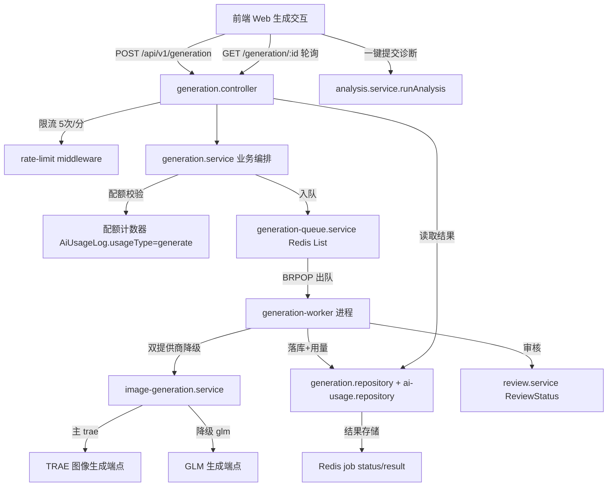
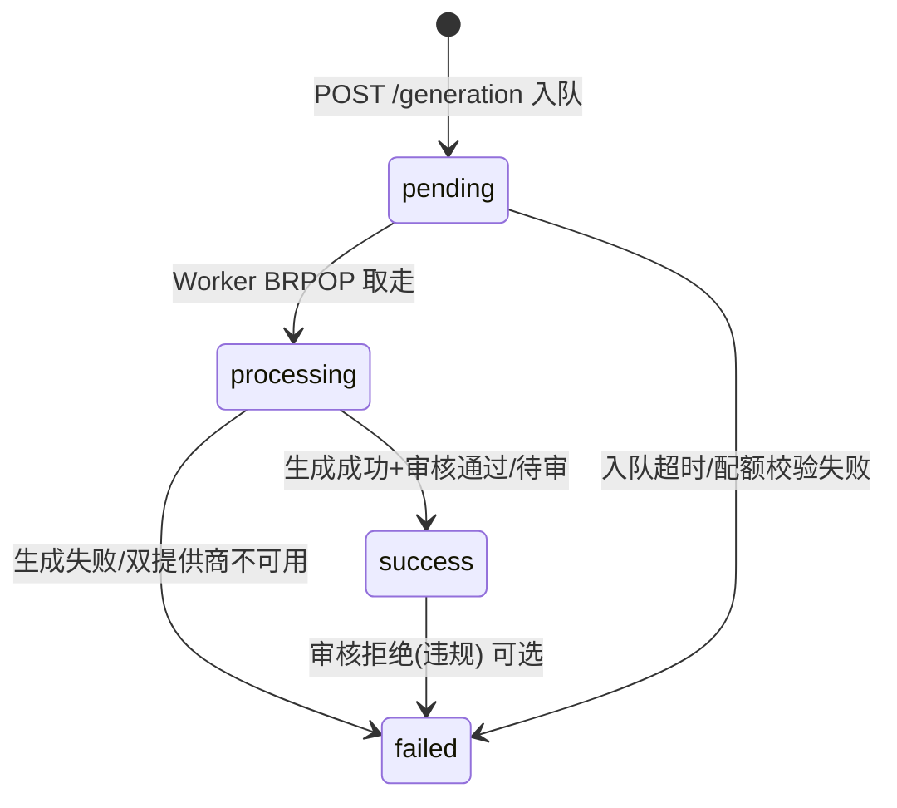
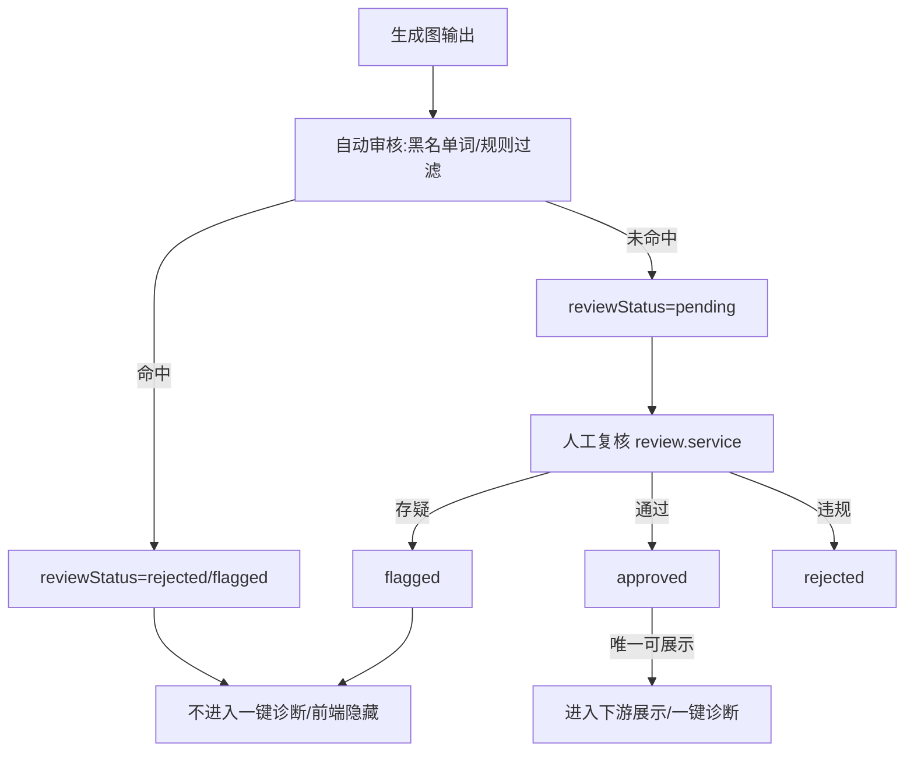
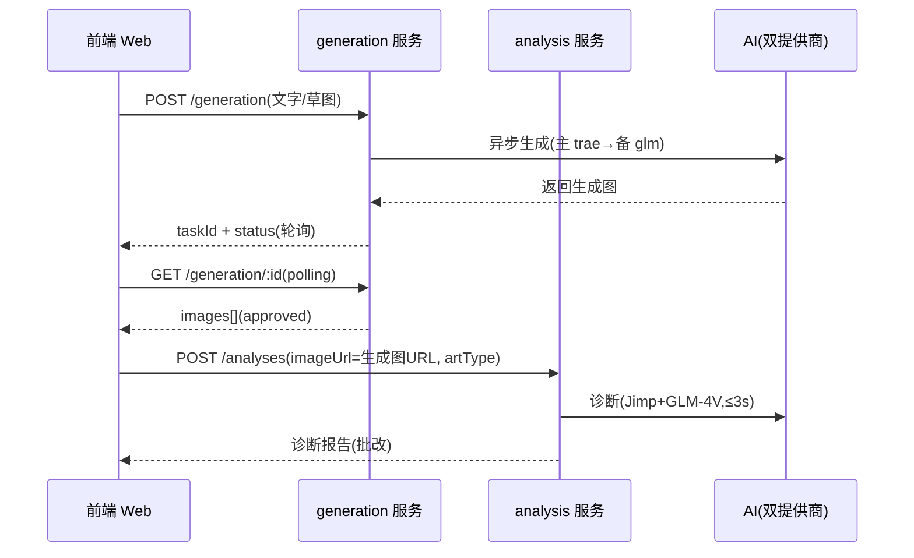
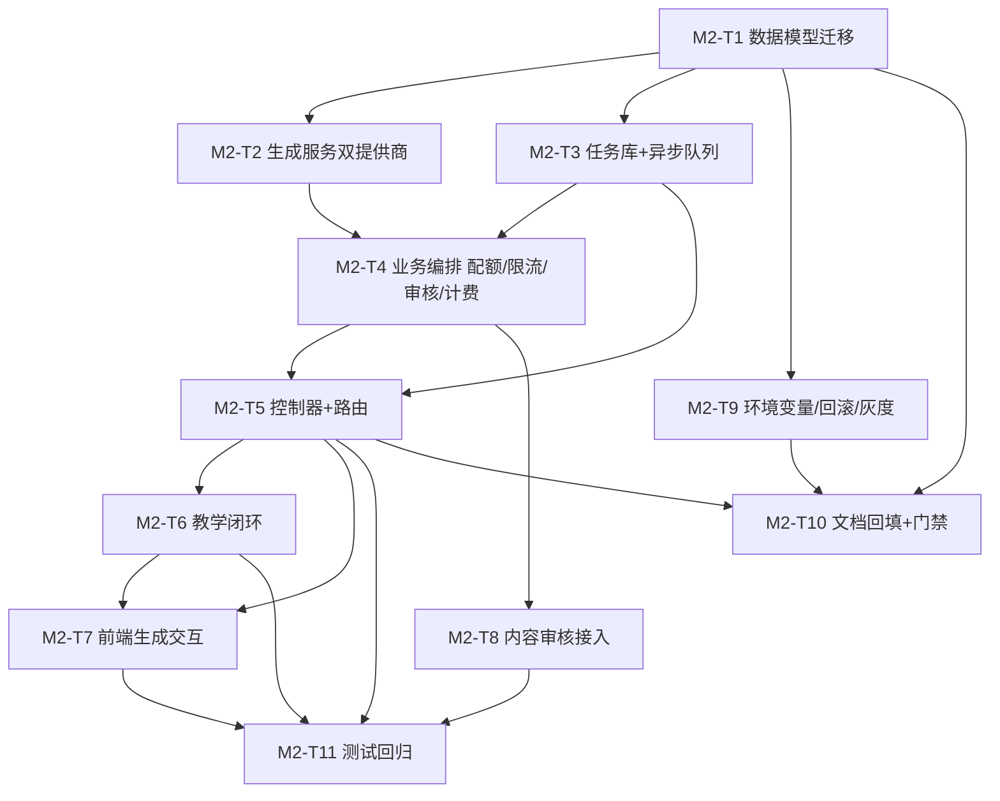

# 丹青有AI · M-2 阶段《AI 图像生成功能文档契约与更新计划》

> **文档版本**：v1.1.0（M-2 收尾版）
> **生成时间**：2026-08-07
> **文档状态**：M-2 已完成（M2-T1~T11 全部落地，门禁 M2-1~M2-4 全 PASS，回归 1192 用例 100% 通过）
> **维护人**：产品架构协调中枢（product-architect）
> **依据文档**：
> - `system-upgrade-plan-2026-08-06.md`（已批准总方案，§2.3.1 AI 图像生成 / §2.6.1 安全合规）
> - `m0-doc-contract-plan-2026-08-06.md`（M-0 契约，§3.3 生成契约草案 / §7 DOC 登记）
> - `m1-execution-plan-2026-08-07.md`（M-1 执行计划，批删/仲裁/高危确认已完成）
> - `implementation-source-of-truth.md`（系统真源，当前实现状态）
> - `server/src/types/api-contract.ts`（跨端共享 TS 契约主副本，§3.17 生成契约已冻结）
> - `server/prisma/schema.prisma`（数据模型）
> - `server/src/services/ai-vision.service.ts`（双提供商降级模式）
> - `server/src/services/analysis-queue.service.ts`（异步队列模式）
> - `server/src/repositories/ai-usage.repository.ts`（用量日志模式）
> - `server/src/services/analysis.service.ts`（配额校验模式）
> - `server/src/middlewares/rate-limit.ts`（限流中间件）
> - `server/src/services/review.service.ts`（内容审核服务）
>
> **适用范围**：Web 应用 / 管理后台 / 移动端 / 后端服务 四端（品牌官网不涉及）
> **唯一产出文件**：本文档（作为 M-2 各专项 agent 的执行真源；`api-contract.ts` 契约已冻结，**本轮不修改任何契约类型**）

> **里程碑标识说明**：总方案 `system-upgrade-plan-2026-08-06.md` §4.1 将"AI 图像生成 + 教学闭环"编号为 **M-3**。本文档按研发会议室口径将其命名为 **M-2**（P0 之后的第三个实现里程碑，紧随 M-0 契约、M-1 核心功能之后）。**两者指向同一范围**，后续任务表引用以本文档 M2-* 为准，与总方案 M-3 一一对应。

---

## 目录

1. [一、M-2 目标与门禁](#一m-2-目标与门禁)
2. [二、技术架构设计](#二技术架构设计)
3. [三、数据模型设计](#三数据模型设计)
4. [四、API 契约实现说明](#四api-契约实现说明)
5. [五、配额与计费规则](#五配额与计费规则)
6. [六、内容审核流程](#六内容审核流程)
7. [七、教学闭环设计](#七教学闭环设计)
8. [八、前端实现要点](#八前端实现要点)
9. [九、M-2 任务拆解与依赖](#九m-2-任务拆解与依赖)
10. [十、影响评估与备份回滚](#十影响评估与备份回滚)
11. [十一、硬约束核对](#十一硬约束核对)
12. [十二、M-2 验收清单](#十二m-2-验收清单)
13. [七、附：文档先行编号登记表](#七附文档先行编号登记表)

---

## 一、M-2 目标与门禁

### 1.1 阶段定位

M-2 是已批准总方案（§4.1，对应 M-3）的**后端实现阶段**，落地 AI 图像生成能力并打通"生成 → 诊断 → 批改"教学闭环，对齐痛点 **P-02（AI 图像生成未集成）** 与 **P-07（生成→诊断→批改闭环未打通）**。

**前置依赖确认**：
- M-0 已冻结生成接口契约（`api-contract.ts §3.17`，DOC-2026-08-006/007/008/009），**类型已存在且不可在本轮修改**。
- M-1 已完成批删（`POST /analyses/batch-delete`）、租户仲裁配置覆盖、管理后台高危确认，其**配额/审计基础**可供 M-2 复用。

**M-2 产出物**：

| 产出物 | 类型 | 说明 |
|--------|------|------|
| 本文档 | 新增 | M-2 执行真源（架构 / 数据模型 / 实现 / 任务拆解 / 影响评估） |
| `schema.prisma` | 更新 | 新增 `GenerationTask` 表 + `AiUsageLog` 追加 `usageType` 字段（A 级数据模型变更） |
| 后端源码 | 新增/更新 | 生成服务 / 生成队列 / 生成控制器 / 生成路由 / 生成仓库 / 配额与限流 / 审核接入 |
| `prd.md` / `tech_arch.md` | 更新 | 回填 AI 图像生成的已实现架构与需求（M-0 已声明，此处落地后同步） |
| 前端源码 | 新增 | Web 端"AI 生成"交互（生成 → 轮询 → 一键诊断） |

> ⚠️ **范围铁律**：`api-contract.ts` §3.17 契约**已冻结，本轮禁止修改**。实现必须严格按冻结类型（`GenerationStatus` / `CreateGenerationRequest` / `CreateGenerationResponse` / `GetGenerationResponse` / `GeneratedImage` / `AiUsageType` / `ErrorCode.GENERATION_*`）执行，不得另立字段或改响应结构。

### 1.2 完成定义（DoD）

M-2 阶段宣告完成，需**全部满足**以下条件：

| # | 完成定义 | 验证方式 |
|---|---------|---------|
| D1 | `POST /api/v1/generation` 与 `GET /api/v1/generation/:id` 已实现，严格按冻结契约返回 | 接口测试 + 契约比对（git diff 不改 api-contract.ts） |
| D2 | 生成任务异步状态机（pending→processing→success/failed）落地，Redis 队列 + 轮询可用 | 集成测试覆盖全部状态迁移 |
| D3 | 双提供商降级（主 trae → 备 glm）生效，`usedFallback` 正确透出 | 故障注入测试（禁用主提供商） |
| D4 | 生成计入配额（`AiUsageLog.usageType=generate`）且受单用户限流（5 次/分钟）保护 | 配额耗尽返回 6101；超限返回 6106 |
| D5 | 生成内容纳入审核（`ReviewStatus`），违规/flagged 图不进入下游展示 | 审核测试 + 黑名单词过滤测试 |
| D6 | 教学闭环打通：生成参考图可一键"提交诊断"，复用 `analysis.service.runAnalysis()` | 端到端测试（生成→诊断→批改） |
| D7 | 数据模型变更（GenerationTask 新增、AiUsageLog.usageType）完成迁移，且挂备份/回滚/灰度方案（§10） | 迁移评审 + 备份演练 |
| D8 | M-2 验收清单（§12）全部勾选，现有 889 测试不回退 | 全量回归 |

### 1.3 验收门禁（Gate）

进入后续里程碑前必须通过的门禁。**M-2 收尾结论：四道门禁全部 PASS（2026-08-07）**。

| 门禁 | 条件 | 责任人 | 结论 | 依据 |
|------|------|--------|:----:|------|
| 门禁 M2-1 | `api-contract.ts` **零改动**（git diff 空），生成实现与冻结类型完全一致 | backend-service + product-architect | **PASS** | §3.17 类型(GenerationStatus/CreateGenerationRequest/Response/GeneratedImage/AiUsageType)与错误码 6101-6106 在实现代码中完整引用且无新增字段；各实现文件注释反复声明"禁止修改 api-contract.ts"；字段名(taskId/status/images/failureReason/usedFallback/createdAt/completedAt)与契约一致 |
| 门禁 M2-2 | 生成接口遵循冻结契约（错误码/字段/状态机 pending→processing→success/failed）+ 数据模型迁移成功 | devops-qa + backend-service | **PASS** | `schema.prisma` 含 `enum GenerationStatus` + `model GenerationTask`(三索引) + `AiUsageLog.usageType/generationId`；`generation.controller` Zod 校验对齐契约；`generation.service` 状态机四态完整；`BusinessError(ErrorCode.GENERATION_*)` 6101-6106 全链路使用 |
| 门禁 M2-3 | 多租户隔离（跨租户访问返回 404，tenantId 强制注入） | api-test-pro + backend-service | **PASS** | `generation.routes` auth→tenant 中间件强制注入；`generation.repository` 所有查询带 `where:{ id, tenantId }`；`generation.service.getGeneration` 跨租户/null→抛 `GENERATION_TASK_NOT_FOUND(6102)` 404；student 越权查他人→404(`canReadTenantWide` 校验) |
| 门禁 M2-4 | 生成功能默认关闭（config-feature 默认 disabled，fail-closed），经 `/api/v1/config` 灰度开启 | devops-qa + product-architect | **PASS** | `config-feature.service` 中 `generation` 开关 `defaultStatus='disabled'`、`type='percentage'`、`defaultValue=0`；`createGeneration` 入口 `isGenerationEnabled(tenantId)` 校验，未开启→`FORBIDDEN(2004)` 403；灰度路径 disabled→gradual(按租户哈希)→enabled |

---

## 二、技术架构设计

### 2.1 总体架构

生成功能为**异步任务**，不阻塞诊断主链路（3 秒 SLA 硬约束）。核心服务与复用模式如下：



**复用模式清单**（避免重复造轮子）：

| 复用模式 | 来源 | 用途 |
|---------|------|------|
| 双提供商降级 | `ai-vision.service.ts` 的 `resolveAIConfig()` | 生成服务主(glm/trae)→备(fallback)选择 |
| 异步队列 | `analysis-queue.service.ts`（Redis LPUSH/BRPOP + job 状态/TTL） | 生成任务入队/出队/状态追踪 |
| 用量日志 | `ai-usage.repository.ts` 的 `create()` / `estimateCostYuan()` | 生成调用计费与成本聚合 |
| 配额校验 | `analysis.service.ts` 的 `checkQuota()` / `PLAN_QUOTA` | 生成配额护栏（§5 扩展） |
| 限流 | `rate-limit.ts` 中间件 | 生成接口 5 次/分钟/用户 |
| 内容审核 | `review.service.ts` + `ReviewStatus` | 生成内容合规审核 |

### 2.2 双提供商降级策略

复用 `ai-vision.service.ts` 的 `resolveAIConfig()` 同源逻辑，新增独立配置 `AI_IMAGE_PROVIDER`（主提供商），**与诊断链路解耦**：

| 场景 | 行为 | 说明 |
|------|------|------|
| 主=trac，trae 配置完整 | 使用 trae | 正常路径，`usedFallback=false` |
| 主=trac，trae 配置残缺 | 降级到 glm | `usedFallback=true`，记 warning 日志 |
| 主=glm，glm key 存在 | 使用 glm | 正常路径 |
| 主=glm，glm key 缺失 | 尝试 trae | 若 trae 也缺失返回 null |
| 双提供商均不可用 | 抛 `GENERATION_PROVIDER_UNAVAILABLE(6103)` | 异步任务标记 failed |

**降级设计要点**：
- 生成超时独立配置（`AI_IMAGE_TIMEOUT`），生成耗时不受诊断 2.5s 限制，但设上限（建议 30s）。
- 主提供商失败记为 `AiUsageLog.success=false`，降级成功后再记一条 `success=true`（provider 为实际生效者）。
- 降级不阻断诊断主链路（生成走独立队列与 Worker）。

### 2.3 异步任务状态机



- 状态存 Redis `job:{id}:status`（复用 analysis-queue 模式），TTL 建议 1 小时。
- 结果存 `job:{id}:result`（`GeneratedImage[]`），同时落库 `GenerationTask.images`（持久化，供 GET 轮询跨进程读取）。
- 前端轮询 `GET /generation/:id`，`status=success` 时返回 `images`。

### 2.4 新增环境变量

| 变量 | 必填 | 说明 |
|------|:---:|------|
| `AI_IMAGE_PROVIDER` | 是 | 主提供商标识（`trae` / `glm`），默认 `trae` |
| `AI_IMAGE_API_KEY` | 是 | 图像生成 API Key（主提供商） |
| `AI_IMAGE_API_URL` | 是 | 图像生成端点 URL（OpenAI 兼容） |
| `AI_IMAGE_API_MODEL` | 是 | 图像生成模型名 |
| `AI_IMAGE_TIMEOUT` | 否 | 生成超时（毫秒，默认 30000） |
| `GENERATION_RATE_LIMIT_PER_MIN` | 否 | 单用户分钟限流（默认 5） |
| `GENERATION_MAX_COUNT` | 否 | 单任务最大张数（默认 4） |

> ⚠️ 生产 `.env` 必须替换占位符；`AI_IMAGE_API_KEY` 严禁提交 git。

---

## 三、数据模型设计

### 3.1 数据模型变更结论

| 变更 | 类型 | 风险 | 结论 |
|------|:---:|:---:|------|
| 新增 `GenerationTask` 表 | 新增模型 | **A（高）** | 存储异步生成任务全生命周期（联盟异步任务状态跨进程持久化） |
| `AiUsageLog` 追加 `usageType` 字段 | 字段新增 | **A（高）** | 区分诊断/生成用量，支撑配额与成本统计（DOC-2026-08-009） |

> **判定依据**：现有 `Analysis`/`AiUsageLog` 无法承载"异步生成任务状态 + 多张生成图 + 审核状态 + 双提供商透出"的完整生命周期，必须新增 `GenerationTask` 表；`AiUsageLog` 需 `usageType` 区分生成计费。

### 3.2 Prisma 模型草案

```prisma
/// 生成任务状态(对齐 api-contract.ts §3.17 GenerationStatus)
enum GenerationStatus {
  pending    // 待处理(已入队)
  processing // 处理中(Worker 已取走)
  success    // 成功
  failed     // 失败
}

/// AI 图像生成任务表(异步,教学闭环源头)
model GenerationTask {
  id             String           @id @default(uuid()) @map("id")
  tenantId       String           @map("tenant_id") // 多租户隔离核心字段
  userId         String           @map("user_id")
  inputType      String           @map("input_type") @db.VarChar(16) // text | sketch
  prompt         String?          @map("prompt") @db.Text            // text 模式的提示词
  sketchImageUrl String?          @map("sketch_image_url") @db.Text // sketch 模式的草稿图 URL
  artType        ArtType          @map("art_type")                   // 生成后一键诊断的目标类型
  aspect         String?          @map("aspect") @db.VarChar(16)     // portrait/landscape/square
  count          Int              @default(1) @map("count")          // 生成数量(1-4)
  status         GenerationStatus @default(pending) @map("status")
  images         Json?            @map("images") // GeneratedImage[] 数组(含 reviewStatus)
  failureReason  String?          @map("failure_reason") @db.Text
  usedFallback   Boolean          @default(false) @map("used_fallback") // 是否经降级
  provider       String?          @map("provider") @db.VarChar(16)  // 实际生效提供商(glm/trae)
  model          String?          @map("model") @db.VarChar(64)     // 实际生效模型
  createdAt      DateTime         @default(now()) @map("created_at")
  completedAt    DateTime?        @map("completed_at")

  // 关系
  tenant Tenant @relation(fields: [tenantId], references: [id])
  user   User   @relation(fields: [userId], references: [id])

  @@index([tenantId, createdAt], map: "generation_tasks_tenant_id_created_at_idx") // 租户内按时间倒序
  @@index([tenantId, userId], map: "generation_tasks_tenant_id_user_id_idx")       // 用户在租户内查询
  @@index([tenantId, status], map: "generation_tasks_tenant_id_status_idx")        // 按状态筛选
  @@map("generation_tasks")
}
```

### 3.3 `AiUsageLog` 扩展

在现有 `AiUsageLog` 模型追加两个字段（向后兼容，默认 `diagnose`）：

```prisma
model AiUsageLog {
  // ... 现有字段不变 ...
  usageType    String   @default("diagnose") @map("usage_type") @db.VarChar(16) // diagnose | generate(DOC-2026-08-009)
  generationId String?  @map("generation_id") // generate 类型关联的生成任务 ID(诊断为 null)
}
```

> 说明：`usageType` 在 Prisma 侧用 `String` 承载（对齐 `api-contract.ts` 的 `AiUsageType = 'diagnose' | 'generate'`），避免枚举迁移复杂度；取值经 Zod/常量白名单约束。**新增字段非空默认 `diagnose`**，现有诊断日志天然兼容，无需数据回填。

### 3.4 索引与查询模式

| 查询场景 | 索引 | 说明 |
|---------|------|------|
| 租户内生成历史倒序 | `(tenantId, createdAt)` | 移动端/Web 历史列表 |
| 指定用户生成记录 | `(tenantId, userId)` | 学生个人生成记录 |
| 按状态筛选待处理/失败 | `(tenantId, status)` | Worker 失败重试/管理后台 |
| 配额统计（generate 计数） | 复用 `AiUsageLog.usage_type` 过滤 | 需在 `ai_usage_logs` 追加 `usage_type` 索引（可选，量小可全扫） |

---

## 四、API 契约实现说明

> **契约已冻结（M-0，`api-contract.ts §3.17`，DOC-2026-08-006/007/008/009）**。M-2 **只实现、不修改**。以下为实现时的契约对齐说明与错误码映射。

### 4.1 接口清单

| 方法 | 路径 | 状态 | 冻结类型 |
|------|------|:---:|---------|
| POST | `/api/v1/generation` | 已冻结 | `CreateGenerationRequest` / `CreateGenerationResponse` |
| GET | `/api/v1/generation/:id` | 已冻结 | `GetGenerationResponse` |

### 4.2 请求/响应契约（冻结，实现须严格对齐）

```typescript
// POST /api/v1/generation 请求(冻结)
export interface CreateGenerationRequest {
  inputType: 'text' | 'sketch';
  prompt?: string;            // text 时必填
  sketchImageUrl?: string;    // sketch 时必填
  artType?: ArtType;          // 默认 painting
  aspect?: 'portrait' | 'landscape' | 'square';
  count?: number;             // 默认 1,上限 4
}

// POST /api/v1/generation 响应(冻结)
export interface CreateGenerationResponse {
  taskId: string;
  status: 'pending' | 'processing' | 'success' | 'failed';
  images: GeneratedImage[] | null; // 异步模式为 null,前端轮询 GET
}

// GET /api/v1/generation/:id 响应(冻结)
export interface GetGenerationResponse {
  taskId: string;
  tenantId: string;
  status: GenerationStatus;
  images: GeneratedImage[] | null;
  failureReason: string | null;
  usedFallback: boolean;
  createdAt: ISODateString;
  completedAt: ISODateString | null;
}

// 单张生成结果(冻结)
export interface GeneratedImage {
  imageUrl: string;
  reviewStatus: ReviewStatus; // 内容审核,违规标记 flagged
}
```

### 4.3 错误码映射（冻结，DOC-2026-08-008）

| 错误码 | 值 | HTTP | 触发场景 |
|--------|:--:|:----:|---------|
| `GENERATION_QUOTA_EXCEEDED` | 6101 | 402 | 生成配额已用完（§5） |
| `GENERATION_TASK_NOT_FOUND` | 6102 | 404 | 任务不存在/跨租户（不泄露存在性） |
| `GENERATION_PROVIDER_UNAVAILABLE` | 6103 | 502 | 双提供商均不可用 |
| `GENERATION_FAILED` | 6104 | 500 | 生成失败 |
| `GENERATION_IMAGE_INVALID` | 6105 | 400 | 输入草稿图无法解析 |
| `GENERATION_RATE_LIMITED` | 6106 | 429 | 生成接口被限流（5 次/分钟） |

### 4.4 实现校验规则

| 项 | 规则 |
|----|------|
| `inputType=text` | 必须携带 `prompt`，否则 `GENERATION_IMAGE_INVALID(6105)` 或参数校验 400 |
| `inputType=sketch` | 必须携带 `sketchImageUrl`，且 URL 可解析（走到本地/已上传图），否则 6105 |
| `count` | 默认 1，>4 截断为 4（按 `GENERATION_MAX_COUNT`） |
| `artType` | 仅四类枚举（painting/design/product/sculpture），校验后透传 |
| 多租户 | `tenantId` 由 JWT 注入，**禁止从请求体读取**；GET 查询强制 `tenantId` 过滤，跨租户 → 6102 |
| CSRF | 写操作需 `X-CSRF-Token` 头匹配 `csrf_token` Cookie（复用现有中间件） |
| 鉴权 | 已登录 + `analysis:create` 权限 |

> **契约铁律**：若实现中发现冻结类型与真实需求冲突（如需新增字段），**不得擅自改 `api-contract.ts`**，须走"文档先行"流程向 product-architect 报备，重新冻结后才可实现。

---

## 五、配额与计费规则

### 5.1 配额模型（决策项）

现有 `analysis.service.ts` 的 `PLAN_QUOTA` 仅统计诊断（Analysis 月度计数）。生成计费需选定配额口径，给出**方案对比**：

| 方案 | 口径 | 优点 | 缺点 | 结论 |
|------|------|------|------|:---:|
| A. 诊断+生成合并配额 | 月度总调用 = Analysis 数 + GenerationTask 数 | 实现简单，复用现有 `countMonthlyUsage` | 生成单次成本更高，可能挤占诊断配额，成本护栏弱 | 否 |
| B. 独立生成配额 | 新增 `GENERATION_PLAN_QUOTA`（free=10/standard=200/enterprise=-1），单独统计 `AiUsageLog.usageType=generate` | 成本护栏强，符合"生成成本更高"定位 | 需新增常量与统计逻辑 | **推荐** |
| C. 权重合并配额 | 生成按 1 次计 N 次诊断额 | 粒度最细 | 复杂度高，配额口径难向用户解释 | 否 |

**决策**：采用 **方案 B（独立生成配额）**。理由：
1. 总方案 §2.3.1 明确定位"生成任务计入 `AiUsageLog`（usageType=generate）"，独立配额天然契合。
2. 生成单次成本显著高于诊断，独立配额更能防止成本失控（§5.3 风险护栏）。
3. 对用户透明：前端展示"生成配额剩余 X/N"，与诊断配额分开显示。

### 5.2 配额实现

```typescript
// 生成配额(独立于诊断 PLAN_QUOTA)
const GENERATION_PLAN_QUOTA: Record<Tenant['plan'], number> = {
  free: 10,
  standard: 200,
  enterprise: -1, // 无限
};

// 生成配额校验(参考 analysis.service.checkQuota 模式)
async checkGenerationQuota(tenantId: string): Promise<void> {
  const tenant = await tenantRepository.findById(tenantId);
  // ... tenant 存在性/status 校验同 checkQuota ...
  const max = GENERATION_PLAN_QUOTA[tenant.plan];
  if (max === -1) return;
  const used = await generationRepository.countMonthlyGenerateUsage(tenantId, year, month);
  if (used >= max) {
    throw new BusinessError(ErrorCode.GENERATION_QUOTA_EXCEEDED,
      `本月生成配额已用完(${used}/${max}),请升级订阅`, 402);
  }
}
```

### 5.3 计费与成本护栏

| 护栏 | 规则 |
|------|------|
| 用量日志 | 每次生成调用写 `AiUsageLog`（`usageType=generate`，`provider/model/apiUrl` 记实际生效者），复用 `estimateCostYuan()` 估算成本 |
| 单用户限流 | `POST /generation` 走 `rate-limit.ts`，5 次/分钟/用户 → `GENERATION_RATE_LIMITED(6106)` |
| 配额 | 独立 `GENERATION_PLAN_QUOTA`，耗尽 → `GENERATION_QUOTA_EXCEEDED(6101)` |
| 失败不扣配额 | 生成失败（双提供商不可用/超时）**不消耗配额**，仅记 `usageType=generate, success=false` 日志（便于成本审计） |
| 成本监控 | 复用 `ai-usage.repository` 聚合，生成成本按天/按租户可查（对齐总方案 §2.5.1 可观测性） |

---

## 六、内容审核流程

### 6.1 审核接入

生成内容复用 `ReviewStatus`（pending/approved/rejected/flagged）。`GeneratedImage.reviewStatus` 在 `GenerationTask.images` JSON 中持久化。



### 6.2 审核规则

| 项 | 规则 |
|----|------|
| 自动审核 | 黑名单关键词过滤 + 生成图元数据校验；命中即 `flagged`（存疑）或 `rejected`（确定违规） |
| 人工复核 | 复用 `review.service.ts` + 管理后台审核入口（`POST /api/admin/artworks/:id/review` 模式），人工改 `approved/rejected` |
| 展示控制 | 仅 `approved`（或 pending 但未 flagged）的图可被前端展示与"一键诊断"；`flagged/rejected` 前端隐藏 |
| 审计 | 审核动作写入 `AuditLog`（auditAction=update），可追溯 |

### 6.3 与现有审核体系的关系

- 复用现有 `ReviewStatus` 枚举与 `review.service.ts`，**不新增审核表**。
- 生成图若被"一键诊断"进入 `Analysis`，其 `Analysis.reviewStatus` 独立走诊断审核流程（不互相覆盖）。
- 生成任务的 `GenerationTask` 本身不落入 `Artwork` 素材库（除非用户主动收藏），避免与现有素材库审核混淆。

---

## 七、教学闭环设计

### 7.1 闭环链路

打通"生成 → 诊断 → 批改"：



### 7.2 闭环要点

| 环节 | 设计 |
|------|------|
| 生成源头 | 文字提示词 **或** 基于已上传草稿图（`sketchImageUrl`，复用现有上传图 URL） |
| 一键诊断 | 前端选中已审核通过的生成图 → `POST /analyses`（`imageUrl=生成图URL`, `artType=任务artType`）→ 复用 `analysis.service.runAnalysis()` |
| 3 秒 SLA | 生成走异步队列，诊断仍走同步（≤3s），**生成不阻塞诊断** |
| 类型贯通 | 生成任务的 `artType` 透传到诊断，保证四类作品维度一致 |
| 批改闭环 | 诊断报告含 professional_suggestions（evidence+priority），学生可据此迭代再生成再诊断 |

> **闭环价值**：学生"由文字/草图生成参考图 → 提交诊断 → 获得批改建议 → 改进再生成"，形成完整教学循环（对齐总方案 §2.3.1 验收标准）。

---

## 八、前端实现要点

> 前端由 `frontend-app` 负责，契约以 `api-contract.ts` 冻结类型为准（跨端共享，禁止独立改动）。

| 要点 | 说明 |
|------|------|
| 生成入口 | Web 端新增"AI 生成"入口（上传/诊断页），支持两种模式：文字提示词 / 上传草稿图 |
| 异步体验 | 提交后展示"生成中"状态（pending/processing），轮询 `GET /generation/:id`（间隔建议 1-2s），成功展示生成的 `images[]` |
| 审核提示 | `reviewStatus=flagged/rejected` 的图灰显并提示"内容审核未通过"，不进入一键诊断 |
| 配额展示 | 展示"生成配额剩余 X/N"，耗尽时提示升级（对齐 6101） |
| 降级透出 | `usedFallback=true` 时 toast 提示"已自动切换备用服务"，保证可用性可感知 |
| 一键诊断 | 选中生成图 → "提交诊断"按钮 → `POST /analyses` → 跳转诊断报告页（对齐 §7.2） |
| 历史记录 | 生成历史列表（可选，P2），复用 `GenerationTask` 分页查询 |
| 类型对齐 | 前端引用 `api-contract.ts` §3.17 类型（通过 sync 脚本同步），禁止本地重建 |

---

## 九、M-2 任务拆解与依赖

### 9.1 任务清单

| 任务 ID | 优先级 | 负责人建议 | 内容 | 依赖 | 验收标准 |
|---------|:-----:|-----------|------|------|---------|
| M2-T1 | P0 | backend-service | 数据模型迁移：新增 `GenerationTask` 表 + `AiUsageLog.usageType`，`prisma migrate` + 回滚 SQL | - | 迁移成功，`prisma generate` 0 错误，`usageType` 默认 diagnose 兼容 |
| M2-T2 | P0 | backend-service | `image-generation.service.ts`：双提供商降级（复用 resolveAIConfig 逻辑）+ 生成调用 + 耗时/超时 | M2-T1 | 主提供商失败自动降级，`usedFallback` 正确 |
| M2-T3 | P0 | backend-service | `generation.repository.ts` + `generation-queue.service.ts`：任务落库 + Redis 异步队列（pending→processing→success/failed） | M2-T1 | 状态机全迁移可用，结果持久化 |
| M2-T4 | P0 | backend-service | `generation.service.ts`：业务编排（配额校验 §5 + 限流 + 任务生命周期 + 审核 + 用量日志） | M2-T2/T3 | 配额/限流/审核/计费全部生效 |
| M2-T5 | P0 | backend-service | `generation.controller.ts` + `generation.routes.ts`：POST/GET 接口，严格按冻结契约返回 | M2-T3/T4 | 契约比对零改动，错误码正确 |
| M2-T6 | P0 | backend-service | 教学闭环：生成图一键诊断接入 `analysis.service.runAnalysis()` | M2-T5 | 生成→诊断→批改端到端通过 |
| M2-T7 | P0 | frontend-app | Web 端"AI 生成"交互（生成/轮询/审核提示/配额/一键诊断） | M2-T5/T6 | 交互完整，闭环可达 |
| M2-T8 | P1 | compliance-checker | 生成内容审核接入（黑名单过滤 + `review.service` 复核入口） | M2-T4 | 违规图不进入下游，审核可审计 |
| M2-T9 | P1 | devops-qa | 环境变量（`AI_IMAGE_*`）配置 + 生产占位符替换 + 备份/回滚演练 + `/api/v1/config` 灰度开关 | M2-T1 | 生产可运行，灰度可控 |
| M2-T10 | P0 | product-architect | 回填 `prd.md`/`tech_arch.md` 已实现架构与需求 + 门禁 M2-1~4 | M2-T1~T9 | 文档与实现一致，四门禁全过 — **已完成（2026-08-07）**：`prd.md §8.1.3` + `tech_arch.md §6/§9.2/§12.2` 已回填；门禁 M2-1~M2-4 全 PASS |
| M2-T11 | P0 | api-test-pro | 全量回归（889+新增）+ 生成/降级/配额/限流/审核/闭环测试 | M2-T5~T8 | 测试通过率 100%，无回归 |

### 9.2 依赖关系图（Mermaid）



### 9.3 并行与串行策略

- **可并行**：M2-T2 / M2-T3（均依赖 M2-T1，互不冲突）；M2-T7 前端可在 M2-T5 契约稳定后提前起。
- **串行**：数据模型迁移 → 生成服务/队列 → 业务编排 → 路由/闭环；门禁依赖全部完成。
- **预计耗时**：2 周（对齐总方案 §7 M-3 周期 08.27-09.09）。

---

## 十、影响评估与备份回滚

### 10.1 变更分级

| 变更 | 涉及 P-xx | 风险级 | 评估结论 |
|------|----------|:-----:|---------|
| 新增 `GenerationTask` 表 | P-02/P-07 | **A** | 数据模型变更。`prisma migrate` 新增表，现有表不受影响。**需**：迁移前 `pg_dump` 备份 3-5 轮 + 回滚 SQL（DROP TABLE）+ 生成功能默认关闭灰度开启 |
| `AiUsageLog.usageType` 字段 | P-02/P-07 | **A** | 数据模型变更。新增非空默认 `diagnose` 列，现有诊断日志天然兼容。**需**：备份 + 回滚迁移（DROP COLUMN）+ 灰度 |
| 生成接口 + 外部 API + 计费 | P-02/P-07 | **A** | 新增接口 + 外部依赖 + 成本风险。**需**：配额护栏 + 单用户限流 + 内容审核 + 双提供商降级 + 按租户灰度 |
| 教学闭环接入诊断 | P-07 | **C** | 生成图作为 `imageUrl` 进诊断，复用现有 `runAnalysis`，无破坏 |
| 前端生成交互 | P-02 | **C** | 纯新增页面/组件，现有 9 页面不受影响 |

### 10.2 备份 / 回滚 / 灰度策略

| 项 | 策略 |
|----|------|
| 备份 | 迁移前执行 `pg_dump` 保留 **3-5 轮**全量 + WAL 连续归档；备份完整性校验 + 恢复演练（Runbook §5） |
| 回滚迁移 | 为 `GenerationTask` 准备 `DROP TABLE generation_tasks`；为 `AiUsageLog.usage_type` 准备 `ALTER TABLE ai_usage_logs DROP COLUMN usage_type` |
| 灰度 | 经 `/api/v1/config` 特性开关按租户灰度：先内部租户 → 试点院校 → 全量；**生成功能默认关闭**，灰度开启 |
| 成本灰度 | 灰度期间收紧 `GENERATION_PLAN_QUOTA` + 限流，监控成本（`AiUsageLog` 聚合）后再放宽 |
| 故障回退 | 双提供商降级保证生成可用性；主不可用不阻断诊断主链路（生成走独立队列） |

---

## 十一、硬约束核对

| 硬约束 | 本计划贯彻点 |
|--------|-------------|
| 多创意形式（绘画/设计/产品/雕塑） | 生成接口 `artType` 覆盖四类，`GENERATION_IMAGE_INVALID` 校验；闭环透传保证诊断维度一致 |
| 3 秒 SLA | 生成走异步队列，诊断链路保持墙钟≤3s；生成不阻塞诊断（独立 Worker） |
| AI 双提供商降级 | 生成复用 GLM/TRAE 降级（`usedFallback` 透出）；诊断降级三道防线不变 |
| 建议含 evidence + priority | M-2 不触碰现有诊断建议格式；仅新增生成能力 |
| 多租户隔离 | 生成任务强制 `tenantId`（repository 注入），GET 跨租户→6102；禁止读请求体 tenant_id |
| DB/Redis 仅绑定 127.0.0.1 | 本轮不改变基础设施绑定 |
| AI 服务双提供商 | 图像生成独立 `AI_IMAGE_*` 配置，主(trae)失败自动降级(glm)，与诊断配置解耦 |
| 文档先行 | 契约已冻结（M-0），M-2 只实现不改契约；任何冲突走文档先行流程报备 |
| 备份回滚 | A 级变更（GenerationTask/AiUsageLog.usageType）挂备份 3-5 轮 + 回滚迁移 + 灰度 |

---

## 十二、M-2 验收清单

> 用于 M-2 验收会逐项勾选。全部 ✔ 后进入门禁 M2-4。

| # | 验收项 | 状态 |
|---|--------|:----:|
| 1 | `GenerationTask` 表 + `AiUsageLog.usageType` 迁移完成，`prisma generate` 0 错误 | ☐ |
| 2 | `api-contract.ts` §3.17 契约**零改动**（git diff 空），生成实现与冻结类型完全一致 | ☐ |
| 3 | POST/GET 生成接口按冻结契约返回，错误码 6101-6106 正确 | ☐ |
| 4 | 异步状态机（pending→processing→success/failed）+ Redis 队列 + 轮询可用 | ☐ |
| 5 | 双提供商降级生效，`usedFallback` 正确透出 | ☐ |
| 6 | 生成计入配额（usageType=generate）+ 独立配额耗尽返回 6101 | ☐ |
| 7 | 单用户限流 5 次/分钟生效，超限返回 6106 | ☐ |
| 8 | 生成内容经审核，flagged/rejected 不进入下游展示 | ☐ |
| 9 | 教学闭环打通：生成图一键诊断，复用 `runAnalysis`，批改报告可达 | ☐ |
| 10 | 前端生成交互完整（生成/轮询/审核提示/配额/一键诊断） | ☐ |
| 11 | 现有 889 测试不回退，新增生成测试通过率 100% | ☐ |
| 12 | 生产 `AI_IMAGE_*` 无占位符密钥，生成功能默认关闭灰度开启 | ☐ |
| 13 | `prd.md`/`tech_arch.md` 已回填生成架构与需求，与实现一致 | ☐ |
| 14 | A 级变更已挂备份 3-5 轮 + 回滚迁移 + 灰度方案 | ☐ |

---

## 七、附：文档先行编号登记表

> 本表补充 M-0 §7 生成相关登记，供 M-2 实现引用。M-2 **不新增契约编号**（契约已冻结）。

| 文档先行编号 | 接口/类型 | 涉及 P-xx | 实现里程碑 | 现状 |
|-------------|----------|----------|:--------:|:---:|
| DOC-2026-08-006 | `POST /api/v1/generation` + `CreateGenerationRequest/Response` | P-02/P-07 | M-2（本文档） | 契约已冻结，待实现 |
| DOC-2026-08-007 | `GET /api/v1/generation/:id` + `GetGenerationResponse` + `GenerationStatus` | P-02/P-07 | M-2（本文档） | 契约已冻结，待实现 |
| DOC-2026-08-008 | `ErrorCode.GENERATION_* = 6101-6106` | P-02/P-07 | M-2（本文档） | 契约已冻结，待实现 |
| DOC-2026-08-009 | `AiUsageLog.usageType` 枚举（diagnose/generate） | P-02/P-07 | M-2（本文档） | 契约已冻结，待实现 |
| （新增，M-2） | `GenerationTask` 表 | P-02/P-07 | M-2（本文档） | 数据模型待迁移 |

---

## 附录：M-2 硬约束核对补充

| 硬约束 | 本计划贯彻点 |
|--------|-------------|
| 红线命令禁止 | 迁移/回滚仅用 `prisma migrate` / `pg_dump` / 回滚 SQL，禁用 `DROP DATABASE` / `rm -rf /` 等生产禁令 |
| 变更前先评估核心组件 | 本文档 §10 已评估：`GenerationTask` 新增 + `AiUsageLog.usageType` 为数据模型变更，属 A 级，已挂备份/回滚/灰度 |
| 功能修改备份 3-5 轮 | 迁移前 `pg_dump` 保留 3-5 轮 + WAL 归档，命名含日期与轮次（`backup-YYYYMMDD-N`） |
| AI 服务双供应商自动回退 | 生成服务独立 `AI_IMAGE_*` 配置，主(trae)缺失/失败自动降级(glm)，不阻断主链路 |

---

> **文档结束**。本计划为 M-2 各专项 agent 的执行真源，基于冻结契约（`api-contract.ts §3.17`）、现有数据模型（`schema.prisma`）与可复用服务模式（降级/队列/用量/配额/限流/审核）编写，未编造不存在的字段。评审通过后由产品架构协调中枢按 §9 分派执行。