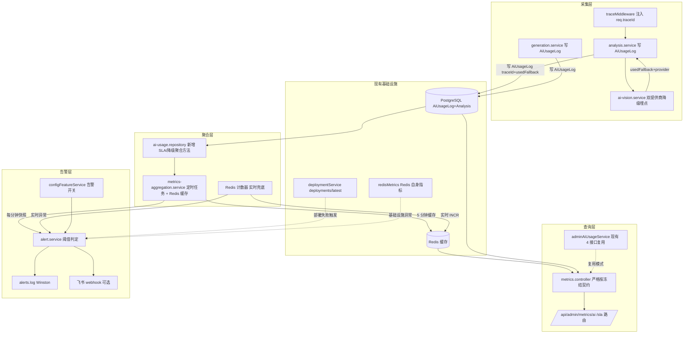
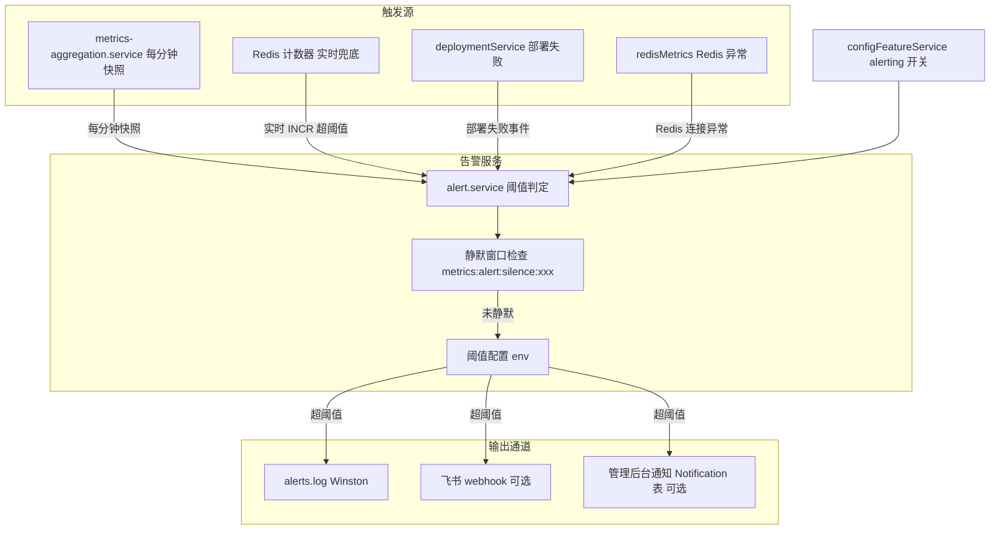
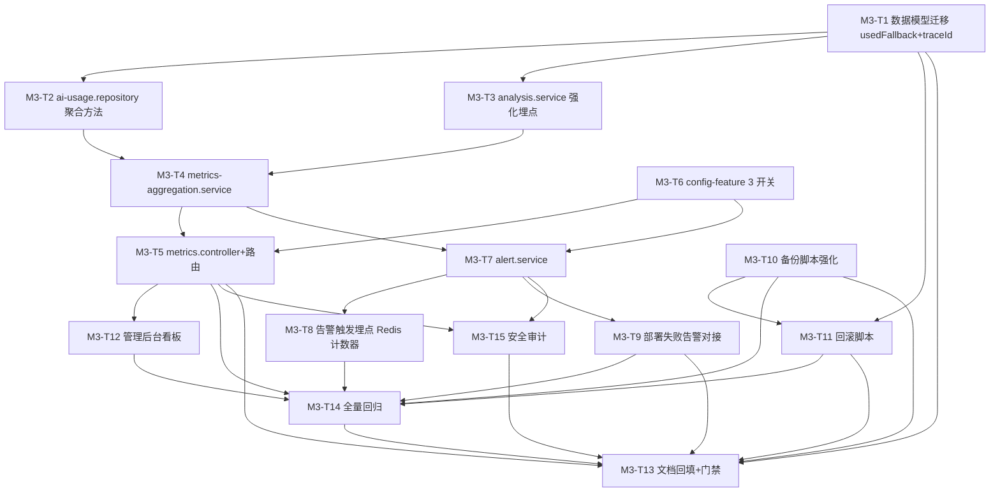

# 丹青有AI · M-3 阶段《可观测性体系建设规划文档》

> **文档版本**：v1.0.0
> **生成时间**：2026-08-07
> **文档状态**：待评审（评审通过后作为 M-3 各专项 agent 的执行真源）
> **维护人**：产品架构协调中枢（product-architect）
> **依据文档**：
> - `system-upgrade-plan-2026-08-06.md`（已批准总方案，§2.5.1 可观测性体系建设 / §2.5.2 部署与备份强化 / §5.3 资源风险与回滚备份策略）
> - `m0-doc-contract-plan-2026-08-06.md`（M-0 契约，§3.5 指标契约草案 / §7 DOC-2026-08-010/011/012 登记）
> - `m1-execution-plan-2026-08-07.md`（M-1 执行计划，批删/仲裁/高危确认已完成）
> - `m2-generation-plan-2026-08-07.md`（M-2 已完成,生成服务+教学闭环落地，门禁 M2-1~M2-4 全 PASS，回归 1192 用例 100% 通过）
> - `implementation-source-of-truth.md`（系统真源，当前实现状态）
> - `server/src/types/api-contract.ts`（跨端共享 TS 契约主副本，§3.18 指标契约已冻结）
> - `server/prisma/schema.prisma`（数据模型）
> - `server/src/middlewares/trace.ts`（traceId 注入中间件，已存在）
> - `server/src/services/redis-metrics.service.ts`（Redis 基础设施指标服务，已存在）
> - `server/src/repositories/ai-usage.repository.ts`（AI 用量日志仓库 + 聚合查询，已存在）
> - `server/src/services/admin-ai-usage.service.ts`（admin AI 用量统计服务，已存在，Redis 缓存 5 分钟）
> - `server/src/services/analysis.service.ts`（分析服务，Phase F1 已透传 aiEnhanced/aiDurationMs）
> - `server/src/services/deployment.service.ts`（部署日志服务，已存在）
> - `server/src/services/config-feature.service.ts`（特性开关服务，已存在，支持按租户百分比灰度）
> - `server/src/routes/admin.routes.ts`（管理后台路由，已注册 /stats/ai-usage/*，未注册 /metrics/*）
>
> **适用范围**：Web 应用 / 管理后台 / 移动端 / 后端服务 四端（品牌官网不涉及）
> **唯一产出文件**：本文档（作为 M-3 各专项 agent 的执行真源；`api-contract.ts` §3.18 契约已冻结，**本轮不修改任何契约类型**）

> **里程碑标识说明**：总方案 `system-upgrade-plan-2026-08-06.md` §4.1 将"可观测性体系 + 备份/灰度/回滚强化"编号为 **M-6**（P1）。本文档按研发会议室口径将其命名为 **M-3**（M-0 契约、M-1 核心功能、M-2 AI 图像生成 之后第三个实现里程碑）。**两者指向同一范围**，后续任务表引用以本文档 M3-* 为准，与总方案 M-6 一一对应。

---

## 目录

1. [一、M-3 目标与门禁](#一m-3-目标与门禁)
2. [二、技术架构设计](#二技术架构设计)
3. [三、API 契约说明](#三api-契约说明)
4. [四、指标定义表](#四指标定义表)
5. [五、告警通道设计](#五告警通道设计)
6. [六、备份/灰度/回滚强化方案](#六备份灰度回滚强化方案)
7. [七、M-3 任务拆解与依赖](#七m-3-任务拆解与依赖)
8. [八、影响评估与备份回滚](#八影响评估与备份回滚)
9. [九、硬约束核对](#九硬约束核对)
10. [十、M-3 验收清单](#十m-3-验收清单)
11. [附：文档先行编号登记表](#附文档先行编号登记表)

---

## 一、M-3 目标与门禁

### 1.1 阶段定位

M-3 是已批准总方案（§4.1，对应 M-6）的**可观测性体系建设阶段**，落地业务级 / AI 级指标采集、查询与告警，并强化部署备份与灰度回滚机制，对齐痛点 **P-08（可观测性停留在基础层）** 与硬约束"3 秒 SLA 持续监控 + 备份 3-5 轮 + 回滚脚本"。

**前置依赖确认**：
- M-0 已冻结可观测性契约（`api-contract.ts §3.18`，DOC-2026-08-010/011/012），**类型已存在且不可在本轮修改**。
- M-1 已完成批删/仲裁/高危确认，其审计与权限基础可供 M-3 复用。
- M-2 已完成 AI 图像生成 + 教学闭环，`AiUsageLog.usageType`（diagnose/generate）字段已落地，M-3 指标聚合可直接区分诊断与生成两类用量。
- 现有 `redisMetrics` 服务已采集 Redis 基础设施级指标（连接/命令/BRPOP/限流），M-3 在其之上扩展**业务级 / AI 级指标**，不混入基础设施指标。
- 现有 `adminAiUsageService` 已上线 4 个 `/stats/ai-usage/*` 接口（overview/by-provider/by-user/trend，Redis 缓存 5 分钟），M-3 **复用其聚合模式**，不重复造轮子。

**M-3 产出物**：

| 产出物 | 类型 | 说明 |
|--------|------|------|
| 本文档 | 新增 | M-3 执行真源（架构 / 数据模型 / 契约对齐 / 指标定义 / 告警 / 任务拆解 / 影响评估） |
| `schema.prisma` | 更新 | `AiUsageLog` 追加 `usedFallback Boolean` + `traceId String?` 字段（A 级数据模型变更） |
| 后端源码 | 新增/更新 | 指标聚合服务 / 指标控制器 / 指标路由 / 告警服务 / 阈值配置 / traceId 贯通埋点 / 备份脚本强化 |
| `prd.md` / `tech_arch.md` | 更新 | 回填可观测性已实现架构与需求（M-0 §2.1 PRD-6/PRD-7、TA-6 已声明，此处落地后同步） |
| 前端源码（管理后台） | 新增 | 可观测性看板页面（SLA 达标率 / 降级率 / 成本 / 可用性趋势图） |
| Runbook | 更新 | 补充备份轮次（3-5 轮）、回滚脚本、告警通道运维步骤 |

> ⚠️ **范围铁律**：`api-contract.ts` §3.18 契约**已冻结，本轮禁止修改**。实现必须严格按冻结类型（`AiMetricsResponse` / `SlaMetricsQuery` / `SlaMetricsResponse` / `ErrorCode.METRICS_DATA_UNAVAILABLE`）执行，不得另立字段或改响应结构。若实现中发现冻结类型与真实需求冲突（如需新增告警相关契约类型），**不得擅自改 `api-contract.ts`**，须走"文档先行"流程向 product-architect 报备，重新冻结后才可实现。

### 1.2 完成定义（DoD）

M-3 阶段宣告完成，需**全部满足**以下条件：

| # | 完成定义 | 验证方式 |
|---|---------|---------|
| D1 | `GET /api/admin/metrics/ai` 与 `GET /api/admin/metrics/sla` 已实现，严格按冻结契约返回 | 接口测试 + 契约比对（git diff 不改 api-contract.ts） |
| D2 | `AiUsageLog.usedFallback` + `AiUsageLog.traceId` 字段迁移完成，向后兼容（默认 false / null） | 迁移评审 + prisma generate 0 错误 |
| D3 | traceId 全链路贯通：`traceMiddleware` 注入的 `req.traceId` 写入 `AiUsageLog.traceId`，AI 调用日志带 traceId | 端到端测试（提交分析→查 AiUsageLog→traceId 一致） |
| D4 | 5 项核心指标（SLA 达标率 / AI 降级率 / 双提供商可用性 / 分析请求量与成功率与平均耗时 / AI 成本）按分钟聚合可查 | 接口返回数据非空且与 AiUsageLog 聚合一致 |
| D5 | 告警通道落地：`alerts.log` 文件 + 阈值告警（降级率 > X% / SLA 达标率 < Y%）+ 可选飞书 webhook | 阈值触发测试（构造降级场景验证 alerts.log 写入） |
| D6 | 备份轮次提升到 3-5 轮全量 + WAL 连续归档，回滚脚本可用 | 备份完整性校验 + 恢复演练（Runbook §5） |
| D7 | `/api/v1/config` 特性开关为指标接口与告警通道提供灰度控制（默认关闭，按租户灰度开启） | 开关关闭时指标接口返回 403；开启后正常返回 |
| D8 | M-3 验收清单（§10）全部勾选，现有 1192 测试不回退 | 全量回归 |

### 1.3 验收门禁（Gate）

进入后续里程碑前必须通过的门禁。

| 门禁 | 条件 | 责任人 | 依据 |
|------|------|--------|------|
| 门禁 M3-1 | `api-contract.ts` **零改动**（git diff 空），指标实现与冻结类型完全一致 | backend-service + product-architect | §3.18 类型(`AiMetricsResponse`/`SlaMetricsQuery`/`SlaMetricsResponse`)与错误码 `METRICS_DATA_UNAVAILABLE(9201)` 在实现代码中完整引用且无新增字段；各实现文件注释反复声明"禁止修改 api-contract.ts" |
| 门禁 M3-2 | 数据模型变更（`AiUsageLog.usedFallback` + `AiUsageLog.traceId`）迁移成功 + 备份 3-5 轮 + 回滚 SQL 就绪 | devops-qa + backend-service | `schema.prisma` 含 `usedFallback Boolean @default(false)` + `traceId String?`；`prisma migrate` 0 错误；回滚 SQL `ALTER TABLE ai_usage_logs DROP COLUMN used_fallback, DROP COLUMN trace_id` 已评审 |
| 门禁 M3-3 | 多租户隔离：`/metrics/sla?tenantId=X` 跨租户访问返回 403（admin 仅可查自己租户，super-admin 可查任意） | api-test-pro + backend-service | 指标控制器强制 `req.tenantId` 校验；非 super-admin 传他人 tenantId → `FORBIDDEN(2004)` |
| 门禁 M3-4 | 告警通道 fail-safe：告警服务异常不阻断指标采集主链路；阈值告警可配置且可静默 | devops-qa + compliance-checker | 告警服务 throw 被 catch swallow + logger.warn；阈值环境变量可调；`ALERT_SILENCE_MINUTES` 静默窗口生效 |

---

## 二、技术架构设计

### 2.1 总体架构

可观测性体系分为**采集层 / 聚合层 / 查询层 / 告警层**四层，复用现有 `traceMiddleware` / `aiUsageRepository` / `adminAiUsageService` / `redisMetrics` / `deploymentService` / `configFeatureService` 模式，不引入新基础设施：



**复用模式清单**（避免重复造轮子）：

| 复用模式 | 来源 | 用途 |
|---------|------|------|
| traceId 注入 | `traceMiddleware`（`server/src/middlewares/trace.ts`） | traceId UUID v4 + X-Trace-Id 头，已存在；M-3 仅扩展写入 AiUsageLog |
| Redis 缓存聚合 | `adminAiUsageService`（Redis 缓存 5 分钟 + DB 聚合） | M-3 指标服务复用同模式，TTL 1-5 分钟 |
| 用量日志聚合 | `aiUsageRepository.overview/groupByProvider/trend` | M-3 新增 `slaCompliance / fallbackRate / providerSwitch` 聚合方法 |
| 双提供商降级 | `ai-vision.service.resolveAIConfig()` + `analysis.service` Phase F1 aiMeta | M-3 在 AiUsageLog 落库时记录 usedFallback + 实际 provider |
| 特性开关 | `configFeatureService`（按租户百分比灰度） | M-3 新增 `metrics` / `alerting` 开关，默认 disabled |
| 部署日志 | `deploymentService.recordDeployment/getLatestDeployment` | M-3 告警通道对接 deployments/latest，部署失败触发告警 |
| Redis 基础设施指标 | `redisMetrics.getSnapshot()` | M-3 不混入业务指标，但告警层可订阅 Redis 异常 |
| 统一响应封装 | `utils/response.ts` 的 `success()` / `error()` | M-3 指标控制器严格使用，禁止裸 res.json |
| BusinessError | `middlewares/error-handler.ts` | M-3 指标不可用时抛 `METRICS_DATA_UNAVAILABLE(9201)` 503 |

### 2.2 Redis 计数器 vs 定时任务聚合方案对比

总方案 §2.5.1 要求"聚合采用 Redis 计数器或定时任务，避免实时查询压库"。本节给出**方案对比与决策**：

| 维度 | 方案 A：纯 Redis 计数器 | 方案 B：纯定时任务聚合 | 方案 C：定时聚合 + Redis 缓存（推荐） |
|------|----------------------|----------------------|----------------------------------|
| 数据来源 | 每次分析调用 INCR Redis 计数器 | Cron 定时扫 AiUsageLog 表聚合 | Cron 聚合 AiUsageLog + 结果写 Redis 缓存 |
| 实时性 | 秒级（INCR 即时） | 延迟 1-5 分钟（Cron 周期） | 延迟 1-5 分钟（首次查询触发或 Cron） |
| 数据准确性 | Redis 重启易丢（AOF 仍可能丢 1s 窗口） | 基于 DB 真源，准确 | 基于 DB 真源，准确 |
| 压库风险 | 无（不查 DB） | 每次查询都聚合大表，压库 | 缓存命中不查 DB，未命中聚合后缓存 |
| 复杂度 | 高（需埋点 INCR/EXPIRE/重置） | 中（Cron + 聚合 SQL） | 中（复用现有 adminAiUsageService 模式） |
| 与现有模式一致性 | 不一致（现有 adminAiUsageService 用方案 B/C 混合） | 一致 | **完全一致** |
| 告警实时性 | 高（可订阅 INCR 事件） | 低（Cron 周期触发） | 中（Redis 计数器仅用于告警实时兜底） |
| 回滚成本 | 高（需清理 Redis 计数器） | 低（停 Cron 即可） | 低（停 Cron + 清缓存 key） |

**决策**：采用 **方案 C（定时聚合 + Redis 缓存）**，理由：

1. **与现有模式完全一致**：`adminAiUsageService` 已用"DB 聚合 + Redis 缓存 5 分钟"模式（`server/src/services/admin-ai-usage.service.ts`），M-3 复用此模式避免平行系统。
2. **数据准确**：基于 `AiUsageLog` DB 真源聚合，Redis 重启不丢指标；Redis 计数器方案存在数据丢失风险，违背可观测性"可信"原则。
3. **低压库**：缓存命中直接返回，未命中才聚合；聚合 SQL 走 `(tenantId, createdAt)` 已有索引，单次聚合 < 100ms。
4. **实时告警兜底**：方案 C 仍保留 Redis 计数器作为**告警层实时兜底**（如 `INCR metrics:fallback:current_minute`），高优先级告警（降级率突增）可在 1 分钟内触发，不必等 Cron。这是方案 B 做不到的。
5. **回滚成本低**：停 Cron + 清 Redis 缓存 key 即可回滚到"无指标"状态，不影响主链路。

> **方案 C 实现要点**：
> - **聚合服务**：`metrics-aggregation.service.ts`，对外暴露 `getAiMetrics(query)` / `getSlaMetrics(query)`，内部走"查 Redis 缓存 → 未命中查 DB 聚合 → 写缓存"流程。
> - **定时任务**：可选（P2），用 `setInterval` 或 `node-cron` 每 5 分钟预热缓存；首版采用"懒加载"（首次查询触发聚合 + 缓存），避免引入 Cron 依赖。
> - **Redis 计数器（告警兜底）**：`alert.service` 在 AiUsageLog 写入时同步 INCR `metrics:fallback:{yyyyMMddHHmm}` + `metrics:total:{yyyyMMddHHmm}`，TTL 2 小时；告警判定走 Redis 计数器，指标查询走 DB 聚合，两者解耦。

### 2.3 指标存储方案

**决策**：**不新增 metrics 持久化表**，复用现有 `AiUsageLog` + `Analysis` 作为指标源。

| 方案 | 优点 | 缺点 | 结论 |
|------|------|------|:---:|
| 新增 `MetricsSnapshot` 表持久化聚合结果 | 查询 O(1)，历史可追溯 | 数据模型膨胀；与 AiUsageLog 数据冗余；需 Cron 落库 | 否 |
| 直接聚合 AiUsageLog + Analysis（实时） | 无冗余；数据真源唯一 | 每次查询压库（即便有索引） | 否 |
| **聚合 AiUsageLog + Redis 缓存（推荐）** | 无冗余；缓存命中 O(1)；未命中走索引聚合 < 100ms | 缓存失效窗口内首次查询慢（< 200ms，可接受） | **是** |

**Redis 缓存 key 设计**：

| Key 模式 | TTL | 内容 | 说明 |
|---------|-----|------|------|
| `metrics:ai:{startDate}:{endDate}` | 300s（5 分钟） | `AiMetricsResponse` JSON | 全局 AI 指标快照 |
| `metrics:sla:{days}:{tenantId|all}` | 300s | `SlaMetricsResponse` JSON | SLA 逐日趋势 |
| `metrics:fallback:{yyyyMMddHHmm}` | 7200s（2 小时） | number（Redis INCR） | 分钟级降级计数（告警实时兜底） |
| `metrics:total:{yyyyMMddHHmm}` | 7200s | number（Redis INCR） | 分钟级总请求计数（告警实时兜底） |
| `metrics:alert:silence:{alertType}` | `ALERT_SILENCE_MINUTES` * 60 | "1" | 告警静默窗口（防重复告警） |

### 2.4 新增环境变量

| 变量 | 必填 | 默认值 | 说明 |
|------|:---:|-------|------|
| `METRICS_CACHE_TTL_SECONDS` | 否 | `300` | 指标 Redis 缓存 TTL（秒） |
| `METRICS_SLA_THRESHOLD_MS` | 否 | `3000` | SLA 达标阈值（毫秒，硬约束 3 秒） |
| `ALERT_AI_FALLBACK_RATE_THRESHOLD` | 否 | `0.1` | AI 降级率告警阈值（0-1，默认 10%） |
| `ALERT_SLA_COMPLIANCE_RATE_THRESHOLD` | 否 | `0.99` | SLA 达标率告警阈值（0-1，低于此值告警，默认 99%） |
| `ALERT_SILENCE_MINUTES` | 否 | `30` | 告警静默窗口（分钟，防重复告警） |
| `ALERT_FEISHU_WEBHOOK_URL` | 否 | - | 飞书告警 webhook URL（留空则仅写 alerts.log） |
| `ALERT_FEISHU_SECRET` | 否 | - | 飞书 webhook 签名密钥（可选） |
| `BACKUP_RETENTION_COUNT` | 否 | `5` | 备份保留轮次（3-5，默认 5） |
| `BACKUP_WAL_ARCHIVE_ENABLED` | 否 | `true` | WAL 连续归档开关 |

> ⚠️ 生产 `.env` 中 `ALERT_FEISHU_WEBHOOK_URL` / `ALERT_FEISHU_SECRET` 严禁提交 git；`server/.env.production` 仅留占位符。

---

## 三、API 契约说明

> **契约已冻结（M-0，`api-contract.ts §3.18`，DOC-2026-08-010/011/012）**。M-3 **只实现、不修改**。以下为实现时的契约对齐说明与错误码映射。

### 3.1 是否需要改动 `api-contract.ts`

**结论：本轮不修改 `api-contract.ts`**。

| 评估项 | 现状 | M-3 处理 |
|--------|------|---------|
| `AiMetricsResponse` 类型 | 已冻结（§3.18，行 3604-3628），含 slaComplianceRate / aiFallbackRate / providerAvailability / analysis / costByDay | 严格按冻结类型实现，不改 |
| `SlaMetricsQuery` / `SlaMetricsResponse` | 已冻结（§3.18，行 3631-3645），含 days / tenantId / dailySla / avgComplianceRate | 严格按冻结类型实现，不改 |
| `ErrorCode.METRICS_DATA_UNAVAILABLE` | 已冻结（行 152，值 9201，HTTP 503） | 严格按冻结错误码抛出，不改 |
| 告警相关契约类型 | **未冻结**（契约中无 `AlertRule` / `AlertEvent` 类型） | **本轮不新增**；告警通道作为后端内部能力（alerts.log + 飞书 webhook），不暴露 HTTP 契约接口；若后续需"告警规则管理 API"，须走文档先行流程报备（见附表 DOC-2026-08-015 预留） |
| `AiUsageLog` 数据模型 | Prisma 侧可扩展（非契约侧） | M-3 新增 `usedFallback Boolean` + `traceId String?` 字段（A 级数据模型变更，见 §8），**不涉及 api-contract.ts 修改**（AiUsageLog 不是契约暴露类型） |

> **契约铁律**：若实现中发现冻结类型与真实需求冲突（如 `AiMetricsResponse` 缺少必要字段），**不得擅自改 `api-contract.ts`**，须走"文档先行"流程向 product-architect 报备，重新冻结后才可实现。

### 3.2 接口清单

| 方法 | 路径 | 状态 | 冻结类型 | 鉴权 |
|------|------|:---:|---------|------|
| GET | `/api/admin/metrics/ai` | 已冻结 | `AiMetricsResponse` | admin 鉴权 + IP 白名单 + `admin:stats:read` |
| GET | `/api/admin/metrics/sla` | 已冻结 | `SlaMetricsQuery` / `SlaMetricsResponse` | admin 鉴权 + IP 白名单 + `admin:stats:read` |

### 3.3 请求/响应契约（冻结，实现须严格对齐）

```typescript
// GET /api/admin/metrics/ai 响应(冻结,api-contract.ts §3.18 行 3604-3628)
export interface AiMetricsResponse {
  /** 统计起始时间 */
  startDate: ISODateString;
  /** 统计结束时间 */
  endDate: ISODateString;
  /** AI 分析 SLA 达标率(0-1,durationMs≤3000 占比) */
  slaComplianceRate: number;
  /** AI 降级率(0-1,aiFallback 次数/总请求) */
  aiFallbackRate: number;
  /** 双提供商可用性(glm/trae) */
  providerAvailability: {
    glm: { successRate: number; switchCount: number };
    trae: { successRate: number; switchCount: number };
  };
  /** 分析请求量 / 成功率 / 平均耗时 */
  analysis: {
    total: number;
    successRate: number;
    avgDurationMs: number;
  };
  /** AI 成本聚合(按天) */
  costByDay: { date: ISODateString; costYuan: number }[];
  /** 统计时间戳 */
  timestamp: ISODateString;
}

// GET /api/admin/metrics/sla 查询参数(冻结,行 3631-3636)
export interface SlaMetricsQuery {
  /** 时间范围天数(默认 7,1-90) */
  days?: number;
  /** 按租户筛选(可选) */
  tenantId?: string;
}

// GET /api/admin/metrics/sla 响应(冻结,行 3639-3645)
export interface SlaMetricsResponse {
  days: number;
  /** 逐日 SLA 达标率 */
  dailySla: { date: ISODateString; complianceRate: number; total: number }[];
  /** 平均 SLA 达标率 */
  avgComplianceRate: number;
}
```

### 3.4 `OperationalMetrics` 类型设计说明

总方案 §2.5.1 提及"在 `api-contract.ts` 新增 `OperationalMetrics` 类型"。M-0 落地时**未单独定义 `OperationalMetrics` 命名**，而是直接定义了具体的 `AiMetricsResponse` + `SlaMetricsResponse` 两个响应类型（语义更清晰，避免单一巨型类型）。

**M-3 处理**：
- **不新增 `OperationalMetrics` 命名类型**（避免契约膨胀，且 M-0 已用两个具体类型覆盖语义）。
- 在 `metrics-aggregation.service.ts` 内部可定义一个**仅服务端内部使用**的 `OperationalMetricsInternal` 接口（不入 `api-contract.ts`），作为聚合中间数据结构，最终映射到 `AiMetricsResponse` / `SlaMetricsResponse` 输出。

```typescript
// server/src/services/metrics-aggregation.service.ts 内部类型(不入契约,仅服务端内部)
interface OperationalMetricsInternal {
  slaComplianceRate: number;       // 来自 Analysis.durationMs ≤ 3000 聚合
  aiFallbackRate: number;          // 来自 AiUsageLog.usedFallback=true 占比
  providerAvailability: {          // 来自 AiUsageLog groupBy provider
    glm: { successRate: number; switchCount: number };
    trae: { successRate: number; switchCount: number };
  };
  analysis: {                      // 来自 Analysis 表聚合
    total: number;
    successRate: number;
    avgDurationMs: number;
  };
  costByDay: { date: string; costYuan: number }[];  // 来自 AiUsageLog.trend
}
```

### 3.5 错误码映射（冻结，DOC-2026-08-012）

| 错误码 | 值 | HTTP | 触发场景 |
|--------|:--:|:----:|---------|
| `METRICS_DATA_UNAVAILABLE` | 9201 | 503 | 指标数据暂不可用（DB 不可用 / 聚合超时 / Redis 缓存与 DB 双失效） |

> **错误处理策略**：
> - DB 聚合失败 + Redis 缓存未命中 → 抛 `METRICS_DATA_UNAVAILABLE(9201)` 503，不返回部分数据（避免误导）。
> - Redis 缓存读失败但 DB 聚合成功 → 正常返回（Redis 仅缓存层，非真源），记 warning 日志。
> - Redis 缓存写失败 → 正常返回（不影响下次聚合），记 warning 日志。
> - 鉴权失败 → 走现有 `UNAUTHORIZED(2001)` / `FORBIDDEN(2004)`，不入指标错误码段。

### 3.6 实现校验规则

| 项 | 规则 |
|----|------|
| `GET /metrics/ai` query | 接受 `startDate` / `endDate`（YYYY-MM-DD，可选，默认近 7 天）；非法日期忽略走默认 |
| `GET /metrics/sla` query | `days` 1-90（默认 7，超界截断）；`tenantId` 可选（非 super-admin 强制为 `req.tenantId`） |
| 多租户 | `tenantId` 由 JWT 注入（`req.tenantId`）；非 super-admin 传他人 tenantId → `FORBIDDEN(2004)` 403；super-admin 可查任意租户或全局 |
| IP 白名单 | `/api/admin/metrics/*` 路由组追加 IP 白名单中间件（复用 admin 现有 IP 白名单，对齐 `admin.danqing-ai.com` 部署模式） |
| CSRF | GET 请求无需 CSRF 校验（现有约定） |
| 鉴权 | 已登录 admin + `admin:stats:read` 权限（与 `/stats/ai-usage/*` 共用） |
| 特性开关 | 经 `configFeatureService.isEnabled('metrics', tenantId)` 判定；默认 disabled，灰度开启（对齐 M2-T6 模式） |
| 缓存 | Redis 缓存 5 分钟（`METRICS_CACHE_TTL_SECONDS`），key 含日期范围/tenantId |
| 限流 | 复用 `apiRateLimiter`（60 次/分钟/用户，与 admin 路由组一致） |

---

## 四、指标定义表

> 每个指标的定义遵循"指标名 / 来源 / 聚合窗口 / 单位 / 告警阈值"五元组。所有指标基于 `AiUsageLog` + `Analysis` 真源聚合，禁止编造来源。

### 4.1 核心 5 项指标（对齐总方案 §2.5.1）

| 指标名 | 来源 | 聚合窗口 | 单位 | 告警阈值 | 计算公式 |
|--------|------|---------|------|---------|---------|
| **AI 分析 SLA 达标率** | `Analysis.durationMs`（DB 字段，已存在） | 分钟级（实时告警） / 日级（趋势查询） | 比例（0-1） | `< 0.99`（`ALERT_SLA_COMPLIANCE_RATE_THRESHOLD`） | `COUNT(durationMs ≤ 3000) / COUNT(*)`，仅统计 `status=success` |
| **AI 降级率** | `AiUsageLog.usedFallback`（M-3 新增字段） | 分钟级（实时告警） / 日级（趋势查询） | 比例（0-1） | `> 0.1`（`ALERT_AI_FALLBACK_RATE_THRESHOLD`） | `COUNT(usedFallback=true) / COUNT(*)`，区分 `usageType=diagnose/generate` |
| **双提供商可用性** | `AiUsageLog.provider` + `success`（已存在） | 日级 | 比例（0-1） + 切换次数 | successRate `< 0.95` 或 switchCount `> 10/min` | `successRate = COUNT(success=true) / COUNT(*)` 按 provider 分组；`switchCount` = 主提供商失败后切换到备提供商的次数（基于 `usedFallback=true` 聚合） |
| **分析请求量 / 成功率 / 平均耗时** | `Analysis` 表（status / durationMs） | 日级 | 数量 / 比例 / 毫秒 | 总量 `> 1000/min`（突发流量）或 successRate `< 0.95` | `total = COUNT(*)`；`successRate = COUNT(status=success) / total`；`avgDurationMs = AVG(durationMs)` |
| **AI 成本** | `AiUsageLog.costYuan`（已存在，`estimateCostYuan` 估算） | 日级，按租户 / 按天 | 元（人民币） | 单日成本 `> 100 元`（`ALERT_DAILY_COST_YUAN_THRESHOLD`，可选） | `SUM(costYuan) GROUP BY DATE(createdAt), tenantId` |

### 4.2 指标细分维度

| 维度 | 字段 | 说明 |
|------|------|------|
| 按用量类型 | `AiUsageLog.usageType`（diagnose / generate） | 区分诊断与生成成本（对齐 M-2 §5 配额口径） |
| 按租户 | `AiUsageLog.tenantId` / `Analysis.tenantId` | 多租户隔离，非 super-admin 仅可查自己租户 |
| 按提供商 | `AiUsageLog.provider`（glm / trae） | 双提供商可用性细分 |
| 按时间 | `AiUsageLog.createdAt` / `Analysis.createdAt` | 逐日趋势、按分钟实时 |
| 按降级类型 | `AiUsageLog.usedFallback` + `failureReason` | 区分 Jimp-only 降级 / 模板建议降级 / 主提供商切换降级 |

### 4.3 降级率细分（区分 Jimp-only / 模板建议）

总方案 §2.5.1 要求"区分 Jimp-only / 模板建议"。M-3 通过 `AiUsageLog.failureReason` 文本 + `usedFallback` 字段组合判定：

| 降级类型 | 判定条件 | 说明 |
|---------|---------|------|
| **Jimp-only 降级** | `usedFallback=true` AND `failureReason` 含 "timeout" / "http_error" / "parse_error" | AI 调用失败回退到 Jimp-only（第二道防线） |
| **模板建议降级** | `usedFallback=true` AND `failureReason` 含 "no_api_key" / "ai_disabled" | AI 未启用或 Key 缺失，走 55 条模板规则（第一/三道防线） |
| **主提供商切换降级** | `usedFallback=true` AND `provider` ≠ 配置的主提供商 | 主(trae)失败降级到备(glm)，或反向（对齐 `ai-vision.service.resolveAIConfig`） |

> **实现要点**：`metrics-aggregation.service.ts` 在聚合 `aiFallbackRate` 时，可同时返回细分维度（虽 `AiMetricsResponse.aiFallbackRate` 是单一比例，但内部聚合可细分用于告警通道区分严重级别）。

### 4.4 traceId 全链路贯通

| 环节 | 现状 | M-3 处理 |
|------|------|---------|
| HTTP 请求 | `traceMiddleware` 已注入 `req.traceId`（UUID v4） + X-Trace-Id 头 | 复用，不改 |
| AI 调用日志 | `analysis.service` Phase F1 已 `logger.warn` 带 traceId | 复用，不改 |
| `AiUsageLog` | **无 traceId 字段** | M-3 新增 `traceId String?` 字段；`analysis.service` 写 AiUsageLog 时传入 `req.traceId` |
| `Analysis` 表 | **无 traceId 字段** | M-3 不改 Analysis 表（避免 A 级变更扩大）；通过 `Analysis.id` 关联 AiUsageLog 反查 traceId |
| 部署日志 | `deployment_logs` 表无 traceId | M-3 不改（部署日志走 X-Deploy-Secret，非用户请求链路） |

> **traceId 贯通价值**：管理后台查看指标异常时，可点击单条 AiUsageLog 的 traceId 跳转到 PM2 日志 grep，端到端定位 AI 调用失败的根因（对齐总方案 §2.5.1 第 4 点）。

---

## 五、告警通道设计

### 5.1 告警架构



### 5.2 告警规则

| 告警类型 | 触发条件 | 严重级别 | 输出通道 | 静默窗口 |
|---------|---------|:------:|---------|---------|
| **SLA 达标率低** | 近 1 分钟 `slaComplianceRate < ALERT_SLA_COMPLIANCE_RATE_THRESHOLD`（默认 0.99） | high | alerts.log + 飞书 + Notification | 30 分钟 |
| **AI 降级率高** | 近 1 分钟 `aiFallbackRate > ALERT_AI_FALLBACK_RATE_THRESHOLD`（默认 0.1） | high | alerts.log + 飞书 + Notification | 30 分钟 |
| **双提供商均不可用** | `providerAvailability.glm.successRate < 0.5 AND trae.successRate < 0.5`（近 5 分钟） | critical | alerts.log + 飞书 + Notification | 60 分钟 |
| **提供商切换频繁** | `switchCount > 10`（近 1 分钟） | medium | alerts.log + 飞书 | 15 分钟 |
| **AI 成本异常** | 单日 `costYuan > ALERT_DAILY_COST_YUAN_THRESHOLD`（默认 100 元） | medium | alerts.log + 飞书 | 60 分钟 |
| **部署失败** | `deploymentService.getLatestDeployment().status === 'failed'` | high | alerts.log + 飞书 | 30 分钟 |
| **Redis 连接异常** | `redisMetrics.getSnapshot().connection.status === 'error'` 持续 > 1 分钟 | high | alerts.log + 飞书 | 15 分钟 |

### 5.3 告警服务实现要点

```typescript
// server/src/services/alert.service.ts(新增,仅服务端内部,不暴露 HTTP 契约)

class AlertServiceClass {
  /** 评估告警(每分钟由 metrics-aggregation.service 调用) */
  async evaluate(snapshot: OperationalMetricsInternal): Promise<void> {
    if (!configFeatureService.isEnabled('alerting')) return;  // 特性开关灰度

    await this.checkSlaCompliance(snapshot.slaComplianceRate);
    await this.checkFallbackRate(snapshot.aiFallbackRate);
    await this.checkProviderAvailability(snapshot.providerAvailability);
    // ... 其他规则
  }

  /** 单条告警发送(静默窗口 + 多通道) */
  private async sendAlert(type: string, level: 'high'|'medium'|'critical', message: string): Promise<void> {
    const silenceKey = `metrics:alert:silence:${type}`;
    const silenced = await redis().get(silenceKey);
    if (silenced) return;  // 静默窗口内不重复告警

    // 1. alerts.log(Winston,always)
    logger.warn({ type, level, message }, '[alert] threshold exceeded');

    // 2. 飞书 webhook(可选,失败不阻断)
    if (env().alertFeishuWebhookUrl) {
      try { await this.sendFeishu(type, level, message); }
      catch (err) { logger.error({ err }, '[alert] feishu webhook failed'); }
    }

    // 3. 静默窗口设置
    await redis().set(silenceKey, '1', 'EX', env().alertSilenceMinutes * 60);
  }
}
```

### 5.4 alerts.log 日志格式

```json
{"level":"warn","time":"2026-08-07T10:30:00.000Z","type":"sla_compliance_low","level":"high","message":"SLA 达标率 0.95 低于阈值 0.99(近 1 分钟)","traceId":"-","tenantId":"-"}
{"level":"warn","time":"2026-08-07T10:31:00.000Z","type":"ai_fallback_high","level":"high","message":"AI 降级率 0.15 高于阈值 0.10(近 1 分钟),Jimp-only 降级 12 次,模板建议降级 3 次","traceId":"-","tenantId":"-"}
```

### 5.5 飞书 webhook 接入

- **URL**：`ALERT_FEISHU_WEBHOOK_URL`（环境变量，留空则不发送）
- **签名**：`ALERT_FEISHU_SECRET`（可选，飞书 webhook 签名校验）
- **消息格式**：飞书交互卡片（含告警类型 / 级别 / 消息 / 时间 / traceId 跳转链接）
- **失败处理**：webhook 调用失败不阻断告警主流程（已写 alerts.log），仅记 error 日志
- **限流**：单条告警走静默窗口；webhook 调用本身加 3 秒超时，避免阻塞指标采集

> **不暴露 HTTP 契约接口**：告警通道作为后端内部能力，不新增 `/api/admin/alerts/*` 类接口（避免改 `api-contract.ts`）；告警规则配置走环境变量，不暴露"规则管理 API"。若后续需"告警规则管理 API"，须走文档先行流程报备（见附表 DOC-2026-08-015 预留）。

---

## 六、备份/灰度/回滚强化方案

### 6.1 备份轮次提升（对齐总方案 §2.5.2 / §5.3）

**现状**：`server/prisma/backup/` 仅 1 份备份（`backup-m2-20260807.dump`），不满足"3-5 轮"硬约束。

**M-3 强化方案**：

| 项 | 现状 | M-3 目标 | 实现 |
|----|------|---------|------|
| 全量备份轮次 | 1 份 | **3-5 轮**（`BACKUP_RETENTION_COUNT`，默认 5） | `deploy/scripts/backup-db.sh` 强化：保留最近 N 份，命名 `backup-YYYYMMDD-N.dump`，超 N 删除最旧 |
| WAL 连续归档 | 未启用 | 启用（`BACKUP_WAL_ARCHIVE_ENABLED=true`） | PostgreSQL 配置 `archive_mode=on` + `archive_command='cp %p /lhcos-data/pg-wal-archive/%f'` |
| 备份完整性校验 | 无 | 每次备份后 `pg_restore --list` 校验 | `backup-db.sh` 追加校验步骤，失败发告警 |
| 恢复演练 | 未执行 | 每次升级前演练一次 | Runbook §5 补充恢复演练步骤（在测试库恢复，不覆盖生产） |
| 备份频率 | 手动 | 每日 1 次（crontab） | `0 2 * * * /var/www/danqing-ai/deploy/scripts/backup-db.sh` |

**备份脚本强化草案**（`deploy/scripts/backup-db.sh`）：

```bash
#!/bin/bash
# 强化版备份脚本:保留 N 轮全量 + WAL 归档 + 完整性校验
set -euo pipefail

RETENTION=${BACKUP_RETENTION_COUNT:-5}
BACKUP_DIR="/lhcos-data/pg-backup"
WAL_ARCHIVE_DIR="/lhcos-data/pg-wal-archive"
TIMESTAMP=$(date +%Y%m%d-%H%M%S)
BACKUP_FILE="${BACKUP_DIR}/backup-${TIMESTAMP}.dump"

# 1. 全量备份(pg_dump 自定义格式,支持并行恢复)
PGPASSWORD="${DATABASE_PASSWORD}" pg_dump \
  --host=127.0.0.1 --port=5432 --username="${DATABASE_USER}" \
  --format=custom --file="${BACKUP_FILE}" "${DATABASE_NAME}"

# 2. 完整性校验
if ! pg_restore --list "${BACKUP_FILE}" > /dev/null 2>&1; then
  echo "[backup] FAILED: integrity check failed for ${BACKUP_FILE}" >&2
  exit 1
fi

# 3. 保留 N 轮,删除最旧
cd "${BACKUP_DIR}"
ls -1t backup-*.dump | tail -n +$((RETENTION + 1)) | xargs -r rm -f

# 4. WAL 归档状态检查(不强制,仅日志)
WAL_COUNT=$(find "${WAL_ARCHIVE_DIR}" -name "0000000*-*" -mtime -1 | wc -l)
echo "[backup] OK: ${BACKUP_FILE}, WAL archives in last 24h: ${WAL_COUNT}"
```

### 6.2 灰度发布（特性开关按租户灰度）

**复用 `configFeatureService`**（M-2 已落地），M-3 新增 3 个开关：

| featureId | name | type | defaultStatus | defaultValue | 说明 |
|-----------|------|------|---------------|--------------|------|
| `metrics` | 可观测性指标接口 | `percentage` | `disabled` | `0` | `/api/admin/metrics/*` 接口灰度，默认关闭，按租户百分比灰度开启 |
| `alerting` | 告警通道 | `boolean` | `disabled` | `false` | 告警服务开关，默认关闭，全量开启或按租户开启 |
| `trace_id_log` | AiUsageLog traceId 贯通 | `boolean` | `disabled` | `false` | traceId 写入 AiUsageLog 开关，默认关闭，灰度开启（避免一次性写满 traceId 字段） |

**灰度路径**：
1. `disabled`（默认）→ 接口返回 `FORBIDDEN(2004)` / 告警不触发 / traceId 不写入
2. `gradual`（percentage=10）→ 10% 租户开启（按 `hashForTenant` 判定）
3. `enabled`（全量）→ 所有租户开启

> **特殊说明**：`metrics` 与 `alerting` 开关相互独立——指标接口可单独开启（仅查询），告警通道可单独开启（仅告警）。建议灰度顺序：先 `metrics` 灰度（验证查询正确性）→ 再 `alerting` 灰度（验证告警阈值）→ 最后 `trace_id_log` 灰度（验证 traceId 贯通）。

### 6.3 回滚方案

为每次涉及数据模型/权限变更的升级预留"迁移前备份 + 回滚迁移脚本"：

| 变更 | 回滚 SQL | 回滚步骤 |
|------|---------|---------|
| `AiUsageLog.usedFallback` 新增 | `ALTER TABLE ai_usage_logs DROP COLUMN used_fallback;` | 1. `psql -f rollback-ai-usage-usedFallback.sql`<br>2. `prisma generate`<br>3. `pm2 restart danqing-api` |
| `AiUsageLog.traceId` 新增 | `ALTER TABLE ai_usage_logs DROP COLUMN trace_id;` | 同上 |
| 指标接口注册 | 注释 `admin.routes.ts` 中 `/metrics/*` 路由 | 1. git revert<br>2. `pm2 restart danqing-api` |
| 告警服务 | 关闭 `alerting` 特性开关 | `PATCH /api/v1/config/features/alerting { status: 'disabled' }` |
| 备份脚本强化 | 回退到旧版 `backup-db.sh` | git revert + crontab 不变 |

**回滚铁律**：
- 回滚前必须 `pg_dump` 备份当前数据库（防止回滚 SQL 误伤）
- 回滚 SQL 仅用 `ALTER TABLE DROP COLUMN` / `DROP INDEX`，**禁用** `DROP DATABASE` / `rm -rf /`（对齐真源 §14.1 红线命令禁止）
- 回滚后验证：`/api/admin/metrics/ai` 返回 `METRICS_DATA_UNAVAILABLE(9201)` 503（接口已下线）或 `FORBIDDEN(2004)` 403（开关关闭）

---

## 七、M-3 任务拆解与依赖

### 7.1 任务清单

| 任务 ID | 优先级 | 负责人建议 | 内容 | 依赖 | 验收标准 |
|---------|:-----:|-----------|------|------|---------|
| M3-T1 | P0 | backend-service | 数据模型迁移：`AiUsageLog` 新增 `usedFallback Boolean @default(false)` + `traceId String?` 字段，`prisma migrate` + 回滚 SQL | - | 迁移成功，`prisma generate` 0 错误，现有 1192 测试不回退 |
| M3-T2 | P0 | backend-service | `ai-usage.repository.ts` 新增聚合方法：`slaCompliance(startDate, endDate)` / `fallbackRate(startDate, endDate)` / `providerSwitchCount(startDate, endDate)` | M3-T1 | 聚合 SQL 走 `(tenantId, createdAt)` 索引，单次 < 100ms |
| M3-T3 | P0 | backend-service | `analysis.service.ts` 强化：写 AiUsageLog 时传入 `traceId`（`req.traceId`）+ `usedFallback`（基于 `aiMeta.aiFailureReason` / `provider` 切换判定） | M3-T1 | traceId 全链路贯通；usedFallback 正确标记降级 |
| M3-T4 | P0 | backend-service | `metrics-aggregation.service.ts` 新增：聚合服务（复用 `adminAiUsageService` 缓存模式）+ `OperationalMetricsInternal` 内部类型 + Redis 缓存 | M3-T2 | 缓存命中 < 10ms，未命中 < 200ms |
| M3-T5 | P0 | backend-service | `metrics.controller.ts` + admin.routes.ts 注册：`GET /metrics/ai` + `GET /metrics/sla`，严格按冻结契约返回，IP 白名单 + admin 鉴权 | M3-T4 | 契约比对零改动，错误码 9201 正确 |
| M3-T6 | P0 | backend-service | `config-feature.service.ts` 新增 3 个开关：`metrics` / `alerting` / `trace_id_log`，默认 disabled | - | 开关关闭时接口返回 403；开启后正常 |
| M3-T7 | P0 | backend-service | `alert.service.ts` 新增：告警服务（阈值判定 + 静默窗口 + alerts.log + 飞书 webhook） | M3-T4 / M3-T6 | 阈值触发 alerts.log 写入；飞书 webhook 可选；fail-safe 不阻断主链路 |
| M3-T8 | P0 | backend-service | 告警触发埋点：`metrics-aggregation.service` 每分钟调用 `alert.service.evaluate(snapshot)`；Redis 计数器实时兜底（`INCR metrics:fallback:{minute}`） | M3-T7 | 告警延迟 < 1 分钟（实时兜底）；DB 聚合告警延迟 < 5 分钟 |
| M3-T9 | P0 | backend-service | `deployment.service` 对接：部署失败时 `alert.service` 触发部署告警（复用 `getLatestDeployment`） | M3-T7 | 部署失败 1 分钟内 alerts.log 写入 |
| M3-T10 | P0 | devops-qa | 备份脚本强化：`deploy/scripts/backup-db.sh` 保留 N 轮 + WAL 归档 + 完整性校验 + crontab 每日执行 | - | 备份保留 5 轮，恢复演练通过 |
| M3-T11 | P0 | devops-qa | 回滚脚本：`deploy/scripts/rollback-m3.sql`（DROP COLUMN used_fallback / trace_id）+ Runbook §5 补充恢复步骤 | M3-T1 | 回滚 SQL 评审通过，测试库演练通过 |
| M3-T12 | P1 | admin-dashboard | 管理后台可观测性看板：新增页面展示 SLA 达标率 / 降级率 / 双提供商可用性 / 成本趋势（调用 `/api/admin/metrics/*`） | M3-T5 | 看板可视化正确，趋势图可交互 |
| M3-T13 | P0 | product-architect | 回填 `prd.md` / `tech_arch.md` 已实现可观测性架构与需求 + 门禁 M3-1~4 | M3-T1~T11 | 文档与实现一致，四门禁全过 |
| M3-T14 | P0 | api-test-pro | 全量回归（1192+新增）+ 指标/告警/traceId/备份/灰度测试 | M3-T5~T10 | 测试通过率 100%，无回归 |
| M3-T15 | P1 | compliance-checker | 安全审计：指标接口 IP 白名单 + admin 鉴权 + 多租户隔离 + 告警静默防滥用 + alerts.log 不泄露敏感信息 | M3-T5 / M3-T7 | 安全审计报告通过，无越权/无敏感泄露 |

### 7.2 依赖关系图（Mermaid）



### 7.3 并行与串行策略

- **可并行**：M3-T6（特性开关）/ M3-T10（备份脚本）/ M3-T11（回滚脚本）相互独立，可并行；M3-T12（前端看板）在 M3-T5 契约稳定后提前起。
- **串行**：数据模型迁移 → repository 聚合方法 → 聚合服务 → 控制器/路由 → 告警服务 → 告警埋点；门禁依赖全部完成。
- **预计耗时**：1 周（对齐总方案 §7 M-6 周期 09.03-09.09）。

---

## 八、影响评估与备份回滚

### 8.1 变更分级

| 变更 | 涉及 P-xx | 风险级 | 评估结论 |
|------|----------|:-----:|---------|
| `AiUsageLog.usedFallback` 字段新增 | P-08 | **A** | 数据模型变更。新增非空默认 `false` 列，现有诊断日志天然兼容。**需**：迁移前 `pg_dump` 备份 3-5 轮 + 回滚 SQL（DROP COLUMN）+ 灰度（`trace_id_log` 开关控制写入） |
| `AiUsageLog.traceId` 字段新增 | P-08 | **A** | 数据模型变更。新增可空列，向后兼容。**需**：备份 + 回滚迁移 + 灰度 |
| 指标接口 + 聚合服务 | P-08 | **C** | 纯新增 `GET /api/admin/metrics/*`，复用现有 AiUsageLog/Analysis，无数据模型变更。Redis 缓存聚合，低压库风险。**需**：特性开关灰度 |
| 告警通道 | P-08 | **B** | 后端内部能力（alerts.log + 飞书 webhook），不暴露 HTTP 契约。**需**：`alerting` 开关灰度 + 静默窗口防滥用 |
| 备份脚本强化 | 硬约束 | **A** | 运维流程变更，无业务代码变更。**需**：Runbook 补充 + 恢复演练 |
| 管理后台看板 | P-08 | **C** | 纯新增页面，调用已冻结契约接口，无后端变更 |

### 8.2 备份 / 回滚 / 灰度策略

| 项 | 策略 |
|----|------|
| 备份 | 迁移前执行 `pg_dump` 保留 **3-5 轮**全量 + WAL 连续归档；备份完整性校验 + 恢复演练（Runbook §5） |
| 回滚迁移 | 为 `AiUsageLog.used_fallback` / `AiUsageLog.trace_id` 各准备 `ALTER TABLE ... DROP COLUMN` 回滚 SQL（M3-T11） |
| 灰度 | 经 `/api/v1/config` 特性开关按租户灰度：`metrics` / `alerting` / `trace_id_log` 三个开关独立控制；先内部租户 → 试点院校 → 全量 |
| 告警灰度 | `alerting` 开关 disabled → gradual（按租户）→ enabled；阈值环境变量可调；静默窗口防重复告警 |
| 故障回退 | 指标接口故障 → 关闭 `metrics` 开关，接口返回 403，不影响主链路；告警服务故障 → 关闭 `alerting` 开关，告警不触发，不影响主链路 |
| 性能护栏 | 聚合 SQL 走 `(tenantId, createdAt)` 索引，单次 < 100ms；Redis 缓存 5 分钟；告警服务 fail-safe（throw 被 catch swallow） |

### 8.3 性能影响评估

| 项 | 影响 | 护栏 |
|----|------|------|
| `analysis.service` 写 AiUsageLog 多 2 个字段 | 单次写入增加 < 1ms，可忽略 | 已异步写入（`aiUsageRepository.create().catch()`），不阻塞主链路 |
| 指标聚合查询 | 单次聚合 < 100ms（走索引） | Redis 缓存 5 分钟，命中率 > 90% 后 DB 查询 < 10 次/分钟 |
| 告警服务每分钟快照 | 单次快照 < 50ms（读 Redis 缓存） | fail-safe，异常不阻断 |
| Redis 计数器 INCR | 单次 < 1ms | TTL 2 小时自动清理，不堆积 |
| 备份脚本每日执行 | `pg_dump` 约 30 秒（数据库 < 1GB） | 凌晨 2 点执行，避开高峰 |

> **3 秒 SLA 影响**：M-3 所有变更**不进入诊断主链路**——AiUsageLog 写入已异步，指标聚合走缓存，告警服务 fail-safe。诊断链路 `analysis.service.runAnalysis()` 墙钟 ≤ 3s 不受影响（对齐硬约束）。

---

## 九、硬约束核对

| 硬约束 | 本计划贯彻点 |
|--------|-------------|
| 多创意形式（绘画/设计/产品/雕塑） | 指标聚合不区分艺术类型（统一统计）；告警阈值不按艺术类型细分（避免复杂度）；`Analysis.workType` 已存在，后续 P2 可按类型细分 |
| 3 秒 SLA | M-3 变更不进入诊断主链路；AiUsageLog 写入异步；指标聚合走 Redis 缓存；告警 fail-safe；SLA 达标率持续监控（`durationMs ≤ 3000`） |
| AI 双提供商降级 | `usedFallback` 字段记录降级；`providerAvailability.switchCount` 监控切换次数；告警通道区分 Jimp-only / 模板建议 / 主提供商切换三类降级 |
| 建议含 evidence + priority | M-3 不触碰现有诊断建议格式；仅新增可观测性能力 |
| 多租户隔离 | `/metrics/sla?tenantId=X` 非 super-admin 跨租户 → 403；指标聚合强制 `tenantId` 过滤（repository 层注入）；告警按全局/租户维度区分 |
| DB/Redis 仅绑定 127.0.0.1 | 本轮不改变基础设施绑定；Redis 缓存走 127.0.0.1:6379；DB 聚合走 127.0.0.1:5432 |
| AI 服务双提供商 | 指标采集复用 `ai-vision.service.resolveAIConfig` 逻辑；`provider` 字段记实际生效者；双提供商均不可用告警（critical 级） |
| 文档先行 | 契约已冻结（M-0），M-3 只实现不改契约；任何冲突走文档先行流程报备；告警相关契约类型预留 DOC-2026-08-015，本轮不实现 |
| 备份回滚 | A 级变更（AiUsageLog 字段）挂备份 3-5 轮 + 回滚迁移 + 灰度；备份脚本强化 + WAL 归档 + 恢复演练 |
| 红线命令禁止 | 迁移/回滚仅用 `prisma migrate` / `pg_dump` / `ALTER TABLE DROP COLUMN`，禁用 `DROP DATABASE` / `rm -rf /` |
| 变更前先评估核心组件 | 本文档 §8 已评估：AiUsageLog 字段新增为 A 级，已挂备份/回滚/灰度；指标接口为 C 级，纯新增 |
| 功能修改备份 3-5 轮 | 迁移前 `pg_dump` 保留 3-5 轮 + WAL 归档，命名含日期与轮次（`backup-YYYYMMDD-HHMMSS.dump`） |

---

## 十、M-3 验收清单

> 用于 M-3 验收会逐项勾选。全部 ✔ 后进入门禁 M3-4。

| # | 验收项 | 状态 |
|---|--------|:----:|
| 1 | `AiUsageLog.usedFallback` + `AiUsageLog.traceId` 迁移完成，`prisma generate` 0 错误 | ☐ |
| 2 | `api-contract.ts` §3.18 契约**零改动**（git diff 空），指标实现与冻结类型完全一致 | ☐ |
| 3 | `GET /api/admin/metrics/ai` 严格按 `AiMetricsResponse` 返回，5 项核心指标数据非空 | ☐ |
| 4 | `GET /api/admin/metrics/sla` 严格按 `SlaMetricsResponse` 返回，`days` 1-90 校验生效 | ☐ |
| 5 | 指标数据暂不可用时返回 `METRICS_DATA_UNAVAILABLE(9201)` 503，不返回部分数据 | ☐ |
| 6 | traceId 全链路贯通：提交分析 → 查 AiUsageLog.traceId 与 X-Trace-Id 头一致 | ☐ |
| 7 | `usedFallback` 正确标记降级：AI 调用失败回退 Jimp-only 时 `usedFallback=true` | ☐ |
| 8 | 双提供商可用性聚合正确：`providerAvailability.glm/trae` 的 successRate + switchCount | ☐ |
| 9 | AI 成本按天聚合（`costByDay`）与 `adminAiUsageService.getTrend` 数据一致 | ☐ |
| 10 | 多租户隔离：非 super-admin 传他人 tenantId → `FORBIDDEN(2004)` 403 | ☐ |
| 11 | IP 白名单 + admin 鉴权 + `admin:stats:read` 权限校验生效 | ☐ |
| 12 | `metrics` / `alerting` / `trace_id_log` 三个特性开关默认 disabled，灰度开启 | ☐ |
| 13 | 告警通道：阈值触发 alerts.log 写入；飞书 webhook 可选；静默窗口防重复 | ☐ |
| 14 | 告警 fail-safe：告警服务异常不阻断指标采集与诊断主链路 | ☐ |
| 15 | 部署失败告警：`deploymentService.getLatestDeployment().status=failed` 触发 alerts.log | ☐ |
| 16 | 备份脚本强化：保留 5 轮全量 + WAL 归档 + 完整性校验 + crontab 每日执行 | ☐ |
| 17 | 回滚脚本：`ALTER TABLE ai_usage_logs DROP COLUMN used_fallback, DROP COLUMN trace_id` 评审通过 | ☐ |
| 18 | 恢复演练：在测试库恢复一份备份，验证数据完整 | ☐ |
| 19 | 管理后台可观测性看板：SLA 达标率 / 降级率 / 成本趋势可视化正确 | ☐ |
| 20 | 现有 1192 测试不回退，新增指标/告警/traceId 测试通过率 100% | ☐ |
| 21 | `prd.md` / `tech_arch.md` 已回填可观测性架构与需求，与实现一致 | ☐ |
| 22 | A 级变更已挂备份 3-5 轮 + 回滚迁移 + 灰度方案 | ☐ |
| 23 | 生产 `ALERT_FEISHU_WEBHOOK_URL` / `ALERT_FEISHU_SECRET` 无占位符密钥（或留空仅用 alerts.log） | ☐ |
| 24 | 安全审计通过：指标接口无越权、alerts.log 不泄露敏感信息、告警静默防滥用 | ☐ |

---

## 附：文档先行编号登记表

> 本表补充 M-0 §7 可观测性相关登记，供 M-3 实现引用。M-3 **不新增契约编号**（契约已冻结），仅登记数据模型变更与预留告警契约编号。

| 文档先行编号 | 接口/类型 | 涉及 P-xx | 实现里程碑 | 现状 |
|-------------|----------|----------|:--------:|:---:|
| DOC-2026-08-010 | `GET /api/admin/metrics/ai` + `AiMetricsResponse` | P-08 | M-3（本文档） | 契约已冻结，待实现 |
| DOC-2026-08-011 | `GET /api/admin/metrics/sla` + `SlaMetricsQuery/Response` | P-08 | M-3（本文档） | 契约已冻结，待实现 |
| DOC-2026-08-012 | `ErrorCode.METRICS_DATA_UNAVAILABLE = 9201` | P-08 | M-3（本文档） | 契约已冻结，待实现 |
| （新增，M-3 数据模型） | `AiUsageLog.usedFallback Boolean` 字段 | P-08 | M-3（本文档） | 数据模型待迁移（A 级） |
| （新增，M-3 数据模型） | `AiUsageLog.traceId String?` 字段 | P-08 | M-3（本文档） | 数据模型待迁移（A 级） |
| DOC-2026-08-015（预留） | 告警规则管理 API（`AlertRule` / `AlertEvent` 类型，若后续需要） | P-08 | M-3+（延后） | **本轮不实现**；告警通道作为后端内部能力，不暴露 HTTP 契约。若后续需"告警规则管理 API"，须走文档先行流程重新冻结 |

---

## 附录：M-3 硬约束核对补充

| 硬约束 | 本计划贯彻点 |
|--------|-------------|
| 红线命令禁止 | 迁移/回滚仅用 `prisma migrate` / `pg_dump` / `ALTER TABLE DROP COLUMN`，禁用 `DROP DATABASE` / `rm -rf /` 等生产禁令 |
| 变更前先评估核心组件 | 本文档 §8 已评估：`AiUsageLog.usedFallback` + `AiUsageLog.traceId` 为数据模型变更，属 A 级，已挂备份/回滚/灰度；指标接口为 C 级，纯新增 |
| 功能修改备份 3-5 轮 | 迁移前 `pg_dump` 保留 3-5 轮 + WAL 归档，命名含日期时间（`backup-YYYYMMDD-HHMMSS.dump`） |
| AI 服务双供应商自动回退 | 指标采集复用 `ai-vision.service.resolveAIConfig` 逻辑；`usedFallback` + `provider` 字段记录实际生效者；双提供商均不可用触发 critical 告警 |
| 文档先行 | 契约已冻结（M-0 §3.18），M-3 只实现不改契约；告警相关契约预留 DOC-2026-08-015，本轮不实现 |

---

> **文档结束**。本计划为 M-3 各专项 agent 的执行真源，基于冻结契约（`api-contract.ts §3.18`）、现有数据模型（`schema.prisma`）与可复用服务模式（traceMiddleware / aiUsageRepository / adminAiUsageService / redisMetrics / deploymentService / configFeatureService）编写，未编造不存在的字段。评审通过后由产品架构协调中枢按 §7 分派执行。
