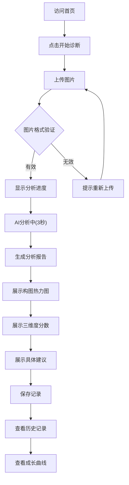

## 1. 产品概述

**丹青有AI**是一个专为高校艺术教育场景设计的AI作业诊断系统。它不是让AI替学生画画，而是让AI像一位耐心的助教一样，看懂学生的画，指出哪里可以更好，告诉学生具体怎么改。

**核心价值：**
- 为艺术教师减轻批改负担，提供结构化数据支撑教学
- 为学生提供具体的、可操作的作业改进建议
- 帮助学生跟踪个人能力成长曲线

---

## 2. 核心功能

### 2.1 用户角色

| 角色 | 核心权限 |
|------|----------|
| 艺术教师 | 查看学生作业分析报告、补充个性化指导、查看班级整体数据 |
| 艺术专业学生 | 上传作业图片、获取AI分析报告、查看历史分析记录、查看个人成长曲线 |
| 非艺术专业学生 | 上传作品、获取AI分析报告 |

### 2.2 功能模块

1. **首页**：产品介绍、上传入口、快速开始引导
2. **AI丹青判官**：图片上传、AI分析、分析报告展示（包含构图热力图）
3. **历史记录**：查看过往分析报告、对比改进情况
4. **成长曲线**：个人能力数据分析与可视化

### 2.3 页面详情

| 页面名称 | 模块名称 | 功能描述 |
|----------|----------|----------|
| 首页 | Hero区域 | 产品品牌展示、核心价值介绍、快速上传入口 |
| 首页 | 功能介绍 | 三个分析维度（构图、色彩、原创性）的详细说明 |
| AI分析页 | 上传模块 | 支持拖拽上传和点击选择图片 |
| AI分析页 | 分析进度 | 3秒内完成分析，展示实时进度动画 |
| AI分析页 | 报告展示 | 三个维度的分数和具体建议、构图热力图、整体评分 |
| 历史记录页 | 记录列表 | 按时间排序的分析记录列表 |
| 历史记录页 | 详情查看 | 查看单次分析的完整报告 |
| 成长曲线页 | 数据可视化 | 构图、色彩、原创性三维度的能力成长曲线 |

---

## 3. 核心流程

**用户核心操作流程：**

1. 用户访问首页，点击"开始诊断"按钮
2. 用户上传作业图片（支持拖拽或点击选择）
3. 系统显示分析进度动画（约3秒）
4. 系统生成结构化分析报告：
   - 构图分析：分数 + 具体建议 + 构图热力图
   - 色彩分析：分数 + 具体建议
   - 原创性分析：分数 + 具体建议
5. 用户可以保存报告或查看历史记录
6. 用户可以查看个人能力成长曲线

---

## 4. 用户界面设计

### 4.1 设计风格

- **主色调**：中国传统水墨色系 - 墨黑(#1a1a1a)、宣纸白(#f5f2eb)、朱砂红(#c41e3a)、石青(#2e5fa1)
- **辅助色**：金色(#d4af37)用于强调和评分展示
- **按钮风格**：圆角矩形，悬停时有轻微阴影和缩放效果
- **字体**：标题使用"Noto Serif SC"书法风格字体，正文使用"Noto Sans SC"
- **布局风格**：卡片式布局，留白充足，营造艺术氛围
- **动效**：优雅的过渡动画，分析过程有水墨扩散效果

### 4.2 页面设计概述

| 页面名称 | 模块名称 | UI元素 |
|----------|----------|--------|
| 首页 | Hero区域 | 水墨风格背景、书法字体标题、醒目的开始按钮 |
| 首页 | 功能介绍 | 三个分析维度卡片，悬停时展开详情 |
| AI分析页 | 上传模块 | 大尺寸上传区域，水墨风格边框，拖拽提示 |
| AI分析页 | 分析进度 | 水墨扩散动画，倒计时显示 |
| AI分析页 | 报告展示 | 三列卡片布局，评分圆环，热力图可视化，建议文字 |
| 历史记录页 | 记录列表 | 时间线布局，缩略图预览 |
| 成长曲线页 | 数据可视化 | 折线图，交互式数据点 |

### 4.3 响应式设计

- **桌面端优先**：主设计针对1920x1080分辨率
- **平板适配**：调整卡片布局为两列
- **移动端适配**：单列布局，优化触控交互

### 4.4 设计亮点

- 融入中国传统水墨画美学元素
- 评分系统采用书法风格数字
- 构图热力图采用水墨晕染效果展示视觉焦点
- 分析进度动画模拟墨水在宣纸上扩散的效果
