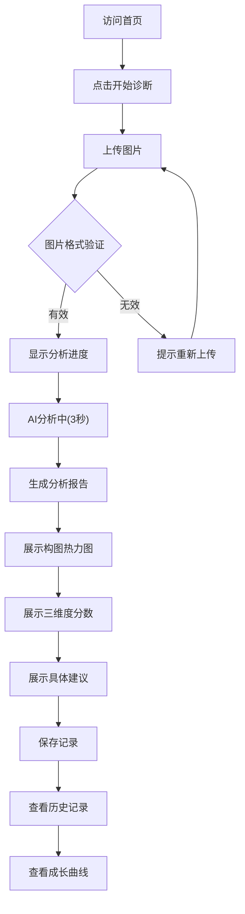
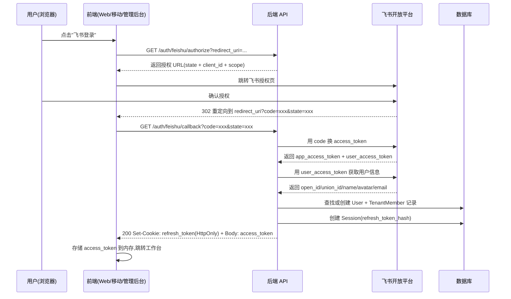
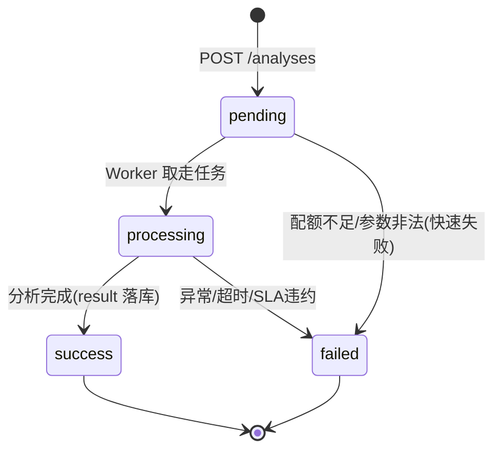

## 1. 产品概述

**丹青有AI**是一个专为高校艺术教育场景设计的AI作业诊断系统。它不是让AI替学生画画，而是让AI像一位耐心的助教一样，看懂学生的画，指出哪里可以更好，告诉学生具体怎么改。

**核心价值：**
- 为艺术教师减轻批改负担，提供结构化数据支撑教学
- 为学生提供具体的、可操作的作业改进建议
- 帮助学生跟踪个人能力成长曲线

---

## 2. 核心功能

### 2.1 用户角色

| 角色 | 核心权限 |
|------|----------|
| 艺术教师 | 查看学生作业分析报告、补充个性化指导、查看班级整体数据 |
| 艺术专业学生 | 上传作业图片、获取AI分析报告、查看历史分析记录、查看个人成长曲线 |
| 非艺术专业学生 | 上传作品、获取AI分析报告 |

### 2.2 功能模块

1. **首页**：产品介绍、上传入口、快速开始引导
2. **AI丹青判官**：图片上传、AI分析、分析报告展示（包含构图热力图）
3. **历史记录**：查看过往分析报告、对比改进情况
4. **成长曲线**：个人能力数据分析与可视化

### 2.3 页面详情

| 页面名称 | 模块名称 | 功能描述 |
|----------|----------|----------|
| 首页 | Hero区域 | 产品品牌展示、核心价值介绍、快速上传入口 |
| 首页 | 功能介绍 | 三个分析维度（构图、色彩、原创性）的详细说明 |
| AI分析页 | 上传模块 | 支持拖拽上传和点击选择图片 |
| AI分析页 | 分析进度 | 3秒内完成分析，展示实时进度动画 |
| AI分析页 | 报告展示 | 三个维度的分数和具体建议、构图热力图、整体评分 |
| 历史记录页 | 记录列表 | 按时间排序的分析记录列表 |
| 历史记录页 | 详情查看 | 查看单次分析的完整报告 |
| 成长曲线页 | 数据可视化 | 构图、色彩、原创性三维度的能力成长曲线 |

---

## 3. 核心流程

**用户核心操作流程：**

1. 用户访问首页，点击"开始诊断"按钮
2. 用户上传作业图片（支持拖拽或点击选择）
3. 系统显示分析进度动画（约3秒）
4. 系统生成结构化分析报告：
   - 构图分析：分数 + 具体建议 + 构图热力图
   - 色彩分析：分数 + 具体建议
   - 原创性分析：分数 + 具体建议
5. 用户可以保存报告或查看历史记录
6. 用户可以查看个人能力成长曲线



---

## 4. 用户界面设计

### 4.1 设计风格

- **主色调**：中国传统水墨色系 - 墨黑(#1a1a1a)、宣纸白(#f5f2eb)、朱砂红(#c41e3a)、石青(#2e5fa1)
- **辅助色**：金色(#d4af37)用于强调和评分展示
- **按钮风格**：圆角矩形，悬停时有轻微阴影和缩放效果
- **字体**：标题使用"Noto Serif SC"书法风格字体，正文使用"Noto Sans SC"
- **布局风格**：卡片式布局，留白充足，营造艺术氛围
- **动效**：优雅的过渡动画，分析过程有水墨扩散效果

### 4.2 页面设计概述

| 页面名称 | 模块名称 | UI元素 |
|----------|----------|--------|
| 首页 | Hero区域 | 水墨风格背景、书法字体标题、醒目的开始按钮 |
| 首页 | 功能介绍 | 三个分析维度卡片，悬停时展开详情 |
| AI分析页 | 上传模块 | 大尺寸上传区域，水墨风格边框，拖拽提示 |
| AI分析页 | 分析进度 | 水墨扩散动画，倒计时显示 |
| AI分析页 | 报告展示 | 三列卡片布局，评分圆环，热力图可视化，建议文字 |
| 历史记录页 | 记录列表 | 时间线布局，缩略图预览 |
| 成长曲线页 | 数据可视化 | 折线图，交互式数据点 |

### 4.3 响应式设计

- **桌面端优先**：主设计针对1920x1080分辨率
- **平板适配**：调整卡片布局为两列
- **移动端适配**：单列布局，优化触控交互

### 4.4 设计亮点

- 融入中国传统水墨画美学元素
- 评分系统采用书法风格数字
- 构图热力图采用水墨晕染效果展示视觉焦点
- 分析进度动画模拟墨水在宣纸上扩散的效果

---

## 5. Phase 1 扩展需求(2026-07-27 增补)

> 本章在 MVP 基础上补齐 Phase 1 所需的飞书登录、多租户、AI 分析任务调度、多端协议四类需求细节,作为 API 契约与数据模型设计的依据。MVP 阶段(第 1-4 节)的需求继续有效,本章仅做增量补充。

### 5.1 飞书登录场景

#### 5.1.1 用户故事

| 编号 | 角色 | 故事 | 验收标准 |
|---|---|---|---|
| US-AUTH-01 | 高校教师 | 我希望用学校飞书账号一键登录,无需再记一套密码 | 点击"飞书登录"按钮,完成授权后直接进入工作台 |
| US-AUTH-02 | 高校学生 | 我希望登录后系统自动识别我所在的学院和班级 | 首次登录自动创建/加入对应租户,无需手动选择 |
| US-AUTH-03 | 多端用户 | 我希望在 Web、移动端、管理后台用同一飞书账号登录 | 三端共用同一 OAuth 应用,union_id 打通身份 |
| US-AUTH-04 | 已登录用户 | 我希望关闭浏览器后下次访问不必重新登录 | access_token 过期后用 refresh_token 静默续期,7 天内免登录 |
| US-AUTH-05 | 安全敏感用户 | 我希望可以主动登出并撤销所有会话 | 登出后 refresh_token 立即失效,其他设备会话一并撤销 |

#### 5.1.2 登录流程



#### 5.1.3 多端登录支持

| 端 | OAuth 重定向 URL | 登录入口 |
|---|---|---|
| Web 应用 | `https://{domain}/auth/feishu/callback` | 顶部导航"飞书登录"按钮 |
| 管理后台 | `https://admin.{domain}/auth/feishu/callback` | 登录页"飞书登录"按钮 |
| 移动端 App | `danqingai://auth/feishu/callback`(Deep Link) | 登录页"飞书登录"按钮 |

三端共用同一飞书自建应用(App ID: `cli_xxx`,7 项权限已开通),通过 `union_id` 打通用户身份。同一用户在三端登录后产生独立的 Session 记录,但共享同一 User 实体。

#### 5.1.4 会话与令牌策略

| 项 | 策略 |
|---|---|
| access_token 签名算法 | JWT RS256(非对称,私钥签发,公钥校验) |
| access_token 有效期 | 15 分钟 |
| refresh_token 有效期 | 7 天 |
| refresh_token 存储位置 | HttpOnly + Secure + SameSite=Lax Cookie |
| refresh_token 安全 | 数据库仅存 SHA-256 哈希,不存明文 |
| 续期机制 | access_token 过期后前端用 `/auth/refresh` 静默换新 |
| 撤销机制 | 登出时将 Session.revoked_at 置为当前时间,refresh_token 立即失效 |
| 多设备会话 | 每次登录产生独立 Session,可"踢出其他设备" |

#### 5.1.5 首次登录的租户归属决策

用户首次飞书登录后,系统按以下优先级决定其租户归属:

1. 若飞书返回 `tenant_key` 已在 Tenant 表登记 → 自动加入该租户,角色默认"学生"
2. 若 `tenant_key` 未登记但邮箱属于已配置高校域名 → 创建新租户(类型"学校"),用户角色"管理员"
3. 若以上均不匹配 → 创建"个人租户"(type=individual),用户角色"管理员",plan=免费版

### 5.2 多租户场景

#### 5.2.1 租户模型

| 租户类型 | 说明 | 创建方式 | 默认 plan |
|---|---|---|---|
| school | 学校级租户 | 首次登录时按邮箱域名自动创建,或管理员手动创建 | 院校版 |
| college | 学院级租户 | 学校管理员创建,归属于某 school | 院校版 |
| class | 班级级租户 | 教师/管理员创建,归属于某 college | 标准版 |
| individual | 个人租户 | 用户首次登录无组织归属时自动创建 | 免费版 |

租户之间存在层级关系(class → college → school),通过 `parent_id` 表达。查询数据时默认仅查当前租户,管理员可向上追溯下级租户聚合数据。

#### 5.2.2 角色体系

| 角色 | 适用租户类型 | 核心权限 |
|---|---|---|
| admin(管理员) | school/college | 管理租户成员、查看聚合数据、配置订阅、邀请教师 |
| teacher(教师) | college/class | 创建班级、邀请学生、查看班级学生作业、补充个性化指导 |
| student(学生) | class/individual | 上传作业、查看自己的分析报告与成长曲线 |
| owner(所有者) | individual | 管理个人租户全部资源(等同 admin) |

一个用户在同一租户中只能有一个角色;在不同租户中可有不同角色(如张老师在 A 学院是 teacher,在 B 班级是 student)。

#### 5.2.3 租户隔离规则

- 所有业务表(Analysis、Artwork 等)强制包含 `tenant_id` 字段
- Repository 层所有查询必须带 `WHERE tenant_id = ?` 条件,禁止跨租户查询(管理员聚合查询除外,且需显式声明)
- 写操作必须校验当前用户属于目标 `tenant_id` 且有相应角色权限
- 多租户中间件从 JWT 中解析 `tenant_id` 注入请求上下文,Repository 从上下文取值

#### 5.2.4 订阅计划

| plan | 价格 | 月分析次数 | 并发分析 | 成员席位 | 数据保留 |
|---|---|---|---|---|---|
| free(免费版) | 0 元 | 50 次/月 | 1 | 1(仅个人) | 30 天 |
| standard(标准版) | 99 元/月 | 2000 次/月 | 5 | 50 | 1 年 |
| enterprise(院校版) | 999 元/月 | 无限 | 20 | 500 | 永久 |

订阅状态由管理后台维护,API 在提交分析任务时校验配额(见 5.3)。

### 5.3 AI 分析任务调度场景

#### 5.3.1 同步与异步混合模式

3 秒 SLA 是硬约束,但真实图像分析(图像预处理 + 特征提取 + 维度分析 + 综合评估)可能超时。采用混合模式:

| 模式 | 触发条件 | 行为 |
|---|---|---|
| 同步模式 | 预估耗时 < 2.5 秒(基于图片大小与历史 P95) | POST /analyses 直接返回最终结果,HTTP 200 |
| 异步模式 | 预估耗时 ≥ 2.5 秒,或队列积压 | POST /analyses 立即返回 `status=processing` + `analysis_id`,前端轮询 GET /analyses/:id |

前端优先尝试同步,若返回 `status=processing` 则切换为轮询(间隔 500ms,最多轮询 6 次,即 3 秒内必须有最终结果或失败)。

#### 5.3.2 任务状态机



| 状态 | 含义 | 是否终态 |
|---|---|---|
| pending | 已入队,等待 Worker 处理 | 否 |
| processing | Worker 正在分析 | 否 |
| success | 分析成功,result 已生成 | 是 |
| failed | 分析失败(超时/异常/配额) | 是 |

#### 5.3.3 3 秒 SLA 保障策略

| 层级 | 措施 | 目标 |
|---|---|---|
| 入口 | 配额预检 + 图片预处理(缩放至 ≤ 1024px) | < 200ms |
| 队列 | Redis 队列 + Worker 池(默认 4 并发) | 排队 < 500ms |
| 模型 | 模型推理超时硬限 2 秒,超时降级返回 cached/简化结果 | 推理 < 2s |
| 降级 | 超时返回 `failed` + 错误码 6002,提示用户重试 | 兜底 |
| 监控 | 每次分析记录 `duration_ms`,P95 > 2.8s 触发告警 | 可观测 |

#### 5.3.4 配额校验流程

```
提交分析任务 → 查询租户当月已用次数 → 对比 plan 限额
  → 不足:返回 code=6001(配额已满)
  → 充足:扣减配额(Redis 原子计数) → 入队 → 返回 analysis_id
```

配额按租户月度计算,每月 1 日 0 点重置。免费版用户配额耗尽后引导升级。

### 5.4 多端协议

#### 5.4.1 端矩阵与共享契约

| 端 | 技术栈 | 状态 | API 消费方式 |
|---|---|---|---|
| Web 应用(学生/教师) | React 18 + Vite + TS | 已有原型,Phase 1 接入后端 | RESTful + 共享 TS 类型 |
| 产品官网 | Next.js 14 | 待开发(Phase 3) | 仅消费公开内容接口 |
| 移动端 App | React Native | 待开发(Phase 3) | RESTful + 共享 TS 类型 |
| 管理后台 | Ant Design Pro | 待开发(Phase 3) | RESTful + 共享 TS 类型 |

#### 5.4.2 类型单一真相源

- 跨端共享的 TypeScript 类型定义由本架构师维护,存放于后端 `server/src/types/api-contract.ts`
- 通过 sync 脚本(Phase 1 由 backend-service 实现)将类型同步到各端 `src/types/api-contract.ts`
- **禁止各端独立修改跨端类型**,发现缺失字段需提 issue 到 product-architect 仲裁后统一更新
- 本契约文档(api-contract-v1.md)为类型定义的人类可读副本,代码与文档冲突时以代码为准,但需同步更新文档

#### 5.4.3 API 调用约定

- 所有端统一通过 `Authorization: Bearer {access_token}` 头部鉴权
- 所有端统一处理 `{code, message, data, traceId}` 响应,`code !== 0` 视为业务错误
- `code === 2002`(token 过期)时自动调用 `/auth/refresh`,刷新后重放原请求
- `code === 2003`(refresh_token 无效)时跳转登录页
- 所有错误展示统一使用 Toast,禁止 alert/prompt/confirm

### 5.5 Phase 1 范围与非目标

#### 5.5.1 Phase 1 范围(In Scope)

- 飞书 OAuth 登录全链路(Web + 管理后台回调)
- 后端分层架构重构(controller/service/repository)
- User / Session / Tenant / TenantMember / Analysis 数据模型与 Prisma schema
- JWT RS256 签发与 refresh_token 续期
- 多租户中间件与 tenant_id 强制过滤
- /analyses 接口(同步 + 异步混合模式)
- 跨端 TypeScript 类型定义与 sync 脚本

#### 5.5.2 Phase 1 非目标(Out of Scope)

- 移动端 App 与产品官网(Phase 3)
- 真实图像分析模型接入(Phase 2,MVP 仍用 mock)
- 订阅支付与计费(Phase 2)
- 管理后台完整功能(Phase 3,Phase 1 仅支持登录)
- 班级/学院层级聚合查询(Phase 2)

---

## 6. 非功能性需求

### 6.1 性能

| 指标 | 目标 |
|---|---|
| AI 分析 P95 延迟 | ≤ 3 秒(SLA 硬约束) |
| API 网关延迟(P95) | ≤ 200ms(不含 AI 分析) |
| 前端首屏 LCP | ≤ 2 秒 |
| 并发分析任务(单租户) | 标准 5 / 院校版 20 |

### 6.2 安全

- JWT RS256 非对称加密,私钥仅存后端,公钥可下发各端校验
- refresh_token 仅存 SHA-256 哈希,HttpOnly Cookie 传输
- 禁止 URL 参数传递 token
- 禁止日志输出 access_token / refresh_token / App Secret
- 所有写操作校验 CSRF(同源 + SameSite Cookie)
- 文件上传白名单:JPEG/PNG/WebP/BMP,≤ 10MB
- 生产环境禁用 SQLite,强制 PostgreSQL

### 6.3 可观测性

- 每个响应包含 `traceId`(UUID v4),贯穿日志/链路追踪
- AI 分析记录 `duration_ms`,按租户/艺术类型聚合统计
- 错误日志包含 traceId + user_id + tenant_id,便于排查
- Phase 1 暂用 console + 结构化 JSON 日志,Phase 2 接入 OpenTelemetry

### 6.4 兼容性

- 前端:Chrome 100+ / Edge 100+ / Safari 15+ / 移动端 Safari 15+
- 后端:Node.js 18 LTS+
- 数据库:PostgreSQL 14+
- 缓存:Redis 6+
