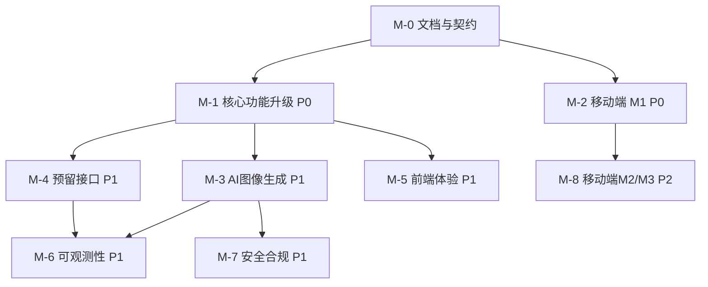

# 丹青有AI · 系统功能全面升级优化方案总结

> **文档版本**：v1.0.0
> **生成时间**：2026-08-06
> **文档状态**：待评审（评审通过后按里程碑分派实施）
> **维护人**：产品架构协调中枢（product-architect）
> **依据文档**：`implementation-source-of-truth.md`（系统真源）、`project-context.md`（产品背景）、`new-features-design.md`（Phase 5 设计）、`context-log-2026-08-06.md`（部署日志同步）、`deploy-runbook-danqing.md`（生产运维手册）
> **适用范围**：Web 应用 / 管理后台 / 移动端 / 品牌官网 / 后端服务 五端

---

## 目录

1. [功能升级的背景与目标](#一功能升级的背景与目标)
2. [具体优化内容与技术实现路径](#二具体优化内容与技术实现路径)
3. [预期效果与关键指标](#三预期效果与关键指标)
4. [实施计划与资源需求](#四实施计划与资源需求)
5. [潜在风险与应对策略](#五潜在风险与应对策略)
6. [关键指标汇总表](#六关键指标汇总表)
7. [里程碑时间表](#七里程碑时间表)

---

## 一、功能升级的背景与目标

### 1.1 现状剖析

丹青有AI 已形成完整的五端产品矩阵，核心业务链路（飞书登录 → 作品上传 → 3 秒 AI 诊断 → 报告展示 → 成长追踪）已跑通并投入生产。

| 维度 | 现状 | 证据来源 |
|------|------|---------|
| 后端分层 | Routes → Controller → Service → Repository，Prisma 19 模型（18 业务 + DeploymentLog） | 真源 §2.2 / §7 |
| 认证体系 | 飞书 OAuth + JWT(RS256) + Redis 会话 + CSRF 双提交；Phase5 已扩展 phone/invitation/password | 真源 §8 |
| AI 分析 | Jimp 像素 + GLM-4V 视觉混合，3 秒 SLA，GLM/TRAE 双提供商降级，55 条模板规则，Redis 缓存 | 真源 §9 |
| 已实现功能 | AI 诊断（四种形态）/ 素材库 / 风格库 / 灵感嫁接 / 情绪画布 / 成长曲线 / 订阅计费 / 通知系统 / 评分预设 / 多评委仲裁 / 管理后台 / 部署日志同步 | 真源 §1.2 / §15.1 |
| 测试质量 | 889/889 通过，tsc 0 错误 | 真源 §14.7 |
| 生产部署 | 腾讯云 43.128.25.202，www.danqing.site，Nginx+PM2+Docker(PG15/Redis7) | Runbook §1 |

### 1.2 痛点分析

在代码审查与用户模拟测试中，识别出以下与"多端矩阵 + 完整教学闭环"目标不匹配的缺口：

| 编号 | 痛点 | 现状 | 影响 | 紧急度 |
|------|------|------|------|:-----:|
| P-01 | 移动端功能不完整 | `mobile/` 仅占位（`profile.tsx:64`），未覆盖 Web 核心功能 | 移动教学场景缺失，无法触达"边走边评"场景 | 高 |
| P-02 | AI 图像生成未集成 | 仅诊断，无"从草稿生成参考图"能力 | 与"课堂素材/风格转换"产品叙事脱节 | 高 |
| P-03 | Phase5 预留接口 501 | `knowledge`/`modules`/`ui`/`config` 四路由返回 501 | 预留能力搁置，无法支撑后续扩展 | 中 |
| P-04 | 租户级仲裁配置覆盖未实现 | `arbitration-default.ts:66` TODO | 院校无法自定义评审标准，减弱 B 端适配性 | 中 |
| P-05 | 管理后台二次验证未完善 | `ConfirmAction/index.tsx:4` | 敏感操作（锁定/删除/退款）缺确认，误操作风险 | 高 |
| P-06 | 前端批量删除依赖本地缓存 | `data-service.ts:415` | 跨端数据不一致，删除状态不可靠 | 中 |
| P-07 | AI 图像生成与诊断链路未打通 | 无"生成→诊断→批改"闭环 | 教学完整度不足 | 中 |
| P-08 | 可观测性停留在基础层 | 仅健康检查 + PM2 日志 + 部署日志同步 | 无法定位 AI 降级率、SLA 达标率、成本 | 中 |

### 1.3 升级目标

围绕"**每位学生被看见、每位教师被减负**"的产品理念，设定五大升级目标：

| 目标编号 | 目标 | 对齐痛点 |
|---------|------|---------|
| G1 | 补齐移动端，实现五端功能对齐 | P-01 |
| G2 | 集成 AI 图像生成，打通"生成→诊断→批改"教学闭环 | P-02 / P-07 |
| G3 | 实现 Phase5 预留接口（knowledge/ui/config），支撑模块化扩展 | P-03 |
| G4 | 落地租户级仲裁配置覆盖 + 管理后台二次验证，强化 B 端治理 | P-04 / P-05 |
| G5 | 修复跨端数据一致性（批量删除），建设可观测性体系 | P-06 / P-08 |

### 1.4 北极星指标

> **北极星指标：X 端月活跃作品诊断数（WAU）** —— 衡量"学生作业被 AI 看见"的核心价值频率。

配套护栏指标（guardrail，防止为达标而牺牲质量）：

| 护栏指标 | 目标 |
|---------|------|
| AI 分析 3 秒 SLA 达标率 | ≥ 99% |
| AI 双提供商降级可用率 | 100%（主降级不可阻断） |
| 多租户隔离违规事件 | 0 |
| 测试通过率 | 保持 100%（889 + 新增） |
| 生产可用性 | ≥ 99.9% |

---

## 二、具体优化内容与技术实现路径

> 优先级定义：
> - **P0（推荐优先实施）**：直接影响核心价值、安全或 SLA 的项，一个迭代（≤2 周）内完成。
> - **P1（分阶段推进）**：提升完整度与体验的项，紧随 P0 之后。
> - **P2（持续演进）**：长期优化项，随版本迭代逐步推进。

### 2.1 模块一：核心功能升级（P0）

#### 2.1.1 租户级仲裁配置覆盖（对齐 P-04）

**现状**：仲裁参数（触发阈值、评委权重、边界规则）为系统全局默认值，`arbitration-default.ts:66` 存在 TODO，租户无法自定义。

**技术方案**：
1. **数据模型增量**：在 `Tenant` 模型新增 `arbitrationConfig Json?` 字段（`@map("arbitration_config")`），存储租户级覆盖配置；`null` 时回退系统默认 `DEFAULT_ARBITRATION_CONFIG`。
2. **配置合并器**：新增 `arbitration.service.ts` 的 `resolveConfig(tenantId)`，采用**深度合并**（租户覆盖 → 系统默认），避免缺失字段导致运行时错误。
3. **管理后台开放**：新增 `/api/admin/tenants/:id/arbitration-config`（GET/PUT），仅 `admin`/`owner` 可读写；写入时做 Zod 全量校验 + 权重归一化校验（总和=1）。
4. **审计记录**：配置变更写入 `AuditLog`（auditAction=update），保证可追溯。

**影响评估**：
- 数据模型变更（新增 Tenant 字段）→ 需 `prisma migrate`，**向后兼容**（现有租户 config 为 null，走默认值）。
- 无需灰度脚本，天然渐进生效。

**验收标准**：租户 A 配置自定义阈值后，A 租户争议触发按新配置，B 租户仍走默认；未配置时行为与现状完全一致；权限校验通过。

#### 2.1.2 管理后台二次验证完善（对齐 P-05）

**现状**：`ConfirmAction/index.tsx:4` 仅有基础确认弹窗，高风险操作（用户锁定、批量删除、退款、撤销 API Key）缺少强确认。

**技术方案**：
1. **分级确认机制**：将 `ConfirmAction` 升级为三级确认强度：
   - 常规（默认）：普通确认弹窗。
   - 敏感：需输入"删除/锁定"等关键字才能确认。
   - 高危：需二次输入当前管理员密码（后端校验 `password` 与 `passwordHash`）。
2. **后端同步校验**：`/api/admin/*` 高危接口（delete/batch/refund/revoke/lock）增加 `X-Confirm-Password` 头或请求体字段，Controller 校验通过后方可执行。
3. **组件复用**：`ConfirmAction` 改为受控组件，暴露 `dangerLevel` / `requireKeyword` / `requirePassword` props，供各页面复用。

**影响评估**：
- 仅前端组件 + 后端高危接口校验，无数据模型变更。
- 密码校验需复用 bcrypt，不引入新依赖。

**验收标准**：高危操作未输入关键字/密码时被阻断；正确的确认流程可完成操作；普通操作不受影响。

#### 2.1.3 前端批量删除跨端一致性（对齐 P-06）

**现状**：`data-service.ts:415` 批量删除依赖本地缓存，删除后跨端（Web/mobile/admin）状态不一致。

**技术方案**：
1. **后端批删原子化**：新增 `POST /api/v1/analyses/batch-delete`（或复用现有批量接口），接收 `{ ids: string[] }`，事务内校验所有 id 归属当前租户，返回 `{ deleted, failed }`。
2. **前端缓存失效**：批删成功后，前端调用 `invalidateQueries(['analyses'])` 或清空对应分页缓存，改为服务端为准。
3. **乐观更新 + 回滚**：前端先乐观移除本地行，若后端返回失败则回滚并 toast 提示，保证 UX 与数据一致性平衡。

**影响评估**：
- 新增后端接口，无数据模型变更。
- 需同步更新 `api-contract.ts` 类型（跨端共享主副本），禁止任一端独立修改。

**验收标准**：Web 删除后，mobile/admin 查询不到已删记录；删除失败时本地行回滚；跨端数据一致。

### 2.2 模块二：移动端补齐（P0）

#### 2.2.1 移动端功能对齐（对齐 P-01）

**现状**：`mobile/`（React Native）仅有占位个人页，未覆盖 Web 核心功能。

**技术方案（分阶段）**：

| 阶段 | 覆盖功能 | 说明 |
|------|---------|------|
| M1 | 登录 + 作品上传/诊断 + 报告查看 | 复用 `api-contract.ts` 共享类型，打通核心闭环 |
| M2 | 历史记录 + 成长曲线 + 素材库浏览 | 覆盖教学高频场景 |
| M3 | 风格库 + 灵感嫁接 + 情绪画布 + 通知 | 全功能对齐 |

**关键技术点**：
- **认证适配**：沿用真源 §8.1 的 mobile 差异——refresh_token 走响应体返回（expo-secure-store 存储），CSRF 用 `X-CSRF-Token` 头。
- **共享类型**：从 `server/src/types/api-contract.ts` 生成 TS 类型供 React Native 引用，**禁止移动端独立定义跨端类型**（遵循文件范围约束与真源约束）。
- **图片上传**：移动端拍照/相册 → multipart 上传 `/api/v1/analyses/upload`，复用现有 Jimp+AI 混合分析链路。
- **3 秒 SLA 移动端体验**：上传前本地压缩（限制 ≤10MB，`UPLOAD_MAX_SIZE`），上传后展示 5 阶段分析动画（复用 Web 的 `getStageDetails` 语术体系）。

**影响评估**：
- 纯增量开发，无后端数据模型变更。
- 移动端复用现有 API，不新增跨端接口；若需新增接口（如移动端专属 OAuth 回调）须先更新 `api-contract.ts`。

**验收标准**：移动端完成登录 → 上传 → 诊断 → 报告全流程；与 Web 查询结果一致；3 秒 SLA 达标。

### 2.3 模块三：AI 能力增强（P1）

#### 2.3.1 AI 图像生成集成（对齐 P-02 / P-07）

**现状**：系统仅支持"诊断已有作品"，无"由文字/草图生成参考图"能力。真源 §15.3 已记录"弃用 Wikimedia 图片，改用 TRAE 内置图像生成"的技术决策，即图像生成能力已具备接入基础。

**技术方案**：
1. **新增生成服务**：`server/src/services/image-generation.service.ts`，接入 TRAE/GLM 的图像生成端点（OpenAI 兼容协议，与现有 AI 模块一致）。
2. **双提供商降级**：复用真源 §9.2 的降级策略——`AI_IMAGE_PROVIDER` 主（trae）失败时自动降级（glm），保证生成可用性。
3. **生成接口**：
   - `POST /api/v1/generation`（提交生成任务，返回任务 id）
   - `GET /api/v1/generation/:id`（轮询结果，含生成图 URL）
4. **教学闭环打通**：生成图直接进入诊断链路——前端"生成参考图"后一键"提交诊断"，复用 `analysis.service.runAnalysis()`，形成"生成 → 诊断 → 批改"闭环。
5. **配额与计费**：生成任务计入 `AiUsageLog`（新增 `usageType=generation`），与现有订阅配额体系对齐，防止滥用。

**影响评估**：
- 新增 `AiUsageLog.usageType` 枚举值（`diagnose`/`generate`），需 minor 迁移，向后兼容。
- 新接口走统一 `ApiResponse` 格式，新增 `ErrorCode`（如 `GENERATION_*`），需同步 `api-contract.ts`。
- 生成能力涉及外部 API 调用与计费，**必须做配额限制**避免成本失控。

**验收标准**：文字/草图可生成参考图；生成失败自动降级；生成计入配额；生成图可一键进入诊断；成本可控（有配额护栏）。

#### 2.3.2 Phase5 预留接口实现（对齐 P-03）

**现状**：`knowledge`（知识库检索）、`ui`（UI 配置）、`config`（功能参数/特性开关）三路由返回 501；`modules`（模块化扩展）建议保留为扩展框架。

**技术方案（按优先级）**：

| 路由 | 实现策略 | 优先级 |
|------|---------|:-----:|
| `/api/v1/config` | 实现特性开关（feature flag）+ 公开配置读取，支撑灰度 | P1 |
| `/api/v1/ui` | 实现租户级 UI 配置读取（主题/组件开关），与租户仲裁配置同理 | P1 |
| `/api/v1/knowledge` | 基于现有 `artworks` 素材库实现关键词检索（先文本检索，后向量检索） | P2 |
| `/api/v1/modules` | 保留为插件式扩展框架，本轮仅定义注册/发现机制，不实现复杂业务 | P2 |

**设计原则**：
- 所有新接口遵循统一 `ApiResponse` 格式与 `ErrorCode` 体系。
- 新类型追加到 `api-contract.ts`（不修改现有类型，遵循真源 §6 追加原则）。
- `config`/`ui` 的租户级覆盖复用"租户配置深合并"模式（与 §2.1.1 一致）。

**影响评估**：
- 无数据模型变更（`ui`/`config` 覆盖可存 `Tenant` 已有 Json 字段或新增字段）。
- 接口从 501 变为可用，属**能力激活**，不破坏现有调用（此前无调用方）。

**验收标准**：`/api/v1/config` 返回可用的特性开关；`/api/v1/ui` 返回租户 UI 配置；`knowledge` 关键词检索可用；`modules` 有注册/发现机制定义。

### 2.4 模块四：前端体验（P1）

#### 2.4.1 Web 端体验与性能优化（对齐真源 §14.5 V2 任务包）

**现状**：V2-C（全局交互）、V2-D（性能优化）、V2-E（测试覆盖）为已规划未完成的长期优化项。

**技术方案**：

| 任务 | 内容 | 优先级 |
|------|------|:-----:|
| V2-C | Toast / 骨架屏 / 错误边界全局统一（已有基础组件，补齐覆盖） | P1 |
| V2-D | bundle 分析（vite-bundle-analyzer）、路由懒加载、memoization | P1 |
| V2-E | 核心页面组件测试覆盖（act 测试、快照） | P2 |

**技术点**：
- **懒加载**：核心诊断页 `/analyze` 保持首屏完整，其余页面（素材库/风格库/情绪画布）改为 `React.lazy` 按需加载。
- **memoization**：对 `HeatmapCanvas`、成长曲线 `Recharts` 组件做 `React.memo` + `useMemo`，减少重绘。
- **Bundle 目标**：首屏 JS ≤ 250KB（gzip），Lighthouse 性能分 ≥ 90。

**影响评估**：纯前端优化，无后端变更；需回归测试保证 9 个页面无功能问题。

**验收标准**：首屏加载时间下降 ≥ 30%；Lighthouse 性能分 ≥ 90；核心页面无回归。

### 2.5 模块五：运维与可观测性（P1）

#### 2.5.1 可观测性体系建设（对齐 P-08）

**现状**：仅有健康检查（`/health`）、PM2 日志、`deployment_logs` 部署日志同步；缺少业务级与 AI 级指标。

**技术方案**：
1. **业务指标采集**：在 `api-contract.ts` 新增 `OperationalMetrics` 类型，后端按分钟聚合以下指标：
   - AI 分析 SLA 达标率（`durationMs ≤ 3000` 占比）
   - AI 降级率（`aiFallback` 次数占比，区分 Jimp-only / 模板建议）
   - 双提供商（GLM/TRAE）可用性与切换次数
   - 分析请求量 / 成功率 / 平均耗时
   - AI 成本（`AiUsageLog` 聚合，按租户/按天）
2. **指标查询接口**：`GET /api/admin/metrics/ai`、`GET /api/admin/metrics/sla`（仅供管理后台，IP 白名单 + admin 鉴权）。
3. **告警通道**：对接 `/api/v1/deployments/latest` 与现有 `alerts.log`，新增"AI 降级率 > X% / SLA 达标率 < Y%"阈值告警（可选接入飞书通知，复用 `notificationService`）。
4. **traceId 全链路**：复用现有 `traceMiddleware`，将 `traceId` 贯通到 AI 调用日志与 `AiUsageLog`，便于端到端排查。

**影响评估**：
- 新增指标聚合逻辑与接口，无数据模型变更（复用现有 `AiUsageLog`/`Analysis`）。
- 聚合采用 Redis 计数器或定时任务，避免实时查询压库。

**验收标准**：管理后台可查看近 7 天 SLA 达标率、AI 降级率、成本趋势；指标可追溯 traceId；告警阈值可配置。

#### 2.5.2 部署与备份强化（对齐硬约束）

**技术方案**：
1. **备份轮次提升**：将数据库备份从"每日全量保留 7 天"提升为"**保留 3-5 轮**完整的全量 + WAL 连续归档"，覆盖升级回滚窗口（见 §5.3）。
2. **灰度发布**：后端引入 `/api/v1/config` 特性开关，对高风险变更（仲裁配置覆盖、AI 生成）做**按租户灰度**，先内部租户后全量。
3. **回滚方案**：为每次涉及数据模型/权限变更的升级预留"迁移前备份 + 回滚迁移脚本"，见 §5.3。

**影响评估**：运维流程调整，无业务代码变更；需在 Runbook 中补充备份轮次与回滚步骤。

### 2.6 模块六：安全合规（P1）

#### 2.6.1 安全加固延续（对齐真源 §13.4）

**技术方案**：
1. **AI 生成内容合规**：生成图与诊断图统一走现有 `ReviewStatus` 内容审核流程，违规标记 `flagged`。
2. **生成接口限流**：`/api/v1/generation` 单独限流（如 5 次/分钟/用户），防滥用与成本攻击。
3. **敏感操作审计**：仲裁配置变更、AI 生成、批删等新操作全部写入 `AuditLog`。
4. **密钥管理**：生产 `AI_API_KEY`/`DEPLOY_SYNC_SECRET` 替换占位符（Runbook §8.2 待办），启用轮换机制。
5. **CORS/Cookie 复核**：确认新接口在白名单内；`COOKIE_SECURE=true` 保持生产强制。

**影响评估**：
- 部分涉及配置（限流、密钥），无数据模型变更。
- 内容审核复用现有 `ReviewStatus`，无新增表。

**验收标准**：生成内容纳入审核；生成接口被限流保护；敏感操作均有审计日志；生产无占位密钥符。

---

## 三、预期效果与关键指标

### 3.1 功能升级预期效果

| 模块 | 升级前 | 升级后 | 对齐痛点 |
|------|--------|--------|---------|
| 核心功能 | 仲裁配置全局固定、高危操作无强确认、批删依赖缓存 | 租户可自定义仲裁、高危操作强确认、批删服务端一致 | P-04/05/06 |
| 移动端 | 仅占位页 | 全功能对齐，移动教学闭环打通 | P-01 |
| AI 能力 | 仅诊断 | 生成→诊断→批改闭环 | P-02/07 |
| 预留接口 | 501 | 可用（config/ui/knowledge/modules 框架） | P-03 |
| 前端体验 | 首屏未优化 | 首屏 ≤250KB，Lighthouse ≥90 | 性能 |
| 可观测性 | 仅健康检查 | SLA/降级/成本/可用性全量指标 | P-08 |
| 安全合规 | 生成无审核、无生成限流 | 内容审核 + 限流 + 审计 + 密钥轮换 | 合规 |

### 3.2 关键量化指标（KPI）

| 一级指标 | 二级指标 | 当前基线 | 目标值 | 衡量方式 |
|---------|---------|---------|--------|---------|
| 北极星 | 移动端月活跃诊断数（WAU） | 0（移动端未上线） | 上线后 ≥ 总量的 30% | 前端埋点 + 后端 `Analysis` 统计 |
| 转化 | 移动端注册→首诊转化率 | - | ≥ 40% | 漏斗分析 |
| 性能 | 首屏 JS 体积 | 待测 | ≤ 250KB(gzip) | vite bundle 分析 |
| 性能 | Lighthouse 性能分 | 待测 | ≥ 90 | Lighthouse CI |
| SLA | AI 3 秒 SLA 达标率 | 待建基线 | ≥ 99% | 后端 `durationMs` 聚合 |
| 可用性 | AI 降级可用率 | 100% | 100% | 降级次数 / 总请求 |
| 成本 | 单次 AI 诊断成本 | 待测 | 建立基线后 -10% | `AiUsageLog` 聚合 |
| 覆盖率 | 移动端功能覆盖 | - | 100%（三阶段后） | 功能清单比对 |
| 质量 | 测试通过率 | 889/889 | 100%（含新增） | Vitest |
| 安全 | 多租户隔离违规 | 0 | 0 | 安全审计 |
| 安全 | 生产可用性 | - | ≥ 99.9% | 健康检查 SLA |

---

## 四、实施计划与资源需求

### 4.1 分阶段里程碑与依赖关系

| 里程碑 | 阶段 | 内容 | 依赖 | 优先级 |
|--------|------|------|------|:-----:|
| M-0 | 前置 | 文档评审 + 更新 `prd.md`/`tech_arch.md` + `api-contract.ts` 类型契约 | - | P0 |
| M-1 | P0 | 核心功能升级（仲裁配置覆盖 + 二次验证 + 批删一致性） | M-0 | P0 |
| M-2 | P0 | 移动端 M1（登录/上传/诊断/报告） | M-0 | P0 |
| M-3 | P1 | AI 图像生成 + 教学闭环 | M-1（配额/审计） | P1 |
| M-4 | P1 | Phase5 预留接口（config/ui 先行） | M-1（租户配置模式） | P1 |
| M-5 | P1 | 前端体验优化（懒加载/memo） | M-1 | P1 |
| M-6 | P1 | 可观测性体系 + 备份/灰度/回滚强化 | M-3/M-4（指标来源） | P1 |
| M-7 | P1 | 安全合规（内容审核/限流/密钥轮换） | M-3 | P1 |
| M-8 | P2 | 移动端 M2/M3 + knowledge 检索 + 测试覆盖 | M-2 | P2 |

**依赖关系图（Mermaid）**：

### 4.2 人力需求

| 角色 | 职责 | 人力（人） | 对应 M 里程碑 |
|------|------|:---:|:---:|
| 产品架构协调中枢 | 文档/契约/跨端协调/仲裁 | 1 | 全程 |
| backend-service | 仲裁配置、批删、生成服务、预留接口、可观测性、安全 | 1 | M-1/3/4/6/7 |
| mobile-app | 移动端功能补齐 | 1 | M-2/8 |
| frontend-app | 前端体验优化、批删前端、生成前端 | 1 | M-1/5 |
| admin-dashboard | 仲裁配置后台、二次验证 | 1 | M-1/4 |
| compliance-checker | 安全合规、内容审核、密钥 | 1 | M-7 |
| devops-qa | 备份轮次、灰度、回滚、指标部署 | 1 | M-6 |
| api-test-pro | 全量回归 + 新增接口测试 | 1 | 各里程碑 |

> 说明：采用"一名 agent 多里程碑串行"的编排，实际并发峰值约 4-5 名 agent，可平滑分配到 P0/P1 阶段。

### 4.3 算力资源

| 用途 | 资源 | 说明 |
|------|------|------|
| AI 诊断 | GLM-4V（现有 `AI_API_KEY`） | 已配置，替换占位符 |
| AI 生成 | TRAE 图像生成（`AI_IMAGE_PROVIDER`） | 新增，需申请 API Key 与配额 |
| 降级备用 | GLM 生成（降级） | 复用现有 GLM 凭证 |
| 向量检索（P2） | 视 `knowledge` 需求定 | P2 阶段评估，若引入需向量库资源 |

### 4.4 云资源与预算

| 资源 | 现状 | 增量需求 | 预算（月度） |
|------|------|---------|:---:|
| 腾讯云 VPS | 1 台（43.128.25.202） | 移动端 / 生成并发高峰期评估是否扩容 | 视扩容而定 |
| PostgreSQL | Docker（127.0.0.1:5432） | 备份轮次提升，磁盘 +10GB | 低 |
| Redis | Docker（127.0.0.1:6379） | 指标聚合 + 生成任务状态，内存 +256MB | 低 |
| AI API 费用 | 诊断（现有） | 生成任务新增，**需配额护栏** | 中（核心成本） |
| 存储 | 本地磁盘 | 生成图 + 上传图增长，+20GB | 低 |

---

## 五、潜在风险与应对策略

### 5.1 技术风险

| 风险 | 等级 | 描述 | 应对策略 |
|------|:---:|------|---------|
| AI 生成成本失控 | 高 | 生成任务无配额将导致 API 费用飙升 | 生成计入 `AiUsageLog` + 配额 + 单用户限流（§2.3.1/§2.6.1） |
| 移动端认证兼容 | 中 | RN 端 refresh_token 走响应体，与 Web Cookie 模式不同 | 严格遵循真源 §8.1 mobile 差异；复用共享类型 |
| 租户配置深合并非预期 | 中 | 深合并导致默认值被意外覆盖 | 提供配置 diff 预览 + 审计日志；测试覆盖缺失字段回退 |
| AI 生成低质/违规 | 中 | 生成内容不合规影响产品形象 | 内容审核（`ReviewStatus`）+ 黑名单词过滤 |
| 批删误删跨租户 | 高 | 批删接口须严格校验租户归属，否则越权 | 事务内强制 `tenantId` 过滤（repository 层注入），禁止读请求体 tenant_id |
| 可观测性聚合压库 | 低 | 实时聚合大表可能拖慢 | 采用 Redis 计数器 + 定时落库，避免实时查询 |

### 5.2 合规风险

| 风险 | 等级 | 描述 | 应对策略 |
|------|:---:|------|---------|
| 生成内容版权/不当内容 | 中 | AI 生成图可能涉及版权或不雅内容 | 内容审核流程 + 用户上报 + 合规专员复核 |
| 手机号/生成数据隐私 | 中 | 移动端手机号认证与生成数据涉及个人信息 | 遵守现有数据最小化原则；手机验证码 5 分钟过期；不上传非必要数据 |
| 密钥泄露 | 高 | `AI_API_KEY`/`DEPLOY_SYNC_SECRET` 生产占位符未替换 | 生产强制替换 + 轮换机制 + `.env` 禁止提交 git |

### 5.3 资源风险与回滚/备份策略

| 风险 | 等级 | 应对策略 |
|------|:---:|---------|
| 数据模型变更（Tenant 仲裁配置、AiUsageLog usageType） | 中 | **迁移前备份**：执行 `pg_dump` 保留 3-5 轮；**回滚迁移**：为每次变更准备 `migrate down` 或手动回滚 SQL；**灰度**：经 `/api/v1/config` 特性开关按租户灰度，先内部租户 |
| 核心权限变更（管理后台二次验证） | 中 | 先软生效（仅前端）→ 后端强制校验分两步灰度；出现大规模误操作可回退到基础确认 |
| AI 生成接入失败 | 中 | 双提供商降级（trae→glm），主不可用不阻断诊断主链路 |
| 部署失败 | 中 | 复用 `deployment_logs` 同步机制追踪；EXIT trap 保证失败被记录；回滚到上一备份 |

**备份保留策略（升级窗口）**：
- 每次涉及基础设施/数据模型/权限变更的升级，保留 **3-5 轮**全量备份 + WAL 连续归档。
- 备份完整性校验 + 恢复演练（Runbook §5），确保回滚可用。

---

## 六、关键指标汇总表

| 指标类别 | 指标 | 当前基线 | P0 目标 | P1 目标 | 衡量方式 |
|---------|------|:---:|:---:|:---:|---------|
| 北极星 | 移动端月活跃诊断数占比 | 0% | 上线 | ≥30% | Analysis 统计 |
| 转化 | 移动端注册→首诊转化率 | - | 建立基线 | ≥40% | 漏斗分析 |
| 性能 | 首屏 JS 体积 | 待测 | ≤250KB | ≤230KB | bundle 分析 |
| 性能 | Lighthouse 性能分 | 待测 | ≥85 | ≥90 | Lighthouse CI |
| SLA | AI 3 秒 SLA 达标率 | 待建基线 | ≥99% | ≥99.5% | durationMs 聚合 |
| 可用性 | AI 降级可用率 | 100% | 100% | 100% | 降级/总请求 |
| 成本 | AI 生成单任务成本 | - | 有配额护栏 | 基线 -10% | AiUsageLog |
| 覆盖率 | 移动端功能覆盖 | 占位 | 30%（M1） | 100%（M3） | 功能清单 |
| 质量 | 测试通过率 | 889/889 | 100% | 100% | Vitest |
| 安全 | 多租户隔离违规 | 0 | 0 | 0 | 安全审计 |
| 安全 | 生产可用性 | - | ≥99.9% | ≥99.95% | 健康检查 |

---

## 七、里程碑时间表

| 里程碑 | 阶段 | 内容 | 计划周期 | 起止（预估） | 产出物 |
|--------|------|------|:---:|------|---------|
| M-0 | 前置 | 文档评审 + 契约更新 | 3 天 | 08.07-08.09 | 更新后 prd/tech_arch/api-contract |
| M-1 | P0 | 核心功能升级 | 2 周 | 08.10-08.23 | 仲裁配置 + 二次验证 + 批删一致性 |
| M-2 | P0 | 移动端 M1 | 2 周 | 08.10-08.23 | 移动端登录/上传/诊断/报告 |
| 门禁 1 | P0 | 回归 + 灰度 | 3 天 | 08.24-08.26 | 全量测试通过 + 按租户灰度 |
| M-3 | P1 | AI 图像生成 + 闭环 | 2 周 | 08.27-09.09 | 生成服务 + 生成→诊断闭环 |
| M-4 | P1 | 预留接口（config/ui） | 1 周 | 08.27-09.02 | config/ui 接口可用 |
| M-5 | P1 | 前端体验优化 | 1 周 | 08.27-09.02 | 懒加载 + memo + 性能达标 |
| M-6 | P1 | 可观测性 + 备份/回滚 | 1 周 | 09.03-09.09 | 指标接口 + 备份轮次提升 |
| M-7 | P1 | 安全合规 | 1 周 | 09.03-09.09 | 内容审核 + 限流 + 密钥轮换 |
| 门禁 2 | P1 | 全链路回归 + 生产发布 | 3 天 | 09.10-09.12 | 生产发布 + 部署日志同步 |
| M-8 | P2 | 移动端 M2/M3 + knowledge + 测试覆盖 | 持续 | 09.13 起 | 全功能对齐 + 检索 + 测试 |

> 说明：P0（M-1/M-2）与 M-3/M-5 可部分并行（M-3/M-5 仅依赖 M-0 与 M-1 的配额/审计基础）；M-6 依赖 M-3/M-4 的指标来源。总周期约 5-6 周完成 P0+P1，P2 随版本持续演进。

---

## 附录：本方案遵循的硬约束核对

| 硬约束 | 方案贯彻点 |
|--------|-----------|
| 多创意形式支持（绘画/设计/产品/雕塑） | 仲裁配置、生成→诊断均按艺术类型自适应，不破坏四类维度 |
| 3 秒 SLA | AI 生成走异步任务，诊断链路保持墙钟 ≤3s；新指标持续监控 SLA 达标率 |
| AI 双提供商降级 | 生成复用 GLM/TRAE 降级策略；诊断降级三道防线不变 |
| 建议含 evidence + priority | 不在本方案中弱化，仅新增能力不触碰现有诊断建议格式 |
| 多租户隔离 | 所有新接口（批删/生成/仲裁配置/预留接口）强制 tenant_id，repository 层注入 |
| DB/Redis 仅绑定 127.0.0.1 | 本轮不改变基础设施绑定，保持现状 |

---

> **文档结束**。本方案基于代码库实际状态撰写，所有优化项均可在现有架构上落地，未编造不存在的功能。评审通过后，由产品架构协调中枢按 §4.1 里程碑分派至各专项 Agent 实施，并先行更新 `prd.md` / `tech_arch.md` / `api-contract.ts` 契约。