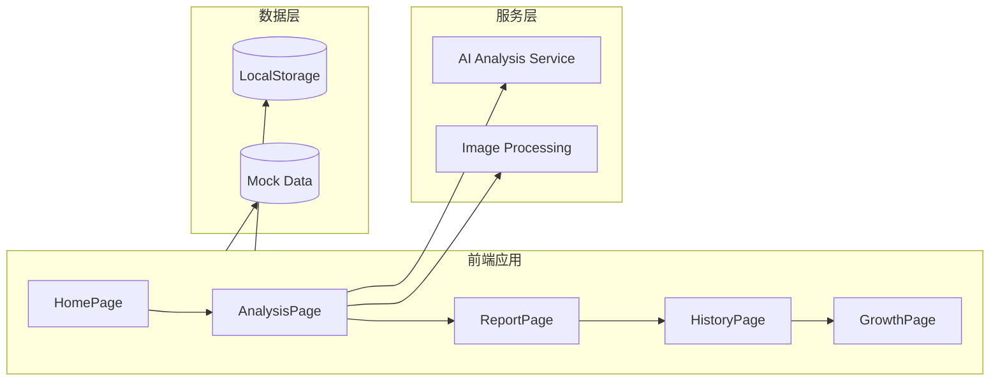
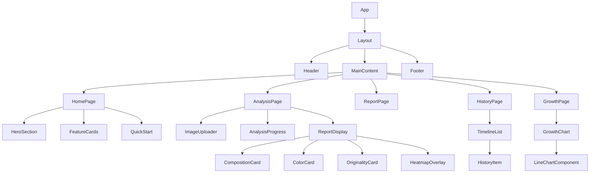
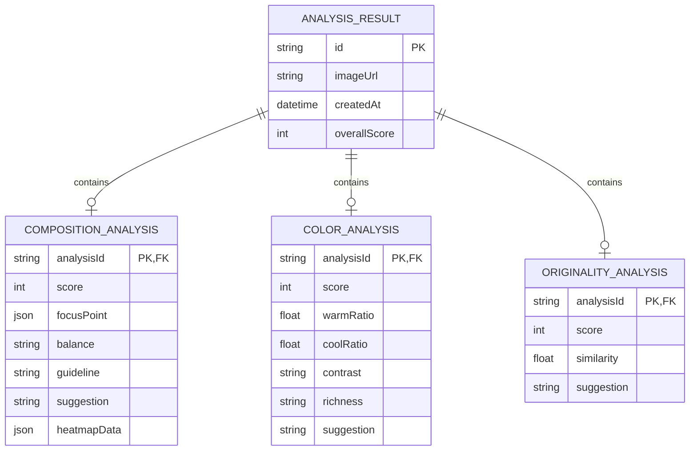

## 1. 架构设计



---

## 2. 技术描述

- **前端框架**: React@18 + TypeScript
- **构建工具**: Vite@6
- **样式**: TailwindCSS@3 + CSS自定义属性
- **图标**: Lucide React
- **图表**: Recharts（用于成长曲线可视化）
- **动画**: CSS动画 + Framer Motion（可选）
- **数据存储**: LocalStorage（模拟数据持久化）
- **后端**: 无（MVP阶段使用模拟数据）

---

## 3. 路由定义

| 路由 | 路径 | 页面组件 | 功能描述 |
|------|------|----------|----------|
| 首页 | `/` | HomePage | 产品介绍、快速开始入口 |
| AI分析页 | `/analyze` | AnalysisPage | 图片上传、AI分析流程 |
| 报告页 | `/report/:id` | ReportPage | 分析报告详情展示 |
| 历史记录页 | `/history` | HistoryPage | 过往分析记录列表 |
| 成长曲线页 | `/growth` | GrowthPage | 个人能力数据可视化 |

---

## 4. API定义（模拟）

### 4.1 分析结果数据结构

```typescript
interface AnalysisResult {
  id: string;
  imageUrl: string;
  createdAt: string;
  composition: {
    score: number;
    focusPoint: { x: number; y: number };
    balance: 'balanced' | 'left-heavy' | 'right-heavy' | 'top-heavy' | 'bottom-heavy';
    guideline: 'good' | 'average' | 'poor';
    suggestion: string;
    heatmapData: number[][];
  };
  color: {
    score: number;
    warmRatio: number;
    coolRatio: number;
    contrast: 'high' | 'medium' | 'low';
    richness: 'rich' | 'moderate' | 'limited';
    suggestion: string;
  };
  originality: {
    score: number;
    similarity: number;
    suggestion: string;
  };
  overallScore: number;
}
```

### 4.2 历史记录数据结构

```typescript
interface HistoryRecord {
  id: string;
  imageUrl: string;
  createdAt: string;
  overallScore: number;
  compositionScore: number;
  colorScore: number;
  originalityScore: number;
}
```

### 4.3 成长曲线数据结构

```typescript
interface GrowthData {
  date: string;
  composition: number;
  color: number;
  originality: number;
  overall: number;
}
```

---

## 5. 组件结构



---

## 6. 数据模型

### 6.1 数据模型定义



### 6.2 Mock数据生成

MVP阶段使用模拟数据，每次分析随机生成：
- 构图分数：60-95分
- 色彩分数：65-92分
- 原创性分数：70-98分
- 生成对应的建议文本
- 生成模拟的构图热力图数据

---

## 7. 关键功能实现

### 7.1 图片上传

- 支持拖拽上传和点击选择
- 图片格式验证（JPG、PNG）
- 图片预览和尺寸限制
- 水墨风格上传区域UI

### 7.2 AI分析模拟

- 3秒延迟模拟AI分析过程
- 水墨扩散动画效果
- 随机生成分析结果数据
- 生成构图热力图数据

### 7.3 报告展示

- 三列卡片布局展示三维度分析
- 环形进度条展示分数
- 热力图叠加在原图上展示视觉焦点
- 可操作的文字建议

### 7.4 历史记录

- LocalStorage存储分析记录
- 时间线布局展示历史
- 点击查看详细报告

### 7.5 成长曲线

- Recharts折线图展示
- 三维度数据对比
- 交互式数据点
