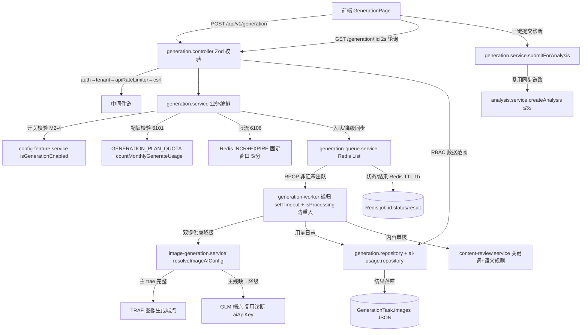
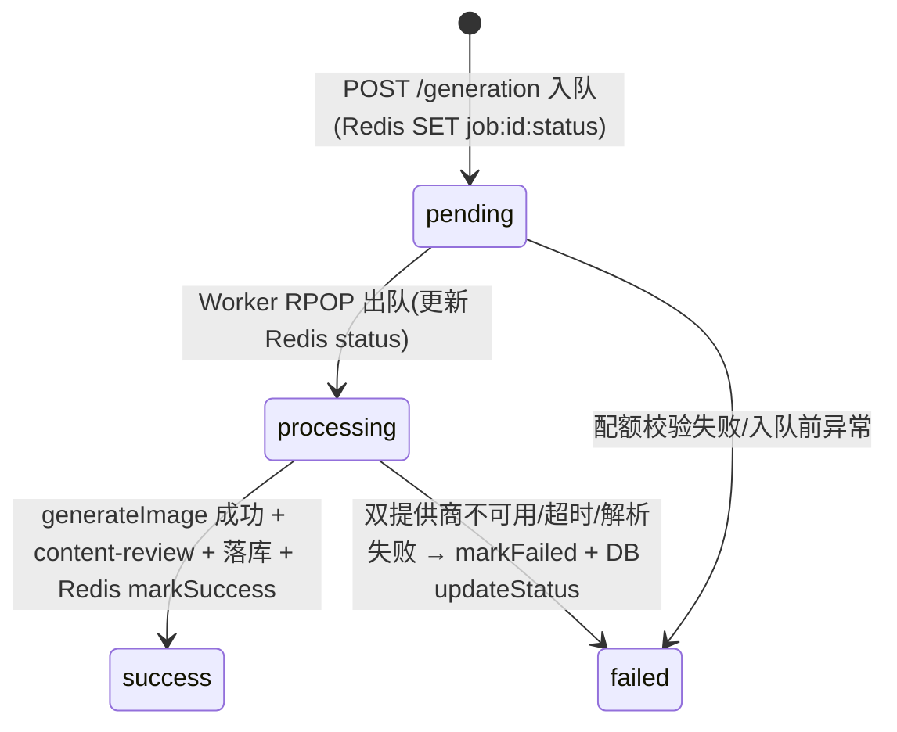
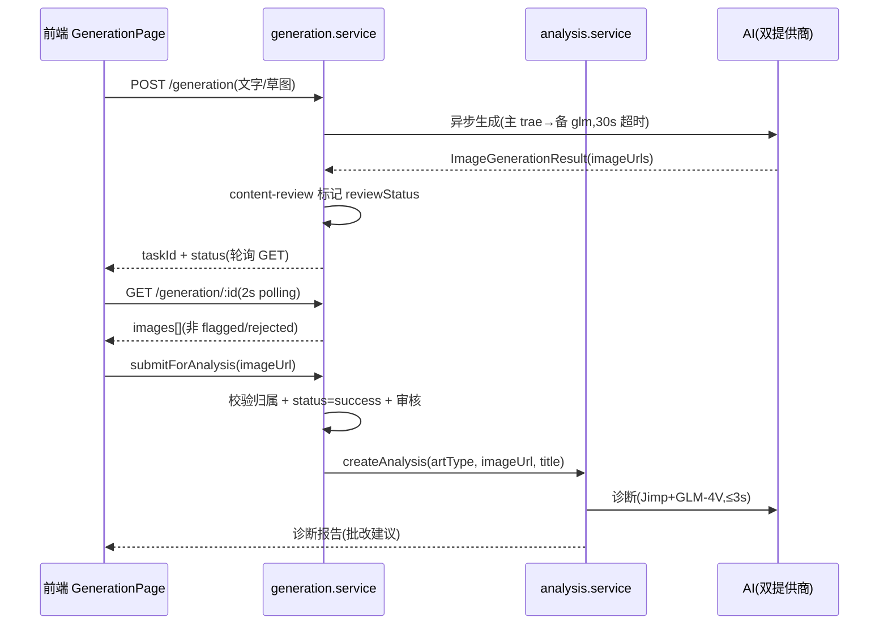
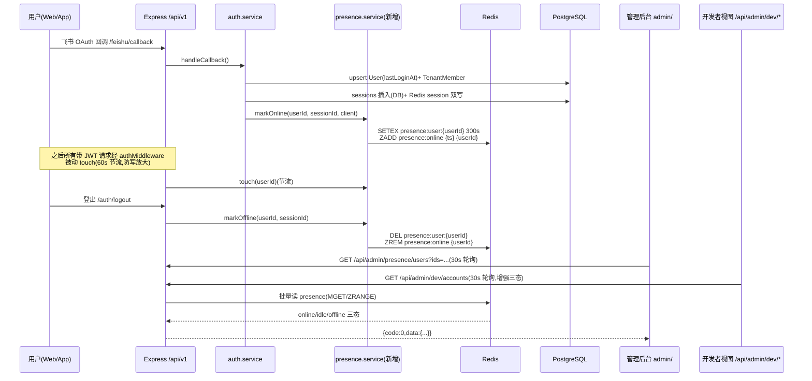

# 丹青有AI · 技术架构文档

> **文档版本**：v2.0.0（M-0 整体重写）
> **生成时间**：2026-08-07
> **文档状态**：已由 MVP 旧版重写为真实五端架构，事实来源为 `implementation-source-of-truth.md`
> **维护人**：产品架构协调中枢（product-architect）+ backend-service
> **仓库**：`Xyangshaun/danqing-ai`，生产域名 `www.danqing.site`
> **适用范围**：Web 应用 / 管理后台 / 移动端 / 品牌官网 / 后端服务 五端

> ⚠️ **本文档已废弃上一版 MVP 架构（LocalStorage / Mock Data / 无后端）表述**。系统当前为"五端 + 后端三层架构"的真实落地形态，详见下文。

---

## 目录

1. [系统架构总览](#1-系统架构总览)
2. [后端三层分层架构](#2-后端三层分层架构)
3. [中间件链路](#3-中间件链路)
4. [技术栈清单](#4-技术栈清单)
5. [AI 分析服务架构](#5-ai分析服务架构)
6. [AI 图像生成架构（M-0 新增）](#6-ai图像生成架构m-0新增)
7. [租户配置深合并架构模式（M-0 新增）](#7-租户配置深合并架构模式m-0新增)
8. [可观测性架构（M-0 新增）](#8-可观测性架构m-0新增)
9. [数据模型](#9-数据模型)
10. [部署架构](#10-部署架构)
11. [硬件实时监督与监考演进](#11-硬件实时监督与监考演进)
12. [已知约束与待优化项](#12-已知约束与待优化项)

---

## 1. 系统架构总览

### 1.1 五端形态

| 端 | 目录 | 技术栈 | 部署形式 |
|----|------|--------|---------|
| Web 应用 | `src/` | React 18 + Vite 5 | 静态文件（Nginx，挂载 `/app`） |
| 管理后台 | `admin/` | Ant Design Pro | 静态文件（Nginx + IP 白名单） |
| 移动端 | `mobile/` | React Native | 待补充 |
| 品牌官网 | `website/` | Next.js 14（静态导出） | 静态文件（Nginx，挂载 `/`） |
| 后端服务 | `server/` | Express 4 + TypeScript | Node.js 20 LTS（PM2 托管） |

### 1.2 部署拓扑

```
                        ┌──────────────────────────────┐
                        │         互联网用户            │
                        └──────────────┬───────────────┘
                                       │ 443/HTTPS
                                       ▼
                ┌──────────────────────────────────────────┐
                │              Nginx 反向代理              │
                │  SSL 终止 + gzip 压缩 + 安全头 + 限流     │
                │  server_tokens off(隐藏版本号)            │
                └──────┬──────────┬──────────┬─────────────┘
                       │  /        │  /app     │  /api/
                       ▼          ▼          ▼
              ┌──────────────┐ ┌──────────┐ ┌─────────────────────┐
              │  website/    │ │  src/    │ │  server/            │
              │ (官网,Next)  │ │ (Web应用)│ │ (Express,PM2)       │
              └──────────────┘ └──────────┘ │  127.0.0.1:3000     │
                                            │  /api/v1/*  业务    │
                                            │  /api/admin/* 管理  │
                                            │  /health    健康    │
                                            └──────┬──────┬───────┘
                                                   ▼      ▼
                                            ┌──────────────┐ ┌──────────────┐
                                            │ PostgreSQL 15│ │   Redis 7    │
                                            │ 数据持久化    │ │ 会话/限流/缓存│
                                            │ WAL 归档    │ │ AOF+RDB      │
                                            │ 仅127.0.0.1 │ │ 仅127.0.0.1  │
                                            └──────────────┘ └──────────────┘
```

> 管理后台（`admin/`）与官网（`website/`）在本节拓扑中以 `/app` 与 `/` 路径挂载于同一 Nginx；管理后台另有 IP 白名单访问控制。

### 1.3 关键设计决策

| 决策 | 原因 |
|------|------|
| app.ts 不启动 HTTP server | 由 `index.ts` 负责，便于 Vitest supertest 直接 import app 做集成测试 |
| 信任第一跳代理 | `app.set('trust proxy', 1)`，生产在 Nginx 后需启用以正确获取客户端 IP |
| traceMiddleware 在 body parser 之前 | body parser 解析失败时需先有 traceId 才能返回带 UUID 的错误响应 |

---

## 2. 后端三层分层架构

后端采用 Routes → Controller → Service → Repository 三层分层，职责单一、便于修改与排查：

| 层级 | 职责 | 示例文件 |
|------|------|---------|
| Routes（路由层） | 路由定义、中间件编排、参数提取 | `server/src/routes/*.routes.ts`（16 个） |
| Controller（控制器层） | 请求/响应转换、Zod 校验、错误处理 | `server/src/controllers/*.controller.ts` |
| Service（业务层） | 核心业务逻辑、事务编排、跨服务调用 | `server/src/services/*.service.ts` |
| Repository（数据层） | Prisma 数据访问、多租户强制过滤 | `server/src/repositories/*.repository.ts` |

后端目录结构概览：

```
server/
├── src/
│   ├── config/             # env.ts(环境变量自检)、permissions.ts(RBAC 矩阵)
│   ├── routes/             # 16 个路由文件(含 4 个 Phase5 预留)
│   ├── controllers/        # 控制器层
│   ├── services/           # 业务服务层(analysis/ai-analysis/feishu 等)
│   ├── repositories/       # 数据访问层
│   ├── middlewares/        # auth/tenant/trace/error-handler/client-adapt
│   ├── types/              # api-contract.ts(契约主副本)、arbitration.ts
│   ├── utils/              # response.ts(统一响应)、logger.ts(Winston)
│   ├── app.ts              # Express 应用工厂
│   └── index.ts            # HTTP server 启动入口
├── prisma/                 # schema.prisma(18 模型)、seed、migrations
├── uploads/                # multer 磁盘存储
└── .env.production         # 生产环境变量模板
```

---

## 3. 中间件链路

`server/src/app.ts` 的中间件注册顺序（traceMiddleware 在 body parser 之前）：

```
helmet(安全头)
  → cors(白名单校验,禁止 *)
    → traceMiddleware(traceId UUID 注入,在 body parser 之前)
      → express.json(1MB 上限)
        → express.urlencoded(1MB 上限)
          → cookieParser(refresh_token HttpOnly)
            → clientIdentification(多端适配:web/admin/mobile/marketing)
              → responseOptimizer(按客户端类型优化响应)
                → 业务路由(/api/v1/*)
                  → 管理路由(/api/admin/*)
                    → notFoundHandler(404 兜底)
                      → errorHandler(统一错误处理,4 参数)
```

健康检查：`GET /health` 与 `GET /api/v1/health`，仅返回 `{status:'up', timestamp}`，不查 DB/Redis，避免雪崩。

---

## 4. 技术栈清单

### 4.1 Web 应用（`src/`）

| 依赖 | 版本 | 用途 |
|------|------|------|
| react / react-dom | ^18.2.0 | UI 框架 |
| react-router-dom | ^6.22.0 | 客户端路由 |
| recharts | ^2.10.0 | 图表（成长曲线） |
| vite | ^5.1.0 | 构建 |
| typescript | ^5.3.3 | 类型安全 |
| tailwindcss | ^3.4.1 | 原子化 CSS |
| vitest / @testing-library/react | - | 测试 |

### 4.2 后端（`server/`）

| 依赖 | 版本 | 用途 |
|------|------|------|
| express | ^4.21.2 | Web 框架 |
| @prisma/client / prisma | ^5.22.0 | ORM / 迁移 |
| ioredis | ^5.4.2 | Redis 客户端（会话/限流/缓存） |
| jimp | ^0.22.12 | 像素级图像分析 |
| axios | ^1.7.9 | AI API 调用 |
| jsonwebtoken | ^9.0.2 | JWT（RS256） |
| zod | ^3.24.1 | Schema 校验 |
| multer | ^1.4.5-lts.1 | 文件上传 |
| helmet / cors / cookie-parser | - | 安全 / 跨域 / Cookie |
| express-rate-limit | ^7.5.0 | 限流 |
| winston | ^3.17.0 | 日志 |

### 4.3 基础设施

| 组件 | 版本 | 用途 |
|------|------|------|
| Node.js | 20 LTS | 运行时（官方 tarball，禁止 curl\|bash） |
| PostgreSQL | 15 | 主数据库（强制，禁 SQLite） |
| Redis | 7 | 会话/缓存/限流（AOF+RDB） |
| Nginx | 1.18+ | 反向代理 + SSL + 静态托管 |
| PM2 | latest | 进程管理（fork 单实例） |
| Docker / 1Panel | - | PG + Redis 容器化 / 面板管理 |

### 4.4 品牌官网（`website/`）

| 依赖 | 版本 | 用途 |
|------|------|------|
| next | 14.2.5 | App Router 静态导出 |
| tailwindcss | 3.4.7 | 样式 |
| framer-motion | 11.3.19 | 动画 |
| next-mdx-remote | 5.0.0 | MDX 博客渲染 |

---

## 5. AI分析服务架构

### 5.1 混合分析架构

系统采用 **Jimp 像素分析 + AI 视觉分析** 混合模式，保障 3 秒 SLA：

```
用户上传作品
  ↓ analysis.service.runAnalysis()
  ↓ 1. 校验租户配额(6001/3001/3002)
  ↓ 2. 校验图片输入(imageUrl 或 localImagePath)
  ↓ 3. 写 DB(pending)
  ↓ 4. 调用分析引擎
    ↓ analysisCacheService.getOrAnalyze()
      ↓ 计算 hash(本地 SHA-256 / URL hash)
      ↓ 查 Redis 缓存 → 命中直接返回(cacheHit=true)
      ↓ 未命中 → env().aiEnabled?
        ↓ 是 → runHybridAnalysis()
        ↓     ↓ Jimp 像素分析(~500ms,始终执行)
        ↓     ↓ AI 视觉分析(超时 2.5s 切断)
        ↓     ↓   成功 → mergeResults(应用 score_adjustments)
        ↓     ↓   失败 → createFallbackAIVisionResult(模板建议)
        ↓     ↓ 返回 HybridAnalysisResult
        ↓ 否 → Jimp-only 模式(~500ms)
      ↓ 仅缓存成功结果
  ↓ 5. 更新 DB(success/failed + durationMs)
  ↓ 6. 异步创建通知(ANALYSIS_DONE/ANALYSIS_FAIL)
  ↓ 返回 { id, status, result, durationMs }
```

### 5.2 双提供商降级

```
AI_PROVIDER=trae?
  ↓ 是 → TRAE 凭证完整?
  ↓       是 → 使用 TRAE
  ↓       否 → 自动降级到 GLM
  ↓ 否 → 使用 GLM
```

AI 模块采用 OpenAI 兼容协议，可接入 GLM/TRAE/OpenAI/Azure/vLLM。

### 5.3 三道降级防线

| 防线 | 触发条件 | 行为 |
|------|---------|------|
| 第一道 | AI 未启用(`aiEnabled=false`) | Jimp + 模板降级建议 |
| 第二道 | AI 调用失败(超时/HTTP/解析) | Jimp + 模板降级建议 |
| 第三道 | AI API Key 缺失 | 自动 fallback 到模板规则 |

模板降级建议由 `template-suggestions.service.ts` 提供 55 条规则（绘画~15 / 设计~13 / 产品~13 / 雕塑~14），每条含 `evidence` + `priority`，优先级限制 high≤2 / medium≤2 / low≤1 / 总≤5。

---

## 6. AI图像生成架构（M-2 已实现，2026-08-07）

> 对应升级痛点 P-02 / P-07，契约见 `api-contract.ts` §3.17（DOC-2026-08-006/007/009，M-0 已冻结）。
> M-2 阶段（任务 M2-T1~T9/T11）已将本节架构全部落地，回归 1192 用例 100% 通过。本节为"已实现"状态回填，事实来源为 `server/src/services/generation*.ts` 与 `server/prisma/schema.prisma`。

### 6.1 架构职责（已实现）

生成功能为**异步任务**，不阻塞诊断主链路（3 秒 SLA 硬约束）。核心服务与落地实现如下：



**已实现组件清单**：

| 关注点 | 落地实现 | 关键文件 |
|--------|---------|---------|
| 异步任务状态机 | `pending → processing → success/failed`，Redis List(LPUSH/RPOP 非阻塞)+ 状态/结果 TTL 1h + DB 持久化跨进程 | `server/src/services/generation-queue.service.ts` |
| Worker 轮询防重入 | 递归 setTimeout(防叠加) + isProcessing 锁(防并发) + 优雅退出挂 gracefulShutdown | `server/src/services/generation-worker.service.ts` |
| 双提供商降级 | 主 trae 配置残缺自动降级到 glm(复用诊断 `aiApiKey`)，超时独立 30s，不重试 | `server/src/services/image-generation.service.ts` |
| 创建/查询接口 | POST/GET 严格按冻结契约返回，Zod 全量校验(inputType/artType/aspect/count/sync) | `server/src/routes/generation.routes.ts` + `server/src/controllers/generation.controller.ts` |
| 业务编排 | 配额→限流→校验→落库→入队/同步降级→审核→用量→闭环 | `server/src/services/generation.service.ts` |
| 数据访问层 | 强制 `tenantId` 过滤，跨租户→null→404；失败不扣配额(status 非 failed 计数) | `server/src/repositories/generation.repository.ts` |
| 独立生成配额 | `free=10/standard=200/enterprise=-1`，耗尽→`GENERATION_QUOTA_EXCEEDED(6101)` 402 | `generation.service.ts#checkGenerationQuota` + `GENERATION_PLAN_QUOTA` |
| 单用户限流 | 5 次/分钟，超限→`GENERATION_RATE_LIMITED(6106)` 429，Redis 异常 fail-open | `generation.service.ts#checkRateLimit` |
| 内容审核 | rejected(明确违禁)/flagged(敏感)/semantic(组合规则)三类，纯函数无 IO，`GeneratedImage.reviewStatus` 持久化 | `server/src/services/content-review.service.ts` |
| 灰度开关 | `generation` 开关 `defaultStatus='disabled'`、`type='percentage'`、`defaultValue=0`(fail-closed)，按租户哈希放量 | `server/src/services/config-feature.service.ts` |
| 教学闭环 | 生成图一键提交诊断，校验归属+status=success+非 flagged/rejected→调 `analysisService.createAnalysis` | `generation.service.ts#submitForAnalysis` |
| 用量日志 | `AiUsageLog.usageType=generate`，仅 provider 非空时记录，成功/调用失败均记录(成本审计) | `generation.service.ts#recordUsage` |

### 6.2 双提供商降级策略（已实现）

`image-generation.service.resolveImageAIConfig()` 复用 `ai-vision.service.resolveAIConfig` 同源思路，但使用独立 `AI_IMAGE_*` 配置，与诊断链路解耦：

| 场景 | 行为 | 代码位置 |
|------|------|---------|
| 主=glm 且 `aiImageApiKey` 存在 | 使用 glm，`usedFallback=false` | `resolveImageAIConfig` 第 112-121 行 |
| 主=trae 且 key+url 均非空 | 使用 trae，`usedFallback=false` | 第 124-133 行 |
| 主=trae 但 key/url 残缺 | 降级到 glm(复用诊断 `aiApiKey`)，`usedFallback=true`，warning 日志 | 第 136-151 行 |
| 双提供商均不可用 | 返回 null，上层标记 `GENERATION_PROVIDER_UNAVAILABLE(6103)` | 第 154 行 |

**降级设计要点（已实现）**：
- 生成超时独立配置(`AI_IMAGE_TIMEOUT`，默认 30000ms)，不受诊断 2.5s 限制。
- 双层超时保障：axios `timeout` + `AbortController` wall-clock deadline（`image-generation.service.ts` 第 321-322 行）。
- 不重试：失败交上层异步任务标记 failed，由编排层决定降级/失败策略。
- 主提供商失败时 `ImageGenerationResult.usedFallback=true`，落库 `GenerationTask.usedFallback` 透出前端。

### 6.3 异步任务状态机（已实现）



- 状态存 Redis `job:{id}:status`（TTL 1 小时），供前端轮询加速。
- 结果存 Redis `job:{id}:result`（`GeneratedImage[]`，TTL 1 小时），同时落库 `GenerationTask.images`（持久化，跨进程 GET 以 DB 为准）。
- 前端轮询 `GET /generation/:id`（2s 间隔），`status=success` 返回 `images`；DB 为 pending/processing 时以 Redis 最新状态补充。

### 6.4 教学闭环（已实现）



**闭环实现要点**：
- 生成源头：文字提示词(`text`) 或 基于已上传草稿图(`sketch`，`image-generation.service.buildImageRequestBody` 注入草稿图引用)。
- 一键诊断：`generation.service.submitForAnalysis` 校验生成任务归属(tenantId+userId)→status=success→目标图非 flagged/rejected→调 `analysisService.createAnalysis({ artType, imageUrl, title })`，诊断配额/图片校验/落库/通知均由 analysis 模块内部完成(同步 ≤3s)。
- 3 秒 SLA：生成走异步队列，诊断仍走同步(≤3s)，**生成不阻塞诊断**(独立 Worker + 独立超时)。
- 类型贯通：生成任务的 `artType` 透传到诊断(`task.artType as ArtType`)，保证四类作品维度一致。

### 6.5 数据模型落地（已实现，schema.prisma）

```prisma
// 生成任务状态(对齐 api-contract.ts §3.17 GenerationStatus)
enum GenerationStatus {
  pending    // 待处理(已入队)
  processing // 处理中(Worker 已取走)
  success    // 成功
  failed     // 失败
}

/// AI 图像生成任务表(异步,教学闭环源头,M-2-T1 已迁移)
model GenerationTask {
  id             String           @id @default(uuid()) @map("id")
  tenantId       String           @map("tenant_id") // 多租户隔离核心字段
  userId         String           @map("user_id")
  inputType      String           @map("input_type") @db.VarChar(16) // text | sketch
  prompt         String?          @map("prompt") @db.Text
  sketchImageUrl String?          @map("sketch_image_url") @db.Text
  artType        ArtType          @map("art_type")
  aspect         String?          @map("aspect") @db.VarChar(16)
  count          Int              @default(1) @map("count")
  status         GenerationStatus @default(pending) @map("status")
  images         Json?            @map("images") // GeneratedImage[] 数组(含 reviewStatus)
  failureReason  String?          @map("failure_reason") @db.Text
  usedFallback   Boolean          @default(false) @map("used_fallback")
  provider       String?          @map("provider") @db.VarChar(16)
  model          String?          @map("model") @db.VarChar(64)
  createdAt      DateTime         @default(now()) @map("created_at")
  completedAt    DateTime?        @map("completed_at")

  tenant Tenant @relation(fields: [tenantId], references: [id])
  user   User   @relation(fields: [userId], references: [id])

  @@index([tenantId, createdAt], map: "generation_tasks_tenant_id_created_at_idx")
  @@index([tenantId, userId], map: "generation_tasks_tenant_id_user_id_idx")
  @@index([tenantId, status], map: "generation_tasks_tenant_id_status_idx")
  @@map("generation_tasks")
}

// AiUsageLog 扩展(M-2-T1 已迁移,向后兼容)
model AiUsageLog {
  // ... 现有字段不变 ...
  usageType    String   @default("diagnose") @map("usage_type") @db.VarChar(16) // diagnose | generate
  generationId String?  @map("generation_id") // generate 类型关联的生成任务 ID
}
```

**已落地索引**（3 个，对应 §3.4 查询模式）：

| 查询场景 | 索引 | 用途 |
|---------|------|------|
| 租户内生成历史倒序 | `(tenantId, createdAt)` | Web/移动端历史列表 |
| 指定用户生成记录 | `(tenantId, userId)` | 学生个人生成记录 |
| 按状态筛选待处理/失败 | `(tenantId, status)` | Worker 失败重试/管理后台 |

### 6.6 配额与计费落地（已实现）

| 护栏 | 落地实现 | 代码位置 |
|------|---------|---------|
| 独立生成配额 | `GENERATION_PLAN_QUOTA = { free:10, standard:200, enterprise:-1 }` | `generation.service.ts` 第 56-60 行 |
| 配额耗尽 | 抛 `GENERATION_QUOTA_EXCEEDED(6101)` HTTP 402 | `checkGenerationQuota` 第 422-428 行 |
| 单用户限流 | Redis `rl:gen:{tenantId}:{userId}` INCR+EXPIRE(60s)，超限→`GENERATION_RATE_LIMITED(6106)` 429 | `checkRateLimit` 第 440-465 行 |
| 失败不扣配额 | `countMonthlyGenerateUsage` 统计 `status in [success, processing, pending]`（排除 failed） | `generation.repository.ts` 第 181-191 行 |
| 用量日志 | `aiUsageRepository.create({ usageType:'generate', generationId, provider, model, success, durationMs, costYuan:null })` | `recordUsage` 第 533-563 行 |
| Redis 异常 fail-open | 限流检查捕获异常后仅 warning 日志，不阻断生成 | `checkRateLimit` 第 456-464 行 |

### 6.7 内容审核落地（已实现）

`content-review.service.ts` 三类规则（纯函数无 IO，便于单元测试）：

| 规则类型 | 严重级别 | 行为 | 示例 |
|---------|---------|------|------|
| `REJECTED_RULES`（6 组） | rejected | 明确违禁，不进入一键诊断 | 恐怖主义/毒品/枪支/儿童色情/邪教/违禁交易 |
| `FLAGGED_RULES`（6 组） | flagged | 敏感需人工复核，前端灰显 | 血腥/暴力/色情裸露/自残自杀/歧视仇恨/恐怖惊悚 |
| `SEMANTIC_RULES`（2 组） | flagged | 组合规则（每组都命中才触发），消除单关键词误报 | 校园暴力/青少年色情 |

- 审核结果：`ContentReviewResult { reviewStatus, reasons, ruleId, needsManualReview }`。
- `GeneratedImage.reviewStatus` 在 `GenerationTask.images` JSON 持久化（契约 frozen，不新增字段）。
- `reasons/ruleId` 写入审计日志（`generation.service.handleReview` 第 511-522 行）。
- `submitForAnalysis` 拦截 flagged/rejected 图（403），不进入一键诊断。

### 6.8 灰度开关落地（已实现，门禁 M2-4）

`config-feature.service.ts` 中 `generation` 开关定义（`FEATURE_DEFINITIONS`）：

```typescript
{
  featureId: 'generation',
  name: 'AI 图像生成',
  description: 'AI 图像生成功能(异步队列 + 教学闭环),默认关闭,经 /api/v1/config 按租户百分比灰度开启',
  type: 'percentage',
  defaultStatus: 'disabled',  // 门禁 M2-4:默认关闭
  defaultValue: 0,             // fail-closed:即使误切 gradual 也按 0% 放量
}
```

**三态判定**（`isEnabled`）：
- `enabled`：开启（全量）。
- `disabled`：关闭（默认）。
- `gradual`：按 `type=percentage` 做租户哈希 < value 判定（`hashForTenant` 0-99）。

**灰度路径**：`disabled`（默认）→ PATCH `/api/v1/config/features/generation` 设 `status='gradual', value=10`（10% 租户）→ 逐步提升 value → `status='enabled'`（全量）。

**存储**：内存 Map（进程真源）+ Redis `config:feature:generation`（跨进程/重启保持，尽力而为）。

### 6.9 多租户隔离落地（已实现，门禁 M2-3）

| 隔离点 | 落地实现 | 代码位置 |
|--------|---------|---------|
| `tenantId` 注入 | `authMiddleware` 从 JWT 解析→`req.tenantId`→`tenantMiddleware` 校验存在 | `generation.routes.ts` 第 35-36 行 |
| 禁止从请求体读 tenantId | controller 仅从 `req.tenantId` 取值，Zod schema 不含 tenantId 字段 | `generation.controller.ts` 第 97-112 行 |
| Repository 强制过滤 | `findById(id, tenantId)` `findFirst({ where:{ id, tenantId } })` | `generation.repository.ts` 第 103-107 行 |
| 跨租户→404 | `findById` 返回 null→service 抛 `GENERATION_TASK_NOT_FOUND(6102)` 404，不泄露存在性 | `generation.service.ts` 第 196-198 行 |
| student ownership | `canReadTenantWide(role)` 校验，student 查他人记录→404 | `generation.service.ts` 第 200-202 行 |
| 写操作预检 | `updateStatus` 先 `findFirst(id+tenantId)` 预检归属，越权返回 null | `generation.repository.ts` 第 119-123 行 |

### 6.10 与现有体系的关系

- 复用现有 `ReviewStatus` 枚举与 `review.service.ts`，**不新增审核表**（生成审核走 `content-review.service` 自动规则 + 人工复核挂点）。
- 生成图若被"一键诊断"进入 `Analysis`，其 `Analysis.reviewStatus` 独立走诊断审核流程（不互相覆盖）。
- 生成任务的 `GenerationTask` 本身不落入 `Artwork` 素材库（除非用户主动收藏），避免与现有素材库审核混淆。
- 双提供商降级复用诊断链路已配置的 GLM 凭据（`aiApiKey/aiApiUrl/aiApiModel`）作为备用，保证"至少一个提供商可用"。

---

## 7. 租户配置深合并架构模式（M-0 新增）

> 对应升级痛点 P-04，契约见 `api-contract.ts` §3.16（DOC-2026-08-003/005）。

### 7.1 resolveConfig(tenantId) 模式

租户级仲裁配置覆盖采用"深合并"模式，作为 config/ui 等能力的通用架构：

```text
resolveConfig(tenantId)
  ├── 读取系统默认 DEFAULT_ARBITRATION_CONFIG
  │     └── 读取租户覆盖 Tenant.arbitrationConfig(Json?,可空)
  │           └── 深合并:未覆盖字段继承系统默认
  └── 返回并缓存有效期内的合并结果
```

- **未配置回退**：`Tenant.arbitrationConfig = null` → 直接返回系统默认（`isDefault=true`）。
- **部分覆盖**：请求体仅传需覆盖的字段（`triggers`/`judgeWeights`/`rules`/`edgeCases`），其余继承默认。
- **校验**：写入时 Zod 全量校验 + 权重归一化（`judgeWeights` 内每模式权重之和=1），违反返回 `ARBITRATION_CONFIG_INVALID = 9110`。
- **审计**：配置变更写入 `AuditLog`（auditAction=update）。

### 7.2 数据承载

`Tenant` 新增 `arbitrationConfig Json?`（`@map("arbitration_config")`），详见 §9 数据模型增量。

---

## 8. 可观测性架构（M-0 新增）

> 对应升级痛点 P-08，契约见 `api-contract.ts` §3.18（DOC-2026-08-010/011）。

### 8.1 指标聚合

| 项 | 方案 |
|----|------|
| 实时计数 | Redis 计数器（调用量、成功率、耗时、成本、降级次数） |
| 定时落库 | 定时任务将 Redis 计数器聚合落库，避免实时查询压库 |
| 指标接口 | `GET /api/admin/metrics/ai`（SLA 达标率/降级率/双提供商可用性/成本） |
| SLA 接口 | `GET /api/admin/metrics/sla`（逐日达标率） |
| 鉴权 | IP 白名单 + admin 鉴权 |
| 数据不可用 | 返回 `METRICS_DATA_UNAVAILABLE = 9201` |

### 8.2 监控链路

- 每次 AI 分析记录 `duration_ms`，P95 > 2.8s 触发告警。
- `traceId`(UUID v4) 贯穿日志/链路，错误响应必须为有效 UUID（三端兜底：trace / error-handler / notFoundHandler）。
- 部署日志经 `DeploymentLog` 模型 + `POST /deployments/log`（`X-Deploy-Secret`）同步，下游用 `GET /deployments/latest` 查询。

---

## 9. 数据模型

- **数据库**：PostgreSQL 15（生产强制，禁 SQLite）
- **主键**：UUID v4；**多租户**：所有业务表强制 `tenant_id`（除 Tenant 表本身）
- **命名**：Prisma 字段 camelCase，DB 列 snake_case（`@map`），表名复数蛇形（`@@map`）
- **Schema**：`server/prisma/schema.prisma`（19 个模型，M-2 新增 `GenerationTask`）

### 9.1 模型清单

| 模型 | 表名 | 说明 |
|------|------|------|
| Tenant | `tenants` | 租户（层级自引用） |
| User | `users` | 用户（多认证方式） |
| Session | `sessions` | 会话（refresh_token SHA-256） |
| TenantMember | `tenant_members` | 租户成员关系 |
| Analysis | `analyses` | AI 分析任务 |
| Subscription | `subscriptions` | 订阅 |
| Invoice | `invoices` | 发票 |
| AuditLog | `audit_logs` | 审计日志（系统级） |
| ApiKey | `api_keys` | API 密钥 |
| CreativeTemplate | `creative_templates` | 创意模板 |
| PhoneVerification | `phone_verifications` | 手机验证码 |
| InvitationCode | `invitation_codes` | 邀请码 |
| EvaluationPreset | `evaluation_presets` | 评分预设 |
| ReviewRecord | `review_records` | 评委评分 |
| DisputeCase | `dispute_cases` | 争议仲裁 |
| AiUsageLog | `ai_usage_logs` | AI 用量日志（M-2 追加 `usageType`/`generationId`） |
| GenerationTask | `generation_tasks` | AI 图像生成任务（M-2 新增，异步状态机 + 教学闭环源头） |
| Notification | `notifications` | 通知 |
| DeploymentLog | `deployment_logs` | 部署日志 |

### 9.2 M-0 数据模型增量

> M-0 定义的规划中数据模型变更。其中 `Tenant.arbitrationConfig` 与 `AiUsageLog.usageType` 已在 M-2 落地；`GenerationTask` 表为 M-2 新增（计划 §3.2），已迁移完成（详见 §6.5）。

```prisma
// Tenant 新增字段(P-04,仲裁配置覆盖)
// arbitrationConfig Json?  @map("arbitration_config")  // null 回退系统默认

// AiUsageLog 新增枚举(P-02/P-07,AI 用量类型) —— M-2 已落地
// usageType    String  @default("diagnose") @map("usage_type")  // diagnose | generate
// generationId String? @map("generation_id")  // generate 类型关联的生成任务 ID(M-2 追加)

// GenerationTask 表(P-02/P-07,M-2 新增,已落地) —— 详见 §6.5
// model GenerationTask { ... }
// enum GenerationStatus { pending | processing | success | failed }
```

**M-2 落地状态**：
- `AiUsageLog.usageType` + `generationId`：已迁移，默认 `diagnose` 向后兼容。
- `GenerationTask` 表：已迁移，含 3 个复合索引（`tenantId+createdAt` / `tenantId+userId` / `tenantId+status`）。
- `GenerationStatus` 枚举：已定义（对齐 `api-contract.ts` §3.17）。
- `Tenant.arbitrationConfig`：M-2 范围外，由后续里程碑落地。

### 9.3 数据模型迁移与回滚方案（M-0 规划）

变更分级：**A 级（高）**，需备份 3-5 轮 + 回滚迁移 + 按租户灰度。

| 变更 | 备份 | 正向迁移 | 回滚 |
|------|------|---------|------|
| `Tenant.arbitration_config` 新增可空 Json 列 | 迁移前 `pg_dump` 全量备份 ≥3 轮 + WAL 归档 | `ALTER TABLE tenants ADD COLUMN arbitration_config JSONB;`（可空，现有租户为 NULL 走系统默认，天然渐进生效） | `ALTER TABLE tenants DROP COLUMN arbitration_config;` |
| `AiUsageLog.usage_type` 新增枚举列 | 同上 | `ALTER TABLE ai_usage_logs ADD COLUMN usage_type VARCHAR(16) NOT NULL DEFAULT 'diagnose';`（向后兼容现有诊断日志） | `ALTER TABLE ai_usage_logs DROP COLUMN usage_type;` |

**灰度策略**：经 `/api/v1/config` 特性开关按租户灰度——先内部租户 → 试点院校 → 全量；生成功能默认关闭，灰度开启。备份轮次提升至 3-5 轮（M0-T11 由 devops-qa 落地）。

### 9.4 核心索引

| 模型 | 索引 | 用途 |
|------|------|------|
| Analysis | `(tenantId, createdAt)` | 租户内按时间倒序 |
| Analysis | `(tenantId, userId)` | 教师查看指定学生 |
| Notification | `(tenantId, userId, readAt)` | 未读计数与过滤 |
| Notification | `(tenantId, userId, createdAt)` | 游标分页 |
| AiUsageLog | `(tenantId, createdAt)` | 租户用量统计 |

---

## 10. 部署架构

### 10.1 组件部署

| 组件 | 方式 |
|------|------|
| 后端服务 | PM2 fork 单实例，端口 `127.0.0.1:3000` |
| Web 应用 | 静态文件，Nginx 挂载 `/app`（`/var/www/danqing-ai/dist/`） |
| 品牌官网 | 静态文件，Nginx 挂载 `/`（`/var/www/danqing-ai/website/`） |
| 管理后台 | 静态文件，Nginx + IP 白名单 |
| PostgreSQL | Docker 容器，1Panel 管理，仅绑定 `127.0.0.1` |
| Redis | Docker 容器，1Panel 管理，仅绑定 `127.0.0.1` |

### 10.2 Nginx 配置要点

生产配置 `deploy/nginx-site.conf` → `/etc/nginx/conf.d/danqing.conf`：

- HTTP → HTTPS 301 强制跳转；`server_tokens off` 隐藏版本号
- gzip：JS/CSS/JSON/XML/SVG + API 响应
- Cache-Control：静态资源 `public, immutable, Expires: 2027`；`index.html` `no-cache`
- 安全头 5 项：HSTS / X-Frame-Options: DENY / X-Content-Type-Options / Referrer-Policy / X-Permitted-Cross-Domain-Policies
- `location /api/` 反代 `127.0.0.1:3000`，透传 `X-Trace-Id`

### 10.3 PM2 配置

`ecosystem.config.cjs`：`node_args: '--env-file=server/.env'`（Node 20 原生）、`instances: 1`、`exec_mode: 'fork'`、`max_memory_restart: '500M'`。

### 10.4 部署流程（五阶段 · 四门禁 · 三铁律）

| 阶段 | 内容 | 门禁 |
|------|------|------|
| S1 | 选型确认 | 技术栈/配置确认 |
| S2 | 服务器接入 | SSH/防火墙/环境就绪 |
| S3 | 外部暴露 | HTTPS/CNAME/端口 |
| S4 | 上线监控 | 告警/备份/预算 |
| S5 | Runbook 文档 | 运维手册完成 |

三铁律：① HTTPS 强制 + HTTP 跳转；② 防火墙默认拒绝 + SSH 加固 + DB 绑定 127.0.0.1；③ 真实告警 + 备份 + 恢复演练 + 预算告警。

---

## 11. 硬件实时监督与监考演进

> 详细信息见 [hardware-live-guidance-plan.md](./hardware-live-guidance-plan.md)。本节为演进方向高层摘要。

| 域 | 技术方案 | 说明 |
|---|---|---|
| 实时媒体域 | WebRTC + SFU（LiveKit）+ 对象存储录制 | 摄像头采集上行 + 大规模转发 + 分段异步归档 |
| 实时 AI 监督 | 关键帧降采样(1~2fps) + 事件触发 + GLM-4V 语义指导 | 复用现有诊断管线，新增流式指导 |
| 监考域 | 人脸核验 + 动作/视线/多设备/切换检测 | 输出异常时间线 + 证据截图 |
| 学情分析域 | 同届基准聚合 + 阶段判定 + 短板雷达 | 首期不训练自有大模型 |
| 硬件域 | 软硬解耦，边缘 AI 盒子（RK3588 + ONNX Runtime） | 软件化先行，硬件后置 |

架构原则：增量扩展（不重构「上传 → 3s 诊断」链路）、事件化/异步化、软硬解耦、合规前置（人脸/未成年人/大规模监控须编码前评审通过）。

---

## 12. 已知约束与待优化项

### 12.1 硬约束

| 约束 | 说明 |
|------|------|
| 多创意形式 | 必须支持绘画、设计、产品设计、雕塑四种 |
| 3 秒 SLA | 所有分析必须在 3 秒内完成 |
| 具体建议 | 提供具体可执行改进建议，而非模糊反馈 |
| AI 双提供商 | 支持 GLM/TRAE，TRAE 缺失时自动降级 |
| AI 建议格式 | 必须含 evidence + priority（high≤2 / medium≤2 / low≤1 / 总≤5） |
| 模板降级 | AI 失败时使用 55 条规则 |
| 多租户隔离 | 所有业务表强制 tenant_id |
| DB/Redis 绑定 | 仅 127.0.0.1，禁止外网访问 |
| 禁止命令 | rm -rf /、DROP DATABASE、curl\|bash 等 |

### 12.2 待优化项（M-1~M-7 落地）

| 项 | 说明 | 对应 M-0 升级痛点 | 状态 |
|----|------|------------------|:----:|
| 跨端批删服务端化 | `POST /analyses/batch-delete` 落地 | P-06 | M-1 已实现 |
| 租户仲裁配置覆盖 | `Tenant.arbitrationConfig` 深合并落地 | P-04 | M-1 已实现 |
| AI 图像生成 | `image-generation.service` + 异步任务 + 双提供商降级 + 教学闭环 | P-02/P-07 | **M-2 已实现（2026-08-07）** |
| 管理后台三级确认 | ConfirmAction 完善 + 后端强制校验分两步 | P-05 | M-1 已实现 |
| config/ui 激活 | 预留接口从 501 变为可用 | P-03 | M-2 部分实现（config-feature 已落地，供生成灰度） |
| 可观测性指标 | Redis 计数器聚合 + admin 指标接口 | P-08 | 待实现 |

---

## 13. 用户在线状态(Presence)与双后台同步架构(M-4 新增,2026-08-08)

> 需求来源:飞书 OAuth 登录成功后,用户信息需在 **管理后台(admin-dashboard)** 与 **开发者后台** 实时可见(在线状态/登录时间/最后活跃/当前会话)。
> 对应 PRD:prd.md §9(P-09);契约:api-contract-v1.md §3.12 / §4.13。

### 13.1 现状调研结论(代码实证)

| 调研项 | 结论 | 证据 |
|--------|------|------|
| 用户持久化 | 登录成功已落 PostgreSQL(`users.lastLoginAt` + `sessions` 行),**无需额外同步动作** | `server/src/services/auth.service.ts` `upsertUserAndTenant()` / `issueTokensAndSession()` |
| ORM / 数据库 | Prisma + PostgreSQL 14+,另有 ioredis 单例 | `server/prisma/schema.prisma`、`server/src/config/redis.ts` |
| 实时基础设施 | **无 WebSocket / SSE**;现有"在线"为 Session 派生计算(`expiresAt>now && revokedAt IS NULL`);`stats/realtime` 的 onlineUsers 用 DAU 近似(代码注释自承"Phase 4 简化") | `server/src/repositories/dev-view.repository.ts`、`server/src/services/admin-stats.service.ts` |
| 管理后台 | `admin/`(AntD Pro)已有 `pages/user/list.tsx`(含 lastLoginAt 列,无在线状态)与 `pages/dev/accounts.tsx`(isOnline/activeSessions/lastActiveAt) | `admin/src/pages/user/list.tsx`、`admin/src/pages/dev/accounts.tsx` |
| 开发者后台 | **独立端不存在**;现为 admin 内 `/api/admin/dev/*` + `pages/dev/*` 模块 | Glob 无 dev-dashboard;文档无登记 |
| 登录写库汇聚点 | 6 条登录路径(飞书回调/扫码/手机 OTP/邀请码/管理员密码/通用账号)全部汇聚于 `issueTokensAndSession()` + `handleCallback()`,**埋点只需 2 处** | `server/src/services/auth.service.ts` |

### 13.2 关键决策仲裁

#### 决策 D1:开发者后台形态 → 本期复用 admin dev 模块,独立端走演进路径

| 方案 | 优点 | 缺点 | 结论 |
|------|------|------|------|
| A. 独立新端 `dev-dashboard/` | 职责隔离;可用 ApiKey(scopes)鉴权 | 新增构建/部署/鉴权链路;本期成本高 | 演进路径(M-5+) |
| **B. 复用 admin `dev/*` 模块(选定)** | 端点/页面/权限已存在,只做增强;符合保守原则 | 开发者需持有 admin/owner 角色 | **本期采用** |

#### 决策 D2:实时状态技术选型 → Redis 心跳 + 查询端点轮询,WS 列为演进

| 方案 | 实时性 | 改造成本 | 风险 | 结论 |
|------|--------|---------|------|------|
| **A. Redis presence + 30s 轮询(选定)** | 秒级(5 分钟 TTL 心跳) | 低:复用 ioredis;查询走既有 `/api/admin/*` 轮询模式 | 心跳节流需防 Redis 写放大 | **本期采用** |
| B. WebSocket 推送 | 毫秒级 | 中:`index.ts` 已 `http.createServer(app)` 可直挂 `ws`;但 PM2 多实例需 sticky / pub-sub | Nginx 反代升级头配置;多进程广播复杂 | M-5 演进 |
| C. SSE | 秒级 | 中 | 连接数占用;代理缓冲 | 不采用 |

### 13.3 数据流设计(登录 → 双后台可见)



### 13.4 在线状态三态模型(单一语义,全端统一)

| 状态 | 判定规则 | 语义 |
|------|---------|------|
| `online` | Redis `presence:user:{userId}` 存在(近 5 分钟有心跳/请求) | 实时活跃 |
| `idle` | presence 不存在,但 DB 有有效 Session(`expiresAt>now && revokedAt IS NULL`) | 会话有效但不活跃(挂起/离开) |
| `offline` | 无 presence 且无有效 Session | 离线 |

> 既有 `dev/accounts` 的 `isOnline`(有效 Session 语义)保留不动,新增 `presenceState` 字段承载三态,**不破坏已冻结契约**,符合向后兼容。

### 13.5 Redis Key 规范(新增,统一登记)

| Key | 类型 | TTL | 写入点 | 读取点 |
|-----|------|-----|--------|--------|
| `presence:user:{userId}` | String(JSON:`{lastSeenAt, client, sessionId}`) | 300s(滑动) | markOnline / touch(60s 节流) | 批量 MGET |
| `presence:online` | ZSET(member=userId, score=lastSeenEpoch) | 由清理任务兜底 | markOnline / touch / markOffline | ZRANGE 在线清单;ZREMRANGEBYSCORE 清理超时 |

### 13.6 数据模型变更点

- **Prisma schema:零变更**。`users.lastLoginAt`、`sessions.*` 已满足持久化需求。
- 仅新增 Redis key(见 §13.5),无表结构迁移、无回滚风险。
- 跨端 TS 类型增量:`server/src/types/api-contract.ts` 新增 `PresenceState`、`UserPresenceEntry`、`PresenceBatchResponse`(详见 api-contract-v1.md §3.12),经 sync 脚本同步各端。

### 13.7 权限与安全

| 端点 | 权限码 | 数据范围 | 防越权设计 |
|------|--------|---------|-----------|
| `GET /api/admin/presence/users` | `admin:user:read`(复用) | 平台级(管理后台) | 复用 authMiddleware+tenantMiddleware+requirePermission 链路;响应脱敏(不返回 ip/userAgent 明细,仅会话数与时间) |
| `GET /api/admin/presence/online` | `admin:stats:read`(复用) | 平台级 | 同上 |
| `GET /api/admin/dev/accounts`(增强) | `admin:user:read`(既有) | 平台级 | 既有鉴权不变,仅响应体追加 `presenceState` |
| 未来独立开发者后台 | 新增 `dev:presence:read`,走 **ApiKey.scopes**(表已存在) | 平台级只读 | M-5 再议,本期不开放 |

- touch 节流:同一 userId 60s 内仅写一次 Redis(进程内 LRU 标记),防止高 QPS 下 Redis 写放大。
- presence JSON 不落敏感字段(不存 IP 全址/UA 原文,仅 client 类型)。
- Redis 故障降级:presence 查询失败时回退 DB Session 派生(即 idle/offline 二态),接口不 5xx。

### 13.8 演进路径(保守迁移)

1. **M-4(本期)**:Redis presence + 轮询,admin 双模块增强,零 schema 变更。
2. **M-5(可选)**:`index.ts` 的 `http.createServer` 直挂 `ws`,presence 变更经 Redis pub/sub 广播至各 PM2 实例,推送替代轮询;独立 `dev-dashboard/` 端 + ApiKey 鉴权。
3. 回滚方案:presence 为纯增量,回滚 = 摘 Middleware 埋点 + 下线查询端点,业务数据零影响。

---

> **文档结束**。本文档基于 `implementation-source-of-truth.md` 重写,已消除 MVP LocalStorage/Mock 残留表述,并纳入 M-0 新增的 AI 生成、租户配置深合并、可观测性架构与数据模型增量,以及 M-4 用户在线状态(Presence)架构(§13)。如需更新,请同步修改对应源文件。